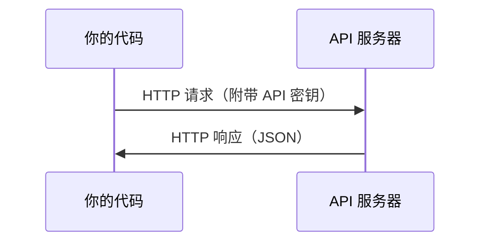

# API 与密钥

> 每个 AI API 的工作方式都一样：发送请求，获取响应。细节不同，但模式不变。

**类型：** 构建
**使用语言：** Python、TypeScript
**前置课程：** 阶段 0，第 01 课
**预计时间：** ~30 分钟

## 学习目标

- 使用环境变量和 `.env` 文件安全存储 API 密钥
- 使用 Anthropic Python SDK 和原始 HTTP 两种方式调用大语言模型 API
- 比较基于 SDK 和原始 HTTP 的请求/响应格式以进行调试
- 识别并处理常见的 API 错误，包括认证错误和频率限制

## 问题

从阶段 11 开始，你将调用大语言模型 API（Anthropic、OpenAI、Google）。在阶段 13-16 中，你将构建在循环中使用这些 API 的 Agent。你需要知道 API 密钥如何工作、如何安全存储它们，以及如何进行第一次 API 调用。

## 概念



每个 API 调用包含：
1. 一个端点（URL）
2. 一个 API 密钥（认证）
3. 一个请求体（你想要什么）
4. 一个响应体（返回什么）

## 构建它

### 步骤 1：安全存储 API 密钥

绝不要把 API 密钥放在代码中。使用环境变量。

```bash
export ANTHROPIC_API_KEY="sk-ant-..."
export OPENAI_API_KEY="sk-..."
```

或使用 `.env` 文件（将其添加到 `.gitignore`）：

```
ANTHROPIC_API_KEY=sk-ant-...
OPENAI_API_KEY=sk-...
```

### 步骤 2：第一次 API 调用（Python）

```python
import anthropic

client = anthropic.Anthropic()

response = client.messages.create(
    model="claude-sonnet-4-20250514",
    max_tokens=256,
    messages=[{"role": "user", "content": "用一句话解释什么是神经网络？"}]
)

print(response.content[0].text)
```

### 步骤 3：第一次 API 调用（TypeScript）

```typescript
import Anthropic from "@anthropic-ai/sdk";

const client = new Anthropic();

const response = await client.messages.create({
  model: "claude-sonnet-4-20250514",
  max_tokens: 256,
  messages: [{ role: "user", content: "用一句话解释什么是神经网络？" }],
});

console.log(response.content[0].text);
```

### 步骤 4：原始 HTTP（无需 SDK）

```python
import os
import urllib.request
import json

url = "https://api.anthropic.com/v1/messages"
headers = {
    "Content-Type": "application/json",
    "x-api-key": os.environ["ANTHROPIC_API_KEY"],
    "anthropic-version": "2023-06-01",
}
body = json.dumps({
    "model": "claude-sonnet-4-20250514",
    "max_tokens": 256,
    "messages": [{"role": "user", "content": "用一句话解释什么是神经网络？"}],
}).encode()

req = urllib.request.Request(url, data=body, headers=headers, method="POST")
with urllib.request.urlopen(req) as resp:
    result = json.loads(resp.read())
    print(result["content"][0]["text"])
```

这就是 SDK 底层做的事情。理解原始 HTTP 调用有助于调试。

## 使用它

本课程中使用的 API：

| API | 何时需要 | 免费额度 |
|-----|---------|---------|
| Anthropic (Claude) | 阶段 11-16（Agent、工具） | 注册送 $5 额度 |
| OpenAI | 阶段 11（对比） | 注册送 $5 额度 |
| Hugging Face | 阶段 4-10（模型、数据集） | 免费 |

你现在不需要全部设置。当课程需要时再配置。

## 交付

本课程产出：
- `outputs/prompt-api-troubleshooter.md` - 诊断常见 API 错误

## 练习

1. 获取一个 Anthropic API 密钥并进行第一次 API 调用
2. 尝试原始 HTTP 版本并比较响应格式与 SDK 版本的差异
3. 故意使用错误的 API 密钥并阅读错误信息

## 关键术语

| 术语 | 人们常说的 | 实际含义 |
|------|-----------|---------|
| API 密钥 | "API 的密码" | 一个唯一字符串，标识你的账户并授权请求 |
| 频率限制 | "他们在限流我" | 每分钟/小时的最大请求数，防止滥用并确保公平使用 |
| Token | "一个词"（在 API 上下文中） | 计费单位：输入和输出 token 分别计数和收费 |
| 流式传输 | "实时响应" | 逐字获取响应，而不是等待完整响应返回 |