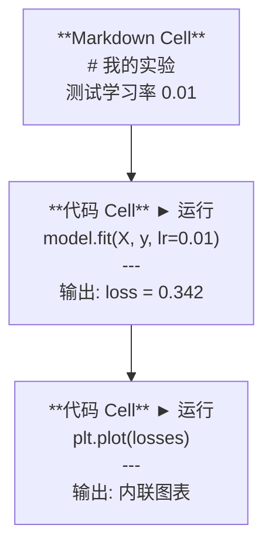
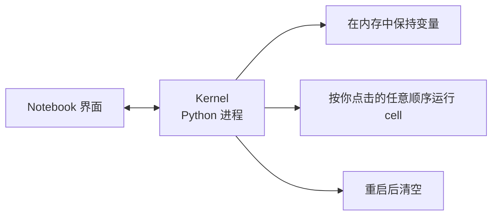

# Jupyter Notebooks

> Notebook 是 AI 工程的实验台。你在这里做原型，然后将在 notebook 中验证的东西迁移到生产中。

**类型：** 构建
**使用语言：** Python
**前置课程：** 阶段 0，第 01 课
**预计时间：** ~30 分钟

## 学习目标

- 安装并启动 JupyterLab、Jupyter Notebook 或带 Jupyter 扩展的 VS Code
- 使用魔法命令（`%timeit`、`%%time`、`%matplotlib inline`）进行基准测试和内联可视化
- 区分何时使用 notebook 和脚本，并应用「在 notebook 中探索，在脚本中交付」的工作流
- 识别并避免常见的 notebook 陷阱：乱序执行、隐藏状态和内存泄漏

## 问题

每一篇 AI 论文、教程和 Kaggle 竞赛都使用 Jupyter notebook。它们让你可以分段运行代码、内联查看输出、将代码与解释混合，并快速迭代。如果你尝试不用 notebook 学习 AI，就像不做草稿纸直接做数学作业一样。

但 notebook 也有真正的陷阱。人们用它做所有事情，包括它完全不擅长的事情。知道何时使用 notebook 和何时使用脚本将为你省去后续调试的噩梦。

## 概念

一个 notebook 是一个 cell 列表。每个 cell 要么是代码，要么是文本。



Kernel 是一个在后台运行的 Python 进程。当你运行一个 cell 时，它将代码发送给 kernel，kernel 执行代码并将结果返回。所有 cell 共享同一个 kernel，因此变量在 cell 之间会持久存在。



那个「按你点击的任意顺序」就是 notebook 的超能力和致命弱点。

## 构建它

### 步骤 1：选择你的界面

三种选择，一种格式：

| 界面 | 安装方式 | 最适合 |
|------|---------|-------|
| JupyterLab | `pip install jupyterlab`，然后 `jupyter lab` | 完整的 IDE 体验，多标签页、文件浏览器、终端 |
| Jupyter Notebook | `pip install notebook`，然后 `jupyter notebook` | 简单、轻量、一次一个 notebook |
| VS Code | 安装「Jupyter」扩展 | 已经在你的编辑器中，支持 git 集成、调试 |

三者都读写相同的 `.ipynb` 文件。选你喜欢的就好。JupyterLab 在 AI 工作中最常见。

```bash
pip install jupyterlab
jupyter lab
```

### 步骤 2：重要的键盘快捷键

你在两种模式下操作。按 `Escape` 进入命令模式（左侧蓝条），按 `Enter` 进入编辑模式（绿条）。

**命令模式（最常用）：**

| 按键 | 操作 |
|------|-----|
| `Shift+Enter` | 运行 cell，移到下一个 |
| `A` | 在上方插入 cell |
| `B` | 在下方插入 cell |
| `DD` | 删除 cell |
| `M` | 转换为 Markdown |
| `Y` | 转换为代码 |
| `Z` | 撤销 cell 操作 |
| `Ctrl+Shift+H` | 显示所有快捷键 |

**编辑模式：**

| 按键 | 操作 |
|------|-----|
| `Tab` | 自动补全 |
| `Shift+Tab` | 显示函数签名 |
| `Ctrl+/` | 切换注释 |

`Shift+Enter` 是你每天会用上千次的按键。先学会这个。

### 步骤 3：Cell 类型

**代码 cell** 运行 Python 并显示输出：

```python
import numpy as np
data = np.random.randn(1000)
data.mean(), data.std()
```

输出：`(0.0032, 0.9987)`

**Markdown cell** 渲染格式化文本。用它们来记录你在做什么以及为什么。支持标题、粗体、斜体、LaTeX 数学公式（`$E = mc^2$`）、表格和图片。

### 步骤 4：魔法命令

这些不是 Python。它们是 Jupyter 特有的命令，以 `%`（行魔法）或 `%%`（cell 魔法）开头。

**计时代码：**

```python
%timeit np.random.randn(10000)
```

输出：`45.2 us +/- 1.3 us per loop`

```python
%%time
model.fit(X_train, y_train, epochs=10)
```

输出：`Wall time: 2.34 s`

`%timeit` 多次运行代码并取平均值。`%%time` 只运行一次。使用 `%timeit` 进行微基准测试，使用 `%%time` 进行训练运行。

**启用内联绘图：**

```python
%matplotlib inline
```

现在每个 `plt.plot()` 或 `plt.show()` 都直接渲染在 notebook 中。

**在 notebook 中安装包：**

```python
!pip install scikit-learn
```

`!` 前缀运行任何 shell 命令。

**检查环境变量：**

```python
%env CUDA_VISIBLE_DEVICES
```

### 步骤 5：内联显示丰富输出

Notebook 自动显示 cell 中的最后一个表达式。但你可以控制它：

```python
import pandas as pd

df = pd.DataFrame({
    "model": ["线性模型", "随机森林", "神经网络"],
    "accuracy": [0.72, 0.89, 0.94],
    "training_time": [0.1, 2.3, 45.6]
})
df
```

这渲染的是一个格式化的 HTML 表格，而不是文本转储。图表同理：

```python
import matplotlib.pyplot as plt

plt.figure(figsize=(8, 4))
plt.plot([1, 2, 3, 4], [1, 4, 2, 3])
plt.title("内联图表")
plt.show()
```

图表直接出现在 cell 下方。这就是 notebook 在 AI 工作中占主导地位的原因。你同时看到数据、图表和代码。

对于图片：

```python
from IPython.display import Image, display
display(Image(filename="architecture.png"))
```

### 步骤 6：Google Colab

Colab 是云端免费的 Jupyter notebook。它为你提供 GPU、预装库和 Google Drive 集成。无需设置。

1. 前往 [colab.research.google.com](https://colab.research.google.com)
2. 上传本课程的任何 `.ipynb` 文件
3. 运行时 > 更改运行时类型 > T4 GPU（免费）

Colab 与本地 Jupyter 的差异：
- 文件不会在会话间持久存在（保存到 Drive 或下载）
- 预安装：numpy、pandas、matplotlib、torch、tensorflow、sklearn
- `from google.colab import files` 用于上传/下载文件
- `from google.colab import drive; drive.mount('/content/drive')` 用于持久存储
- 空闲 90 分钟后会话超时（免费版）

## 使用它

### Notebook 与脚本：何时使用哪个

| 使用 notebook | 使用脚本 |
|--------------|---------|
| 探索数据集 | 训练流水线 |
| 原型设计模型 | 可复用的工具函数 |
| 可视化结果 | 任何带有 `if __name__` 的内容 |
| 解释你的工作 | 定时运行的代码 |
| 快速实验 | 生产代码 |
| 课程练习 | 包和库 |

规则：**在 notebook 中探索，在脚本中交付**。

AI 中的常见工作流：
1. 在 notebook 中探索数据
2. 在 notebook 中原型设计模型
3. 一旦可行，将代码迁移到 `.py` 文件
4. 将这些 `.py` 文件导入回 notebook 以进行进一步实验

### 常见陷阱

**乱序执行。** 你运行了 cell 5，然后是 cell 2，然后是 cell 7。Notebook 在你的机器上正常工作，但当别人从上到下运行时就会出问题。修复：分享前执行 Kernel > 重启 & 运行全部。

**隐藏状态。** 你删除了一个 cell，但它创建的变量仍然在内存中。Notebook 看起来干净，但依赖于一个幽灵 cell。修复：定期重启 kernel。

**内存泄漏。** 加载 4GB 数据集，训练模型，加载另一个数据集。什么都不会被释放。修复：`del variable_name` 和 `gc.collect()`，或者重启 kernel。

## 交付

本课程产出：
- `outputs/prompt-notebook-helper.md` 用于调试 notebook 问题

## 练习

1. 打开 JupyterLab，创建一个 notebook，使用 `%timeit` 比较列表推导式和 numpy 创建 100,000 个随机数数组的速度
2. 创建一个同时包含 Markdown 和代码 cell 的 notebook，加载一个 CSV，显示数据框并绘制图表。然后运行 Kernel > 重启 & 运行全部以验证它从上到下正常工作
3. 将 `code/notebook_tips.py` 中的代码复制到 Colab notebook 中，并使用免费 GPU 运行

## 关键术语

| 术语 | 人们常说的 | 实际含义 |
|------|-----------|---------|
| Kernel | "运行我代码的东西" | 一个独立的 Python 进程，执行 cell 并在内存中保持变量 |
| Cell | "一个代码块" | Notebook 中独立可运行的单元，可以是代码或 Markdown |
| 魔法命令 | "Jupyter 技巧" | 以 `%` 或 `%%` 为前缀的特殊命令，控制 notebook 环境 |
| `.ipynb` | "Notebook 文件" | 包含 cell、输出和元数据的 JSON 文件。代表 IPython Notebook |

## 扩展阅读

- [JupyterLab 文档](https://jupyterlab.readthedocs.io/) 了解完整功能集
- [Google Colab 常见问题](https://research.google.com/colaboratory/faq.html) 了解 Colab 特定的限制和功能
- [28 个 Jupyter Notebook 技巧](https://www.dataquest.io/blog/jupyter-notebook-tips-tricks-shortcuts/) 了解高级用户快捷键