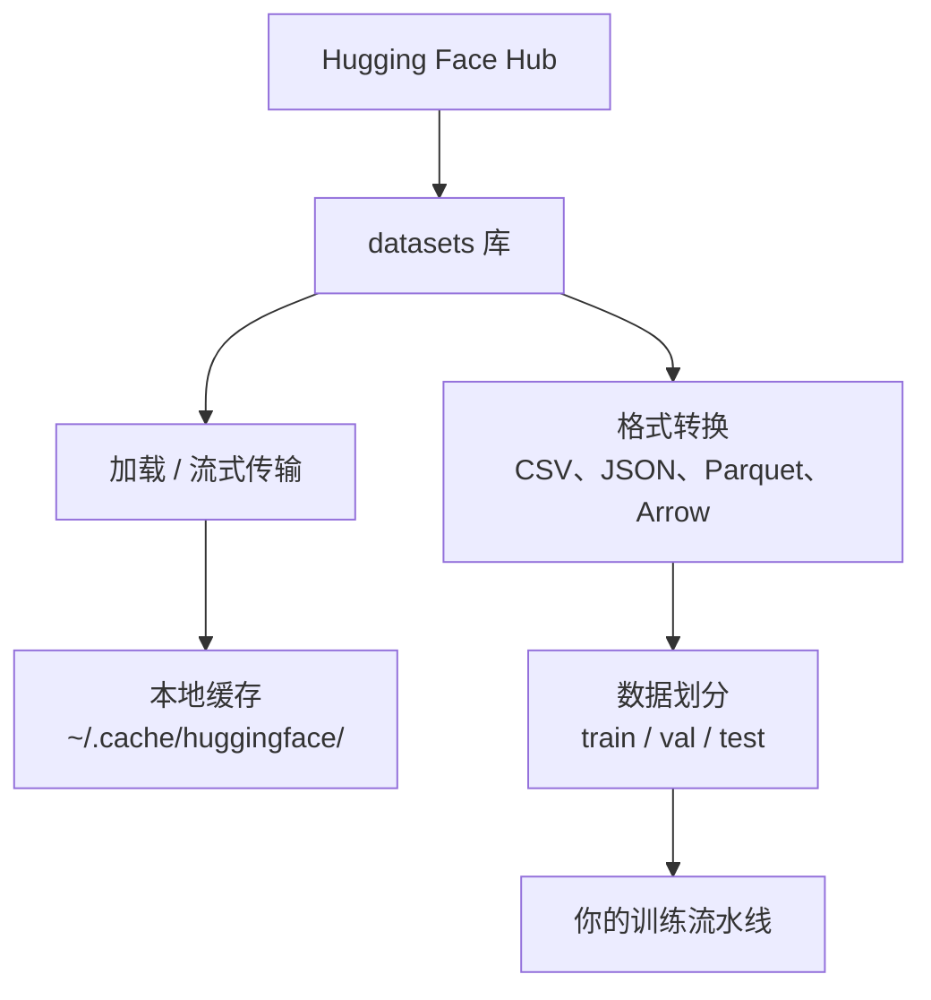

# 数据管理

> 数据是燃料。你如何管理它决定了你前进的速度。

**类型：** 构建
**使用语言：** Python
**前置课程：** 阶段 0，第 01 课
**预计时间：** ~45 分钟

## 学习目标

- 使用 Hugging Face `datasets` 库加载、流式传输和缓存数据集
- 在 CSV、JSON、Parquet 和 Arrow 格式之间转换并解释它们的权衡
- 使用固定的随机种子创建可复现的训练/验证/测试集划分
- 使用 `.gitignore`、Git LFS 或 DVC 管理大型模型和数据集文件

## 问题

每个 AI 项目都以数据开始。你需要找到数据集、下载它们、在格式之间转换、划分训练和评估集，并对其进行版本控制以确保实验可复现。每次都手动做这些既慢又容易出错。你需要一个可重复的工作流。

## 概念



Hugging Face `datasets` 库是 AI 工作中加载数据的标准方式。它开箱即用地处理下载、缓存、格式转换和流式传输。

## 构建它

### 步骤 1：安装 datasets 库

```bash
pip install datasets huggingface_hub
```

### 步骤 2：加载数据集

```python
from datasets import load_dataset

dataset = load_dataset("imdb")
print(dataset)
print(dataset["train"][0])
```

这会下载 IMDB 电影评论数据集。第一次下载后，它从 `~/.cache/huggingface/datasets/` 缓存加载。

### 步骤 3：流式传输大型数据集

某些数据集太大无法放入磁盘。流式传输逐行加载而不下载整个数据集。

```python
dataset = load_dataset("wikimedia/wikipedia", "20220301.en", split="train", streaming=True)

for i, example in enumerate(dataset):
    print(example["title"])
    if i >= 4:
        break
```

流式传输给你一个 `IterableDataset`。你逐行处理数据。无论数据集多大，内存使用保持恒定。

### 步骤 4：数据集格式

`datasets` 库底层使用 Apache Arrow。你可以根据流水线的需要转换为其他格式。

```python
dataset = load_dataset("imdb", split="train")

dataset.to_csv("imdb_train.csv")
dataset.to_json("imdb_train.json")
dataset.to_parquet("imdb_train.parquet")
```

格式对比：

| 格式 | 大小 | 读取速度 | 最佳用途 |
|------|-----|---------|---------|
| CSV | 大 | 慢 | 人类可读、电子表格 |
| JSON | 大 | 慢 | API、嵌套数据 |
| Parquet | 小 | 快 | 分析、列式查询 |
| Arrow | 最小 | 最快 | 内存中处理（`datasets` 内部使用的格式） |

对于 AI 工作，Parquet 是最佳的存储格式。Arrow 是你内存中处理时使用的格式。CSV 和 JSON 用于数据交换。

### 步骤 5：数据划分

每个 ML 项目需要三个划分：

- **训练集**：模型从中学习（通常 80%）
- **验证集**：训练期间检查进度（通常 10%）
- **测试集**：训练完成后的最终评估（通常 10%）

一些数据集已预先划分。如果没有，自己划分：

```python
dataset = load_dataset("imdb", split="train")

split = dataset.train_test_split(test_size=0.2, seed=42)
train_val = split["train"].train_test_split(test_size=0.125, seed=42)

train_ds = train_val["train"]
val_ds = train_val["test"]
test_ds = split["test"]

print(f"训练: {len(train_ds)}, 验证: {len(val_ds)}, 测试: {len(test_ds)}")
```

始终设置种子以确保可复现性。相同的种子每次产生相同的划分。

### 步骤 6：下载和缓存模型

模型是大文件。`huggingface_hub` 库处理下载和缓存。

```python
from huggingface_hub import hf_hub_download, snapshot_download

model_path = hf_hub_download(
    repo_id="sentence-transformers/all-MiniLM-L6-v2",
    filename="config.json"
)
print(f"缓存位置: {model_path}")

model_dir = snapshot_download("sentence-transformers/all-MiniLM-L6-v2")
print(f"完整模型位置: {model_dir}")
```

模型缓存到 `~/.cache/huggingface/hub/`。一旦下载，后续运行会即时加载。

### 步骤 7：处理大文件

模型权重和大型数据集不应放入 git。三种选择：

**选项 A：.gitignore（最简单）**

```
*.bin
*.safetensors
*.pt
*.onnx
data/*.parquet
data/*.csv
models/
```

**选项 B：Git LFS（在 git 中跟踪大文件）**

```bash
git lfs install
git lfs track "*.bin"
git lfs track "*.safetensors"
git add .gitattributes
```

Git LFS 在仓库中存储指针，实际文件存储在单独的服务器上。GitHub 提供 1 GB 免费空间。

**选项 C：DVC（数据版本控制）**

```bash
pip install dvc
dvc init
dvc add data/training_set.parquet
git add data/training_set.parquet.dvc data/.gitignore
git commit -m "使用 DVC 跟踪训练数据"
```

DVC 创建指向你数据的小 `.dvc` 文件。数据本身存储在 S3、GCS 或其他远程存储后端。

| 方法 | 复杂度 | 最佳用途 |
|------|-------|---------|
| .gitignore | 低 | 个人项目、可重新获取的下载数据 |
| Git LFS | 中 | 通过 git 共享模型权重的团队 |
| DVC | 高 | 可复现的实验、大数据集、团队 |

对本课程而言，`.gitignore` 就足够了。当需要跨机器复现精确实验时再使用 DVC。

### 步骤 8：存储模式

**本地存储** 适用于 10 GB 以下的数据集。HF 缓存自动处理。

**云存储** 适用于更大的数据集或跨机器共享：

```python
import os

local_path = os.path.expanduser("~/.cache/huggingface/datasets/")

# s3_path = "s3://my-bucket/datasets/"
# gcs_path = "gs://my-bucket/datasets/"
```

DVC 直接与 S3 和 GCS 集成：

```bash
dvc remote add -d myremote s3://my-bucket/dvc-store
dvc push
```

对本课程而言，本地存储就足够了。当你在远程 GPU 实例上微调时，云存储变得相关。

## 本课程使用的数据集

| 数据集 | 课程 | 大小 | 教什么 |
|--------|-----|------|-------|
| IMDB | 分词、分类 | 84 MB | 文本分类基础 |
| WikiText | 语言建模 | 181 MB | 下一个 token 预测 |
| SQuAD | 问答系统 | 35 MB | 问答、跨度 |
| Common Crawl（子集） | 嵌入 | 各异 | 大规模文本处理 |
| MNIST | 视觉基础 | 21 MB | 图像分类基础 |
| COCO（子集） | 多模态 | 各异 | 图文对 |

你现在不需要下载所有这些。每节课会指定所需内容。

## 使用它

运行工具脚本验证一切正常：

```bash
python code/data_utils.py
```

这会下载一个小型数据集、转换它、划分它并打印摘要。

## 交付

本课程产出：
- `code/data_utils.py` - 可复用的数据加载和缓存工具
- `outputs/prompt-data-helper.md` - 为任务找到合适数据集的提示词

## 练习

1. 加载 `glue` 数据集并使用 `mrpc` 配置，检查前 5 个示例
2. 流式传输 `c4` 数据集并计算 10 秒内能处理多少示例
3. 将数据集转换为 Parquet 并比较与 CSV 的文件大小
4. 创建 70/15/15 的训练/验证/测试划分，使用固定种子并验证大小

## 关键术语

| 术语 | 人们常说的 | 实际含义 |
|------|-----------|---------|
| 数据集划分 | "训练数据" | 在 ML 生命周期不同阶段使用的命名子集（train/val/test） |
| 流式传输 | "延迟加载" | 从远程源逐行处理数据，无需下载完整数据集 |
| Parquet | "压缩的 CSV" | 针对分析查询和存储效率优化的列式文件格式 |
| Arrow | "快速数据框" | datasets 库内部使用的内存列式格式，支持零拷贝读取 |
| Git LFS | "大文件版 git" | 将大文件存储在 git 仓库外部，同时在版本控制中保留指针的扩展 |
| DVC | "数据版 git" | 数据集和模型的版本控制系统，与云存储集成 |
| 缓存 | "已下载的" | 之前获取的数据的本地副本，默认存储在 ~/.cache/huggingface/ 中 |