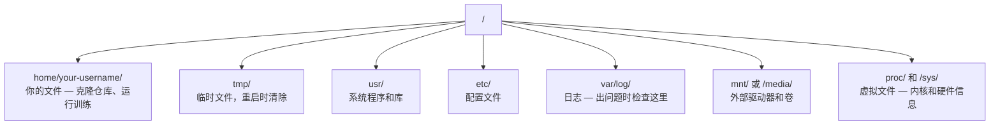

# AI 开发中的 Linux

> 大多数 AI 运行在 Linux 上。你需要知道足够多才不至于卡住。

**类型：** 学习
**使用语言：** --
**前置课程：** 阶段 0，第 01 课
**预计时间：** ~30 分钟

## 学习目标

- 在 Linux 文件系统中导航，从命令行执行基本文件操作
- 使用 `chmod` 和 `chown` 管理文件权限，解决「权限被拒绝」错误
- 使用 `apt` 安装系统包，为 AI 工作设置一台全新的 GPU 机器
- 识别 macOS 和 Linux 之间的差异，这些差异常常让在远程机器上工作的开发者绊倒

## 问题

你在 macOS 或 Windows 上开发。但一旦 SSH 到云 GPU 机器、租用 Lambda 实例或启动 EC2，你就进入 Ubuntu 了。终端是你唯一的界面。没有 Finder、没有资源管理器、没有 GUI。如果你无法通过命令行导航文件系统、安装包和管理进程，你就只能一边支付空闲 GPU 费用，一边谷歌「如何在 Linux 解压文件」。

这是一份生存指南。它精确涵盖你在远程 Linux 机器上进行 AI 工作所需的内容。不多不少。

## 文件系统布局

Linux 将所有内容组织在单一根 `/` 下。没有 `C:\` 或 `/Volumes`。你会实际接触到的目录：



你的主目录是 `~` 或 `/home/your-username`。几乎所有事情都在这里进行。

## 基本命令

这 15 个命令覆盖了你在远程 GPU 机器上 95% 会做的事情。

### 移动

```bash
pwd                         # 我在哪？
ls                          # 这里有什么？
ls -la                      # 这里有什么，包括隐藏文件和详细信息？
cd /path/to/dir             # 去那里
cd ~                        # 回家
cd ..                       # 向上一级
```

### 文件和目录

```bash
mkdir my-project            # 创建目录
mkdir -p a/b/c              # 一次创建嵌套目录

cp file.txt backup.txt      # 复制文件
cp -r src/ src-backup/      # 复制目录（递归）

mv old.txt new.txt          # 重命名文件
mv file.txt /tmp/           # 移动文件

rm file.txt                 # 删除文件（没有回收站，没了就没了）
rm -rf my-dir/              # 删除目录及其所有内容
```

`rm -rf` 是永久性的。没有撤销。按回车之前仔细检查路径。

### 读取文件

```bash
cat file.txt                # 打印整个文件
head -20 file.txt           # 前 20 行
tail -20 file.txt           # 最后 20 行
tail -f log.txt             # 实时跟踪日志文件（Ctrl+C 停止）
less file.txt               # 滚动浏览文件（q 退出）
```

### 搜索

```bash
grep "error" training.log           # 查找包含 "error" 的行
grep -r "learning_rate" .           # 在当前目录的所有文件中搜索
grep -i "cuda" config.yaml          # 不区分大小写搜索

find . -name "*.py"                 # 查找当前目录下所有 Python 文件
find . -name "*.ckpt" -size +1G     # 查找大于 1GB 的检查点文件
```

## 权限

Linux 中每个文件都有所有者和权限位。当脚本无法执行或你不能写入目录时，你会遇到这个问题。

```bash
ls -l train.py
# -rwxr-xr-- 1 user group 2048 Mar 19 10:00 train.py
#  ^^^             所有者权限：读、写、执行
#     ^^^          组权限：读、执行
#        ^^        其他人：只读
```

常见修复：

```bash
chmod +x train.sh           # 使脚本可执行
chmod 755 deploy.sh         # 所有者：完全，其他人：读+执行
chmod 644 config.yaml       # 所有者：读+写，其他人：只读

chown user:group file.txt   # 更改文件所有者（需要 sudo）
```

当某处提示「权限被拒绝」时，几乎都是权限问题。`chmod +x` 或 `sudo` 能解决大多数情况。

## 包管理（apt）

Ubuntu 使用 `apt`。这是你安装系统级软件的方式。

```bash
sudo apt update             # 刷新包列表（总是先执行这个）
sudo apt install -y htop    # 安装包（-y 跳过确认）
sudo apt install -y build-essential  # C 编译器、make 等。许多 Python 包需要
sudo apt install -y tmux    # 终端复用器（断开后保持会话存活）

apt list --installed        # 已经安装了哪些？
sudo apt remove htop        # 卸载
```

在新 GPU 机器上通常安装的包：

```bash
sudo apt update && sudo apt install -y \
    build-essential \
    git \
    curl \
    wget \
    tmux \
    htop \
    unzip \
    python3-venv
```

## 用户和 sudo

你通常以普通用户身份登录。某些操作需要 root（管理员）权限。

```bash
whoami                      # 我是什么用户？
sudo command                # 以 root 身份运行单个命令
sudo su                     # 变成 root（用 exit 退出，谨慎使用）
```

在云 GPU 实例上，你通常就是唯一的用户并且已经拥有 sudo 权限。不要以 root 身份运行所有操作。只在需要时使用 sudo。

## 进程和 systemd

当你的训练卡住，或者需要检查正在运行什么时：

```bash
htop                        # 交互式进程查看器（q 退出）
ps aux | grep python        # 查找运行中的 Python 进程
kill 12345                  # 优雅停止 PID 为 12345 的进程
kill -9 12345               # 强制杀死（优雅方式无效时使用）
nvidia-smi                  # GPU 进程和内存使用
```

systemd 管理服务（后台守护进程）。如果你运行推理服务器会用到它：

```bash
sudo systemctl start nginx          # 启动服务
sudo systemctl stop nginx           # 停止它
sudo systemctl restart nginx        # 重启它
sudo systemctl status nginx         # 检查是否在运行
sudo systemctl enable nginx         # 开机自启
```

## 磁盘空间

GPU 机器通常磁盘空间有限。模型和数据集很快会填满它。

```bash
df -h                       # 所有挂载驱动器的磁盘使用情况
df -h /home                 # 特定 /home 的磁盘使用情况

du -sh *                    # 当前目录中每个项目的大小
du -sh ~/.cache             # 缓存大小（pip、huggingface 模型存放在这里）
du -sh /data/checkpoints/   # 检查检查点有多大

# 找到最大的空间占用者
du -h --max-depth=1 / 2>/dev/null | sort -hr | head -20
```

常见的空间节省方法：

```bash
# 清除 pip 缓存
pip cache purge

# 清除 apt 缓存
sudo apt clean

# 删除不需要的旧检查点
rm -rf checkpoints/epoch_01/ checkpoints/epoch_02/
```

## 网络

你会下载模型、传输文件并从命令行访问 API。

```bash
# 下载文件
wget https://example.com/model.bin                   # 下载文件
curl -O https://example.com/data.tar.gz              # 同样的事，用 curl
curl -s https://api.example.com/health | python3 -m json.tool  # 访问 API，美化 JSON

# 在机器之间传输文件
scp model.bin user@remote:/data/                     # 复制文件到远程机器
scp user@remote:/data/results.csv .                  # 从远程复制文件到本地
scp -r user@remote:/data/checkpoints/ ./local-dir/   # 复制目录

# 同步目录（对于大传输比 scp 更快，中断后能恢复）
rsync -avz --progress ./data/ user@remote:/data/
rsync -avz --progress user@remote:/results/ ./results/
```

对于大文件传输使用 `rsync` 而不是 `scp`。它只传输变化的字节，并且能处理中断的连接。

## tmux：保持会话存活

当你 SSH 到远程机器时，合上笔记本会杀死你的训练运行。tmux 防止这种情况。

```bash
tmux new -s train           # 创建名为 "train" 的新会话
# ... 开始你的训练，然后：
# Ctrl+B，然后 D            # 断开（训练继续运行）

tmux ls                     # 列出会话
tmux attach -t train        # 重新连接会话

# 在 tmux 中：
# Ctrl+B，然后 %            # 垂直分割窗格
# Ctrl+B，然后 "            # 水平分割窗格
# Ctrl+B，然后 方向键       # 在窗格之间切换
```

始终在 tmux 中运行长时间训练任务。务必这么做。

## 面向 Windows 用户的 WSL2

如果你在 Windows 上，WSL2 给你一个真正的 Linux 环境，无需双系统。

```bash
# 在 PowerShell（管理员模式）中
wsl --install -d Ubuntu-24.04

# 重启后，从开始菜单打开 Ubuntu
sudo apt update && sudo apt upgrade -y
```

WSL2 运行真正的 Linux 内核。本课中的所有内容在其中都能工作。你的 Windows 文件在 WSL 中的路径是 `/mnt/c/Users/YourName/`。

GPU 透传在 Windows 侧安装了 NVIDIA 驱动后可以工作。安装 Windows 版的 NVIDIA 驱动（不是 Linux 版），CUDA 将在 WSL2 中可用。

## 坑：macOS 到 Linux

如果你从 macOS 过来，这些会让你绊倒：

| macOS | Linux | 备注 |
|-------|-------|------|
| `brew install` | `sudo apt install` | 有时包名不同。`brew install htop` 和 `sudo apt install htop` 效果一样，但 `brew install readline` 和 `sudo apt install libreadline-dev` 不同。 |
| `open file.txt` | `xdg-open file.txt` | 但在远程机器上没有 GUI。使用 `cat` 或 `less`。 |
| `pbcopy` / `pbpaste` | 不可用 | 通过 SSH 无法使用剪贴板管道。 |
| `~/.zshrc` | `~/.bashrc` | macOS 默认是 zsh。大多数 Linux 服务器使用 bash。 |
| `/opt/homebrew/` | `/usr/bin/`、`/usr/local/bin/` | 二进制文件位置不同。 |
| `sed -i '' 's/a/b/' file` | `sed -i 's/a/b/' file` | macOS 的 sed 需要 `-i` 后面跟空字符串。Linux 不需要。 |
| 大小写不敏感文件系统 | 大小写敏感文件系统 | `Model.py` 和 `model.py` 在 Linux 上是两个不同的文件。 |
| 行尾符 `\n` | 行尾符 `\n` | 相同。但 Windows 使用 `\r\n`，这会破坏 bash 脚本。运行 `dos2unix` 修复。 |

## 快速参考卡片

```
导航:      pwd, ls, cd, find
文件:      cp, mv, rm, mkdir, cat, head, tail, less
搜索:      grep, find
权限:      chmod, chown, sudo
包管理:    apt update, apt install
进程:      htop, ps, kill, nvidia-smi
服务:      systemctl start/stop/restart/status
磁盘:      df -h, du -sh
网络:      curl, wget, scp, rsync
会话:      tmux new/attach/detach
```

## 练习

1. SSH 到任何 Linux 机器（或打开 WSL2），导航到你的主目录。创建一个项目文件夹，在里面用 `touch` 创建三个空文件，然后用 `ls -la` 列出它们。
2. 使用 apt 安装 `htop`，运行它，找出哪个进程使用了最多的内存。
3. 启动一个 tmux 会话，在里面运行 `sleep 300`，断开连接，列出会话，然后重新连接。
4. 使用 `df -h` 检查可用磁盘空间，然后使用 `du -sh ~/.cache/*` 找出缓存中占用了空间的内容。
5. 使用 `scp` 将文件从本地传输到远程机器，然后用 `rsync` 做同样的传输，比较体验。`