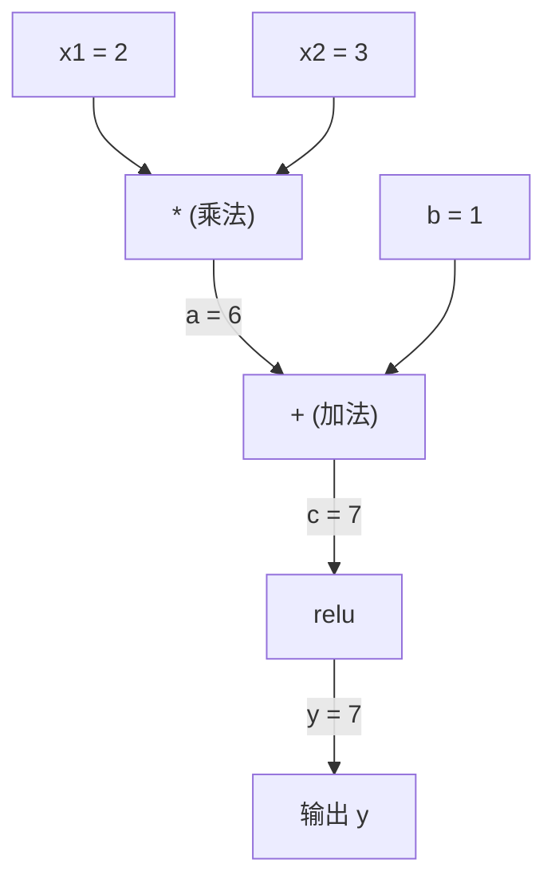
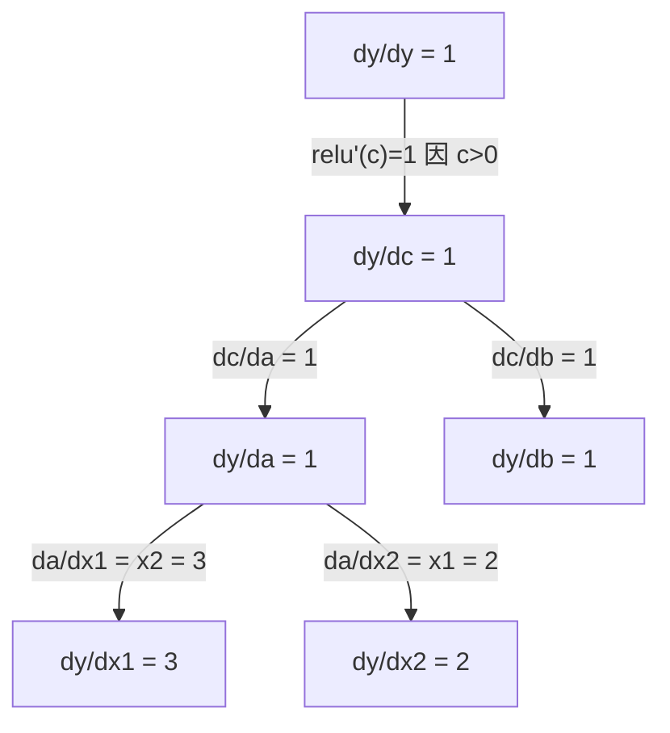

# 链式法则与自动微分

> 链式法则是每个会学习的神经网络背后的引擎。

**类型：** 构建
**使用语言：** Python
**前置课程：** 阶段 1，第 04 课（导数与梯度）
**预计时间：** ~90 分钟

## 学习目标

- 构建一个最小化的 autograd 引擎（Value 类），记录操作并通过反向模式自动微分计算梯度
- 使用拓扑排序通过计算图实现前向和反向传播
- 仅使用从零构建的 autograd 引擎构建并训练一个 XOR 多层感知器
- 通过对数值有限差分的梯度检查验证自动微分的正确性

## 问题

你可以计算简单函数的导数。但神经网络不是简单函数。它是数百个函数的组合：矩阵乘法、加偏置、应用激活、再次矩阵乘法、softmax、交叉熵损失。输出是一个函数的函数的函数。

要训练网络，你需要损失对每一个权重的梯度。对数百万参数手动做这是不可能的。数值方法（有限差分）做太慢。

链式法则给你数学。自动微分给你算法。它们一起让你通过任意函数组合计算精确梯度，时间仅与单次前向传播相当。

这就是 PyTorch、TensorFlow 和 JAX 的工作方式。你将从头构建一个微型版本。

## 概念

### 链式法则

如果 `y = f(g(x))`，y 对 x 的导数是：

```
dy/dx = dy/dg * dg/dx = f'(g(x)) * g'(x)
```

沿着链条相乘导数。每个环节贡献其局部导数。

示例: `y = sin(x^2)`

```
g(x) = x^2       g'(x) = 2x
f(g) = sin(g)     f'(g) = cos(g)

dy/dx = cos(x^2) * 2x
```

对于更深的组合，链条延伸：

```
y = f(g(h(x)))
dy/dx = f'(g(h(x))) * g'(h(x)) * h'(x)
```

神经网络中的每一层都是这条链条中的一环。

### 计算图

计算图让链式法则可视化。每个操作成为一个节点。数据向前流经图。梯度向后流动。

**前向传播（计算值）：**



**反向传播（计算梯度）：**



反向传播在每一个节点应用链式法则，将梯度从输出传播到输入。

### 前向模式 vs 反向模式

有两种方式在图期间应用链式法则。

**前向模式**从输入开始向前推送导数。适用于输入少、输出多的情况。

**反向模式**从输出开始向后拉回梯度。适用于输入多、输出少的情况。

神经网络有数百万输入（权重）和一个输出（损失）。反向模式在一次反向传播中计算所有梯度。这就是为什么反向传播使用反向模式。

| 模式 | 种子 | 方向 | 最适合 |
|------|------|------|-------|
| 前向 | `dx_i/dx_i = 1` | 输入到输出 | 输入少，输出多 |
| 反向 | `dy/dy = 1` | 输出到输入 | 输入多，输出少（神经网络） |

## 构建它

### 步骤 1：Value 类

```python
class Value:
    def __init__(self, data, children=(), op=''):
        self.data = data
        self.grad = 0.0
        self._backward = lambda: None
        self._prev = set(children)
        self._op = op

    def __repr__(self):
        return f"Value(data={self.data:.4f}, grad={self.grad:.4f})"
```

每个 `Value` 存储其数值数据、梯度（初始为零）、一个反向函数以及指向产生它的子节点的指针。

### 步骤 2：带梯度跟踪的算术操作

```python
    def __add__(self, other):
        other = other if isinstance(other, Value) else Value(other)
        out = Value(self.data + other.data, (self, other), '+')
        def _backward():
            self.grad += out.grad
            other.grad += out.grad
        out._backward = _backward
        return out

    def __mul__(self, other):
        other = other if isinstance(other, Value) else Value(other)
        out = Value(self.data * other.data, (self, other), '*')
        def _backward():
            self.grad += other.data * out.grad
            other.grad += self.data * out.grad
        out._backward = _backward
        return out
```

### 步骤 3：反向传播

```python
    def backward(self):
        topo = []
        visited = set()
        def build_topo(v):
            if v not in visited:
                visited.add(v)
                for child in v._prev:
                    build_topo(child)
                topo.append(v)
        build_topo(self)

        self.grad = 1.0
        for v in reversed(topo):
            v._backward()
```

## 练习

1. 使用 autograd 引擎计算 y = x^2 + 3x + 1 在 x=2 时的导数
2. 为 XOR 问题构建一个 MLP，仅使用你的 Value 类进行训练
3. 使用梯度检查（有限差分）验证反向传播梯度
4. 在计算图中追踪梯度，确认每个节点的链式法则相乘

## 关键术语

| 术语 | 人们常说的 | 实际含义 |
|------|-----------|---------|
| 计算图 | "操作树" | 将函数表示为操作节点的有向无环图 |
| 自动微分 | "自动梯度" | 通过函数组合计算机械式精确导数的算法 |
| 反向模式 | "反向传播" | 从输出开始，将梯度向后拉过图 |
| 拓扑排序 | "顺序" | 节点的线性排序，使依赖关系出现在使用它们之前 |
| 梯度检查 | "验证导数" | 将自动微分梯度与数值有限差分近似进行比较 |