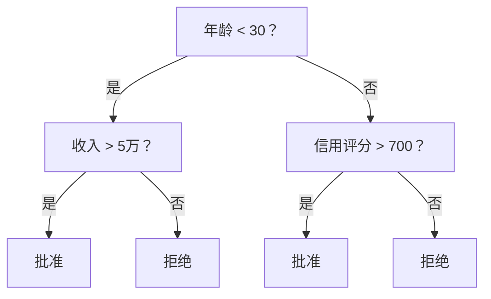
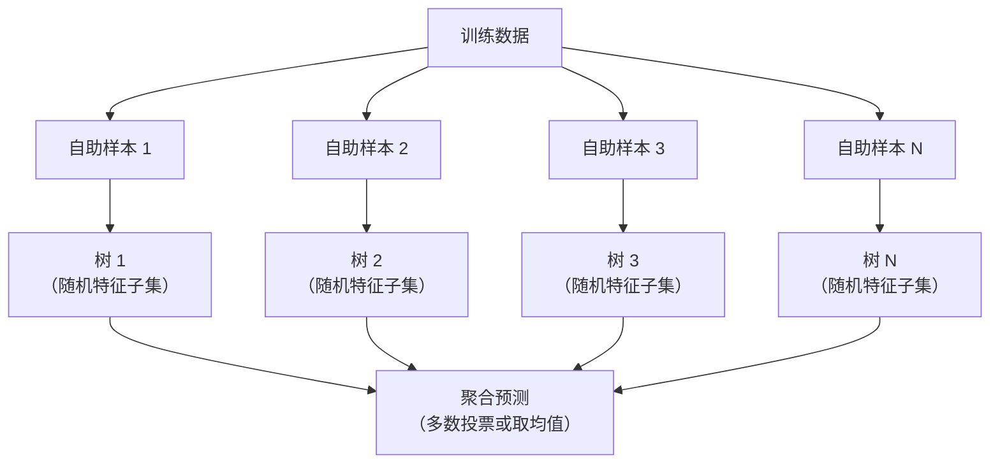

# 决策树与随机森林

> 决策树只是一个流程图。但由它们组成的森林是 ML 中最强大的工具之一。

**类型：** Build
**语言：** Python
**前置知识：** 阶段 1（第 09 课信息论，第 06 课概率）
**时间：** 约 90 分钟

## 学习目标

- 实现 Gini 不纯度、熵和信息增益计算，找到最优决策树分裂点
- 从零构建带有预剪枝控制（最大深度、最小样本数）的决策树分类器
- 使用自助采样和特征随机化构建随机森林，并解释它为什么降低方差
- 比较 MDI 特征重要性与排列重要性，识别 MDI 有偏的情况

## 问题

你有表格数据。行是样本，列是特征，还有你想要预测的目标列。你可以用一个神经网络来处理。但对于表格数据，基于树的模型（决策树、随机森林、梯度提升树）始终优于深度学习。结构化数据上的 Kaggle 竞赛由 XGBoost 和 LightGBM 主导，而不是 Transformer。

为什么？树可以处理混合特征类型（数值和类别）而无需预处理。它们可以在没有特征工程的情况下处理非线性关系。它们是可解释的：你可以查看树并确切看到为什么做出某个预测。而且随机森林对许多树取平均，在中等大小数据集上高度抵抗过拟合。

本课使用递归分裂从零构建决策树，然后在其上构建随机森林。你将实现分裂标准背后的数学（Gini 不纯度、熵、信息增益），并理解为什么弱学习器的集成可以变得强大。

## 概念

### 决策树做什么

决策树通过询问一系列是/否问题，将特征空间划分为矩形区域。



每个内部节点对某个特征与某个阈值进行比较测试。每个叶子节点做出预测。要对新数据点进行分类，从根节点开始，沿着分支直到到达叶子节点。

树是自顶向下构建的，在每个节点选择最能分离数据的特征和阈值。"最好"是由分裂标准定义的。

### 分裂标准：衡量不纯度

在每个节点，我们有一组样本。我们想要分裂它们，使产生的子节点尽可能"纯净"，即每个子节点主要包含一个类别。

**Gini 不纯度** 衡量如果按照该节点的类别分布来标记，随机选择的样本被错误分类的概率。

```
Gini(S) = 1 - sum(p_k^2)

其中 p_k 是类别 k 在集合 S 中的比例。
```

对于纯节点（全是同一类），Gini = 0。对于 50/50 的二元分裂，Gini = 0.5。越低越好。

```
示例：6 只猫，4 只狗

Gini = 1 - (0.6^2 + 0.4^2) = 1 - (0.36 + 0.16) = 0.48
```

**熵** 衡量节点中的信息量（无序程度）。在阶段 1 第 09 课中涵盖。

```
Entropy(S) = -sum(p_k * log2(p_k))
```

对于纯节点，熵 = 0。对于 50/50 的二元分裂，熵 = 1.0。越低越好。

```
示例：6 只猫，4 只狗

Entropy = -(0.6 * log2(0.6) + 0.4 * log2(0.4))
        = -(0.6 * -0.737 + 0.4 * -1.322)
        = 0.442 + 0.529
        = 0.971 bits
```

**信息增益** 是分裂后不纯度（熵或 Gini）的减少量。

```
IG(S, feature, threshold) = Impurity(S) - weighted_avg(Impurity(S_left), Impurity(S_right))

其中权重是每个子节点中样本的比例。
```

每个节点的贪心算法：尝试每个特征和每个可能的阈值。选择最大化信息增益的（特征，阈值）对。

### 分裂如何工作

对于当前节点有 n 个特征和 m 个样本的数据集：

1. 对于每个特征 j（j = 1 到 n）：
   - 按特征 j 排序样本
   - 尝试连续不同值之间的每个中点作为阈值
   - 计算每个阈值的信息增益
2. 选择具有最高信息增益的特征和阈值
3. 将数据分裂为左（特征 <= 阈值）和右（特征 > 阈值）
4. 在每个子节点上递归

这种贪心方法不保证全局最优树。找到最优树是 NP 难的。但贪心分裂在实践中效果很好。

### 停止条件

没有停止条件的话，树会一直生长直到每个叶子节点都是纯的（每个叶子一个样本）。这完美记忆训练数据，但泛化极差。

**预剪枝** 在树完全生长前停止它：
- 最大深度：当树达到设定深度时停止分裂
- 每个叶子的最小样本数：如果节点少于 k 个样本则停止
- 最小信息增益：如果最佳分裂对不纯度的改进低于阈值则停止
- 最大叶子节点数：限制叶子总数

**后剪枝** 先生长完整树，然后修剪：
- 代价复杂度剪枝（scikit-learn 使用）：添加与叶子数量成正比的惩罚。增加惩罚得到更小的树
- 减少误差剪枝：如果验证误差不增加则移除子树

预剪枝更简单更快。后剪枝通常产生更好的树，因为它不会过早停止那些可能导致有用进一步分裂的分支。

### 用于回归的决策树

对于回归，叶子预测是该叶子中目标值的均值。分裂标准也会改变：

**方差减少** 取代信息增益：

```
VR(S, feature, threshold) = Var(S) - weighted_avg(Var(S_left), Var(S_right))
```

选择最能减少方差的分裂。树将输入空间划分为区域，并在每个区域中预测一个常数（均值）。

### 随机森林：集成的力量

单个决策树方差高。数据中的小变化可以产生完全不同的树。随机森林通过对许多树取平均来解决这个问题。



两个随机性来源使树多样化：

**Bagging（自助聚合）**：每棵树在自助样本上训练，即从训练数据中带放回地随机采样。大约 63% 的原始样本出现在每个自助样本中（其余的成为袋外样本，可用于验证）。

**特征随机化**：每次分裂时，只考虑随机的特征子集。对于分类，默认是 sqrt(n_features)。对于回归，是 n_features/3。这防止所有树在相同的主导特征上分裂。

关键洞见：对许多去相关的树取平均可以在不增加偏差的情况下减少方差。每棵单独的树可能平庸。集成是强大的。

### 特征重要性

随机森林自然地提供特征重要性分数。最常用的方法：

**不纯度平均减少（MDI）**：对于每个特征，在所有树和所有使用该特征的节点上，将不纯度的总减少量相加。在较早分裂中产生更大不纯度减少的特征更重要。

```
importance(feature_j) = 在所有使用 feature_j 的节点上求和：
    (节点样本数 / 总样本数) * 不纯度减少量
```

这很快（在训练期间计算），但偏向高基数特征和有许多可能分裂点的特征。

**排列重要性** 是替代方案：打乱一个特征的值，测量模型准确率下降多少。更可靠但更慢。

### 什么时候树胜过神经网络

树和森林在表格数据上主导神经网络。几个原因：

| 因素 | 树 | 神经网络 |
|------|-----|---------|
| 混合类型（数值 + 类别） | 原生支持 | 需要编码 |
| 小数据集（< 1万行） | 效果好 | 过拟合 |
| 特征交互 | 通过分裂发现 | 需要架构设计 |
| 可解释性 | 完全透明 | 黑盒 |
| 训练时间 | 分钟级 | 小时级 |
| 超参数敏感性 | 低 | 高 |

当数据具有空间或序列结构（图像、文本、音频）时，神经网络胜出。对于扁平的特征表，树是默认选择。

## Build It

### 第 1 步：Gini 不纯度和熵

从零构建两个分裂标准，验证它们对哪些分裂是好的看法一致。

```python
import math

def gini_impurity(labels):
    n = len(labels)
    if n == 0:
        return 0.0
    counts = {}
    for label in labels:
        counts[label] = counts.get(label, 0) + 1
    return 1.0 - sum((c / n) ** 2 for c in counts.values())

def entropy(labels):
    n = len(labels)
    if n == 0:
        return 0.0
    counts = {}
    for label in labels:
        counts[label] = counts.get(label, 0) + 1
    return -sum(
        (c / n) * math.log2(c / n) for c in counts.values() if c > 0
    )
```

### 第 2 步：找到最佳分裂

尝试每个特征和每个阈值。返回信息增益最高的那个。

```python
def information_gain(parent_labels, left_labels, right_labels, criterion="gini"):
    measure = gini_impurity if criterion == "gini" else entropy
    n = len(parent_labels)
    n_left = len(left_labels)
    n_right = len(right_labels)
    if n_left == 0 or n_right == 0:
        return 0.0
    parent_impurity = measure(parent_labels)
    child_impurity = (
        (n_left / n) * measure(left_labels) +
        (n_right / n) * measure(right_labels)
    )
    return parent_impurity - child_impurity
```

### 第 3 步：构建 DecisionTree 类

递归分裂、预测和特征重要性追踪。

```python
class DecisionTree:
    def __init__(self, max_depth=None, min_samples_split=2,
                 min_samples_leaf=1, criterion="gini",
                 max_features=None):
        self.max_depth = max_depth
        self.min_samples_split = min_samples_split
        self.min_samples_leaf = min_samples_leaf
        self.criterion = criterion
        self.max_features = max_features
        self.tree = None
        self.feature_importances_ = None

    def fit(self, X, y):
        self.n_features = len(X[0])
        self.feature_importances_ = [0.0] * self.n_features
        self.n_samples = len(X)
        self.tree = self._build(X, y, depth=0)
        total = sum(self.feature_importances_)
        if total > 0:
            self.feature_importances_ = [
                fi / total for fi in self.feature_importances_
            ]

    def predict(self, X):
        return [self._predict_one(x, self.tree) for x in X]
```

### 第 4 步：构建 RandomForest 类

自助采样、特征随机化和多数投票。

```python
class RandomForest:
    def __init__(self, n_trees=100, max_depth=None,
                 min_samples_split=2, max_features="sqrt",
                 criterion="gini"):
        self.n_trees = n_trees
        self.max_depth = max_depth
        self.min_samples_split = min_samples_split
        self.max_features = max_features
        self.criterion = criterion
        self.trees = []

    def fit(self, X, y):
        n = len(X)
        for _ in range(self.n_trees):
            indices = [random.randint(0, n - 1) for _ in range(n)]
            X_boot = [X[i] for i in indices]
            y_boot = [y[i] for i in indices]
            tree = DecisionTree(
                max_depth=self.max_depth,
                min_samples_split=self.min_samples_split,
                max_features=self.max_features,
                criterion=self.criterion,
            )
            tree.fit(X_boot, y_boot)
            self.trees.append(tree)

    def predict(self, X):
        all_preds = [tree.predict(X) for tree in self.trees]
        predictions = []
        for i in range(len(X)):
            votes = {}
            for preds in all_preds:
                v = preds[i]
                votes[v] = votes.get(v, 0) + 1
            predictions.append(max(votes, key=votes.get))
        return predictions
```

完整实现（包含所有辅助方法）见 `code/trees.py`。

## Use It

使用 scikit-learn，训练随机森林只需三行：

```python
from sklearn.ensemble import RandomForestClassifier
from sklearn.datasets import load_iris
from sklearn.model_selection import train_test_split

X, y = load_iris(return_X_y=True)
X_train, X_test, y_train, y_test = train_test_split(X, y, random_state=42)

rf = RandomForestClassifier(n_estimators=100, random_state=42)
rf.fit(X_train, y_train)
print(f"准确率：{rf.score(X_test, y_test):.4f}")
print(f"特征重要性：{rf.feature_importances_}")
```

在实践中，梯度提升树（XGBoost、LightGBM、CatBoost）通常比随机森林更强，因为它们顺序构建树，每棵树纠正前一棵的错误。但随机森林更难错误配置，几乎不需要超参数调优。

## Ship It

本课产出 `outputs/prompt-tree-interpreter.md` —— 一个为业务相关方解释决策树分裂的提示词。输入训练好的树的结构（深度、特征、分裂阈值、准确率），它会将模型翻译为通俗语言规则、排序特征重要性、标记过拟合或泄露，并推荐下一步。任何时候你需要向不懂代码的人解释基于树的模型时使用它。

## 练习

1. 在具有 3 个类别的 2D 数据集上训练单个决策树。手动追踪分裂并画出矩形决策边界。比较 max_depth=2 和 max_depth=10 时的边界。

2. 为回归树实现方差减少分裂。生成 y = sin(x) + noise 的 200 个点并拟合你的回归树。画出树的分段常数预测与真实曲线的对比。

3. 用 1、5、10、50 和 200 棵树构建随机森林。绘制训练准确率和测试准确率与树数量的关系。观察测试准确率趋于平稳但不下降（森林抵抗过拟合）。

4. 在 5 个不同数据集上比较 Gini 不纯度 vs 熵作为分裂标准。测量准确率和树深度。在大多数情况下，它们产生几乎相同的结果。解释为什么。

5. 实现排列重要性。在一个有一个特征是随机噪声但基数高的数据集上与 MDI 重要性比较。MDI 会对噪声特征排名更高。排列重要性不会。

## 关键术语

| 术语 | 人们怎么说 | 实际含义 |
|------|-----------|---------|
| 决策树 | "用于预测的流程图" | 通过学习一系列 if/else 分裂将特征空间划分为矩形区域的模型 |
| Gini 不纯度 | "节点有多混杂" | 随机样本在节点处被误分类的概率。0 = 纯，0.5 = 二元情况最大不纯 |
| 熵 | "节点中的无序程度" | 节点处的信息内容。0 = 纯，1.0 = 二元情况最大不确定。来自信息论 |
| 信息增益 | "分裂有多好" | 分裂后不纯度的减少。选择分裂的贪心标准 |
| 预剪枝 | "提前停止树的生长" | 通过设置最大深度、最小样本数或最小增益阈值来提前停止树生长 |
| 后剪枝 | "事后修剪树" | 生长完整树，然后移除不改善验证性能的子树 |
| Bagging | "在随机子集上训练" | 自助聚合。每个模型在带放回的不同随机样本上训练 |
| 随机森林 | "一堆树" | 决策树的集成，每棵树在自助样本上训练，每次分裂时使用随机特征子集 |
| 特征重要性 (MDI) | "哪些特征重要" | 每个特征贡献的总不纯度减少量，在所有树和节点上求和 |
| 排列重要性 | "打乱并检查" | 当特征值随机打乱时准确率的下降。比 MDI 对噪声特征更可靠 |
| 方差减少 | "信息增益的回归版本" | 回归树的信息增益类比。选择最能减少目标方差的分裂 |
| 自助样本 | "带重复的随机样本" | 从原始数据集中带放回抽取的随机样本。大小相同，但有重复 |