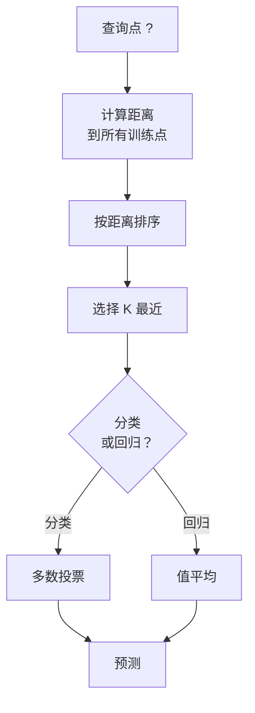
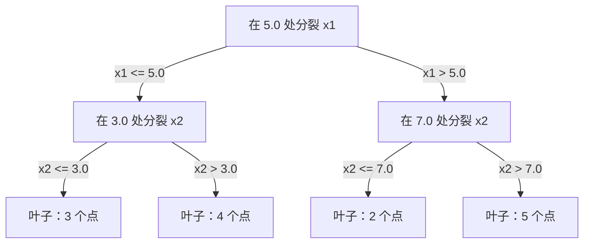

# K近邻与距离

> 存储一切。通过查看邻居来预测。最简单但实际上有效的算法。

**类型：** Build
**语言：** Python
**前置知识：** 阶段 1（第 14 课范数与距离）
**时间：** 约 90 分钟

## 学习目标

- 从零实现可配置 K 和距离加权投票的 KNN 分类与回归
- 比较 L1、L2、余弦和闵可夫斯基距离度量，为给定数据类型选择合适的度量
- 解释维度灾难并展示为什么 KNN 在高维空间中性能下降
- 构建 KD 树用于高效最近邻搜索，分析它何时优于暴力搜索

## 问题

你有一个数据集。一个新数据点来了。你需要对它分类或预测它的值。你不需要从数据中学习参数（像线性回归或 SVM），只需要找到离新点最近的 K 个训练点，让它们投票。

这就是 K 近邻。没有训练阶段。没有参数需要学习。没有损失函数需要最小化。你存储整个训练集，在预测时计算距离。

听起来太简单以至于不可能工作。但 KNN 在许多问题上出人意料地有竞争力，特别是对于中小数据集，深入理解它揭示了基础概念：距离度量的选择（连接到阶段 1 第 14 课），维度灾难，以及懒惰学习和急切学习的区别。

KNN 在现代 AI 中无处不在，只是换了名字。向量数据库对嵌入做 KNN 搜索。检索增强生成（RAG）找到 K 个最近的文档块。推荐系统找到相似用户或物品。算法是相同的，只是规模和数据结构不同。

## 概念

### KNN 如何工作

给定一个带标签点的数据集和一个新查询点：

1. 计算查询到数据集中每个点的距离
2. 按距离排序
3. 取 K 个最近的点
4. 对于分类：在 K 个邻居中多数投票
5. 对于回归：K 个邻居值的平均（或加权平均）



这就是整个算法。没有拟合。没有梯度下降。没有轮次。

### 选择 K

K 是唯一的超参数。它控制偏差-方差权衡：

| K | 行为 |
|---|----------|
| K = 1 | 决策边界跟随每个点。训练误差为零。高方差。过拟合 |
| 小 K (3-5) | 对局部结构敏感。可以捕捉复杂边界 |
| 大 K | 边界更平滑。对噪声更鲁棒。可能欠拟合 |
| K = N | 对每个点预测多数类别。最大偏差 |

常见起点是对于有 N 个点的数据集，K = sqrt(N)。二元分类使用奇数 K 以避免平局。


### 距离度量

距离函数定义了"近"的含义。不同的度量产生不同的邻居，不同的预测。

**L2（欧氏）** 是默认选择。直线距离。

```
d(a, b) = sqrt(sum((a_i - b_i)^2))
```

对特征尺度敏感。使用 L2 和 KNN 之前始终标准化特征。

**L1（曼哈顿）** 对绝对值差求和。比 L2 对离群点更鲁棒，因为它不对差平方。

```
d(a, b) = sum(|a_i - b_i|)
```

**余弦距离** 测量向量之间的夹角，忽略大小。对文本和嵌入数据必不可少。

```
d(a, b) = 1 - (a . b) / (||a|| * ||b||)
```

**闵可夫斯基** 使用参数 p 推广 L1 和 L2。

```
d(a, b) = (sum(|a_i - b_i|^p))^(1/p)

p=1: 曼哈顿
p=2: 欧氏
p->inf: 切比雪夫（最大绝对差）
```

使用哪种度量取决于数据：

| 数据类型 | 最佳度量 | 原因 |
|-----------|------------|-----|
| 数值特征，相似尺度 | L2（欧氏）| 默认，适用于空间数据 |
| 数值特征，存在离群点 | L1（曼哈顿）| 鲁棒，不放大大差异 |
| 文本嵌入 | 余弦 | 大小是噪声，方向是含义 |
| 高维稀疏 | 余弦或 L1 | L2 受维度灾难影响 |
| 混合类型 | 自定义距离 | 每个特征类型组合度量 |

### 加权 KNN

标准 KNN 对所有 K 个邻居给予相等权重。但距离 0.1 的邻居应该比距离 5.0 的邻居更重要。

**距离加权 KNN** 对每个邻居按距离的倒数加权：

```
weight_i = 1 / (distance_i + epsilon)

对于分类：加权投票
对于回归：     加权平均 = sum(w_i * y_i) / sum(w_i)
```

epsilon 防止查询点精确匹配训练点时除以零。

加权 KNN 对 K 的选择不那么敏感，因为遥远邻居无论如何贡献很小。

### 维度灾难

KNN 性能在高维度下降低。这不是模糊的担忧。这是一个数学事实。

**问题 1：距离收敛。** 随着维度增加，最大距离与最小距离的比率趋近于 1。所有点对于查询都变得同等"远"。

```
在 d 维中，对于随机均匀点：

d=2:    max_dist / min_dist = 变化很大
d=100:  max_dist / min_dist ~ 1.01
d=1000: max_dist / min_dist ~ 1.001

当所有距离几乎相等，"最近"就失去意义。
```

**问题 2：体积爆炸。** 为了在固定比例的数据中捕获 K 个邻居，你需要将搜索半径扩展到覆盖特征空间更大的部分。高维中的"邻域"包含了空间的大部分。

**问题 3：角落主导。** 在 d 维单位超立方体中，大部分体积集中在角落附近，而不是中心。当 d 增长时，内切于立方体的球包含的体积可以忽略不计。

实际后果：KNN 在大约 20-50 个特征以内效果好。超过这个范围，应用 KNN 之前你需要降维（PCA、UMAP、t-SNE），或者使用利用数据固有低维性的树搜索结构。

### KD-树：快速最近邻搜索

暴力 KNN 计算查询到每个训练点的距离。每次查询是 O(n * d)。对于大数据集，这太慢了。

KD 树递归地沿特征轴划分空间。在每一层，它在中位数处沿一个维度分裂。



要找到最近邻，遍历树到包含查询的叶子，然后回溯，只在相邻分区可能包含更近点时才检查它们。

平均查询时间：低维是 O(log n)。但在高维（d > 20）KD 树退化到 O(n)，因为回溯消除的分支越来越少。

### Ball 树：更好的中等维度

Ball 树将数据划分为嵌套超球体而不是轴对齐盒子。每个节点定义一个包含子树中所有点的球（中心 + 半径）。

相对于 KD 树的优势：
- 在中等维度（直到 ~50）效果更好
- 处理非轴对齐结构
- 更紧的边界体积意味着搜索期间可以剪枝更多分支

KD 树和 Ball 树都是精确算法。对于真正大规模搜索（数百万点，数百维度），使用近似最近邻方法（HNSW、IVF、乘积量化）代替。这些在阶段 1 第 14 课涵盖。

### 懒惰学习 vs 急切学习

KNN 是懒惰学习者：它在训练时不做任何工作，所有工作都在预测时。大多数其他算法（线性回归、SVM、神经网络）是急切学习者：它们在训练时做繁重计算构建紧凑模型，然后预测很快。

| 方面 | 懒惰（KNN） | 急切（SVM、神经网络） |
|--------|------------|------------------------|
| 训练时间 | O(1) 只存储数据 | O(n * epochs) |
| 预测时间 | O(n * d) 每次查询 | O(d) 或 O(parameters) |
| 预测时内存 | 存储整个训练集 | 只存储模型参数 |
| 适应新数据 | 即时添加点 | 需要重新训练模型 |
| 决策边界 | 隐式，动态计算 | 显式，训练后固定 |

懒惰学习在以下情况理想：
- 数据集频繁变化（添加/移除点无需重新训练）
- 你只需要对很少的查询做预测
- 你想要零训练时间
- 数据集足够小，暴力搜索足够快

### KNN 用于回归

KNN 回归不使用多数投票，而是平均 K 个邻居的目标值。

```
预测 = (1/K) * sum(y_i 对 i in K 最近邻居)

带距离加权：
预测 = sum(w_i * y_i) / sum(w_i)
其中 w_i = 1 / distance_i
```

KNN 回归产生分段常数（带加权后是分段光滑）预测。它不能外推到训练数据范围之外。如果训练目标都在 0 到 100 之间，KNN 永远不会预测 200。

## Build It

### 第 1 步：距离函数

实现 L1、L2、余弦和闵可夫斯基距离。这些直接连接到阶段 1 第 14 课。

```python
import math

def l2_distance(a, b):
    return math.sqrt(sum((ai - bi) ** 2 for ai, bi in zip(a, b)))

def l1_distance(a, b):
    return sum(abs(ai - bi) for ai, bi in zip(a, b))

def cosine_distance(a, b):
    dot_val = sum(ai * bi for ai, bi in zip(a, b))
    norm_a = math.sqrt(sum(ai ** 2 for ai in a))
    norm_b = math.sqrt(sum(bi ** 2 for bi in b))
    if norm_a == 0 or norm_b == 0:
        return 1.0
    return 1.0 - dot_val / (norm_a * norm_b)

def minkowski_distance(a, b, p=2):
    if p == float('inf'):
        return max(abs(ai - bi) for ai, bi in zip(a, b))
    return sum(abs(ai - bi) ** p for ai, bi in zip(a, b)) ** (1 / p)
```

### 第 2 步：KNN 分类器和回归器

构建完整的 KNN，支持可配置的 K、距离度量和可选距离加权。

```python
class KNN:
    def __init__(self, k=5, distance_fn=l2_distance, weighted=False,
                 task="classification"):
        self.k = k
        self.distance_fn = distance_fn
        self.weighted = weighted
        self.task = task
        self.X_train = None
        self.y_train = None

    def fit(self, X, y):
        self.X_train = X
        self.y_train = y

    def predict(self, X):
        return [self._predict_one(x) for x in X]
```

### 第 3 步：KD 树用于高效搜索

从零构建 KD 树，递归地在每个维度的中位数处分裂。

```python
class KDTree:
    def __init__(self, X, indices=None, depth=0):
        # Recursively partition the data
        self.axis = depth % len(X[0])
        # Split on median of the current axis
        ...

    def query(self, point, k=1):
        # Traverse to leaf, then backtrack
        ...
```

完整实现（包含所有辅助方法和演示）见 `code/knn.py`。

### 第 4 步：特征缩放

KNN 需要特征缩放，因为距离对特征量级敏感。范围从 0 到 1000 的特征会主导范围从 0 到 1 的特征。

```python
def standardize(X):
    n = len(X)
    d = len(X[0])
    means = [sum(X[i][j] for i in range(n)) / n for j in range(d)]
    stds = [
        max(1e-10, (sum((X[i][j] - means[j]) ** 2 for i in range(n)) / n) ** 0.5)
        for j in range(d)
    ]
    return [[((X[i][j] - means[j]) / stds[j]) for j in range(d)] for i in range(n)], means, stds
```

## Use It

使用 scikit-learn：

```python
from sklearn.neighbors import KNeighborsClassifier
from sklearn.preprocessing import StandardScaler
from sklearn.pipeline import Pipeline

clf = Pipeline([
    ("scaler", StandardScaler()),
    ("knn", KNeighborsClassifier(n_neighbors=5, metric="euclidean")),
])
clf.fit(X_train, y_train)
print(f"准确率：{clf.score(X_test, y_test):.4f}")
```

当数据集足够大且维度足够低时，scikit-learn 自动使用 KD 树或 ball 树。对于高维数据，它回退到暴力搜索。你可以用 `algorithm` 参数控制这一点。

对于大规模最近邻搜索（数百万向量），使用 FAISS、Annoy 或向量数据库：

```python
import faiss

index = faiss.IndexFlatL2(dimension)
index.add(embeddings)
distances, indices = index.search(query_vectors, k=5)
```

## 练习

1. 在具有 3 个类别的二维数据集上实现 KNN 分类。画出 K=1、K=5、K=15 和 K=N 的决策边界。观察从过拟合到欠拟合的过渡。

2. 在 2、5、10、50、100 和 500 维度生成 1000 个随机点。对每个维度，计算最大两两距离与最小两两距离的比率。画出比率 vs 维度以可视化维度灾难。

3. 在文本分类问题（使用 TF-IDF 向量）上比较 KNN 使用 L1、L2 和余弦距离。哪种度量给出最佳准确率？为什么余弦往往对文本胜出？

4. 实现 KD 树并测量在 2D、10D 和 50D 中对 1k、10k 和 100k 个点查询时间与暴力搜索对比。在多少维度 KD 树不再比暴力搜索快？

5. 为 y = sin(x) + noise 构建加权 KNN 回归器。与非加权 KNN 在 K=3、10、30 时比较。展示加权产生更平滑的预测，特别是对于大 K。

## 关键术语

| 术语 | 实际含义 |
|------|----------------------|
| K 近邻 | 通过找到查询的 K 个最近训练点来预测的非参数算法 |
| 懒惰学习 | 训练时不计算。所有工作都在预测时发生。KNN 是典型例子 |
| 急切学习 | 训练时做繁重计算构建紧凑模型。大多数 ML 算法都是急切的 |
| 维度灾难 | 在高维中，距离收敛，邻域扩展到覆盖大部分空间，使 KNN 无效 |
| KD-树 | 递归沿特征轴划分空间的二叉树。低维 O(log n) 查询 |
| Ball 树 | 嵌套超球体的树。在中等维度（直到 ~50）比 KD 树效果更好 |
| 加权 KNN | 邻居按距离倒数加权。更近的邻居对预测影响更大 |
| 特征缩放 | 将特征归一化到可比范围。距离方法如 KNN 需要 |
| 多数投票 | 通过计数哪个类别在 K 邻居中最常见来分类 |
| 暴力搜索 | 计算到每个训练点的距离。每次查询 O(n*d)。精确但对大 n 慢 |
| 近似最近邻 | 比精确搜索快得多，找到近似最近点的算法（HNSW、LSH、IVF） |
| Voronoi 图 | 空间划分，每个区域包含所有比其他训练点更近于一个训练点的点。K=1 KNN 产生 Voronoi 边界 |

## 延伸阅读

- [Cover & Hart: Nearest Neighbor Pattern Classification (1967)](https://ieeexplore.ieee.org/document/1053964) - 基础 KNN 论文，证明错误率最多是贝叶斯最优的两倍
- [Friedman, Bentley, Finkel: An Algorithm for Finding Best Matches in Logarithmic Expected Time (1977)](https://dl.acm.org/doi/10.1145/355744.355745) - 原始 KD 树论文
- [Beyer et al.: When Is "Nearest Neighbor" Meaningful? (1999)](https://link.springer.com/chapter/10.1007/3-540-49257-7_15) - 最近邻维度灾难的形式分析
- [scikit-learn Nearest Neighbors documentation](https://scikit-learn.org/stable/modules/neighbors.html) - 实用指南，含算法选择
- [FAISS: A Library for Efficient Similarity Search](https://github.com/facebookresearch/faiss) - Meta 的十亿级近似最近邻搜索库
