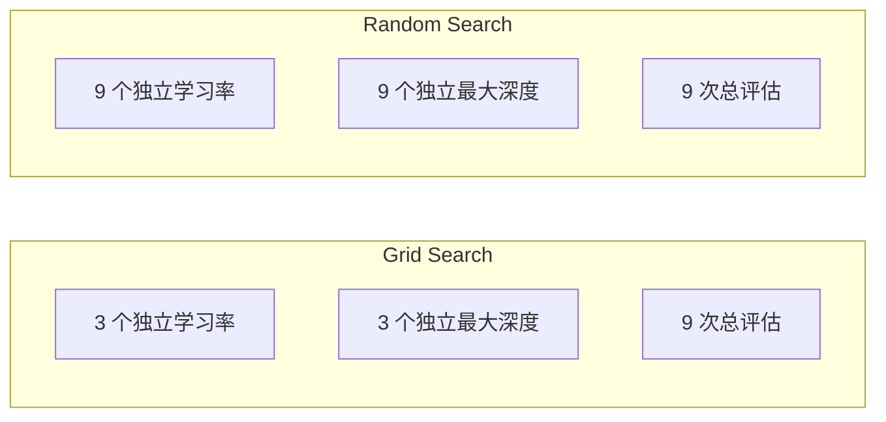
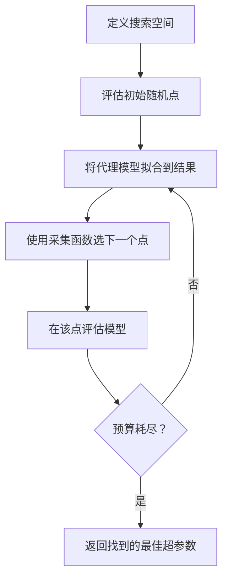
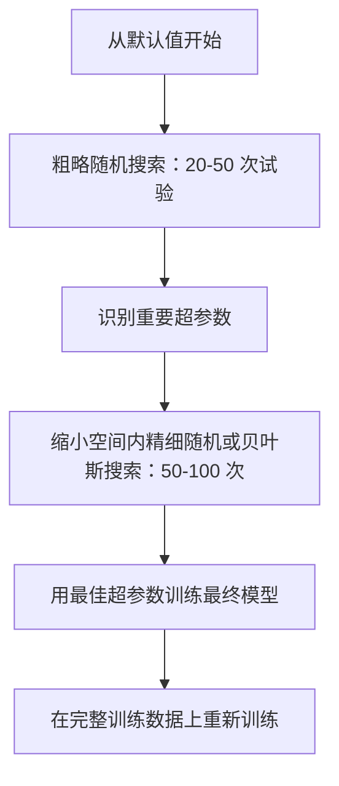
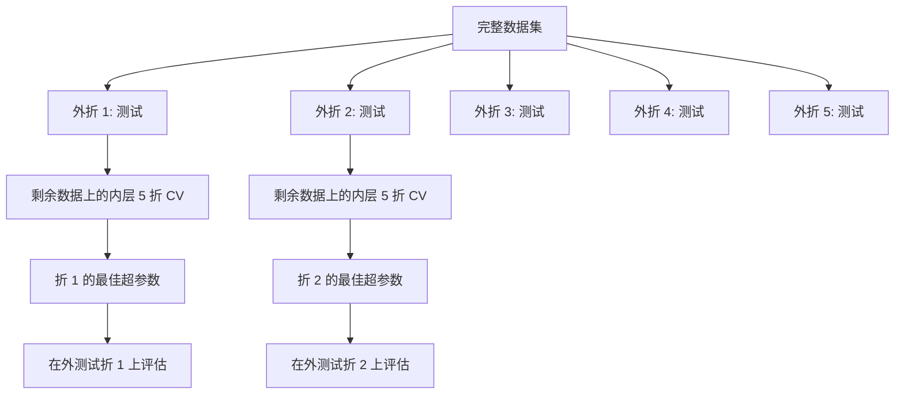

# 超参数调优

> 超参数是你在训练开始前调节的旋钮。调好它们是好模型和优秀模型之间的区别。

**类型：** Build
**语言：** Python
**前置知识：** 阶段 2 第 11 课（集成方法）
**时间：** 约 90 分钟

## 学习目标

- 从零实现网格搜索、随机搜索和贝叶斯优化，比较它们的样本效率
- 解释为什么当大多数超参数的有效维度很低时，随机搜索优于网格搜索
- 使用代理模型和采集函数构建贝叶斯优化循环来引导搜索
- 设计一个通过适当交叉验证避免过拟合验证集的超参数调优策略

## 问题

你的梯度提升模型有学习率、树的数量、最大深度、每叶最小样本数、子采样率和列采样率。这是六个超参数。如果每个有 5 个合理值，网格有 5^6 = 15,625 个组合。每个训练 10 秒。就是 43 小时的计算量。

网格搜索是最显而易见的方法，但在大规模上也是最差的。随机搜索用更少计算做得更好。贝叶斯优化通过学习过去的评估做得更好。知道使用哪种策略，以及哪些超参数真正重要，可以节省数天浪费的 GPU 时间。

## 概念

### 参数 vs 超参数

参数在训练过程中学习（权重、偏置、分裂阈值）。超参数在训练前设置，控制学习过程。

| 超参数 | 控制什么 | 典型范围 |
|---------------|-----------------|---------------|
| 学习率 | 每次更新步长 | 0.001 到 1.0 |
| 树数量/轮次数 | 训练多久 | 10 到 10,000 |
| 最大深度 | 模型复杂度 | 1 到 30 |
| 正则化（lambda） | 过拟合预防 | 0.0001 到 100 |
| 批次大小 | 梯度估计噪声 | 16 到 512 |
| Dropout 率 | 丢弃的神经元比例 | 0.0 到 0.5 |

### 网格搜索

网格搜索评估指定值的每种组合。它详尽且易于理解，但随超参数数量指数缩放。

```
2 个超参数的网格：

  learning_rate: [0.01, 0.1, 1.0]
  max_depth:     [3, 5, 7]

  评估：3 x 3 = 9 个组合

  (0.01, 3)  (0.01, 5)  (0.01, 7)
  (0.1,  3)  (0.1,  5)  (0.1,  7)
  (1.0,  3)  (1.0,  5)  (1.0,  7)
```

网格搜索有一个根本缺陷：如果一个超参数重要而其他不重要，大多数评估都浪费了。从 9 次评估中你只得到 3 个重要参数的独立值。

### 随机搜索

随机搜索从分布中采样超参数，而不是网格。在同样的 9 次评估预算下，你得到每个超参数的 9 个独立值。



为什么随机优于网格（Bergstra & Bengio, 2012）：

- 大多数超参数的有效维度很低。对于给定问题，6 个超参数中通常只有 1-2 个重要。
- 网格搜索在无关维度上浪费评估。
- 随机搜索在相同预算下更密集地覆盖重要维度。
- 在 60 次随机试验中，你有 95% 的几率找到距离最优解 5% 以内的点（如果搜索空间中存在最优解）。

### 贝叶斯优化

随机搜索忽略结果。它不知道高学习率会导致发散，也不知道深度 3 始终优于深度 10。贝叶斯优化使用过去的评估来决定下一个搜索位置。



两个关键组件：

**代理模型：** 一个评估成本低的模型（通常是高斯过程），近似昂贵的实际目标函数。它给出搜索空间中任何点的预测和不确定性估计。

**采集函数：** 通过平衡开发（在已知好的点附近搜索）和探索（在不确定性高的地方搜索）来决定下一步评估位置。常见选择：

- **期望改进（EI）：** 在这个点上能期望多大程度超过当前最佳？
- **上置信界（UCB）：** 预测加不确定性倍数。UCB 高意味着有潜力或未探索。
- **改进概率（PI）：** 这个点超过当前最佳的概率是多少？

贝叶斯优化通常用 2-5 倍更少的评估就找到比随机搜索更好的超参数。代理模型拟合的开销相比于实际模型训练可以忽略。

### 早停

不是每个训练都需要完成。如果 10 轮训练后某个配置明显不好，停止它并继续。这是在超参数搜索上下文中的早停。

策略：
- **基于耐心的：** 如果验证损失连续 N 轮不下降则停止
- **中位数修剪：** 如果试验的中间结果比已完成试验在同一阶段的中位数差则停止
- **Hyperband：** 为许多配置分配小预算，然后逐步为最好的增加预算

Hyperband 特别有效。81 个配置各从 1 轮开始，保留前三分之一，给他们 3 轮，再保留前三分之一，以此类推。这比用完整预算评估所有配置快 10-50 倍找到好的配置。

### 学习率调度器

学习率几乎总是最重要的超参数。调度器在训练过程中调整它，而不是保持不变。

| 调度器 | 公式 | 何时使用 |
|-----------|---------|-------------|
| 阶梯衰减 | 每 N 轮乘以 0.1 | 经典 CNN 训练 |
| 余弦退火 | lr * 0.5 * (1 + cos(pi * t / T)) | 现代默认 |
| 预热 + 衰减 | 线性增长然后余弦衰减 | Transformer |
| 单周期 | 在一个周期内先增后减 | 快速收敛 |
| 平台衰减 | 指标停滞时按因子减少 | 安全默认 |

### 超参数重要性

并非所有超参数同等重要。关于随机森林（Probst et al., 2019）和梯度提升的研究显示了持续的模式：

**高重要性：**
- 学习率（总是首先调优）
- 估计器数量/轮次数（使用早停代替调优）
- 正则化强度

**中等重要性：**
- 最大深度/层数
- 每叶最小样本/权重衰减
- 子采样率

**低重要性：**
- 最大特征（随机森林）
- 具体激活函数选择
- 批次大小（在合理范围内）

先调优重要的，其余保持默认。

### 实践策略



具体工作流：

1. **从库默认值开始。** 它们由有经验的从业者选择，通常已达到 80% 的效果。
2. **粗略随机搜索。** 宽范围，20-50 次试验。使用早停快速终止坏试验。
3. **分析结果。** 哪些超参数与性能相关？缩小搜索空间。
4. **精细搜索。** 在缩小的空间中进行贝叶斯优化或聚焦的随机搜索。50-100 次试验。
5. **在找到的最佳超参数上对所有训练数据重新训练。**

### 交叉验证集成

在单个验证划分上调优超参数是有风险的。最佳超参数可能过拟合到那个特定的验证折。嵌套交叉验证通过使用两个循环解决：

- **外循环**（评估）：将数据分为训练+验证和测试。报告无偏性能。
- **内循环**（调优）：将训练+验证分为训练和验证。找到最佳超参数。



每个外折独立地找到自己的最佳超参数。外折分数是泛化性能的无偏估计。

使用 sklearn：

```python
from sklearn.model_selection import cross_val_score, GridSearchCV
from sklearn.ensemble import GradientBoostingRegressor

inner_cv = GridSearchCV(
    GradientBoostingRegressor(),
    param_grid={
        "learning_rate": [0.01, 0.05, 0.1],
        "max_depth": [2, 3, 5],
        "n_estimators": [50, 100, 200],
    },
    cv=5,
    scoring="neg_mean_squared_error",
)

outer_scores = cross_val_score(
    inner_cv, X, y, cv=5, scoring="neg_mean_squared_error"
)

print(f"嵌套 CV MSE: {-outer_scores.mean():.4f} +/- {outer_scores.std():.4f}")
```

这很昂贵（5 外折 x 5 内折 x 27 网格点 = 675 次模型拟合），但它给你值得信赖的性能估计。在论文中报告最终结果或决策影响重大时使用。

### 实用技巧

**从学习率开始。** 对基于梯度的方法它总是最重要的超参数。坏的学习率让其他一切无关紧要。固定其他超参数为默认值，先扫描学习率。

**对学习率和正则化使用 log-uniform 分布。** 0.001 和 0.01 之间的差异与 0.1 和 1.0 之间的差异一样重要。线性搜索在大端浪费预算。

**使用早停代替调优 n_estimators。** 对提升和神经网络，将 n_estimators 或轮次设高，让早停决定何时停止。这从搜索中移除一个超参数。

**预算分配。** 将 60% 的调优预算花在最重要的 2 个超参数上。剩下的 40% 花在其余上。前 2 个贡献了大部分性能变化。

**规模很重要。** 不要在 log 尺度上搜索批次大小（16、32、64 即可）。总是在 log 尺度上搜索学习率。使搜索分布匹配超参数如何影响模型。

| 模型类型 | 顶级超参数 | 推荐搜索 | 预算 |
|-----------|--------------------|--------------------|--------|
| 随机森林 | n_estimators, max_depth, min_samples_leaf | 随机搜索，50 次 | 低（训练快） |
| 梯度提升 | learning_rate, n_estimators, max_depth | 贝叶斯，100 次 + 早停 | 中 |
| 神经网络 | learning_rate, weight_decay, batch_size | 贝叶斯或随机，100+ 次 | 高（训练慢） |
| SVM | C, gamma（RBF 核） | log 尺度网格，25-50 次 | 低（2 参数） |
| Lasso/Ridge | alpha | log 尺度 1D 搜索，20 次 | 很低 |
| XGBoost | learning_rate, max_depth, subsample, colsample | 贝叶斯，100-200 次 + 早停 | 中 |

**存疑时：** 随机搜索 2 倍超参数数量的试验（如 6 个超参数 = 12+ 次最少）。你会惊讶于 50 次随机搜索有多常击败精心设计的网格搜索。

## Build It

### 第 1 步：从零实现网格搜索

`code/tuning.py` 中的代码从零实现网格搜索、随机搜索和简单的贝叶斯优化。

```python
def grid_search(model_fn, param_grid, X_train, y_train, X_val, y_val):
    keys = list(param_grid.keys())
    values = list(param_grid.values())
    best_score = -float("inf")
    best_params = None
    n_evals = 0

    for combo in itertools.product(*values):
        params = dict(zip(keys, combo))
        model = model_fn(**params)
        model.fit(X_train, y_train)
        score = evaluate(model, X_val, y_val)
        n_evals += 1

        if score > best_score:
            best_score = score
            best_params = params

    return best_params, best_score, n_evals
```

### 第 2 步：从零实现随机搜索

```python
def random_search(model_fn, param_distributions, X_train, y_train,
                  X_val, y_val, n_iter=50, seed=42):
    rng = np.random.RandomState(seed)
    best_score = -float("inf")
    best_params = None

    for _ in range(n_iter):
        params = {k: sample(v, rng) for k, v in param_distributions.items()}
        model = model_fn(**params)
        model.fit(X_train, y_train)
        score = evaluate(model, X_val, y_val)

        if score > best_score:
            best_score = score
            best_params = params

    return best_params, best_score, n_iter
```

### 第 3 步：贝叶斯优化（简化版）

核心思想：将高斯过程拟合到观察到的（超参数，分数）对上，然后使用采集函数决定下一个探索位置。

```python
class SimpleBayesianOptimizer:
    def __init__(self, search_space, n_initial=5):
        self.search_space = search_space
        self.n_initial = n_initial
        self.X_observed = []
        self.y_observed = []

    def _kernel(self, x1, x2, length_scale=1.0):
        dists = np.sum((x1[:, None, :] - x2[None, :, :]) ** 2, axis=2)
        return np.exp(-0.5 * dists / length_scale ** 2)

    def _fit_gp(self, X_new):
        X_obs = np.array(self.X_observed)
        y_obs = np.array(self.y_observed)
        y_mean = y_obs.mean()
        y_centered = y_obs - y_mean

        K = self._kernel(X_obs, X_obs) + 1e-4 * np.eye(len(X_obs))
        K_star = self._kernel(X_new, X_obs)

        L = np.linalg.cholesky(K)
        alpha = np.linalg.solve(L.T, np.linalg.solve(L, y_centered))
        mu = K_star @ alpha + y_mean

        v = np.linalg.solve(L, K_star.T)
        var = 1.0 - np.sum(v ** 2, axis=0)
        var = np.maximum(var, 1e-6)

        return mu, var

    def _expected_improvement(self, mu, var, best_y):
        sigma = np.sqrt(var)
        z = (mu - best_y) / (sigma + 1e-10)
        ei = sigma * (z * norm_cdf(z) + norm_pdf(z))
        return ei

    def suggest(self):
        if len(self.X_observed) < self.n_initial:
            return sample_random(self.search_space)

        candidates = [sample_random(self.search_space) for _ in range(500)]
        X_cand = np.array([to_vector(c) for c in candidates])
        mu, var = self._fit_gp(X_cand)
        ei = self._expected_improvement(mu, var, max(self.y_observed))
        return candidates[np.argmax(ei)]

    def observe(self, params, score):
        self.X_observed.append(to_vector(params))
        self.y_observed.append(score)
```

GP 代理给每个候选点两个信息：预测分数（mu）和不确定性（var）。期望改进平衡两者：它倾向于模型预测高分或不确定性高的点。早期大多数点不确定性高，优化器探索。后期它聚焦在最有潜力的区域。

### 第 4 步：比较所有方法

在同一合成目标上运行所有三种方法并比较。

```python
def synthetic_objective(params):
    lr = params["learning_rate"]
    depth = params["max_depth"]
    return -(np.log10(lr) + 2) ** 2 - (depth - 4) ** 2 + 10

# 网格搜索
param_grid = {
    "learning_rate": [0.001, 0.01, 0.1, 1.0],
    "max_depth": [2, 3, 4, 5, 6, 7, 8],
}

# 随机搜索
param_dist = {
    "learning_rate": ("log_float", 0.001, 1.0),
    "max_depth": ("int", 2, 8),
}

# 贝叶斯优化
optimizer = SimpleBayesianOptimizer(param_dist, n_initial=5)
```

在相同预算下，贝叶斯优化通常最快找到最佳分数，因为它不会在明显差的区域浪费评估。随机搜索比网格搜索覆盖更多空间。网格搜索只在超参数很少且能负担穷举搜索时胜出。

## Use It

### Optuna 实践

Optuna 是严肃超参数调优的推荐库。它原生支持修剪、分布式搜索和可视化。

```python
import optuna

def objective(trial):
    lr = trial.suggest_float("learning_rate", 1e-4, 1e-1, log=True)
    n_est = trial.suggest_int("n_estimators", 50, 500)
    max_depth = trial.suggest_int("max_depth", 2, 10)

    model = GradientBoostingRegressor(
        learning_rate=lr,
        n_estimators=n_est,
        max_depth=max_depth,
    )
    model.fit(X_train, y_train)
    return mean_squared_error(y_val, model.predict(X_val))

study = optuna.create_study(direction="minimize")
study.optimize(objective, n_trials=100)

print(f"最佳参数: {study.best_params}")
print(f"最佳 MSE: {study.best_value:.4f}")
```

### Optuna 带修剪

修剪提前停止无潜力试验，节省大量计算：

```python
import optuna
from sklearn.model_selection import cross_val_score

def objective(trial):
    params = {
        "learning_rate": trial.suggest_float("lr", 1e-4, 0.5, log=True),
        "max_depth": trial.suggest_int("max_depth", 2, 10),
        "n_estimators": trial.suggest_int("n_estimators", 50, 500),
        "subsample": trial.suggest_float("subsample", 0.5, 1.0),
    }

    model = GradientBoostingRegressor(**params)
    scores = cross_val_score(model, X_train, y_train, cv=3,
                             scoring="neg_mean_squared_error")
    mean_score = -scores.mean()

    trial.report(mean_score, step=0)
    if trial.should_prune():
        raise optuna.TrialPruned()

    return mean_score

pruner = optuna.pruners.MedianPruner(n_startup_trials=10, n_warmup_steps=5)
study = optuna.create_study(direction="minimize", pruner=pruner)
study.optimize(objective, n_trials=200)
```

这通常节省 40-60% 的总计算量。

### sklearn 内置调优器

```python
from sklearn.model_selection import RandomizedSearchCV
from scipy.stats import loguniform, randint

param_dist = {
    "learning_rate": loguniform(1e-4, 1e-1),
    "n_estimators": randint(50, 500),
    "max_depth": randint(2, 10),
}

search = RandomizedSearchCV(
    GradientBoostingRegressor(),
    param_dist,
    n_iter=100,
    cv=5,
    scoring="neg_mean_squared_error",
    random_state=42,
    n_jobs=-1,
)
search.fit(X_train, y_train)
print(f"最佳参数: {search.best_params_}")
print(f"最佳 CV MSE: {-search.best_score_:.4f}")
```

### 超参数调优中的常见错误

**通过预处理的数据泄露。** 如果在交叉验证前在整个数据集上拟合缩放器，来自验证折的信息泄露到训练中。始终将预处理放在 `Pipeline` 中，使其只在训练折上拟合。

**对验证集过拟合。** 运行数千次试验实际上是训练在验证集上。使用嵌套交叉验证获得最终性能估计，或保留一个绝不接触的单独测试集。

**搜索范围太窄。** 如果你的最佳值在搜索空间边界上，说明你搜索得不够广。最优值可能在范围之外。始终检查最佳参数是否在边界。

**忽略交互效应。** 在提升中，学习率和估计器数量强烈交互。低学习率需要更多估计器。独立调优它们比同时调优效果更差。

**不对迭代模型使用早停。** 对于梯度提升和神经网络，将 n_estimators 或轮次设为高值并使用早停。这严格优于将迭代次数作为超参数调优。

## 练习

1. 以相同总预算（如 50 次评估）运行网格搜索和随机搜索。比较找到的最佳分数。用不同种子运行 10 次实验。随机搜索多少频率胜出？

2. 从零实现 Hyperband。从 81 个配置开始，每个训练 1 轮。每轮保留前 1/3 并将其预算翻三倍。比较总计算量。

3. 为第 11 课的梯度提升实现添加学习率调度器（余弦退火）。相比固定学习率有帮助吗？

4. 使用 Optuna 在真实数据集上调优 RandomForestClassifier。使用 `optuna.visualization.plot_param_importances(study)` 查看哪些超参数最重要。与本课的重要性排名匹配吗？

5. 实现一个简单的采集函数（期望改进）并演示探索与开发。绘制代理模型的均值和不确定性，显示 EI 选择下一步评估的位置。

## 关键术语

| 术语 | 人们说的 | 实际含义 |
|------|----------------|----------------------|
| 超参数 | "你选择的设置" | 训练前设置的值，控制学习过程，不是从数据中学习得到的 |
| 网格搜索 | "尝试每种组合" | 在指定参数网格上进行穷举搜索。指数成本。 |
| 随机搜索 | "只是随机采样" | 从分布中采样超参数。比网格搜索更好地覆盖重要维度。 |
| 贝叶斯优化 | "智能搜索" | 使用目标函数的代理模型决定下一步评估位置，平衡探索与开发 |
| 代理模型 | "廉价近似" | 一个模型（通常是高斯过程），从观察到的评估中近似昂贵的实际目标函数 |
| 采集函数 | "下一步看哪里" | 通过平衡期望改进与不确定性对候选点评分。EI 和 UCB 是常见选择。 |
| 早停 | "停止浪费时间" | 当验证性能停止改善时提前终止训练 |
| Hyperband | "配置锦标赛" | 自适应资源分配：以少量预算开始许多配置，保留最好的并增加预算 |
| 学习率调度器 | "在训练中改变 lr" | 一个在训练过程中调整学习率以获得更好收敛的函数 |

## 延伸阅读

- [Bergstra & Bengio: Random Search for Hyper-Parameter Optimization (2012)](https://jmlr.org/papers/v13/bergstra12a.html) -- 证明随机优于网格的论文
- [Snoek et al., Practical Bayesian Optimization of Machine Learning Algorithms (2012)](https://arxiv.org/abs/1206.2944) -- ML 贝叶斯优化
- [Li et al., Hyperband: A Novel Bandit-Based Approach (2018)](https://jmlr.org/papers/v18/16-558.html) -- Hyperband 论文
- [Optuna: A Next-generation Hyperparameter Optimization Framework](https://arxiv.org/abs/1907.10902) -- Optuna 论文
- [Probst et al., Tunability: Importance of Hyperparameters (2019)](https://jmlr.org/papers/v20/18-444.html) -- 哪些超参数重要