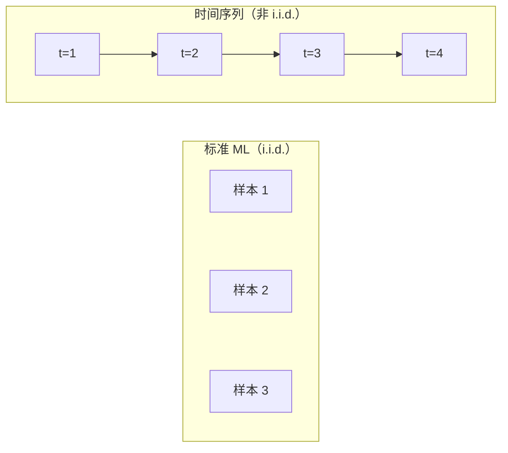
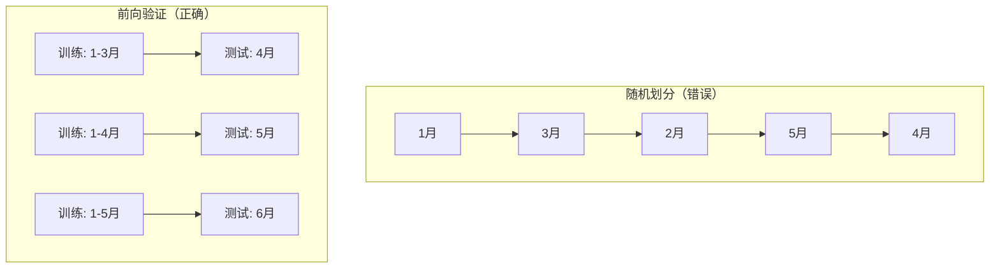

# 时间序列基础

> 过去的表现确实预示未来的结果——只要你首先检查平稳性。

**类型：** Build
**语言：** Python
**前置知识：** 阶段 2 第 01-09 课
**时间：** 约 90 分钟

## 学习目标

- 将时间序列分解为趋势、季节性和残差分量，并检验平稳性
- 实现滞后特征和滚动统计量，将时间序列转换为监督学习问题
- 构建一个防止未来数据泄露到训练中的前向验证框架
- 解释为什么随机训练/测试划分对时间序列无效，并展示与适当时间划分的性能差距

## 问题

你有按时间排序的数据。每日销售额、每小时温度、每分钟 CPU 使用率、每周股价。你想预测下一个值、下一周、下一季度。

你拿起标准 ML 工具包：随机训练/测试划分、交叉验证、特征矩阵输入、预测输出。每一步都是错的。

时间序列打破了标准 ML 依赖的假设。样本不是独立的——今天的温度取决于昨天的。随机划分将未来信息泄露到过去。在回测中看起来很好的特征在生产中失败，因为它们依赖随时间变化的模式。

一个使用随机交叉验证得到 95% 准确率的模型，在使用正确的时间评估时可能只有 55%。这个差异不是技术细节。是一个纸上有效的模型和一个生产中有效的模型之间的区别。

## 概念

### 时间序列有何不同

标准 ML 假设 i.i.d.——独立同分布。每个样本从相同分布中抽取，独立于其他样本。时间序列违反两者：

- **不独立。** 今天的股价依赖于昨天的。这周的销售额与上周相关。
- **不同分布。** 分布随时间变化。12 月的销售额与 3 月不同。

这些违反不是小问题。它们改变了你构建特征的方式、评估模型的方式以及哪些算法有效。



在标准 ML 中，样本是可互换的。打乱它们不影响。在时间序列中，顺序就是一切。打乱会破坏信号。

### 时间序列的组成

每个时间序列是以下各项的组合：

- **趋势：** 长期方向。收入每年增长 10%。全球温度上升。
- **季节性：** 固定间隔的重复模式。零售额在 12 月激增。空调使用在 7 月达到峰值。
- **残差：** 去除趋势和季节性后剩下的部分。如果残差看起来像白噪声，分解就捕捉到了信号。

### 平稳性

如果时间序列的统计属性（均值、方差、自相关）不随时间变化，它就是平稳的。大多数预测方法假设平稳性。

**为什么重要：** 非平稳序列的均值在漂移。在 1 月数据上训练的模型学到的均值与 2 月将呈现的不同。会系统性地出错。

**如何检查：** 计算窗口上的滚动均值和滚动标准差。如果它们漂移，序列是非平稳的。

**如何修复：** 差分。不建模原始值，建模连续值之间的变化：

```
diff[t] = value[t] - value[t-1]
```

如果一轮差分不够，再做一次（二阶差分）。大多数真实序列最多需要两轮。

**ADF 检验：** Augmented Dickey-Fuller 检验是标准的平稳性统计检验。p 值低于 0.05 可以拒绝原假设（非平稳）并得出平稳结论。

### 自相关

自相关衡量时间 t 的值与时间 t-k（过去 k 步）的值之间的相关程度。自相关函数（ACF）为每个滞后 k 绘制这个相关性。

**ACF 告诉你：**
- 序列记忆多远。如果 ACF 在滞后 5 后降到零，5 步之前的值无关。
- 是否存在季节性。如果 ACF 在滞后 12（月度数据）处尖峰，则存在年度季节性。
- 创建多少滞后特征。使用 ACF 变得可忽略之前的滞后。

**PACF（偏自相关函数）** 去除了间接相关性。如果今天与 3 天前相关仅因为两者与昨天相关，则滞后 3 的 PACF 为零而 ACF 不为零。

### 滞后特征：将时间序列转为监督学习

标准 ML 模型需要特征矩阵 X 和目标 y。时间序列给你一列值。桥梁是滞后特征。

取序列 [10, 12, 14, 13, 15] 并创建 lag-1 和 lag-2 特征：

| lag_2 | lag_1 | 目标 |
|-------|-------|--------|
| 10    | 12    | 14     |
| 12    | 14    | 13     |
| 14    | 13    | 15     |

现在你有了一个标准回归问题。任何 ML 模型都可以从滞后预测目标。

你可以工程化的其他特征：
- **滚动统计量：** 最近 k 个值的均值、标准差、最小值、最大值
- **日历特征：** 星期几、月份、是否假日、是否周末
- **差分值：** 相对前一步的变化
- **扩展统计量：** 累计均值、累计和
- **比率特征：** 当前值 / 滚动均值

### 前向验证

这是本课最重要的概念。标准 K 折交叉验证随机分配样本到训练和测试。对时间序列，这会泄露未来信息。



前向验证：
1. 用截至时间 t 的数据训练
2. 在时间 t+1 预测
3. 向前滑动窗口
4. 重复

每个测试折只包含所有训练数据之后的数据。无未来泄露。这给你模型部署后表现的诚实估计。

### 何时使用什么

| 方法 | 最适合 | 处理季节性 | 处理外部特征 |
|----------|---------|-------------------|------------------------|
| 滞后特征 + ML | 多外部特征的表格数据 | 配合日历特征 | 是 |
| ARIMA | 单变量序列，短期 | SARIMA 变体 | 否 |
| 指数平滑 | 简单趋势 + 季节性 | 是（Holt-Winters） | 否 |
| Prophet | 业务预测，节假日 | 是（傅里叶项） | 有限 |
| 神经网络 | 长序列，多序列 | 学习得到 | 是 |

对于大多数实际问题，滞后特征 + 梯度提升是最强起点。

### 预测策略

**递归：** 预测一步，将预测作为下一步的输入。简单但误差累积。

**直接：** 为每个预测期训练单独模型。无误差累积，但每个模型训练样本更少。

**多输出：** 训练一个输出所有预测期的模型。共享信息但需要支持多输出的模型。

## Build It

### 滞后特征创建器

```python
def make_lag_features(series, n_lags):
    n = len(series)
    X = np.full((n, n_lags), np.nan)
    for lag in range(1, n_lags + 1):
        X[lag:, lag - 1] = series[:-lag]
    valid = ~np.isnan(X).any(axis=1)
    return X[valid], series[valid]
```

### 前向交叉验证

```python
def walk_forward_split(n_samples, n_splits=5, min_train=50):
    step = max(1, (n_samples - min_train) // n_splits)
    for i in range(n_splits):
        train_end = min_train + i * step
        test_end = min(train_end + step, n_samples)
        if train_end >= n_samples:
            break
        yield slice(0, train_end), slice(train_end, test_end)
```

### 简单自回归模型

纯 AR 模型就是滞后特征上的线性回归：

```python
class SimpleAR:
    def __init__(self, n_lags=5):
        self.n_lags = n_lags
        self.weights = None
        self.bias = None

    def fit(self, series):
        X, y = make_lag_features(series, self.n_lags)
        X_b = np.column_stack([np.ones(len(X)), X])
        theta = np.linalg.lstsq(X_b, y, rcond=None)[0]
        self.bias = theta[0]
        self.weights = theta[1:]
        return self
```

### 平稳性检查

```python
def check_stationarity(series, window=50):
    rolling_mean = np.array([
        series[max(0, i - window):i].mean()
        for i in range(1, len(series) + 1)
    ])
    rolling_std = np.array([
        series[max(0, i - window):i].std()
        for i in range(1, len(series) + 1)
    ])
    return rolling_mean, rolling_std
```

### 自相关

```python
def autocorrelation(series, max_lag=20):
    n = len(series)
    mean = series.mean()
    var = series.var()
    acf = np.zeros(max_lag + 1)
    for k in range(max_lag + 1):
        cov = np.mean((series[:n-k] - mean) * (series[k:] - mean))
        acf[k] = cov / var if var > 0 else 0
    return acf
```

## Use It

使用 sklearn，你可以直接使用滞后特征配任何回归器：

```python
from sklearn.linear_model import Ridge
from sklearn.model_selection import TimeSeriesSplit

X, y = make_lag_features(series, n_lags=10)

tscv = TimeSeriesSplit(n_splits=5)
for train_idx, test_idx in tscv.split(X):
    model = Ridge(alpha=1.0)
    model.fit(X[train_idx], y[train_idx])
    predictions = model.predict(X[test_idx])
```

## Ship It

本课产出：
- `outputs/prompt-time-series-advisor.md` -- 时间序列问题框架提示词
- `code/time_series.py` -- 滞后特征、前向验证、AR 模型、平稳性检查

### 你必须超越的基线

1. **最后值（持续性）。** 预测明天将与今天相同。对很多序列，出奇难超越。
2. **季节性朴素。** 预测今天将与上周同一天相同。如果你的模型不能超越这个，它没有学到任何超出季节性的有用模式。
3. **移动平均。** 预测最近 k 个值的平均。平滑噪声但不能捕捉突变。

### 实用技巧

1. **从绘图开始。** 任何建模前，绘制原始序列。寻找趋势、季节性、异常值、结构断点。
2. **先差分，再建模。** 如果序列有明显趋势，创建滞后特征前先差分。
3. **至少保留一个完整季节性周期。** 如果有周季节性，测试集至少需要完整一周。
4. **生产监控。** 时间序列模型随时间退化。追踪滚动预测误差。当误差开始上升时，用近期数据重新训练。
5. **注意制度变化。** 在疫情前数据上训练的模型不会预测疫情期间的行为。

## 练习

1. 合成生成带趋势和季节性的时间序列。用不同滞后数（1 到 30）训练 AR 模型。绘制验证误差 vs 滞后数。最优滞后数是多少？

2. 比较随机划分和前向验证。计算两者报告的"准确率"。差距多大？什么情况下随机划分更误导人？

3. 添加滚动均值特征（窗口 7 和 14）到滞后特征。与仅用滞后比较预测误差。滚动统计量有帮助吗？

4. 实现递归多步预测：训练一步预测模型，然后调用 10 次，每次将预测作为输入。绘制预测 vs 实际并观察误差如何累积。

## 关键术语

| 术语 | 人们说的 | 实际含义 |
|------|----------------|----------------------|
| 时间序列 | "按时间排序的数据" | 按时间顺序索引的一系列数据点，观察之间的间隔有意义 |
| 平稳性 | "统计属性不变化" | 时间序列的均值、方差和自相关在时间上恒定的属性 |
| 差分 | "值减前值" | 计算连续观察之间的差异，将非平稳序列转换为平稳序列 |
| 自相关 | "序列与自己过去的相关性" | 时间序列值与自身滞后版本之间的相关性，衡量序列的记忆程度 |
| 滞后特征 | "过去值作为特征" | 使用前序时间步的值作为特征以创建监督学习问题的技术 |
| 前向验证 | "时间尊重型交叉验证" | 训练数据严格在测试数据之前的评估方法，防止未来信息泄露 |
| 趋势 | "长期方向" | 时间序列向上或向下的持续运动，去除后可实现平稳性 |
| 季节性 | "定期重复" | 按固定时间间隔重复的模式，如每日、每周或每年周期 |
| 残差 | "剩下的部分" | 去除趋势和季节性后剩下的部分，理想为白噪声 |

## 延伸阅读

- [Hyndman & Athanasopoulos, Forecasting: Principles and Practice](https://otexts.com/fpp3/) -- 免费的时间序列预测教科书
- [Makridakis et al., The M5 Competition (2022)](https://www.sciencedirect.com/science/article/pii/S0169207021001874) -- 展示 ML 方法与统计方法对比的大规模预测竞赛