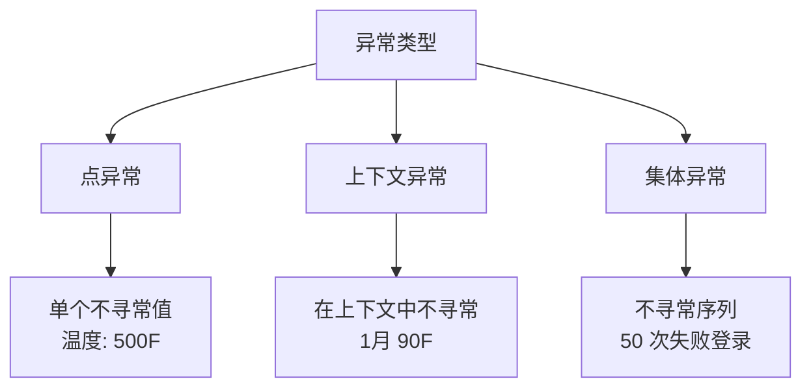
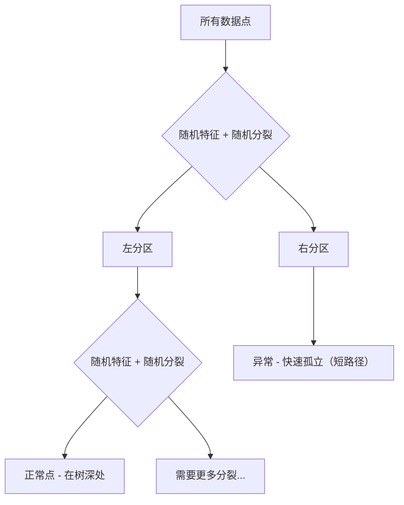

# 异常检测

> 正常很容易定义。异常就是不正常的东西。

**类型：** Build
**语言：** Python
**前置知识：** 阶段 2 第 01-09 课
**时间：** 约 75 分钟

## 学习目标

- 从零实现 Z 分数、IQR 和孤立森林异常检测方法
- 区分点异常、上下文异常和集体异常，为每种选择合适的检测方法
- 解释为什么异常检测被框架为建模正常数据而非分类异常
- 比较无监督异常检测与监督分类，评估新颖异常覆盖率与精确率之间的权衡

## 问题

一张信用卡下午 2 点在纽约使用，下午 2:05 在东京使用。一个工厂传感器读数 150 度而正常范围是 80-120。一台服务器每秒发送 50,000 个请求而日均只有 200。

这些都是异常。发现它们很重要。欺诈造成数十亿损失。设备故障导致停机。网络入侵造成数据损失。

挑战：你很少有标记的异常样本。欺诈占交易的 0.1%。设备故障一年发生几次。你不能训练标准分类器，因为"异常"类别中几乎没有东西可学。即使有一些标签，你见过的异常也不是你将来会遇到的唯一类型。明天的欺诈手法与今天不同。

异常检测将问题翻转。不学习什么是异常的，而是学习什么是正常的。任何偏离正常的都是可疑的。这在无标签情况下有效，适应新类型异常，并可扩展到海量数据集。

## 概念

### 异常类型

- **点异常。** 单个数据点无论上下文都不寻常。温度读数 500 度。一笔 $50,000 的交易来自通常消费 $50 的账户。
- **上下文异常。** 一个数据点在给定上下文下不寻常。90 度的温度在夏天正常，在冬天异常。相同值，不同上下文。
- **集体异常。** 作为整体不寻常的数据点序列，即使每个单独点可能正常。五次登录失败正常。连续五十次是暴力攻击。



### 无监督框架

异常检测本质上不同于分类。你建模的是正常数据的分布，而不是两个类别之间的决策边界。

三种情况：
1. **完全无监督。** 无标签。在所有数据上拟合检测器，期望异常足够稀少不至于破坏"正常"模型。
2. **半监督。** 有仅含正常数据的干净数据集。在这干净集上拟合，对其余一切评分。这是可能时最强的设置。
3. **弱监督。** 有少量标记异常。用于评估，不用于训练。

### Z 分数方法

最简单的方法。计算每个特征的均值和标准差。标记距离均值超过 k 个标准差的任何点。

```
z_score = (x - mean) / std
异常 if |z_score| > threshold
```

默认阈值为 3.0（正态分布下 99.7% 的正常数据落在 3 个标准差内）。

**优势：** 简单、快速、可解释。

**劣势：** 假设数据正态分布。对训练数据中的异常值敏感。在多峰分布上失败。

### IQR 方法

比 Z 分数更稳健。使用四分位距代替均值和标准差。

```
Q1 = 第 25 百分位
Q3 = 第 75 百分位
IQR = Q3 - Q1
下界 = Q1 - factor * IQR
上界 = Q3 + factor * IQR
异常 if x < 下界 or x > 上界
```

默认因子为 1.5。

**优势：** 对异常值稳健，适用于偏态分布，无需正态假设。

**劣势：** 仅单变量，无法检测在联合空间中异常的点。

### 孤立森林

核心洞见：异常是少且不同的。在数据的随机划分中，异常更容易被孤立——它们需要更少的随机分裂就能与其他点分离。



**工作原理：**
1. 构建许多随机树（孤立森林）
2. 在每个节点，随机选一个特征和一个在特征最小和最大值之间的分裂值
3. 继续分裂直到每个点被孤立（在自己的叶子中）
4. 异常在所有树上的平均路径长度更短

异常分数：`score(x) = 2^(-avg_path_length(x) / c(n))`，其中 c(n) 是 n 个样本的期望路径长度。分数接近 1 意味着异常。接近 0.5 意味着正常。

**优势：** 无分布假设，适用于高维，扩展性好，处理混合特征类型。

**劣势：** 在密集区域的异常（掩蔽效应）上困难，许多无关特征时随机分裂效果较差。

### 局部异常因子（LOF）

LOF 将点周围的局部密度与其邻居周围的密度比较。在密集区域包围的稀疏区域中的点是异常的。

**优势：** 检测局部异常，适用于不同密度的聚类。

**劣势：** 大数据集上慢（O(n^2)），对 k 选择敏感，非常高维效果差。

### 方法对比

| 方法 | 假设 | 速度 | 高维 | 检测局部异常 |
|--------|------------|-------|-------------------|------------------------|
| Z 分数 | 正态分布 | 很快 | 是（每特征） | 否 |
| IQR | 无（每特征） | 很快 | 是（每特征） | 否 |
| 孤立森林 | 无 | 快 | 是 | 部分 |
| LOF | 距离有意义 | 慢 | 差 | 是 |

### 评估挑战

评估异常检测器比评估分类器更难：

- **极端类别不平衡。** 0.1% 异常，预测"正常"给一切得到 99.9% 准确率。准确率无用。
- **更好的指标：** Precision@k（标记的前 k 项中有多少真实异常）、AUPRC（精确率-召回率曲线下面积）、固定误报率下的召回率。

## Build It

### Z 分数检测器

```python
def zscore_detect(X, threshold=3.0):
    mean = X.mean(axis=0)
    std = X.std(axis=0)
    std[std == 0] = 1.0
    z = np.abs((X - mean) / std)
    return z.max(axis=1) > threshold
```

### IQR 检测器

```python
def iqr_detect(X, factor=1.5):
    q1 = np.percentile(X, 25, axis=0)
    q3 = np.percentile(X, 75, axis=0)
    iqr = q3 - q1
    iqr[iqr == 0] = 1.0
    lower = q1 - factor * iqr
    upper = q3 + factor * iqr
    outside = (X < lower) | (X > upper)
    return outside.any(axis=1)
```

### 从零实现孤立森林

```python
class IsolationTree:
    def __init__(self, max_depth):
        self.max_depth = max_depth

    def fit(self, X, depth=0):
        n, p = X.shape
        if depth >= self.max_depth or n <= 1:
            self.is_leaf = True
            self.size = n
            return self
        self.is_leaf = False
        self.feature = np.random.randint(p)
        x_min = X[:, self.feature].min()
        x_max = X[:, self.feature].max()
        if x_min == x_max:
            self.is_leaf = True
            self.size = n
            return self
        self.threshold = np.random.uniform(x_min, x_max)
        left_mask = X[:, self.feature] < self.threshold
        self.left = IsolationTree(self.max_depth).fit(X[left_mask], depth + 1)
        self.right = IsolationTree(self.max_depth).fit(X[~left_mask], depth + 1)
        return self


class IsolationForest:
    def __init__(self, n_estimators=100, max_samples=256, seed=42):
        self.n_estimators = n_estimators
        self.max_samples = max_samples

    def fit(self, X):
        sample_size = min(self.max_samples, X.shape[0])
        max_depth = int(np.ceil(np.log2(sample_size)))
        for _ in range(self.n_estimators):
            idx = rng.choice(X.shape[0], size=sample_size, replace=False)
            tree = IsolationTree(max_depth=max_depth)
            tree.fit(X[idx])
            self.trees.append(tree)

    def anomaly_score(self, X):
        avg_path = 所有树上的平均路径长度
        scores = 2.0 ** (-avg_path / c(max_samples))
        return scores
```

## Use It

使用 sklearn：

```python
from sklearn.ensemble import IsolationForest
from sklearn.neighbors import LocalOutlierFactor

iso = IsolationForest(n_estimators=100, contamination=0.05, random_state=42)
iso.fit(X_train)
predictions = iso.predict(X_test)

lof = LocalOutlierFactor(n_neighbors=20, contamination=0.05, novelty=True)
lof.fit(X_train)
predictions = lof.predict(X_test)
```

### 生产考虑

1. **阈值漂移。** 数据分布变化时固定阈值过时。监控异常分数分布并定期调整。
2. **告警疲劳。** 太多误报操作员不再关注。从高阈值开始（更少、更可靠告警），随信任建立逐步降低。
3. **集成方法。** 生产中组合多个检测器。只在多个方法一致认为异常时才标记。这显著减少误报。
4. **特征工程。** 原始特征很少足够。添加滚动统计量、比率、距上次事件时间、领域特定特征。
5. **反馈闭环。** 当操作员调查标记项并确认或驳回，将这些反馈回系统。

## Ship It

本课产出：
- `outputs/skill-anomaly-detector.md` -- 选择正确检测器的决策技能
- `code/anomaly_detection.py` -- Z 分数、IQR 和孤立森林从零实现，含 sklearn 对比

## 练习

1. 生成带 5% 异常注入的二维高斯数据。用不同阈值（2.0、2.5、3.0、3.5）运行 Z 分数检测器。绘制精确率、召回率、F1 vs 阈值。最优阈值是多少？

2. 用相同数据比较 IQR 和 Z 分数。添加一些极值异常（|z| > 10）。这如何影响 Z 分数检测其他异常的能力？IQR 仍然能检测它们吗？

3. 变化孤立森林的最大样本数（64、128、256、512）。绘制 AUPRC vs max_samples。更大样本数总是更好吗？

4. 实现 LOF 从零实现（或使用 sklearn）。比较 LOF 和孤立森林在不同密度聚类的数据集上的表现。LOF 在哪表现更好？

## 关键术语

| 术语 | 人们说的 | 实际含义 |
|------|----------------|----------------------|
| 异常检测 | "找出奇怪的东西" | 识别不符合预期正常行为模式的数据点、事件或观察 |
| 点异常 | "单个奇怪值" | 不论上下文都被视为不寻常的单独数据点 |
| 上下文异常 | "在上下文中奇怪" | 仅在特定上下文（时间、位置）中不寻常的数据点，在其他地方可能正常 |
| Z 分数 | "多少标准差远" | 标准化分数衡量观测值离均值的标准差数量 |
| IQR | "四分位距" | 基于四分位数的稳健异常检测方法，使用第 25 和第 75 百分位定义正常范围 |
| 孤立森林 | "随机分裂找出离群者" | 使用随机划分树并衡量隔离一个点需要多少次分裂的集成异常检测方法 |
| LOF | "局部密度比较" | 将点的局部密度与其邻居比较的异常检测方法，发现局部而非全局异常 |
| 污染率 | "期望异常比例" | 数据集中异常估计比例，用于将连续异常分数转为二元决策 |

## 延伸阅读

- [Liu et al., Isolation Forest (2008)](https://cs.nju.edu.cn/zhouzh/zhouzh.files/publication/icdm08b.pdf) -- 原始孤立森林论文
- [Breunig et al., LOF: Identifying Density-Based Local Outliers (2000)](https://www.dbs.ifi.lmu.de/Publikationen/Papers/LOF.pdf) -- LOF 论文
- [Goldstein and Uchida, A Comparative Evaluation of Unsupervised Anomaly Detection Algorithms (2016)](https://journals.plos.org/plosone/article?id=10.1371/journal.pone.0152173) -- 真实数据集上 10 种方法的实证比较