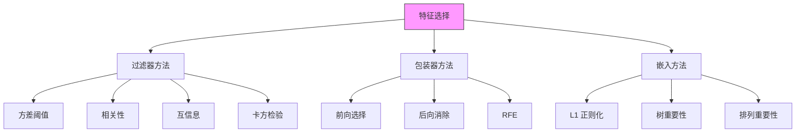

# 特征选择

> 在机器学习中，特征越多，问题越多。引入的每个无用特征都在阻止模型发现信号。

**类型：** Build
**语言：** Python
**前置知识：** 阶段 2 第 01-09 课
**时间：** 约 90 分钟

## 学习目标

- 从零实现方差阈值、基于相关性和互信息滤波器及递归特征消除
- 解释包装器、过滤器和嵌入方法之间的权衡，为给定约束选择合适方法
- 使用互信息选择类别预测和回归任务的特征
- 诊断维数灾难对距离方法的影响并量化使用太少或太多特征的代价

## 问题

你有 200 个特征，50 个真正有用。你如何找到那 50 个？

你训练一个模型在全部 200 个特征上。它学得很好——在训练数据上。在测试数据上？不行。150 个噪声特征给了模型自由参数，使它适应噪声而非信号。这称为过拟合，每多一个无关特征它都会加剧。

你尝试特征工程。你凭直觉选择特征。领域知识告诉你了 15 个。但剩下 35 个对模型却是隐藏的。一些与目标有非线性关系。一些仅在特定交互中才显现。

特征选择就是你找出剩余 35 个的方式。它是将 200 个特征降为 50 个，而非用 PCA 或自动编码器线性组合创建新特征。你只保留最有信息量的原始特征。这保留可解释性——如果医生想知道哪些指标预测心脏病发作，那就很有用。

## 概念

### 三种方法论

特征选择分为三类：



**过滤器方法**独立评估特征，不考虑后续模型。快速且可扩展。按方差、相关性或互信息给特征排序，选择前 k 个。

**包装器方法**使用模型性能来选择特征。它们在不同子集上训练模型，并保留产生最佳验证分数的子集。计算代价高但通常有更好特征质量。

**嵌入方法**在训练期间执行选择。LASSO（L1）将权重推为零，消除无关特征。基于树的模型产生特征重要性，用于选择前 k 个。

### 方差阈值

零方差特征包含所有行的相同值。这些在每个问题上都无用。

低方差特征，在几乎所有行中具有相同值（例如 99% 的值为真），可能提供极小信息。移除它们减少噪声并加速训练。

```python
def variance_threshold(X, threshold=0.0):
    keep = np.var(X, axis=0) > threshold
    return X[:, keep], np.where(keep)[0]
```

这是第一步。它快速，移除真正无用特征，之后几乎无缺点。总是在建模前应用。

### 基于相关性的选择

相关衡量两个变量之间的线性关系。计算每个特征与目标之间的相关性，保留相关性最高的特征。

优点是简单。缺点是假设线性关系。如果特征通过 U 形曲线影响目标，相关性考察可能误判它。

你需要同时考虑特征间的相关性。两个与目标高度相关的特征如果强相关则可能冗余。同时保留两者会增加模型复杂性，却可能不改善性能。一个基本规则是移除与已选中特征相关系数大于 0.95 的特征。

### 互信息

互信息是一个强大的方法，可检测特征和目标之间的任何函数依赖——非线性的、离散的、基于熵的。它回答一个简单问题：知道特征 A 的值能在多大程度上减少我对目标的不确定性？

公式：
```
I(X; Y) = H(Y) - H(Y|X)
```

或等价地：
```
I(X; Y) = H(X) + H(Y) - H(X, Y)
```

互信息高的特征无论关系是线性、二次还是分段都重要。这与仅捕捉线性的相关性形成对比。

对于连续特征和目标，最好通过直方图或 K 近邻估计来近似。

```python
def mutual_information_discrete(X_disc, y, n_bins=20):
    n_samples = len(y)
    mi_scores = np.zeros(X_disc.shape[1])

    hy = compute_entropy(y)

    for j in range(X_disc.shape[1]):
        hx = compute_entropy(X_disc[:, j])
        hxy = compute_joint_entropy(X_disc[:, j], y)
        mi_scores[j] = hx + hy - hxy

    return mi_scores
```

优点：非参数（无线性假设），适用于分类和回归目标，自然处理多变量交互。比相关性更能捕捉复杂模式。

缺点：连续数据需要离散化（分箱损失信息），在非常高维中将邻域方法变慢。

### 包装器方法

**前向选择：** 从空集开始。每次选择一个新特征，它在配合已选中特征使用时最能改进模型。

**后向消除：** 从全部特征开始。每次移除一个特征，它对剔除后模型性能损害最小。

**递归特征消除（RFE）：** 训练模型，消除最不重要的特征，重复。每一步重新训练模型。当只剩期望数量的特征时停止。

这些方法更慢但产生针对你特定模型的优化特征集。

### 嵌入方法

**LASSO 路径：** 用不同正则化强度 λ 值训练 LASSO。小 λ 时许多特征活跃。大 λ 时只保留最强特征。沿路径追踪哪些特征先消失——最持久的特征最有信号价值。用交叉验证选 λ，获得直接来自最优模型的特征子集。

**基于树的重要性：** 随机森林特征重要性衡量每个特征在所有树中平均减少的不纯度总和。按重要性排序特征并选择前 k 个。这对于树模型自然，但重要性偏好高基数类别特征（具有许多唯一值的类别产生虚假的高重要性分数）。

**排列重要性：** 打乱一列的值。在验证集上重新计算模型误差。如果打乱后误差显著增加，则该特征重要。这比不纯度重要性更稳健，不会偏好高基数类别。

```python
def permutation_importance(model, X, y, n_repeats=10):
    baseline_score = model.score(X, y)
    importances = np.zeros(X.shape[1])

    for j in range(X.shape[1]):
        scores = []
        for _ in range(n_repeats):
            X_perm = X.copy()
            X_perm[:, j] = np.random.permutation(X_perm[:, j])
            scores.append(model.score(X_perm, y))
        importances[j] = baseline_score - np.mean(scores)

    return importances
```

### 方法对比

| 方法 | 速度 | 质量 | 独立于模型 | 值得什么时候用 |
|--------|-------|---------|----------------|----------------|
| 方差阈值 | 很快 | 基线 | 是 | 始终：建模前移除零方差特征 |
| 相关性 | 快 | 好 | 是 | 第一个筛选：快速剔除多余特征 |
| 互信息 | 快 | 很好 | 是 | 非线性关系，得到稳健的特征排序 |
| 卡方 | 快 | 好 | 是 | 分类目标 + 离散/归一化特征 |
| RFE | 慢 | 非常好 | 否 | 最终优化：针对特定模型的特征子集 |
| LASSO | 快 | 好 | 否 | 线性模型要同时选择特征并完成训练 |
| 排列重要性 | 中等 | 非常好 | 否 | 任何模型上的稳健重要性估计 |

### 维数灾难

随着特征数量的增加，两个随机点之间的距离以 O(sqrt(d)) 的速度增长。在高维中，每个点到其他每个点的距离大致相同。距离失去意义。

这意味着 KNN 在高维中失效。基于距离的异常检测失效。聚类失效。你需要足够数据以确保每个维度的信息可靠。经验法则：每类每个特征需 O(10) 个样本来估计任何稳健的东西。

按相关性或互信息筛选来降维有助于重归有意义的距离。这也促使使用基于树的模型，它们通过轴对齐分裂更温和地应对维度——每个分裂一次只处理一个特征。

## Build It

### 从零实现特征选择器

```python
class FeatureSelector:
    def __init__(self):
        self.selected_features = None

    def fit(self, X, y, method="mutual_info", k=10, **kwargs):
        if method == "variance":
            scores = variance_filter(X)
        elif method == "correlation":
            scores = correlation_filter(X, y)
        elif method == "mutual_info":
            scores = mutual_information_filter(X, y)
        self.selected_features = np.argsort(scores)[-k:]
        return self

    def transform(self, X):
        return X[:, self.selected_features]
```

### LASSO 路径分析

```python
def lasso_path_analysis(X, y, alphas=None):
    if alphas is None:
        alphas = np.logspace(0, -3, 50)

    lasso = Lasso(max_iter=10000)
    coefs = []

    for alpha in alphas:
        lasso.set_params(alpha=alpha)
        lasso.fit(X, y)
        coefs.append(lasso.coef_.copy())

    return np.array(coefs), alphas
```

## Use It

sklearn 使特征选择流水线化：

```python
from sklearn.feature_selection import (
    VarianceThreshold,
    SelectKBest,
    f_classif,
    mutual_info_classif,
    RFE,
    RFECV,
    SelectFromModel,
)
from sklearn.linear_model import LassoCV

selector = VarianceThreshold(threshold=0.01)
X_filtered = selector.fit_transform(X)

k_best = SelectKBest(score_func=f_classif, k=10)
X_best = k_best.fit_transform(X, y)

lasso = LassoCV(cv=5).fit(X, y)
selector = SelectFromModel(lasso, prefit=True)
X_selected = selector.transform(X)
```

### 生产中的实际策略

生产中选择特征通常不是只跑一种方法，而是按层次组合它们。这样在保持有效性的同时控制计算成本。

1. **第一道：方差。** 移除方差为零或极低的特征。总是第一步。成本极低，从无损失。
2. **第二道：相关性。** 移除与已选中特征相关系数 > 0.95 的特征。降低冗余，加快后续步骤。
3. **第三道：单变量评分。** 使用互信息（非线性关系）或 f_classif（仅线性）。取前 k 个特征，其中 k 通常是 50 ~ 200。
4. **第四道：模型内选择。** 用选中的特征子集训练最终模型。如果模型有内嵌特征重要性（树模型、LASSO），按重要度修剪。如果模型是黑箱，用 RFE 或排列重要性做最终削减。

这种层层递进的方式平衡了速度和效果。廉价过滤器先跑，降低维度。昂贵的模型内方法仅在选取的特征子集上运行，省时又省力。

## Ship It

本课产出：
- `outputs/skill-feature-selector.md` -- 按数据类型、预算和模型选择最佳特征选择器的技能
- `code/feature_selection.py` -- 方差、相关性、互信息和 RFE 从零实现

## 练习

1. UI 应用程序包含 500 个特征。10 个与目标真正相关，490 个是噪声。比较逐步添加噪声特征时三种方法的性能。哪种方法在噪声特征增多时最稳定？

2. 创建两个强相关特征并用不同噪声比例复制它们。基于相关性的选择是否会发现冗余？在选择其中一个而非两个后，模型性能是否改变？

3. 在回归问题和分类问题上比较互信息与 f_score。当特征与目标具有非线性二次关系时，互信息是否会得到更高的特征得分？你会看到得分的差异模式是什么？

4. 围绕排列重要性构建特征选择器。在稳定之前需要多少次排列？测试重复次数从 1 到 50，看重要性排名的方差。

5. 用 1% 噪声 99% 信号的设定生成 100 维数据集。将互信息得分与随机森林重要性进行比较。哪种方法能更清晰地将前 10 个信号特征与噪声分离？

## 关键术语

| 术语 | 人们说的 | 实际含义 |
|------|----------------|----------------------|
| 特征选择 | "挑好的特征" | 通过从完整特征集中选择最有信息子集来减少特征空间维度 |
| 过滤器方法 | "不看模型选特征" | 基于统计度量独立于任何模型选择特征；快速但忽略特征交互 |
| 包装器方法 | "用模型评估特征子集" | 用目标模型的性能指导选择的迭代搜索；更慢但产生特定于模型的特征 |
| 嵌入方法 | "训练时内置选择" | 模型在训练过程中选择特征的方法；LASSO 使权重归零，树模型导出重要性 |
| 互信息 | "特征有多降低不确定性" | 衡量已知特征知情后目标不确定性减少多少；捕捉任意函数依赖 |
| 递归特征消除 | "反复修剪最弱特征" | 反复训练模型并移除最不重要特征直到达到期望特征数 |
| 维数灾难 | "特征多却样本少" | 随维度增加数据点变得稀疏的现象，使距离度量在更多维度上意义减弱 |
| 方差阈值 | "抛弃常数值" | 对模型无用的零（或接近零）方差特征**