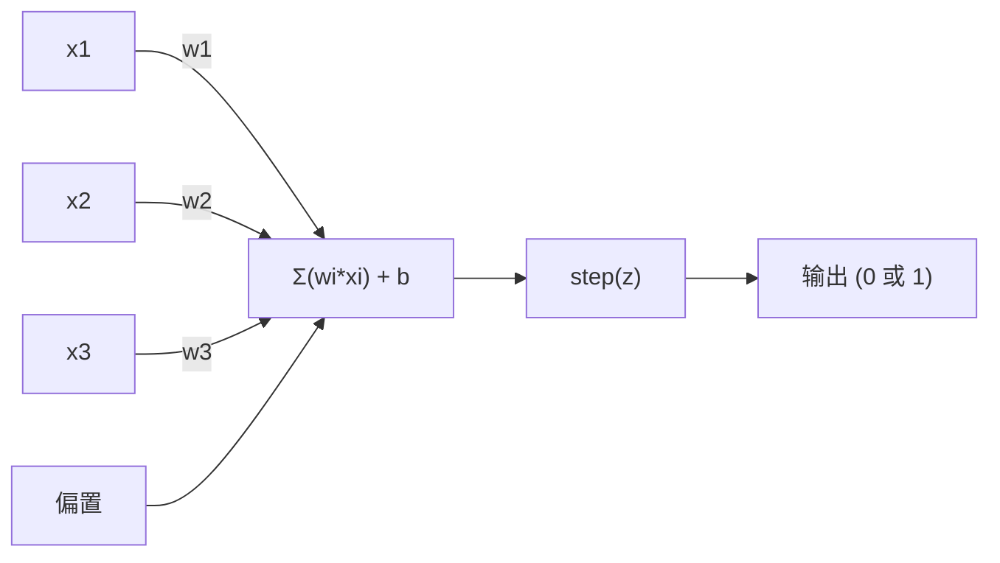

# 感知机

> 感知机是神经网络的原子。拆开它，你会发现权重、偏置和一个决策。

**类型：** Build
**语言：** Python
**前置知识：** 阶段 1（线性代数直觉）
**时间：** 约 60 分钟

## 学习目标

- 在 Python 中从零实现感知机，包括权重更新规则和阶跃激活函数
- 解释为什么单个感知机只能解决线性可分问题，并演示 XOR 失败案例
- 通过组合 OR、NAND 和 AND 门构建多层感知机来解决 XOR 问题
- 使用 sigmoid 激活和反向传播训练两层网络来自动学习 XOR

## 问题

你了解向量和点积。你知道矩阵将输入转换为输出。但机器如何"学习"使用哪个转换？

感知机回答了这个问题。它是最简单的学习机器：接收一些输入，乘以权重，加偏置，做二值决策。然后调整。就是这样。曾经构建的每个神经网络都是这个想法的层层堆叠。

理解感知机意味着理解"学习"在代码中实际意味着什么：调整数字直到输出匹配现实。

## 概念

### 一个神经元，一个决策

感知机接收 n 个输入，每个乘以一个权重，求和，加偏置，通过激活函数传递结果。



阶跃函数很粗暴：如果加权和加偏置 >= 0，输出 1。否则输出 0。

```
step(z) = 1  if z >= 0
           0  if z < 0
```

这是一个线性分类器。权重和偏置定义了一条线（或高维空间中的超平面），将输入空间分为两个区域。

### 决策边界

对于两个输入，感知机在二维空间中画一条线：

```
  x2
  ┤
  │  类别 1        /
  │    (0)          /
  │                /
  │               / w1·x1 + w2·x2 + b = 0
  │              /
  │             /     类别 2
  │            /        (1)
  ┼───────────/──────────── x1
```

线的一边输出 0。另一边输出 1。训练移动这条线直到正确分离类别。

### 学习规则

感知机学习规则很简单：

```
对每个训练样本 (x, y_true)：
    y_pred = predict(x)
    error = y_true - y_pred

    对每个权重：
        w_i = w_i + 学习率 * error * x_i
    偏置 = 偏置 + 学习率 * error
```

如果预测正确，error = 0，不变。如果预测 0 但应该是 1，权重增加。如果预测 1 但应该是 0，权重减少。学习率控制每次调整的大小。

### XOR 问题

这就是它崩溃的地方。看这些逻辑门：

```
AND 门：           OR 门：            XOR 门：
x1  x2  out         x1  x2  out         x1  x2  out
0   0   0           0   0   0           0   0   0
0   1   0           0   1   1           0   1   1
1   0   0           1   0   1           1   0   1
1   1   1           1   1   1           1   1   0
```

AND 和 OR 是线性可分的：你可以画一条线将 0 和 1 分开。XOR 不是。没有一条线可以将 [0,1] 和 [1,0] 与 [0,0] 和 [1,1] 分开。

```
AND（可分）：        XOR（不可分）：

  x2                      x2
  1 ┤  0     1            1 ┤  1     0
    │     /                 │
  0 ┤  0 / 0              0 ┤  0     1
    ┼──/──────── x1         ┼──────────── x1
      线有用！         没有一条线有用！
```

这是一个基本限制。单个感知机只能解决线性可分问题。Minsky 和 Papert 在 1969 年证明了这一点，几乎扼杀了神经网络研究十年。

解决方案：将感知机堆叠成层。一个多层感知机可以通过组合两个线性决策为一个非线性决策来解决 XOR。

## Build It

### 第 1 步：感知机类

```python
class Perceptron:
    def __init__(self, n_inputs, learning_rate=0.1):
        self.weights = [0.0] * n_inputs
        self.bias = 0.0
        self.lr = learning_rate

    def predict(self, inputs):
        total = sum(w * x for w, x in zip(self.weights, inputs))
        total += self.bias
        return 1 if total >= 0 else 0

    def train(self, training_data, epochs=100):
        for epoch in range(epochs):
            errors = 0
            for inputs, target in training_data:
                prediction = self.predict(inputs)
                error = target - prediction
                if error != 0:
                    errors += 1
                    for i in range(len(self.weights)):
                        self.weights[i] += self.lr * error * inputs[i]
                    self.bias += self.lr * error
            if errors == 0:
                print(f"在第 {epoch + 1} 轮收敛")
                return
        print(f"在 {epochs} 轮后未收敛")
```

### 第 2 步：在逻辑门上训练

```python
and_data = [
    ([0, 0], 0),
    ([0, 1], 0),
    ([1, 0], 0),
    ([1, 1], 1),
]

or_data = [
    ([0, 0], 0),
    ([0, 1], 1),
    ([1, 0], 1),
    ([1, 1], 1),
]

not_data = [
    ([0], 1),
    ([1], 0),
]

print("=== AND 门 ===")
p_and = Perceptron(2)
p_and.train(and_data)
for inputs, _ in and_data:
    print(f"  {inputs} -> {p_and.predict(inputs)}")

print("\n=== OR 门 ===")
p_or = Perceptron(2)
p_or.train(or_data)
for inputs, _ in or_data:
    print(f"  {inputs} -> {p_or.predict(inputs)}")

print("\n=== NOT 门 ===")
p_not = Perceptron(1)
p_not.train(not_data)
for inputs, _ in not_data:
    print(f"  {inputs} -> {p_not.predict(inputs)}")
```

### 第 3 步：观察 XOR 失败

```python
xor_data = [
    ([0, 0], 0),
    ([0, 1], 1),
    ([1, 0], 1),
    ([1, 1], 0),
]

print("\n=== XOR 门（单个感知机）===")
p_xor = Perceptron(2)
p_xor.train(xor_data)
for inputs, _ in xor_data:
    print(f"  {inputs} -> {p_xor.predict(inputs)}")
```

感知机永远不会收敛，因为 XOR 不是线性可分的。

### 第 4 步：通过组合解决 XOR

```python
def xor_network(x1, x2):
    h1 = nand_gate(x1, x2)
    h2 = or_gate(x1, x2)
    output = and_gate(h1, h2)
    return output

print("\n=== XOR 通过多层网络 ===")
for x1, x2, _ in xor_data:
    print(f"  [{x1}, {x2}] -> {xor_network(x1, x2)}")
```

### 第 5 步：学习 XOR 的两层网络

使用 sigmoid 激活 + 反向传播的完整训练循环，从头开始，没有框架。

## Use It

使用 scikit-learn 对应物：

```python
from sklearn.linear_model import Perceptron

model = Perceptron(max_iter=1000, eta0=0.1)
model.fit(X_train, y_train)
predictions = model.predict(X_test)
```

## Ship It

本课产出：
- `outputs/skill-perceptron.md` -- 故障排除感知机代码和诊断收敛问题的技能

## 练习

1. 证明单层感知机等价于逻辑回归。拿之前编写的逻辑回归代码，在一个简单的二分类任务上与感知机的预测输出进行比较。

2. 用从零构建的门电路（NAND、OR、AND）在纸上模拟 XOR 网络的输出。计算包含 4 个可能的 XOR 输入组合所需的神经元总数。

3. 使用训练好的感知机权重和偏置，推导 AND 和 OR 的决策边界线方程。画出每个门的输入空间，并用画好的线直观验证分类是正确的。

4. 修改感知机训练循环，增加"早停"，当所有样本分类正确时自动停止 epoch 循环（已在代码中展示，但试试不同初始化看看对收敛所需时间的影响）。

5. 用两个感知机搭建二进制半加器（一个输出 sum，一个输出 carry），并展示为什么它与 XOR + AND 的电路等价。

## 关键术语

| 术语 | 人们说的 | 实际含义 |
|------|----------------|----------------------|
| 感知机 | "最基础的学习机器" | 对加权输入求和的线性二分类器，初始权重为 0，根据误差更新权重 |
| 线性可分 | "数据能被一条线切分开" | 二分类问题在特征空间中存在超平面能将两个类别完美分开 |
| XOR 问题 | "线性不可分的案例" | 对于 X 型排布的点，没有一个超平面能正确切分，导致单层感知机无法解决 |
| 阶跃函数 | "硬性切分，不连续" | 输入大于等于 0 则输出 1、否则输出 0 的激活函数，会破坏梯度 |
| 学习规则 | "看错了就是该调整" | 感知机的训练算法：先预测、算误差，再按 error * x_i * 学习率更新每个权重 |
| 收敛 | "总错数变成 0" | 模型在一个 epoch 内对所有训练样本都正确分类的状态 |
| 多层感知机 | "不止一层的神经网络" | 至少一个隐藏层的网络；将多个感知机层层堆叠，可以学习非线性边界 |
| 决策边界 | "一条线或一个超平面" | 分隔两个类别的几何平面；由网络的权重和偏置定义 |

## 延伸阅读

- [Rosenblatt, The Perceptron: A Probabilistic Model for Information Storage and Organization in the Brain (1958)](https://psycnet.apa.org/record/1959-09865-001) -- 原始感知机论文
- [Minsky and Papert, Perceptrons (1969)](https://books.google.com/books?id=Ow1OAQAAIAAJ) -- 证明单层感知机数学局限的著作，引发了第一个"AI 冬天"
- [3Blue1Brown, But what is a neural network?](https://www.youtube.com/watch?v=aircAruvnKk) -- 神经网络机制的直观视频