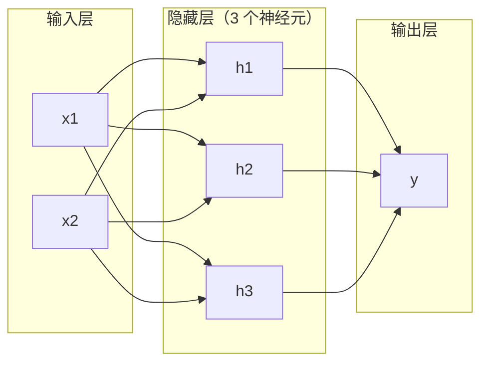
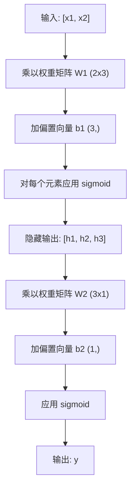

# 多层网络与前向传播

> 一个神经元画一条线。堆叠它们，你就能画出任何形状。

**类型：** Build
**语言：** Python
**前置知识：** 阶段 01（数学基础），课程 03.01（感知机）
**时间：** 约 90 分钟

## 学习目标

- 从零构建包含 Layer 和 Network 类的多层网络，完成完整的前向传播
- 追踪矩阵维度通过网络的每一层，识别形状不匹配
- 解释堆叠非线性激活如何使网络学习弯曲的决策边界
- 使用手动调整的 sigmoid 权重以 2-2-1 架构解决 XOR 问题

## 问题

单个神经元是画线器。仅此而已。一条直线穿过你的数据。AI 中的每个真实问题——图像识别、语言理解、下围棋——都需要曲线。将神经元堆叠成层就是获得曲线的方式。

1969 年，Minsky 和 Papert 证明这个限制是致命的：单层网络不能学习 XOR。不是"学习困难"——是数学上不可能。XOR 真值表将 [0,1] 和 [1,0] 放在一边，[0,0] 和 [1,1] 放在另一边。没有一条线能分开它们。

这扼杀了神经网络资助超过十年。解决方案回顾起来很明显：不要只用一层。将神经元堆叠成层。让第一层将输入空间雕刻成新特征，让第二层将这些特征组合成单条线无法做出的决策。

这个堆叠就是多层网络。它是当今生产中每个深度学习模型的基础。前向传播——数据从输入经过隐藏层流向输出——是你构建其他一切之前首先需要构建的东西。

## 概念

### 层：输入、隐藏、输出

多层网络有三种类型的层：

**输入层**——实际上不是层。它持有你的原始数据。两个特征意味着两个输入节点。这里没有计算发生。

**隐藏层**——工作发生的地方。每个神经元接收前一层的每个输出，应用权重和偏置，然后通过激活函数传递结果。"隐藏"是因为你永远不会在训练数据中直接看到这些值。

**输出层**——最终答案。对于二分类，一个带 sigmoid 的神经元。对于多分类，每个类别一个神经元。



这是一个 2-3-1 网络。两个输入，三个隐藏神经元，一个输出。每条连接带有一个权重。每个神经元（输入除外）带有偏置。

每层产生一个称为隐藏状态的数字向量。对于文本，隐藏状态增加维度——将一个词编码为 768 个数字来捕捉语义。对于图像，它们降低维度——将数百万像素压缩为可管理的表示。隐藏状态是学习所在的地方。

### 神经元与激活

每个神经元做三件事：

1. 将每个输入乘以对应的权重
2. 对所有乘积求和并加偏置
3. 通过激活函数传递和

目前，激活函数是 sigmoid：

```
sigmoid(z) = 1 / (1 + e^(-z))
```

Sigmoid 将任何数字压缩到 (0, 1) 范围。大正值推向 1。大负值推向 0。零映射到 0.5。这条平滑曲线使学习成为可能——与感知机的硬阶跃不同，sigmoid 处处有梯度。

### 前向传播：数据如何流动

前向传播将输入数据逐层推送通过网络，直到到达输出。前向传播期间没有学习发生。这是纯粹的计算：乘、加、激活、重复。



在每层，三个操作依次发生：

```
z = W * input + b       （线性变换）
a = sigmoid(z)           （激活）
```

一层的输出成为下一层的输入。这就是完整的前向传播。

### 矩阵维度

追踪维度是深度学习中最重要的调试技能。以下是 2-3-1 网络：

| 步骤 | 操作 | 维度 | 结果形状 |
|------|-----------|------------|-------------|
| 输入 | x | -- | (2,) |
| 隐藏层线性 | W1 * x + b1 | W1: (3, 2), b1: (3,) | (3,) |
| 隐藏层激活 | sigmoid(z1) | -- | (3,) |
| 输出层线性 | W2 * h + b2 | W2: (1, 3), b2: (1,) | (1,) |
| 输出层激活 | sigmoid(z2) | -- | (1,) |

规则：第 k 层的权重矩阵 W 形状为 (当前层神经元数, 上一层神经元数)。行匹配当前层。列匹配上一层。如果形状对不上，你就有 bug。

### 万能近似定理

1989 年，George Cybenko 证明了非凡的事情：具有单个隐藏层和足够多神经元的神经网络可以以任意所需精度近似任何连续函数。

这并不意味着一个隐藏层总是最好的。这意味着架构在理论上是可行的。在实践中，更深的网络（更多层，每层更少神经元）用比浅宽网络少得多的总参数学习相同的函数。这就是深度学习有效的原因。

直觉：隐藏层中的每个神经元学习一个"凸起"或特征。足够多的凸起放在正确的位置可以近似任何平滑曲线。更多神经元，更多凸起，更好的近似。


### 可组合性

神经网络是可组合的。你可以堆叠它们、链接它们、并行运行它们。Whisper 模型使用编码器网络处理音频和单独的解码器网络生成文本。现代 LLM 是仅解码器。BERT 是仅编码器。T5 是编码器-解码器。架构选择定义了模型能做什么。

## Build It

纯 Python，无 numpy。每个矩阵操作从零编写。

### 第 1 步：Sigmoid 激活

```python
import math

def sigmoid(x):
    x = max(-500.0, min(500.0, x))
    return 1.0 / (1.0 + math.exp(-x))
```

钳制到 [-500, 500] 防止溢出。`math.exp(500)` 很大但是有限的。`math.exp(1000)` 是无穷。

### 第 2 步：Layer 类

所有深度学习中最重要的操作是矩阵乘法。每层、每个注意力头、每个前向传播——一路都是矩阵乘法。线性层接收输入向量，乘以权重矩阵，加偏置向量：y = Wx + b。这一个方程是神经网络中 90% 的计算。

一个层持有权重矩阵和偏置向量。它的 forward 方法接收输入向量并返回激活后的输出。

```python
class Layer:
    def __init__(self, n_inputs, n_neurons, weights=None, biases=None):
        if weights is not None:
            self.weights = weights
        else:
            import random
            self.weights = [
                [random.uniform(-1, 1) for _ in range(n_inputs)]
                for _ in range(n_neurons)
            ]
        if biases is not None:
            self.biases = biases
        else:
            self.biases = [0.0] * n_neurons

    def forward(self, inputs):
        self.last_input = inputs
        self.last_output = []
        for neuron_idx in range(len(self.weights)):
            z = sum(
                w * x for w, x in zip(self.weights[neuron_idx], inputs)
            )
            z += self.biases[neuron_idx]
            self.last_output.append(sigmoid(z))
        return self.last_output
```

权重矩阵形状为 (n_neurons, n_inputs)。每行是一个神经元在所有输入上的权重。forward 方法遍历神经元，计算加权和加偏置，应用 sigmoid，收集结果。

### 第 3 步：Network 类

Network 持有层的列表并协调前向传播：

```python
class Network:
    def __init__(self):
        self.layers = []

    def add(self, layer):
        self.layers.append(layer)

    def forward(self, inputs):
        current = inputs
        for layer in self.layers:
            current = layer.forward(current)
        return current
```

当前层的输出自动成为下一层的输入。无需手动连接。

### 第 4 步：在 XOR 上测试

```python
net = Network()
net.add(layer_h1)
net.add(layer_h2)
net.add(layer_out)

xor_tests = [([0, 0], 0), ([0, 1], 1), ([1, 0], 1), ([1, 1], 0)]
for inputs, target in xor_tests:
    output = net.forward(inputs)[0]
    predicted = 1 if output > 0.5 else 0
    print(f"{inputs} -> {output:.3f} (预测 {predicted}, 真实 {target})")
```

## Use It

使用 PyTorch，前向传播是自动的：

```python
import torch.nn as nn

class XORNet(nn.Module):
    def __init__(self):
        super().__init__()
        self.hidden = nn.Linear(2, 2)
        self.output = nn.Linear(2, 1)

    def forward(self, x):
        x = torch.sigmoid(self.hidden(x))
        x = torch.sigmoid(self.output(x))
        return x
```

## Ship It

本课产出：
- `outputs/prompt-network-architect.md` -- 为你的数据设计网络架构和使用库的提示词

## 练习

1. 修改网络架构为 2-4-1 并重新测试 XOR。额外的隐藏神经元会改变性能吗？

2. 创建一个 2-3-2 网络，输出层有两个神经元（多分类）。写一个输出 2 个值（而不是 1 个）的分类数据集：试试带噪声的 AND-OR 双标签预测。

3. 通过从输入到隐藏层绘制 2D 空间，可视化隐藏表示。原始 XOR 问题在新特征空间中如何变化？

4. 在代码中添加对矩阵操作的层支持，一次处理多个样本。保持与单一样本版本相同的形状检查规则。

5. 在 2-2-10 网络上追踪矩阵维度。计算所有层的总参数数量。

## 关键术语

| 术语 | 人们说的 | 实际含义 |
|------|----------------|----------------------|
| 多层感知机 (MLP) | "堆叠的感知机" | 具有至少一个隐藏层、全连接的前馈网络 |
| 前向传播 | "输入 -> 隐藏 -> 输出" | 数据流过每层（乘、加、激活）的路径，不更新权重 |
| 隐藏层 | "输入输出之间的层" | 在两层之间处理数据但不出现在训练数据中的层 |
| 全连接层 | "每个神经元接收上一层的每个输出" | 每个输入-神经元对被分配一独立权重的层 |
| 万能近似定理 | "一个隐藏层足够" | 一个具有 S 形激活的单隐藏层可以逼近任何连续函数的证明 |
| 激活函数 | "非线性弯曲步骤" | 应用于神经元输出的非线性函数，赋予网络弯曲决策边界的能力 |
| Sigmoid | "S 形曲线" | 将任何数字压缩到 (0,1) 范围的激活函数，使学习变得平滑 |
| 矩阵乘法 | "行 x 列求和" | 线性层的核心操作：y = Wx + b，每次前向传播都会出现 |

## 延伸阅读

- [Cybenko, Approximation by Superpositions of a Sigmoidal Function (1989)](https://link.springer.com/article/10.1007/BF02551274) -- 万能近似定理
- [3Blue1Brown, Backpropagation calculus](https://www.youtube.com/watch?v=tIeHLnjs5U8) -- 理解网络和反向传播的直观视频
- [Karpathy, Yes you should understand backprop](https://medium.com/@karpathy/yes-you-should-understand-backprop-e2f06eab496b) -- 为什么每个人都应该理解网络层中的前向与后向传播