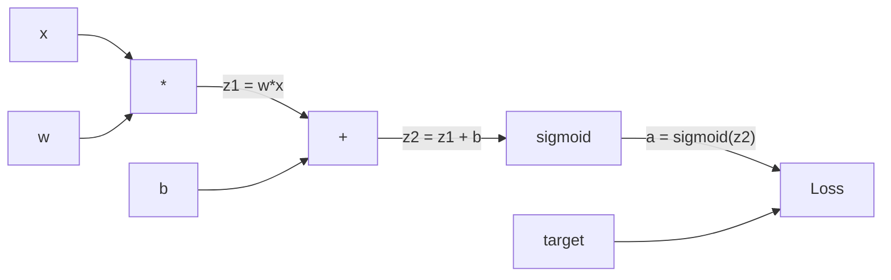
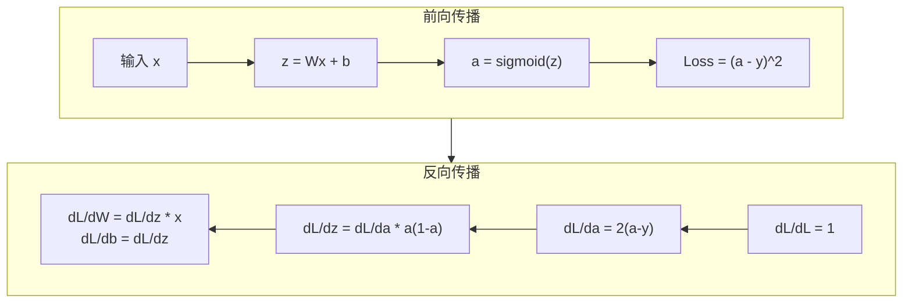
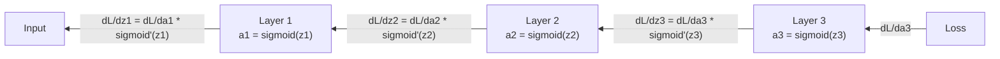

# 从零实现反向传播

> 反向传播是使学习成为可能的算法。没有它，神经网络只是昂贵的随机数生成器。

**类型：** Build
**语言：** Python
**前置知识：** 课程 03.02（多层网络）
**时间：** 约 120 分钟

## 学习目标

- 实现基于 Value 的自动微分引擎，构建计算图并通过拓扑排序计算梯度
- 使用链式法则推导加法、乘法和 sigmoid 的反向传播
- 仅使用你的从零反向传播引擎训练多层网络解决 XOR 和圆形分类
- 识别深层 sigmoid 网络中的梯度消失问题，解释为什么梯度呈指数级缩减

## 问题

你的网络有一个隐藏层，768 个输入，3072 个输出。那是 2,359,296 个权重。它做了一个错误的预测。哪些权重导致了错误？逐个测试每个权重意味着 230 万次前向传播。反向传播在单次反向传播中计算全部 230 万个梯度。这不是优化。这是可训练和不可能之间的区别。

朴素方法：取一个权重，微微调整，再次运行前向传播，测量损失是上升还是下降。这给出该权重的梯度。现在对网络中每个权重都这样做。乘以数千个训练步骤和数百万个数据点。你需要地质年代才能训练任何有用的东西。

反向传播解决了这个问题。一次前向传播，一次反向传播，所有梯度计算完成。诀窍是来自微积分的链式法则，系统地应用于计算图。这是使深度学习变得可行的算法。没有它，我们仍然会被困在玩具问题上。

## 概念

### 链式法则应用于网络

你在阶段 01 课程 05 中看到了链式法则。快速复习：如果 y = f(g(x))，那么 dy/dx = f'(g(x)) * g'(x)。你沿链乘导数。

在神经网络中，"链"是从输入到损失的操作序列。每层应用权重、加偏置、通过激活传递。损失函数比较最终输出和目标。反向传播反向追踪这条链，计算每个操作对误差的贡献。

### 计算图

每次前向传播构建一个图。每个节点是一个操作（乘、加、sigmoid）。每条边向前传递值，向后传递梯度。



前向传播：值从左到右流动。x 和 w 产生 z1 = w*x。加 b 得到 z2。Sigmoid 给出激活 a。使用损失函数比较 a 和目标 y。

反向传播：梯度从右向左流动。从 dL/da 开始（损失随激活的变化）。乘以 da/dz2（sigmoid 导数）。得到 dL/dz2。分裂为 dL/db（等于 dL/dz2，因为 z2 = z1 + b）和 dL/dz1。然后 dL/dw = dL/dz1 * x，dL/dx = dL/dz1 * w。

图中的每个节点在反向传播中有一个工作：接收来自上游的梯度，乘以局部导数，向下传递。

### 前向 vs 反向



前向传播存储每个中间值：z、a、每层的输入。反向传播需要这些存储的值来计算梯度。这是反向传播核心的内存-计算权衡。你用内存（存储激活）换取速度（一次传播而不是数百万次）。

### 梯度在网络中的流动

对于 3 层网络，梯度链通过每层：



在每层，梯度乘以 sigmoid 导数。Sigmoid 导数是 a * (1 - a)，最大值为 0.25（当 a = 0.5 时）。深三层，梯度最多乘以 0.25^3 = 0.0156。深十层：0.25^10 = 0.000001。

### 梯度消失

这就是梯度消失问题。Sigmoid 将输出压缩到 0 和 1 之间。其导数始终小于 0.25。堆叠足够的 sigmoid 层，梯度缩减为零。早期层几乎不学习，因为它们收到接近零的梯度。

```
sigmoid(z)：     输出范围 [0, 1]
sigmoid'(z)：    最大值 0.25（在 z = 0 处）

5 层之后：   梯度 * 0.25^5 = 原始信号的 0.001 倍
10 层之后：  梯度 * 0.25^10 = 原始信号的 0.000001 倍
```

这就是为什么深层 sigmoid 网络几乎不可能训练。修复方案——ReLU 及其变体——是课程 04 的主题。目前，理解反向传播完全正常运行。问题在于它正在穿过什么。

### 推导 2 层网络的梯度

具有输入 x、带 sigmoid 的隐藏层、带 sigmoid 的输出层和 MSE 损失的网络的具体数学。

前向传播：
```
z1 = W1 * x + b1
a1 = sigmoid(z1)
z2 = W2 * a1 + b2
a2 = sigmoid(z2)
L = (a2 - y)^2
```

反向传播（逐步应用链式法则）：
```
dL/da2 = 2(a2 - y)
da2/dz2 = a2 * (1 - a2)
dL/dz2 = dL/da2 * da2/dz2 = 2(a2 - y) * a2 * (1 - a2)

dL/dW2 = dL/dz2 * a1
dL/db2 = dL/dz2

dL/da1 = dL/dz2 * W2
da1/dz1 = a1 * (1 - a1)
dL/dz1 = dL/da1 * da1/dz1

dL/dW1 = dL/dz1 * x
dL/db1 = dL/dz1
```

每个梯度是从损失反向追踪的局部导数乘积。这就是反向传播的全部。

## Build It

### 第 1 步：Value 节点

我们计算中的每个数字成为 Value。它存储其数据、梯度以及如何创建的（以便知道如何反向计算梯度）。

```python
class Value:
    def __init__(self, data, children=(), op=''):
        self.data = data
        self.grad = 0.0
        self._backward = lambda: None
        self._children = set(children)
        self._op = op

    def __repr__(self):
        return f"Value(data={self.data:.4f}, grad={self.grad:.4f})"
```

尚无梯度（0.0）。尚无反向函数（无操作）。`_children` 追踪哪些 Value 产生了这个，以便我们稍后可以对图进行拓扑排序。

### 第 2 步：带有反向函数的运算

每个运算创建一个新 Value 并定义梯度如何反向流过它。

```python
def __add__(self, other):
    other = other if isinstance(other, Value) else Value(other)
    out = Value(self.data + other.data, (self, other), '+')

    def _backward():
        self.grad += out.grad
        other.grad += out.grad

    out._backward = _backward
    return out

def __mul__(self, other):
    other = other if isinstance(other, Value) else Value(other)
    out = Value(self.data * other.data, (self, other), '*')

    def _backward():
        self.grad += other.data * out.grad
        other.grad += self.data * out.grad

    out._backward = _backward
    return out
```

对于加法：d(a+b)/da = 1，d(a+b)/db = 1。所以两个输入直接获得输出的梯度。

对于乘法：d(a*b)/da = b，d(a*b)/db = a。每个输入获得另一个的值乘以输出梯度。

`+=` 很关键。一个 Value 可能在多个运算中使用。它的梯度是所有路径的梯度之和。

### 第 3 步：Sigmoid 和损失

```python
import math

def sigmoid(self):
    x = self.data
    x = max(-500, min(500, x))
    s = 1.0 / (1.0 + math.exp(-x))
    out = Value(s, (self,), 'sigmoid')

    def _backward():
        self.grad += s * (1 - s) * out.grad

    out._backward = _backward
    return out
```

### 第 4 步：拓扑排序和反向传播

```python
def backward(self):
    topo = []
    visited = set()

    def build_topo(v):
        if v not in visited:
            visited.add(v)
            for child in v._children:
                build_topo(child)
            topo.append(v)

    build_topo(self)
    self.grad = 1.0
    for v in reversed(topo):
        v._backward()
```

### 第 5 步：训练网络

```python
model = MLP(2, [4, 1])

for epoch in range(epochs):
    loss = Value(0.0)
    for x, y in data:
        xv = [Value(xi) for xi in x]
        prediction = model(xv)
        loss += (prediction - Value(y)) ** 2

    model.zero_grad()
    loss.backward()

    for param in model.parameters():
        param.data -= lr * param.grad
```

## Use It

PyTorch 用 `autograd` 做反向传播：

```python
import torch

x = torch.tensor([1.0, 2.0], requires_grad=True)
w = torch.tensor([0.5, 0.5], requires_grad=True)
loss = (x * w).sum()
loss.backward()
print(w.grad)
```

## Ship It

本课产出：
- `outputs/prompt-gradient-debugger.md` -- 调试梯度消失/爆炸和反向传播代码的提示词

## 练习

1. 在隐藏层中使用 sigmoid 的网络中逐层测量梯度幅度。为每个新的隐藏层扩展网络，观察梯度在哪一层消亡。

2. 实现 `Value.pow(2)` 方法，使平方操作的反向传播从链式法则直接产生 2x 因子。

3. 在 6 层 sigmoid 网络中打印梯度直方图。证明早期层梯度确实比后面层的梯度小一个数量级。

4. 在 MLP 中添加方法绘制计算图，显示每个节点和操作类型。检查最终图是否匹配你的预期网络形状。

5. 将 3 层网络中的梯度计算与手算结果对比（用纸笔对简单数据点调用 backward 后计算 dL/dw）。

## 关键术语

| 术语 | 人们说的 | 实际含义 |
|------|----------------|----------------------|
| 反向传播 | "通过链式法则反向计算梯度" | 计算损失对网络中每个参数的梯度的算法，逐层反向工作 |
| 计算图 | "操作的 DAG" | 有向无环图，节点是运算，边是数据依赖关系；反向传播沿边传播梯度 |
| 链式法则 | "乘导数沿链" | 微积分规则：dy/dx = dy/du * du/dx，允许在复合函数中高效计算梯度 |
| 拓扑排序 | "DAG 的线性顺序" | 按操作顺序排列节点，使得每个节点的子节点在其之前出现；反向传播中反向调用 |
| 局部梯度 | "这个操作引入的梯度" | 一个操作输出对输入的导数，链式法则中用于累积梯度的局部因子 |
| 梯度消失 | "早期层收不到信号" | sigmoid 等激活函数的导数很小，经过很多层相乘后梯度趋近于零 |
| 梯度爆炸 | "更新过大使训练发散" | 权重过大使得网络层间梯度的乘积爆炸，通常在深层 RNN 中看到 |
| 自动微分 / autograd | "反向传播的引擎" | 自动构建计算图并计算梯度的系统，无需手动推导导数 |

## 延伸阅读

- [Rumelhart et al., Learning Internal Representations by Error Propagation (1986)](https://web.stanford.edu/class/psych209a/ReadingsByDate/2_06/PDPVolIChapter8.pdf) -- 神经网络反向传播的开创性论文
- [Karpathy, micrograd](https://github.com/karpathy/micrograd) -- 反向传播引擎的最小实现，本课 Value 类的灵感来源
- [Linnainmaa, The Representation of the Cumulative Rounding Error (1970)](https://core.ac.uk/download/pdf/82381954.pdf) -- 1970 年首次描述自动微分（反向模式），早于神经网络使用 15 年