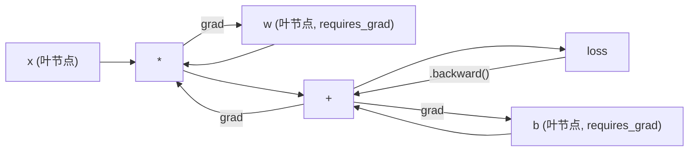
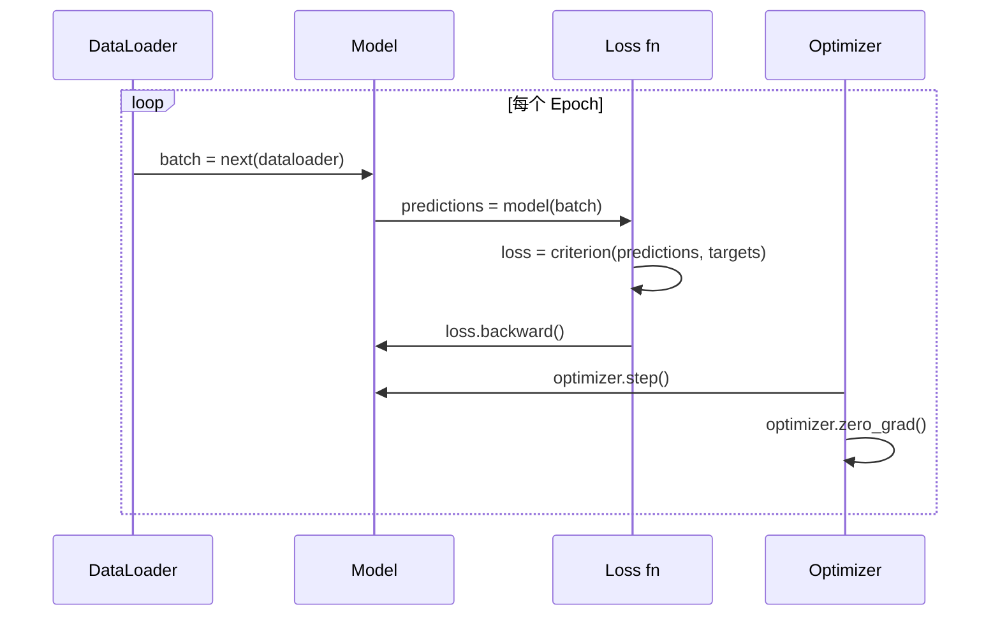

# PyTorch 入门

> 你从活塞和曲轴组装了引擎。现在学习每个人实际驾驶的那一个。

**类型：** Build
**语言：** Python
**前置知识：** 课程 03.10（构建你自己的微型框架）
**时间：** 约 75 分钟

## 学习目标

- 使用 PyTorch 的 nn.Module、nn.Sequential 和 autograd 构建和训练神经网络
- 使用 PyTorch 张量、GPU 加速和标准训练循环（zero_grad、前向、损失、反向、步进）
- 将你的从零构建的微型框架组件转换为其 PyTorch 等价物
- 在同一任务上分析比较纯 Python 框架和 PyTorch 的训练速度

## 问题

你有一个可工作的微型框架。线性层、ReLU、dropout、批归一化、Adam、DataLoader、训练循环。它用纯 Python 在圆形分类问题上训练了一个 4 层网络。

但在同一问题上，它比 PyTorch 慢 500 倍。

你的微型框架用嵌套的 Python 循环一次处理一个样本。PyTorch 将相同操作调度到在 GPU 上运行的优化 C++/CUDA 内核。在单个 NVIDIA A100 上，PyTorch 在 ImageNet（128 万张图像）上训练 ResNet-50（2560 万参数）大约需要 6 小时。在相同任务上，你的框架大约需要 3000 小时——如果它不先耗尽内存的话。

速度不是唯一的差距。你的框架没有 GPU 支持。没有自动微分——你为每个模块手写了 backward()。没有序列化。没有分布式训练。没有混合精度。无法在不使用 print 语句的情况下调试梯度流。

PyTorch 填补了每一个这些差距。而且它在保持你已经构建的完全相同心智模型的情况下做到了：Module、forward()、parameters()、backward()、optimizer.step()。概念一一对应转移。语法几乎相同。区别在于 PyTorch 在你从零设计的相同接口背后包装了十年的系统工程。

## 概念

### 为什么 PyTorch 胜出

2015 年，TensorFlow 要求你在运行任何内容之前定义一个静态计算图。你构建图，编译它，然后向其中喂数据。调试意味着盯着图可视化看。改变架构意味着从头重建图。

PyTorch 于 2017 年推出了不同的理念：即刻执行。你写 Python。它立即运行。`y = model(x)` 现在就实际计算 y，而不是"向图添加一个稍后会计算 y 的节点"。这意味着标准 Python 调试工具可用。print() 有效。pdb 有效。前向传播中的 if/else 有效。

到 2020 年，市场已经表明了态度。PyTorch 在 ML 研究论文中的份额从 7%（2017 年）上升到超过 75%（2022 年）。Meta、Google DeepMind、OpenAI、Anthropic 和 Hugging Face 都使用 PyTorch 作为主要框架。TensorFlow 2.x 作为回应采用了即刻执行——默认承认 PyTorch 的设计是正确的。

教训：开发者体验具有复利效应。一个慢 10% 但调试快 50% 的框架每次都赢。

### 张量

张量是具有三个关键属性的多维数组：形状、数据类型和设备。

```python
import torch

x = torch.zeros(3, 4)           # 形状: (3, 4), 数据类型: float32, 设备: cpu
x = torch.randn(2, 3, 224, 224) # 批量 2 张 RGB 图像, 224x224
x = torch.tensor([1, 2, 3])     # 来自 Python 列表
```

**形状**是维度。标量形状为 ()，向量为 (n,)，矩阵为 (m, n)，一批图像为 (batch, channels, height, width)。

**数据类型**控制精度和内存。

| 数据类型 | 位数 | 范围 | 用例 |
|-------|------|-------|----------|
| float32 | 32 | 约 7 位小数 | 默认训练 |
| float16 | 16 | 约 3.3 位小数 | 混合精度 |
| bfloat16 | 16 | 与 float32 相同范围，更低精度 | LLM 训练 |
| int8 | 8 | -128 到 127 | 量化推理 |

**设备**决定计算发生的位置。

```python
device = torch.device("cuda" if torch.cuda.is_available() else "cpu")
x = torch.randn(3, 4, device=device)
x = x.to("cuda")
x = x.cpu()
```

每个操作要求所有张量在同一设备上。这是初学者遇到的第一大 PyTorch 错误：`RuntimeError: Expected all tensors to be on the same device`。通过在计算前将所有内容移动到相同设备来修复。

**重塑**是常数时间——它改变元数据，而非数据。

```python
x = torch.randn(2, 3, 4)
x.view(2, 12)      # 重塑为 (2, 12) -- 必须连续
x.reshape(6, 4)    # 重塑为 (6, 4) -- 始终有效
x.permute(2, 0, 1) # 重新排序维度
x.unsqueeze(0)     # 添加维度: (1, 2, 3, 4)
x.squeeze()        # 移除大小为 1 的维度
```

### 自动微分

你的微型框架要求你为每个模块实现 backward()。PyTorch 不需要。它将张量上的每个操作记录到有向无环图（计算图）中，然后反向遍历该图以自动计算梯度。



与你的框架的关键区别：PyTorch 使用基于磁带的自动微分。每个操作在前向传播期间追加到"磁带"。调用 `.backward()` 反向重放磁带。

```python
x = torch.randn(3, requires_grad=True)
y = x ** 2 + 3 * x
z = y.sum()
z.backward()
print(x.grad)  # dz/dx = 2x + 3
```

自动微分的三条规则：

1. 只有 `requires_grad=True` 的叶张量累积梯度
2. 梯度默认累积——在每次反向传播前调用 `optimizer.zero_grad()`
3. `torch.no_grad()` 禁用梯度追踪（评估期间使用）

### nn.Module

`nn.Module` 是 PyTorch 中每个神经网络组件的基类。你已经在课程 10 中构建了这个抽象。PyTorch 的版本增加了自动参数注册、递归模块发现、设备管理和状态字典序列化。

```python
import torch.nn as nn

class MLP(nn.Module):
    def __init__(self, input_dim, hidden_dim, output_dim):
        super().__init__()
        self.layer1 = nn.Linear(input_dim, hidden_dim)
        self.relu = nn.ReLU()
        self.layer2 = nn.Linear(hidden_dim, output_dim)

    def forward(self, x):
        x = self.layer1(x)
        x = self.relu(x)
        x = self.layer2(x)
        return x
```

当你在 `__init__` 中将 `nn.Module` 或 `nn.Parameter` 赋值为属性时，PyTorch 会自动注册它。`model.parameters()` 递归收集每个已注册的参数。这就是为什么你永远不需要像在微型框架中那样手动收集权重。

关键构建块：

| 模块 | 功能 | 参数 |
|--------|-------------|------------|
| nn.Linear(in, out) | Wx + b | in*out + out |
| nn.Conv2d(in_ch, out_ch, k) | 2D 卷积 | in_ch*out_ch*k*k + out_ch |
| nn.BatchNorm1d(features) | 归一化激活 | 2 * features |
| nn.Dropout(p) | 随机归零 | 0 |
| nn.ReLU() | max(0, x) | 0 |
| nn.GELU() | 高斯误差线性 | 0 |
| nn.Embedding(vocab, dim) | 查找表 | vocab * dim |
| nn.LayerNorm(dim) | 逐样本归一化 | 2 * dim |

### 损失函数和优化器

PyTorch 提供了你构建的所有内容的生产就绪版本。

**损失函数**（来自 `torch.nn`）：

| 损失 | 任务 | 输入 |
|------|------|-------|
| nn.MSELoss() | 回归 | 任意形状 |
| nn.CrossEntropyLoss() | 多类分类 | 对数几率（非 softmax） |
| nn.BCEWithLogitsLoss() | 二分类 | 对数几率（非 sigmoid） |
| nn.L1Loss() | 回归（鲁棒） | 任意形状 |
| nn.CTCLoss() | 序列对齐 | 对数概率 |

注意：`CrossEntropyLoss` 内部结合了 `LogSoftmax` + `NLLLoss`。传入原始对数几率，而非 softmax 输出。这是一个常见错误，会悄悄地产生错误的梯度。

**优化器**（来自 `torch.optim`）：

| 优化器 | 何时使用 | 典型 LR |
|-----------|-------------|-----------|
| SGD(params, lr, momentum) | CNN，调优良好的管道 | 0.01--0.1 |
| Adam(params, lr) | 默认起点 | 1e-3 |
| AdamW(params, lr, weight_decay) | Transformer，微调 | 1e-4--1e-3 |
| LBFGS(params) | 小规模，二阶 | 1.0 |

### 训练循环

每个 PyTorch 训练循环遵循相同的 5 步模式。你已经在课程 10 中知道了这个。



标准模式：

```python
for epoch in range(num_epochs):
    model.train()
    for inputs, targets in train_loader:
        inputs, targets = inputs.to(device), targets.to(device)
        optimizer.zero_grad()
        outputs = model(inputs)
        loss = criterion(outputs, targets)
        loss.backward()
        optimizer.step()
```

批次循环内的五行代码。这五行代码训练了 GPT-4、Stable Diffusion 和 LLaMA。架构变了。数据变了。这五行代码不变。

### Dataset 和 DataLoader

PyTorch 的 `Dataset` 是一个抽象类，有两个方法：`__len__` 和 `__getitem__`。`DataLoader` 用批处理、shuffle 和多进程数据加载包装它。

```python
from torch.utils.data import Dataset, DataLoader

class MNISTDataset(Dataset):
    def __init__(self, images, labels):
        self.images = images
        self.labels = labels

    def __len__(self):
        return len(self.labels)

    def __getitem__(self, idx):
        return self.images[idx], self.labels[idx]

loader = DataLoader(dataset, batch_size=64, shuffle=True, num_workers=4)
```

`num_workers=4` 生成 4 个进程在 GPU 训练当前批次时并行加载数据。在磁盘密集型工作负载（大图像、音频）上，仅此一项就可以将训练速度翻倍。

### GPU 训练

将模型移动到 GPU：

```python
device = torch.device("cuda" if torch.cuda.is_available() else "cpu")
model = model.to(device)
```

这递归地将每个参数和缓冲区移动到 GPU。然后在训练期间移动每个批次：

```python
inputs, targets = inputs.to(device), targets.to(device)
```

**混合精度**通过在前向/反向中使用 float16 同时保持主权重在 float32，在现代 GPU（A100、H100、RTX 4090）上将内存使用减半并使吞吐量翻倍：

```python
from torch.amp import autocast, GradScaler

scaler = GradScaler()
for inputs, targets in loader:
    with autocast(device_type="cuda"):
        outputs = model(inputs)
        loss = criterion(outputs, targets)
    scaler.scale(loss).backward()
    scaler.step(optimizer)
    scaler.update()
    optimizer.zero_grad()
```

### 对比：微型框架 vs PyTorch vs JAX

| 特性 | 微型框架 (L10) | PyTorch | JAX |
|---------|---------------------|---------|-----|
| 自动微分 | 手动 backward() | 基于磁带的 autograd | 函数变换 |
| 执行 | 即刻（Python 循环） | 即刻（C++ 内核） | 追踪 + JIT 编译 |
| GPU 支持 | 否 | 是（CUDA, ROCm, MPS） | 是（CUDA, TPU） |
| 速度（MNIST MLP） | ~300s/epoch | ~0.5s/epoch | ~0.3s/epoch |
| 模块系统 | 自定义 Module 类 | nn.Module | 无状态函数（Flax/Equinox） |
| 调试 | print() | print(), pdb, breakpoint() | 更难（JIT 追踪破坏 print） |
| 生态系统 | 无 | Hugging Face, Lightning, timm | Flax, Optax, Orbax |
| 学习曲线 | 你构建了它 | 中等 | 陡峭（函数式范式） |
| 生产使用 | 玩具问题 | Meta, OpenAI, Anthropic, HF | Google DeepMind, Midjourney |

## Build It

一个仅使用 PyTorch 原语在 MNIST 上训练的 3 层 MLP。没有高级包装器。没有 `torchvision.datasets`。我们自己下载和解析原始数据。

### 第 1 步：从原始文件加载 MNIST

MNIST 以 4 个 gzip 文件形式提供：训练图像（60000 x 28 x 28）、训练标签、测试图像（10000 x 28 x 28）、测试标签。我们下载并解析二进制格式。

```python
import torch
import torch.nn as nn
import struct
import gzip
import urllib.request
import os

def download_mnist(path="./mnist_data"):
    base_url = "https://storage.googleapis.com/cvdf-datasets/mnist/"
    files = [
        "train-images-idx3-ubyte.gz",
        "train-labels-idx1-ubyte.gz",
        "t10k-images-idx3-ubyte.gz",
        "t10k-labels-idx1-ubyte.gz",
    ]
    os.makedirs(path, exist_ok=True)
    for f in files:
        filepath = os.path.join(path, f)
        if not os.path.exists(filepath):
            urllib.request.urlretrieve(base_url + f, filepath)

def load_images(filepath):
    with gzip.open(filepath, "rb") as f:
        magic, num, rows, cols = struct.unpack(">IIII", f.read(16))
        data = f.read()
        images = torch.frombuffer(bytearray(data), dtype=torch.uint8)
        images = images.reshape(num, rows * cols).float() / 255.0
    return images

def load_labels(filepath):
    with gzip.open(filepath, "rb") as f:
        magic, num = struct.unpack(">II", f.read(8))
        data = f.read()
        labels = torch.frombuffer(bytearray(data), dtype=torch.uint8).long()
    return labels
```

### 第 2 步：定义模型

一个 3 层 MLP：784 -> 256 -> 128 -> 10。ReLU 激活。Dropout 用于正则化。不用批归一化以保持简单。

```python
class MNISTModel(nn.Module):
    def __init__(self):
        super().__init__()
        self.net = nn.Sequential(
            nn.Linear(784, 256),
            nn.ReLU(),
            nn.Dropout(0.2),
            nn.Linear(256, 128),
            nn.ReLU(),
            nn.Dropout(0.2),
            nn.Linear(128, 10),
        )

    def forward(self, x):
        return self.net(x)
```

输出层产生 10 个原始对数几率（每个数字一个）。没有 softmax——`CrossEntropyLoss` 内部处理它。

参数数量：784*256 + 256 + 256*128 + 128 + 128*10 + 10 = 235146。以现代标准来看很小。GPT-2 small 有 1.24 亿。这个在几秒内训练完成。

### 第 3 步：训练循环

标准的前向-损失-反向-步进模式。

```python
def train_one_epoch(model, loader, criterion, optimizer, device):
    model.train()
    total_loss = 0
    correct = 0
    total = 0
    for images, labels in loader:
        images, labels = images.to(device), labels.to(device)
        optimizer.zero_grad()
        outputs = model(images)
        loss = criterion(outputs, labels)
        loss.backward()
        optimizer.step()
        total_loss += loss.item() * images.size(0)
        _, predicted = outputs.max(1)
        correct += predicted.eq(labels).sum().item()
        total += labels.size(0)
    return total_loss / total, correct / total


def evaluate(model, loader, criterion, device):
    model.eval()
    total_loss = 0
    correct = 0
    total = 0
    with torch.no_grad():
        for images, labels in loader:
            images, labels = images.to(device), labels.to(device)
            outputs = model(images)
            loss = criterion(outputs, labels)
            total_loss += loss.item() * images.size(0)
            _, predicted = outputs.max(1)
            correct += predicted.eq(labels).sum().item()
            total += labels.size(0)
    return total_loss / total, correct / total
```

注意评估期间的 `torch.no_grad()`。这禁用了 autograd，减少内存使用并加速推理。没有它，PyTorch 会构建一个你永远不会使用的计算图。

### 第 4 步：将所有内容连接起来

```python
def main():
    device = torch.device("cuda" if torch.cuda.is_available() else "cpu")

    download_mnist()
    train_images = load_images("./mnist_data/train-images-idx3-ubyte.gz")
    train_labels = load_labels("./mnist_data/train-labels-idx1-ubyte.gz")
    test_images = load_images("./mnist_data/t10k-images-idx3-ubyte.gz")
    test_labels = load_labels("./mnist_data/t10k-labels-idx1-ubyte.gz")

    train_dataset = torch.utils.data.TensorDataset(train_images, train_labels)
    test_dataset = torch.utils.data.TensorDataset(test_images, test_labels)
    train_loader = torch.utils.data.DataLoader(
        train_dataset, batch_size=64, shuffle=True
    )
    test_loader = torch.utils.data.DataLoader(
        test_dataset, batch_size=256, shuffle=False
    )

    model = MNISTModel().to(device)
    criterion = nn.CrossEntropyLoss()
    optimizer = torch.optim.Adam(model.parameters(), lr=1e-3)

    num_params = sum(p.numel() for p in model.parameters())
    print(f"设备: {device}")
    print(f"参数: {num_params:,}")
    print(f"训练样本: {len(train_dataset):,}")
    print(f"测试样本: {len(test_dataset):,}")
    print()

    for epoch in range(10):
        train_loss, train_acc = train_one_epoch(
            model, train_loader, criterion, optimizer, device
        )
        test_loss, test_acc = evaluate(
            model, test_loader, criterion, device
        )
        print(
            f"第 {epoch+1:2d} 轮 | "
            f"训练损失: {train_loss:.4f} | 训练准确率: {train_acc:.4f} | "
            f"测试损失: {test_loss:.4f} | 测试准确率: {test_acc:.4f}"
        )

    torch.save(model.state_dict(), "mnist_mlp.pt")
    print(f"\n模型保存到 mnist_mlp.pt")
    print(f"最终测试准确率: {test_acc:.4f}")
```

10 轮后的预期输出：约 97.8% 测试准确率。CPU 训练时间：约 30 秒。GPU：约 5 秒。在相同架构上使用你的微型框架：约 45 分钟。

## Use It

### 快速对比：微型框架 vs PyTorch

| 微型框架（课程 10） | PyTorch |
|---------------------------|---------|
| `model = Sequential(Linear(784, 256), ReLU(), ...)` | `model = nn.Sequential(nn.Linear(784, 256), nn.ReLU(), ...)` |
| `pred = model.forward(x)` | `pred = model(x)` |
| `optimizer.zero_grad()` | `optimizer.zero_grad()` |
| `grad = criterion.backward()` 然后 `model.backward(grad)` | `loss.backward()` |
| `optimizer.step()` | `optimizer.step()` |
| 无 GPU | `model.to("cuda")` |
| 每个模块手动反向传播 | Autograd 处理一切 |

接口几乎相同。区别在于底层的一切。

### 保存和加载模型

```python
torch.save(model.state_dict(), "model.pt")

model = MNISTModel()
model.load_state_dict(torch.load("model.pt", weights_only=True))
model.eval()
```

始终保存 `state_dict()`（参数字典），而不是模型对象。保存模型对象使用 pickle，当重构代码时会失效。状态字典是可移植的。

### 学习率调度

```python
scheduler = torch.optim.lr_scheduler.CosineAnnealingLR(
    optimizer, T_max=10
)
for epoch in range(10):
    train_one_epoch(model, train_loader, criterion, optimizer, device)
    scheduler.step()
```

PyTorch 提供了 15+ 个调度器：StepLR、ExponentialLR、CosineAnnealingLR、OneCycleLR、ReduceLROnPlateau。都插入相同的优化器接口。

## Ship It

本课产生两个产出：

- `outputs/prompt-pytorch-debugger.md` -- 诊断常见 PyTorch 训练失败的提示词
- `outputs/skill-pytorch-patterns.md` -- PyTorch 训练模式的技能参考

## 练习

1. 将你的微型框架 MLP（课程 10）转换为 PyTorch。比较 10 轮后的训练时间和最终测试准确率。PyTorch 快多少（测量并报告比率）？

2. 在第一个 Linear 层之后添加 BatchNorm1d。具有 BatchNorm 的模型是否收敛更快（更少的 epoch）？如果不预热直接提高学习率会发生什么？

3. 试验混合精度训练。在 A100 或 RTX 4090 GPU 上，测量 float16 + GradScaler 与 float32 相比的内存使用和吞吐量。

4. 实现一个自定义 Dataset，用于从磁盘流式传输图像文件（不将所有内容加载到内存）。测量当数据集太大放不下 RAM 时的吞吐量。

5. 比较 `model.eval()` 与 `model.train()` 模式。使用和不使用 dropout 分别进行推理。为什么在评估期间禁用 dropout 很重要？

## 关键术语

| 术语 | 人们说的 | 实际含义 |
|------|----------------|----------------------|
| 张量 | "多维数组" | PyTorch 中的核心数据结构，具有形状、数据类型和设备属性来表征数据 |
| autograd | "自动微分" | PyTorch 通过在前向期间记录操作并在后向期间重放来自动计算梯度的磁带系统 |
| nn.Module | "所有神经网络的基类" | 标准 PyTorch 抽象，管理参数注册、设备放置和状态字典序列化 |
| 即刻执行 | "代码立即运行" | 操作在写入时执行而非构建静态图的设计理念，使调试和实验更简单 |
| DataLoader | "批数据迭代器" | 封装批处理、shuffle 和多进程数据加载的内置类 |
| 混合精度 | "float16 前向，float32 权重" | 使用较低精度（float16）进行计算同时保持 float32 主权重的训练技术，节省内存并提高速度 |
| state_dict | "参数字典" | 包含模型所有可学习参数的序列化字典，用于保存/加载和模型共享 |
| zero_grad | "重置梯度" | 在每次反向传播前将累积梯度归零的关键步骤，防止跨批次的错误累积 |

## 延伸阅读

- [PyTorch Documentation](https://pytorch.org/docs/stable/) -- 官方权威 PyTorch 文档
- [Horace He, PyTorch Internals](http://blog.ezyang.com/2019/05/pytorch-internals/) -- 自动微分引擎内部原理深入解析
- [Lilian Weng, How to Train Really Large Models on Many GPUs](https://lilianweng.github.io/posts/2021-09-25-train-large/) -- 大规模分布式训练的实用指南