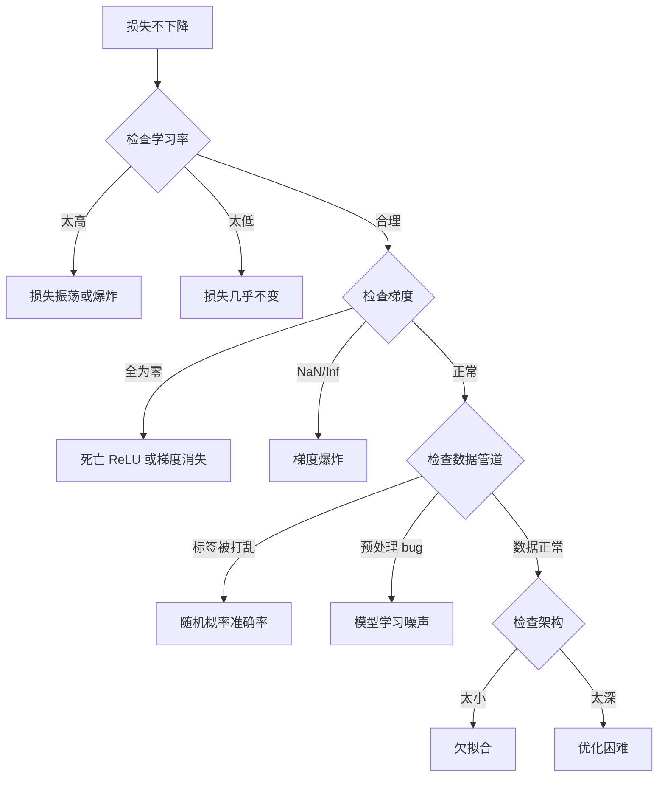
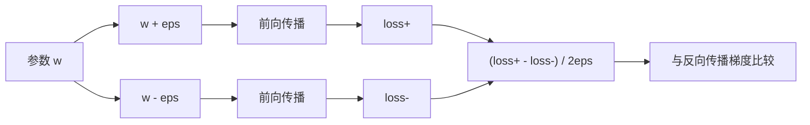
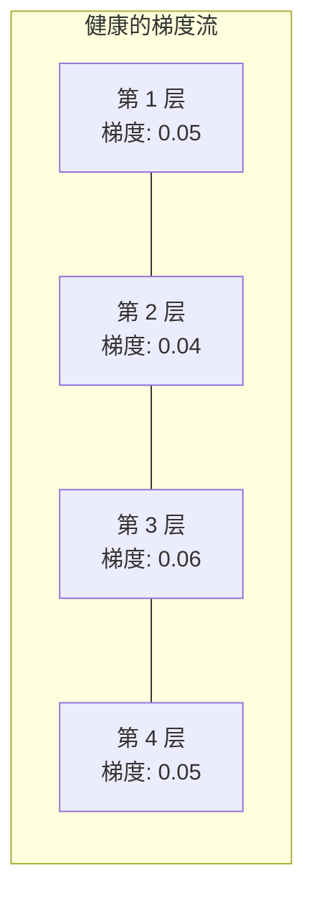
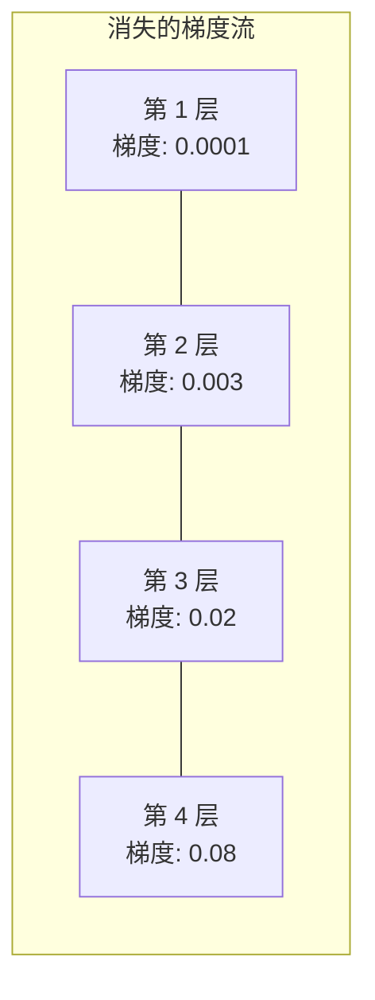
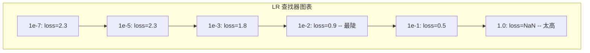

# 神经网络调试

> 你的网络编译了。它运行了。它产生了一个数字。数字是错的，什么也没崩溃。欢迎来到最难的一种调试——那种没有错误消息的调试。

**类型：** Practice
**语言：** Python, PyTorch
**前置知识：** Phase 03 课程 01-10（特别是反向传播、损失函数、优化器）
**时间：** 约 90 分钟

## 学习目标

- 使用系统性调试策略诊断常见神经网络故障（NaN 损失、平坦损失曲线、过拟合、振荡）
- 应用"过拟合一个批次"技术验证模型架构和训练循环是否正确
- 检查梯度幅度、激活分布和权重范数，以识别梯度消失/爆炸问题
- 构建覆盖数据管道、模型架构、损失函数、优化器和学习率问题的调试检查清单

## 问题

传统软件在出问题时崩溃。空指针抛出异常。类型不匹配在编译时报错。差一错误产生明显错误的输出。

神经网络不会给你这种奢侈。

一个损坏的神经网络运行到结束，打印一个损失值，并输出预测。损失可能下降。预测可能看起来合理。但模型悄悄地错了——学习捷径、记忆噪声或收敛到无用的局部最小值。Google 研究人员估计 60-70% 的 ML 调试时间花在"无声"错误上，这些错误不产生错误但降低模型质量。

一个可工作模型和一个损坏模型之间的区别通常只是错位的一行代码：一个缺失的 `zero_grad()`、一个转置的维度、一个差了 10 倍的学习率。经典的"训练神经网络食谱"（2019 年）以此开头："最常见的神经网络错误是不崩溃的错误。"

这节课教你找到那些错误。

## 概念

### 调试心态

忘记打印后祈祷式的调试。神经网络调试需要一个系统性的方法，因为反馈循环很慢（每次训练运行数分钟到数小时）且症状模糊（糟糕的损失可能意味着 20 种不同的事情）。

黄金法则：**从简单开始，一次添加一个复杂性，并独立验证每一部分。**



### 症状 1：损失不下降

这是最常见的投诉。训练循环运行，epoch 滴答流逝，损失保持不变或剧烈振荡。

**错误的学习率。** 太高：损失振荡或跳到 NaN。太低：损失下降得如此缓慢以至于看起来是平的。Adam 从 1e-3 开始。SGD 从 1e-1 或 1e-2 开始。在得出其他结论之前，始终尝试 3 个跨 10 倍的学习率（例如 1e-2、1e-3、1e-4）。

**死亡 ReLU。** 如果 ReLU 神经元收到大的负输入，它输出 0 且其梯度为 0。它永远不会再次激活。如果足够多的神经元死亡，网络无法学习。检查：打印每个 ReLU 层后恰好为零的激活比例。如果 >50% 死亡，切换到 LeakyReLU 或降低学习率。

**梯度消失。** 在具有 sigmoid 或 tanh 激活的深层网络中，梯度在反向传播时指数收缩。到它们到达第一层时，它们约为 0。第一层停止学习。修复：使用 ReLU/GELU，添加残差连接，或使用批归一化。

**梯度爆炸。** 相反的问题——梯度指数增长。常见于 RNN 和非常深的网络。损失跳到 NaN。修复：梯度裁剪（`torch.nn.utils.clip_grad_norm_`），降低学习率，或添加归一化。

### 症状 2：损失下降但模型很糟糕

损失下降。训练准确率达到 99%。但测试准确率是 55%。或者模型在真实数据上产生无意义的输出。

**过拟合。** 模型记忆训练数据而非学习模式。训练和验证损失之间的差距随时间增长。修复：更多数据、dropout、权重衰减、早停、数据增强。

**数据泄漏。** 测试数据泄漏到训练中。准确率可疑地高。常见原因：分割前 shuffle、用全数据集统计量进行预处理、跨分片的重复样本。修复：先分割，再预处理，检查重复。

**标签错误。** 大多数真实数据集中 5-10% 的标签是错误的（Northcutt 等人，2021——"测试集中普遍存在的标签错误"）。模型学习噪声。修复：使用置信学习查找和修复错误标记的样本，或使用损失截断忽略高损失样本。

### 症状 3：损失中出现 NaN 或 Inf

损失值变为 `nan` 或 `inf`。训练死亡。

**学习率太高。** 梯度更新超调得如此之远以至于权重爆炸。修复：减少 10 倍。

**log(0) 或 log(负数)。** 交叉熵损失计算 `log(p)`。如果你的模型输出恰好 0 或负概率，log 爆炸。修复：将预测裁剪到 `[eps, 1-eps]`，其中 `eps=1e-7`。

**除零。** 批归一化除以标准差。具有恒定值的批次 std=0。修复：向分母添加 epsilon（PyTorch 默认这样做，但自定义实现可能不会）。

**数值溢出。** 输入到 `exp()` 的大激活产生 Inf。Softmax 特别容易。修复：在指数运算前减去最大值（log-sum-exp 技巧）。

### 技巧 1：梯度检查

将你的解析梯度（来自反向传播）与数值梯度（来自有限差分）比较。如果它们不一致，你的反向传播有 bug。

参数 `w` 的数值梯度：

```
梯度数值 = (loss(w + eps) - loss(w - eps)) / (2 * eps)
```

一致性度量（相对差）：

```
相对差 = |梯度解析 - 梯度数值| / max(|梯度解析|, |梯度数值|, 1e-8)
```

如果 `相对差 < 1e-5`：正确。如果 `相对差 > 1e-3`：几乎肯定有 bug。



### 技巧 2：激活统计

在训练期间监控每层激活的均值和标准差。健康的网络保持激活均值接近 0，标准差接近 1（归一化后）或至少是有界的。

| 健康指标 | 均值 | 标准差 | 诊断 |
|-----------------|------|-----|-----------|
| 健康 | ~0 | ~1 | 网络正常学习 |
| 饱和 | >>0 或 <<0 | ~0 | 激活卡在极端值 |
| 死亡 | 0 | 0 | 神经元死亡（全为零） |
| 爆炸 | >>10 | >>10 | 激活无界增长 |

### 技巧 3：梯度流可视化

绘制每层的平均梯度幅度。在健康的网络中，梯度幅度在层间应该大致相似。如果早期层的梯度比后面层小 1000 倍，你有梯度消失。





### 技巧 4：过拟合一个批次测试

深度学习中最重要的调试技巧。

取一个小批次（8-32 个样本）。在其上训练 100+ 次迭代。损失应该降到接近零，训练准确率应该达到 100%。如果没有，你的模型或训练循环有根本性的 bug——不要进行完整训练。

这个测试能捕获：
- 损坏的损失函数
- 损坏的反向传播
- 架构太小无法表示数据
- 优化器未连接到模型参数
- 数据和标签未对齐

运行只需 30 秒，节省数小时的完整训练运行调试时间。

### 技巧 5：学习率查找器

Leslie Smith（2017）提出在一个 epoch 内将学习率从非常小（1e-7）扫到非常大（10），同时记录损失。绘制损失 vs 学习率。最优学习率大约是损失开始最快下降的速率的 1/10。



此例中的最佳 LR：~1e-3（比最陡点小一个数量级）。

### 常见 PyTorch 错误

这些是 PyTorch 社区中浪费最多集体时间的错误：

| 错误 | 症状 | 修复 |
|-----|---------|-----|
| 忘记 `optimizer.zero_grad()` | 梯度跨批次累积，损失振荡 | 在 `loss.backward()` 前添加 `optimizer.zero_grad()` |
| 测试时忘记 `model.eval()` | Dropout 和批归一化行为不同，测试准确率在运行间波动 | 添加 `model.eval()` 和 `torch.no_grad()` |
| 错误的张量形状 | 无声广播产生错误结果，无错误 | 调试时在每次操作后打印形状 |
| CPU/GPU 不匹配 | `RuntimeError: expected CUDA tensor` | 在模型和数据上都使用 `.to(device)` |
| 未分离张量 | 计算图永远增长，OOM | 使用 `.detach()` 或 `with torch.no_grad()` |
| 原地操作破坏 autograd | `RuntimeError: modified by in-place operation` | 将 `x += 1` 替换为 `x = x + 1` |
| 数据未归一化 | 损失卡在随机概率水平 | 将输入归一化到均值=0, 标准差=1 |
| 标签类型错误 | 交叉熵期望 `Long`，得到 `Float` | 转换标签：`labels.long()` |

### 主调试表

| 症状 | 可能原因 | 首先尝试的 |
|---------|-------------|-------------------|
| 损失卡在 -log(1/num_classes) | 模型预测均匀分布 | 检查数据管道，验证标签匹配输入 |
| 几步后损失为 NaN | 学习率太高 | LR 减少 10 倍 |
| 立即损失为 NaN | log(0) 或除零 | 在 log/除法操作中添加 epsilon |
| 损失剧烈振荡 | LR 太高或批次大小太小 | 降低 LR，增加批次大小 |
| 损失下降然后停滞 | LR 对于微调阶段太高 | 添加 LR 调度（余弦或阶梯衰减） |
| 训练准确率高，测试准确率低 | 过拟合 | 添加 dropout、权重衰减、更多数据 |
| 训练准确率 = 测试准确率 = 随机概率 | 模型什么也没学到 | 运行过拟合一个批次测试 |
| 训练准确率 = 测试准确率但两者都很低 | 欠拟合 | 更大的模型，更多层，更多特征 |
| 梯度全为零 | 死亡 ReLU 或分离的计算图 | 切换到 LeakyReLU，检查 `.requires_grad` |
| 训练期间内存不足 | 批次太大或图未释放 | 减少批次大小，评估时使用 `torch.no_grad()` |

## Build It

一个监控激活、梯度和损失曲线的诊断工具包。你将故意损坏一个网络并使用工具包诊断每个问题。

### 第 1 步：NetworkDebugger 类

挂钩到 PyTorch 模型中以记录每层的激活和梯度统计。

```python
import torch
import torch.nn as nn
import math


class NetworkDebugger:
    def __init__(self, model):
        self.model = model
        self.activation_stats = {}
        self.gradient_stats = {}
        self.loss_history = []
        self.lr_losses = []
        self.hooks = []
        self._register_hooks()

    def _register_hooks(self):
        for name, module in self.model.named_modules():
            if isinstance(module, (nn.Linear, nn.Conv2d, nn.ReLU, nn.LeakyReLU)):
                hook = module.register_forward_hook(self._make_activation_hook(name))
                self.hooks.append(hook)
                hook = module.register_full_backward_hook(self._make_gradient_hook(name))
                self.hooks.append(hook)

    def _make_activation_hook(self, name):
        def hook(module, input, output):
            with torch.no_grad():
                out = output.detach().float()
                self.activation_stats[name] = {
                    "mean": out.mean().item(),
                    "std": out.std().item(),
                    "fraction_zero": (out == 0).float().mean().item(),
                    "min": out.min().item(),
                    "max": out.max().item(),
                }
        return hook

    def _make_gradient_hook(self, name):
        def hook(module, grad_input, grad_output):
            if grad_output[0] is not None:
                with torch.no_grad():
                    grad = grad_output[0].detach().float()
                    self.gradient_stats[name] = {
                        "mean": grad.mean().item(),
                        "std": grad.std().item(),
                        "abs_mean": grad.abs().mean().item(),
                        "max": grad.abs().max().item(),
                    }
        return hook

    def record_loss(self, loss_value):
        self.loss_history.append(loss_value)

    def check_loss_health(self):
        if len(self.loss_history) < 2:
            return "NOT_ENOUGH_DATA"
        recent = self.loss_history[-10:]
        if any(math.isnan(v) or math.isinf(v) for v in recent):
            return "NAN_OR_INF"
        if len(self.loss_history) >= 20:
            first_half = sum(self.loss_history[:10]) / 10
            second_half = sum(self.loss_history[-10:]) / 10
            if second_half >= first_half * 0.99:
                return "NOT_DECREASING"
        if len(recent) >= 5:
            diffs = [recent[i+1] - recent[i] for i in range(len(recent)-1)]
            if max(diffs) - min(diffs) > 2 * abs(sum(diffs) / len(diffs)):
                return "OSCILLATING"
        return "HEALTHY"

    def check_activations(self):
        issues = []
        for name, stats in self.activation_stats.items():
            if stats["fraction_zero"] > 0.5:
                issues.append(f"死亡神经元: {name} 有 {stats['fraction_zero']:.0%} 零激活")
            if abs(stats["mean"]) > 10:
                issues.append(f"激活爆炸: {name} 均值={stats['mean']:.2f}")
            if stats["std"] < 1e-6:
                issues.append(f"激活坍缩: {name} 标准差={stats['std']:.2e}")
        return issues if issues else ["健康"]

    def check_gradients(self):
        issues = []
        grad_magnitudes = []
        for name, stats in self.gradient_stats.items():
            grad_magnitudes.append((name, stats["abs_mean"]))
            if stats["abs_mean"] < 1e-7:
                issues.append(f"梯度消失: {name} 绝对均值={stats['abs_mean']:.2e}")
            if stats["abs_mean"] > 100:
                issues.append(f"梯度爆炸: {name} 绝对均值={stats['abs_mean']:.2e}")
        if len(grad_magnitudes) >= 2:
            first_mag = grad_magnitudes[0][1]
            last_mag = grad_magnitudes[-1][1]
            if last_mag > 0 and first_mag / last_mag > 100:
                issues.append(f"梯度比率: 第一层/最后一层 = {first_mag/last_mag:.0f}x (消失)")
        return issues if issues else ["健康"]

    def print_report(self):
        print("\n=== 网络调试器报告 ===")
        print(f"\n损失健康度: {self.check_loss_health()}")
        if self.loss_history:
            print(f"  最近 5 个损失值: {[f'{v:.4f}' for v in self.loss_history[-5:]]}")
        print("\n激活诊断:")
        for item in self.check_activations():
            print(f"  {item}")
        print("\n梯度诊断:")
        for item in self.check_gradients():
            print(f"  {item}")
        print("\n每层激活统计:")
        for name, stats in self.activation_stats.items():
            print(f"  {name}: 均值={stats['mean']:.4f} 标准差={stats['std']:.4f} 零值比例={stats['fraction_zero']:.1%}")
        print("\n每层梯度统计:")
        for name, stats in self.gradient_stats.items():
            print(f"  {name}: 绝对均值={stats['abs_mean']:.2e} 最大值={stats['max']:.2e}")

    def remove_hooks(self):
        for hook in self.hooks:
            hook.remove()
        self.hooks.clear()
```

### 第 2 步：过拟合一个批次测试

```python
def overfit_one_batch(model, x_batch, y_batch, criterion, lr=0.01, steps=200):
    optimizer = torch.optim.Adam(model.parameters(), lr=lr)
    model.train()
    print("\n=== 过拟合一个批次测试 ===")
    print(f"批次大小: {x_batch.shape[0]}, 步数: {steps}")

    for step in range(steps):
        optimizer.zero_grad()
        output = model(x_batch)
        loss = criterion(output, y_batch)
        loss.backward()
        optimizer.step()

        if step % 50 == 0 or step == steps - 1:
            with torch.no_grad():
                preds = (output > 0).float() if output.shape[-1] == 1 else output.argmax(dim=1)
                targets = y_batch if y_batch.dim() == 1 else y_batch.squeeze()
                acc = (preds.squeeze() == targets).float().mean().item()
            print(f"  第 {step:3d} 步 | 损失: {loss.item():.6f} | 准确率: {acc:.1%}")

    final_loss = loss.item()
    if final_loss > 0.1:
        print(f"\n  失败: 损失未收敛 ({final_loss:.4f})。模型或训练循环已损坏。")
        return False
    print(f"\n  通过: 损失收敛到 {final_loss:.6f}")
    return True
```

### 第 3 步：学习率查找器

```python
def find_learning_rate(model, x_data, y_data, criterion, start_lr=1e-7, end_lr=10, steps=100):
    import copy
    original_state = copy.deepcopy(model.state_dict())
    optimizer = torch.optim.SGD(model.parameters(), lr=start_lr)
    lr_mult = (end_lr / start_lr) ** (1 / steps)

    model.train()
    results = []
    best_loss = float("inf")
    current_lr = start_lr

    print("\n=== 学习率查找器 ===")

    for step in range(steps):
        optimizer.zero_grad()
        output = model(x_data)
        loss = criterion(output, y_data)

        if math.isnan(loss.item()) or loss.item() > best_loss * 10:
            break

        best_loss = min(best_loss, loss.item())
        results.append((current_lr, loss.item()))

        loss.backward()
        optimizer.step()

        current_lr *= lr_mult
        for param_group in optimizer.param_groups:
            param_group["lr"] = current_lr

    model.load_state_dict(original_state)

    if len(results) < 10:
        print("  无法完成 LR 扫描——损失发散太快")
        return results

    min_loss_idx = min(range(len(results)), key=lambda i: results[i][1])
    suggested_lr = results[max(0, min_loss_idx - 10)][0]

    print(f"  扫描了 {len(results)} 步，从 {start_lr:.0e} 到 {results[-1][0]:.0e}")
    print(f"  最小损失 {results[min_loss_idx][1]:.4f} 在 lr={results[min_loss_idx][0]:.2e}")
    print(f"  建议学习率: {suggested_lr:.2e}")

    return results
```

### 第 4 步：梯度检查器

```python
def _flat_to_multi_index(flat_idx, shape):
    multi_idx = []
    remaining = flat_idx
    for dim in reversed(shape):
        multi_idx.insert(0, remaining % dim)
        remaining //= dim
    return tuple(multi_idx)


def gradient_check(model, x, y, criterion, eps=1e-4):
    model.train()
    x_double = x.double()
    y_double = y.double()
    model_double = model.double()

    print("\n=== 梯度检查 ===")
    overall_max_diff = 0
    checked = 0

    for name, param in model_double.named_parameters():
        if not param.requires_grad:
            continue

        layer_max_diff = 0

        model_double.zero_grad()
        output = model_double(x_double)
        loss = criterion(output, y_double)
        loss.backward()
        analytical_grad = param.grad.clone()

        num_checks = min(5, param.numel())
        for i in range(num_checks):
            idx = _flat_to_multi_index(i, param.shape)
            original = param.data[idx].item()

            param.data[idx] = original + eps
            with torch.no_grad():
                loss_plus = criterion(model_double(x_double), y_double).item()

            param.data[idx] = original - eps
            with torch.no_grad():
                loss_minus = criterion(model_double(x_double), y_double).item()

            param.data[idx] = original

            numerical = (loss_plus - loss_minus) / (2 * eps)
            analytical = analytical_grad[idx].item()

            denom = max(abs(numerical), abs(analytical), 1e-8)
            rel_diff = abs(numerical - analytical) / denom

            layer_max_diff = max(layer_max_diff, rel_diff)
            checked += 1

        overall_max_diff = max(overall_max_diff, layer_max_diff)
        status = "OK" if layer_max_diff < 1e-5 else "不匹配"
        print(f"  {name}: 最大相对差={layer_max_diff:.2e} [{status}]")

    model.float()

    print(f"\n  检查了 {checked} 个参数")
    if overall_max_diff < 1e-5:
        print("  通过: 梯度匹配 (相对差 < 1e-5)")
    elif overall_max_diff < 1e-3:
        print("  警告: 微小差异 (1e-5 < 相对差 < 1e-3)")
    else:
        print("  失败: 检测到梯度不匹配 (相对差 > 1e-3)")
    return overall_max_diff
```

### 第 5 步：故意损坏的网络

现在将工具包应用到损坏的网络并诊断每一个。

```python
def demo_broken_networks():
    torch.manual_seed(42)
    x = torch.randn(64, 10)
    y = (x[:, 0] > 0).long()

    print("\n" + "=" * 60)
    print("BUG 1: 学习率太高 (lr=10)")
    print("=" * 60)
    model1 = nn.Sequential(nn.Linear(10, 32), nn.ReLU(), nn.Linear(32, 2))
    debugger1 = NetworkDebugger(model1)
    optimizer1 = torch.optim.SGD(model1.parameters(), lr=10.0)
    criterion = nn.CrossEntropyLoss()
    for step in range(20):
        optimizer1.zero_grad()
        out = model1(x)
        loss = criterion(out, y)
        debugger1.record_loss(loss.item())
        loss.backward()
        optimizer1.step()
    debugger1.print_report()
    debugger1.remove_hooks()

    print("\n" + "=" * 60)
    print("BUG 2: 不良初始化导致死亡 ReLU")
    print("=" * 60)
    model2 = nn.Sequential(nn.Linear(10, 32), nn.ReLU(), nn.Linear(32, 32), nn.ReLU(), nn.Linear(32, 2))
    with torch.no_grad():
        for m in model2.modules():
            if isinstance(m, nn.Linear):
                m.weight.fill_(-1.0)
                m.bias.fill_(-5.0)
    debugger2 = NetworkDebugger(model2)
    optimizer2 = torch.optim.Adam(model2.parameters(), lr=1e-3)
    for step in range(50):
        optimizer2.zero_grad()
        out = model2(x)
        loss = criterion(out, y)
        debugger2.record_loss(loss.item())
        loss.backward()
        optimizer2.step()
    debugger2.print_report()
    debugger2.remove_hooks()

    print("\n" + "=" * 60)
    print("BUG 3: 缺少 zero_grad（梯度累积）")
    print("=" * 60)
    model3 = nn.Sequential(nn.Linear(10, 32), nn.ReLU(), nn.Linear(32, 2))
    debugger3 = NetworkDebugger(model3)
    optimizer3 = torch.optim.SGD(model3.parameters(), lr=0.01)
    for step in range(50):
        out = model3(x)
        loss = criterion(out, y)
        debugger3.record_loss(loss.item())
        loss.backward()
        optimizer3.step()
    debugger3.print_report()
    debugger3.remove_hooks()

    print("\n" + "=" * 60)
    print("健康网络: 正确设置用于对比")
    print("=" * 60)
    model_good = nn.Sequential(nn.Linear(10, 32), nn.ReLU(), nn.Linear(32, 2))
    debugger_good = NetworkDebugger(model_good)
    optimizer_good = torch.optim.Adam(model_good.parameters(), lr=1e-3)
    for step in range(50):
        optimizer_good.zero_grad()
        out = model_good(x)
        loss = criterion(out, y)
        debugger_good.record_loss(loss.item())
        loss.backward()
        optimizer_good.step()
    debugger_good.print_report()
    debugger_good.remove_hooks()

    print("\n" + "=" * 60)
    print("过拟合一个批次测试（健康模型）")
    print("=" * 60)
    model_test = nn.Sequential(nn.Linear(10, 32), nn.ReLU(), nn.Linear(32, 2))
    overfit_one_batch(model_test, x[:8], y[:8], criterion)

    print("\n" + "=" * 60)
    print("学习率查找器")
    print("=" * 60)
    model_lr = nn.Sequential(nn.Linear(10, 32), nn.ReLU(), nn.Linear(32, 2))
    find_learning_rate(model_lr, x, y, criterion)

    print("\n" + "=" * 60)
    print("梯度检查")
    print("=" * 60)
    model_grad = nn.Sequential(nn.Linear(10, 8), nn.ReLU(), nn.Linear(8, 2))
    gradient_check(model_grad, x[:4], y[:4], criterion)
```

## Use It

### PyTorch 内置工具

```python
import torch
import torch.nn as nn

model = nn.Sequential(
    nn.Linear(768, 256),
    nn.ReLU(),
    nn.Linear(256, 10),
)

with torch.autograd.detect_anomaly():
    output = model(input_tensor)
    loss = criterion(output, target)
    loss.backward()

for name, param in model.named_parameters():
    if param.grad is not None:
        print(f"{name}: 梯度均值={param.grad.abs().mean():.2e}")
```

### Weights & Biases 集成

```python
import wandb

wandb.init(project="debug-training")

for epoch in range(100):
    loss = train_one_epoch()
    wandb.log({
        "loss": loss,
        "lr": optimizer.param_groups[0]["lr"],
        "grad_norm": torch.nn.utils.clip_grad_norm_(model.parameters(), float("inf")),
    })

    for name, param in model.named_parameters():
        if param.grad is not None:
            wandb.log({f"grad/{name}": wandb.Histogram(param.grad.cpu().numpy())})
```

### TensorBoard

```python
from torch.utils.tensorboard import SummaryWriter

writer = SummaryWriter("runs/debug_experiment")

for epoch in range(100):
    loss = train_one_epoch()
    writer.add_scalar("Loss/train", loss, epoch)

    for name, param in model.named_parameters():
        writer.add_histogram(f"weights/{name}", param, epoch)
        if param.grad is not None:
            writer.add_histogram(f"gradients/{name}", param.grad, epoch)
```

### 调试检查清单（完整训练前）

1. 运行过拟合一个批次测试。如果失败，停止。
2. 打印模型摘要——验证参数数量合理。
3. 用随机数据运行一次前向传播——检查输出形状。
4. 训练 5 个 epoch——验证损失下降。
5. 检查激活统计——无死亡层，无爆炸。
6. 检查梯度流——无消失，无爆炸。
7. 验证数据管道——打印 5 个随机样本及其标签。

## Ship It

本课产出：
- `outputs/prompt-nn-debugger.md` -- 诊断神经网络训练失败的提示词
- `outputs/skill-debug-checklist.md` -- 调试训练问题的决策树检查清单

调试的关键部署模式：
- 向生产训练脚本添加监控挂钩
- 每 N 步将激活和梯度统计记录到 W&B 或 TensorBoard
- 为 NaN 损失、死亡神经元（>80% 零）或梯度爆炸实现自动告警
- 更改架构或数据管道时始终运行过拟合一个批次测试

## 练习

1. **添加梯度爆炸检测器。** 修改 `NetworkDebugger` 以检测梯度何时超过阈值并自动建议梯度裁剪值。在无归一化的 20 层网络上测试。

2. **构建死亡神经元复活器。** 编写一个函数，识别死亡 ReLU 神经元（始终输出 0）并用 Kaiming 初始化重新初始化其输入权重。展示这可以恢复一个 >70% 神经元死亡后的网络。

3. **实现带绘图的学习率查找器。** 扩展 `find_learning_rate` 将结果保存为 CSV，并编写一个单独的脚本读取 CSV 并使用 matplotlib 显示 LR vs 损失曲线。为 CIFAR-10 上的 ResNet-18 确定最优 LR。

4. **创建数据管道验证器。** 编写一个函数检查：跨训练/测试分割的重复样本、标签分布不平衡（>10:1 比例）、输入归一化（均值接近 0，标准差接近 1）以及数据中的 NaN/Inf 值。在故意损坏的数据集上运行。

5. **调试真实故障。** 取课程 10 的微型框架，引入一个微妙 bug（例如在反向传播中转置权重矩阵），并使用梯度检查精确定位哪个参数有错误的梯度。记录调试过程。

## 关键术语

| 术语 | 人们说的 | 实际含义 |
|------|----------------|----------------------|
| 无声 bug | "它运行但给出坏结果" | 一个不产生错误但降低模型质量的 bug——ML 中的主要故障模式 |
| 死亡 ReLU | "神经元死了" | ReLU 神经元的输入始终为负，因此它输出 0 并永久接收 0 梯度 |
| 梯度消失 | "早期层停止学习" | 梯度在层间指数收缩，使早期层的权重有效冻结 |
| 梯度爆炸 | "损失变为 NaN" | 梯度在层间指数增长，导致权重更新过大而溢出 |
| 梯度检查 | "验证反向传播正确" | 将反向传播的解析梯度与有限差分的数值梯度比较 |
| 过拟合一个批次 | "最重要的调试测试" | 在单个小批次上训练以验证模型可以学习——如果不行，某事根本性地坏了 |
| LR 查找器 | "扫描以找到正确的学习率" | 在一个 epoch 内指数增加学习率，选择损失发散前的速率 |
| 数据泄漏 | "测试数据泄漏到训练中" | 来自测试集的信息污染了训练，产生人为的高准确率 |

## 延伸阅读

- [Karpathy, "A Recipe for Training Neural Networks" (2019)](http://karpathy.github.io/2019/04/25/recipe/) -- 经典的神经网络调试实用手册
- [Northcutt et al., "Pervasive Label Errors in Test Sets" (2021)](https://arxiv.org/abs/2103.14749) -- 证明大多数基准数据集包含显著标签错误
- [Smith, "Cyclical Learning Rates for Training Neural Networks" (2017)](https://arxiv.org/abs/1506.01186) -- LR 查找器技术的原始论文
- [Andrej Karpathy's "makemore" debugging sessions](https://www.youtube.com/playlist?list=PLAqhIrjkxbuWI23v9cThsA9GvCAUhRvKZ) -- 通过实例学习神经网络调试的视频系列