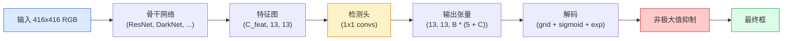

# 目标检测 — 从零实现 YOLO

> 检测是分类加回归，在特征图的每个位置上运行，然后通过非极大值抑制进行清理。

**类型：** 构建
**语言：** Python
**前置课程：** 阶段 4 第 03 课（CNN）、阶段 4 第 04 课（图像分类）、阶段 4 第 05 课（迁移学习）
**时间：** 约 75 分钟

## 学习目标

- 解释将检测转化为密集预测问题的网格加锚框设计，并说明输出张量中每个数字的含义
- 计算框之间的交并比（IoU），并从零实现非极大值抑制（NMS）
- 在预训练骨干网络之上构建一个最小 YOLO 风格的头，包括分类、目标性和边界框回归损失
- 阅读检测指标行（precision@0.5、recall、mAP@0.5、mAP@0.5:0.95），并选择下一个要调整的旋钮

## 问题

分类说"这张图像是狗"。检测说"在像素 (112, 40, 280, 210) 有一只狗，在 (400, 180, 560, 310) 有一只猫，帧中没有其他东西"。这一个结构性变化——预测可变数量的带标签的框而不是每张图像一个标签——是每个自主系统、每个监控产品、每个文档布局解析器以及每个工厂视觉产线所依赖的。

检测也是所有视觉工程权衡同时出现的地方。你希望框是准确的（回归头），你希望每个框有正确的类别（分类头），你希望模型知道什么时候没有东西可检测（目标性分数），你希望每个真实物体恰好有一个预测（非极大值抑制）。错过任何一个，流水线要么遗漏物体、报告幻觉框，要么在不同位置预测同一个物体十五次。

YOLO（You Only Look Once，Redmon et al. 2016）是通过单次卷积网络前向传递使所有这些实时运行的设计，相同的结构决策仍然是现代检测器（YOLOv8、YOLOv9、YOLO-NAS、RT-DETR）的骨干。学会核心，每个变体都变成相同部件的重新排列。

## 概念

### 检测作为密集预测

分类器每张图像输出 C 个数字。YOLO 风格的检测器每张图像输出 `(S x S x (5 + C))` 个数字，其中 S 是空间网格大小。



每个 `S * S` 网格单元预测 `B` 个框。对于每个框：

- 4 个数字描述几何：`tx, ty, tw, th`。
- 1 个数字是目标性分数："这个单元中是否有一个以该单元为中心的物体？"
- C 个数字是类别概率。

每个单元总数：`B * (5 + C)`。对于 VOC，`S=13, B=2, C=20`，每个单元 50 个数字。

### 为什么使用网格和锚框

普通回归会对每个物体以绝对坐标预测 `(x, y, w, h)`。这对卷积网络来说很难，因为平移图像不应该以相同量平移所有预测——每个物体在空间上是有锚定的。网格通过将每个真实框分配给其中心所在的网格单元来解决这个问题；只有那个单元才对该物体负责。

锚框解决第二个问题。一个 3x3 卷积不能轻易地从 16 像素感受野的特征单元回归出一个 500 像素宽的框。相反，我们为每个单元预定义 `B` 个先验框形状（锚框），并预测偏离每个锚框的小增量。模型学习选择正确的锚框并微调它，而不是从零开始回归。

```
锚框先验（416x416 输入的示例）：

  小:   (30,  60)
  中:   (75,  170)
  大:   (200, 380)

在每个网格单元，每个锚框输出 (tx, ty, tw, th, obj, c_1, ..., c_C)。
```

现代检测器通常使用 FPN，每个分辨率有不同的锚框集合——浅层高分辨率图上用小锚框，深层低分辨率图上用大锚框。同样的思想，更多的尺度。

### 解码预测

原始的 `tx, ty, tw, th` 不是框坐标；它们是需要变换后才能绘制的回归目标：

```
中心 x  = (sigmoid(tx) + cell_x) * stride
中心 y  = (sigmoid(ty) + cell_y) * stride
宽度    = anchor_w * exp(tw)
高度    = anchor_h * exp(th)
```

`sigmoid` 将中心偏移保持在单元内部。`exp` 允许宽度从锚框自由缩放而不翻转符号。`stride` 将网格坐标缩放回像素。这个解码步骤在 YOLO v2 以来的每个版本中都是相同的。

### IoU

检测中两个框之间的通用相似性度量：

```
IoU(A, B) = area(A 与 B 的交集) / area(A 与 B 的并集)
```

IoU = 1 表示完全相同；IoU = 0 表示无重叠。预测与真实框之间的 IoU 决定一个预测是否算作真正例（通常 IoU >= 0.5）。两个预测之间的 IoU 是 NMS 用来去重的指标。

### 非极大值抑制

在相邻锚框上训练的卷积网络通常会为同一物体预测重叠的框。NMS 保留最高置信度的预测并删除 IoU 高于阈值的任何其他预测。

```
NMS(boxes, scores, iou_threshold):
    按 score 降序排列 boxes
    keep = []
    while boxes 非空:
        选取最高分的 box，加入 keep
        删除与所选 box 的 IoU > iou_threshold 的每个 box
    return keep
```

典型阈值：目标检测用 0.45。最近的检测器用 `soft-NMS`、`DIoU-NMS` 替代标准 NMS，或直接学习抑制（RT-DETR），但结构目的相同。

### 损失函数

YOLO 损失是三种带权重相加的损失：

```
L = lambda_coord * L_box(pred, target, 其中 obj=1)
  + lambda_obj   * L_obj(pred, 1,     其中 obj=1)
  + lambda_noobj * L_obj(pred, 0,     其中 obj=0)
  + lambda_cls   * L_cls(pred, target, 其中 obj=1)
```

只有包含物体的单元才贡献边界框回归和分类损失。没有物体的单元只贡献目标性损失（教会模型保持沉默）。`lambda_noobj` 通常很小（~0.5），因为绝大多数单元是空的，否则会主导总损失。

现代变体用 CIoU / DIoU（直接优化 IoU）替代 MSE 框损失，使用 focal loss 处理类别不平衡，并用质量焦点损失平衡目标性。三段式结构不变。

### 检测指标

准确率不适用于检测。适用的四个数字：

- **Precision@IoU=0.5** — 在被计为正例的预测中，有多少实际是正确的。
- **Recall@IoU=0.5** — 真实物体中，我们找到了多少。
- **AP@0.5** — IoU 阈值 0.5 下的精确率-召回率曲线面积；每类一个数字。
- **mAP@0.5:0.95** — 在 IoU 阈值 0.5, 0.55, ..., 0.95 上 AP 的平均值。COCO 指标；最严格且信息量最大。

报告全部四个。一个在 mAP@0.5 上强但在 mAP@0.5:0.95 上弱的检测器是粗略定位但不紧密；用更好的框回归损失来修复。高精确率低召回率的检测器太保守；降低置信度阈值或增加目标性权重。

## 构建它

### 步骤 1：IoU

整节课的核心工具。适用于 `(x1, y1, x2, y2)` 格式的两个框数组。

```python
import numpy as np

def box_iou(boxes_a, boxes_b):
    ax1, ay1, ax2, ay2 = boxes_a[:, 0], boxes_a[:, 1], boxes_a[:, 2], boxes_a[:, 3]
    bx1, by1, bx2, by2 = boxes_b[:, 0], boxes_b[:, 1], boxes_b[:, 2], boxes_b[:, 3]

    inter_x1 = np.maximum(ax1[:, None], bx1[None, :])
    inter_y1 = np.maximum(ay1[:, None], by1[None, :])
    inter_x2 = np.minimum(ax2[:, None], bx2[None, :])
    inter_y2 = np.minimum(ay2[:, None], by2[None, :])

    inter_w = np.clip(inter_x2 - inter_x1, 0, None)
    inter_h = np.clip(inter_y2 - inter_y1, 0, None)
    inter = inter_w * inter_h

    area_a = (ax2 - ax1) * (ay2 - ay1)
    area_b = (bx2 - bx1) * (by2 - by1)
    union = area_a[:, None] + area_b[None, :] - inter
    return inter / np.clip(union, 1e-8, None)
```

返回一个 `(N_a, N_b)` 的成对 IoU 矩阵。对单个真实框使用，只需将其中一个数组设为 `(1, 4)` 形状。

### 步骤 2：非极大值抑制

```python
def nms(boxes, scores, iou_threshold=0.45):
    order = np.argsort(-scores)
    keep = []
    while len(order) > 0:
        i = order[0]
        keep.append(i)
        if len(order) == 1:
            break
        rest = order[1:]
        ious = box_iou(boxes[[i]], boxes[rest])[0]
        order = rest[ious <= iou_threshold]
    return np.array(keep, dtype=np.int64)
```

确定性的，排序导致 `O(N log N)`，在相同输入上与 `torchvision.ops.nms` 的行为匹配。

### 步骤 3：框编码和解码

在像素坐标和网络实际回归的 `(tx, ty, tw, th)` 目标之间转换。

```python
def encode(box_xyxy, cell_x, cell_y, stride, anchor_wh):
    x1, y1, x2, y2 = box_xyxy
    cx = 0.5 * (x1 + x2)
    cy = 0.5 * (y1 + y2)
    w = x2 - x1
    h = y2 - y1
    tx = cx / stride - cell_x
    ty = cy / stride - cell_y
    tw = np.log(w / anchor_wh[0] + 1e-8)
    th = np.log(h / anchor_wh[1] + 1e-8)
    return np.array([tx, ty, tw, th])


def decode(tx_ty_tw_th, cell_x, cell_y, stride, anchor_wh):
    tx, ty, tw, th = tx_ty_tw_th
    cx = (sigmoid(tx) + cell_x) * stride
    cy = (sigmoid(ty) + cell_y) * stride
    w = anchor_wh[0] * np.exp(tw)
    h = anchor_wh[1] * np.exp(th)
    return np.array([cx - w / 2, cy - h / 2, cx + w / 2, cy + h / 2])


def sigmoid(x):
    return 1.0 / (1.0 + np.exp(-x))
```

测试：编码一个框然后解码——你应该得到非常接近原始值的结果（当 `tx` 不在后 sigmoid 范围内时，sigmoid 逆不完全可逆）。

### 步骤 4：一个最小的 YOLO 头

在特征图上的一个 1x1 卷积，重塑为 `(B, S, S, num_anchors, 5 + C)`。

```python
import torch
import torch.nn as nn

class YOLOHead(nn.Module):
    def __init__(self, in_c, num_anchors, num_classes):
        super().__init__()
        self.num_anchors = num_anchors
        self.num_classes = num_classes
        self.conv = nn.Conv2d(in_c, num_anchors * (5 + num_classes), kernel_size=1)

    def forward(self, x):
        n, _, h, w = x.shape
        y = self.conv(x)
        y = y.view(n, self.num_anchors, 5 + self.num_classes, h, w)
        y = y.permute(0, 3, 4, 1, 2).contiguous()
        return y
```

输出形状：`(N, H, W, num_anchors, 5 + C)`。最后一个维度保存 `[tx, ty, tw, th, obj, cls_0, ..., cls_{C-1}]`。

### 步骤 5：真实值分配

对每个真实框，决定哪个 `(cell, anchor)` 负责。

```python
def assign_targets(boxes_xyxy, classes, anchors, stride, grid_size, num_classes):
    num_anchors = len(anchors)
    target = np.zeros((grid_size, grid_size, num_anchors, 5 + num_classes), dtype=np.float32)
    has_obj = np.zeros((grid_size, grid_size, num_anchors), dtype=bool)

    for box, cls in zip(boxes_xyxy, classes):
        x1, y1, x2, y2 = box
        cx, cy = 0.5 * (x1 + x2), 0.5 * (y1 + y2)
        gx, gy = int(cx / stride), int(cy / stride)
        bw, bh = x2 - x1, y2 - y1

        ious = np.array([
            (min(bw, aw) * min(bh, ah)) / (bw * bh + aw * ah - min(bw, aw) * min(bh, ah))
            for aw, ah in anchors
        ])
        best = int(np.argmax(ious))
        aw, ah = anchors[best]

        target[gy, gx, best, 0] = cx / stride - gx
        target[gy, gx, best, 1] = cy / stride - gy
        target[gy, gx, best, 2] = np.log(bw / aw + 1e-8)
        target[gy, gx, best, 3] = np.log(bh / ah + 1e-8)
        target[gy, gx, best, 4] = 1.0
        target[gy, gx, best, 5 + cls] = 1.0
        has_obj[gy, gx, best] = True
    return target, has_obj
```

锚框选择是"与真实框的最佳形状 IoU"——一个廉价的代理，匹配 YOLOv2/v3 的分配。v5 及更高版本使用更复杂的策略（任务对齐匹配、动态 k），它们精炼了相同的想法。

### 步骤 6：三种损失

```python
def yolo_loss(pred, target, has_obj, lambda_coord=5.0, lambda_obj=1.0, lambda_noobj=0.5, lambda_cls=1.0):
    has_obj_t = torch.from_numpy(has_obj).bool()
    target_t = torch.from_numpy(target).float()

    # 边界框回归损失：仅对有物体的单元
    box_pred = pred[..., :4][has_obj_t]
    box_true = target_t[..., :4][has_obj_t]
    loss_box = torch.nn.functional.mse_loss(box_pred, box_true, reduction="sum")

    # 目标性损失
    obj_pred = pred[..., 4]
    obj_true = target_t[..., 4]
    loss_obj_pos = torch.nn.functional.binary_cross_entropy_with_logits(
        obj_pred[has_obj_t], obj_true[has_obj_t], reduction="sum")
    loss_obj_neg = torch.nn.functional.binary_cross_entropy_with_logits(
        obj_pred[~has_obj_t], obj_true[~has_obj_t], reduction="sum")

    # 对有物体的单元的分类损失
    cls_pred = pred[..., 5:][has_obj_t]
    cls_true = target_t[..., 5:][has_obj_t]
    loss_cls = torch.nn.functional.binary_cross_entropy_with_logits(
        cls_pred, cls_true, reduction="sum")

    total = (lambda_coord * loss_box
             + lambda_obj * loss_obj_pos
             + lambda_noobj * loss_obj_neg
             + lambda_cls * loss_cls)
    return total, {"box": loss_box.item(), "obj_pos": loss_obj_pos.item(),
                   "obj_neg": loss_obj_neg.item(), "cls": loss_cls.item()}
```

每个 YOLO 教程要么硬编码要么扫描的五个超参数。比例很重要：`lambda_coord=5, lambda_noobj=0.5` 反映了原始 YOLOv1 论文，并且仍然作为合理默认值有效。

### 步骤 7：推理流水线

解码原始头部输出，应用 sigmoid/exp，按目标性阈值过滤，然后 NMS。

```python
def postprocess(pred_tensor, anchors, stride, img_size, conf_threshold=0.25, iou_threshold=0.45):
    pred = pred_tensor.detach().cpu().numpy()
    grid_h, grid_w = pred.shape[1], pred.shape[2]
    num_anchors = len(anchors)

    boxes, scores, classes = [], [], []
    for gy in range(grid_h):
        for gx in range(grid_w):
            for a in range(num_anchors):
                tx, ty, tw, th, obj, *cls = pred[0, gy, gx, a]
                score = sigmoid(obj) * sigmoid(np.array(cls)).max()
                if score < conf_threshold:
                    continue
                cls_idx = int(np.argmax(cls))
                cx = (sigmoid(tx) + gx) * stride
                cy = (sigmoid(ty) + gy) * stride
                w = anchors[a][0] * np.exp(tw)
                h = anchors[a][1] * np.exp(th)
                boxes.append([cx - w / 2, cy - h / 2, cx + w / 2, cy + h / 2])
                scores.append(float(score))
                classes.append(cls_idx)

    if not boxes:
        return np.zeros((0, 4)), np.zeros((0,)), np.zeros((0,), dtype=int)
    boxes = np.array(boxes)
    scores = np.array(scores)
    classes = np.array(classes)
    keep = nms(boxes, scores, iou_threshold)
    return boxes[keep], scores[keep], classes[keep]
```

这就是完整的评估路径：head -> decode -> threshold -> NMS。

## 使用它

`torchvision.models.detection` 提供具有相同概念结构的生产级检测器。加载预训练模型只需三行。

```python
import torch
from torchvision.models.detection import fasterrcnn_resnet50_fpn_v2

model = fasterrcnn_resnet50_fpn_v2(weights="DEFAULT")
model.eval()
with torch.no_grad():
    predictions = model([torch.randn(3, 400, 600)])
print(predictions[0].keys())
print(f"boxes:  {predictions[0]['boxes'].shape}")
print(f"scores: {predictions[0]['scores'].shape}")
print(f"labels: {predictions[0]['labels'].shape}")
```

对于实时推理流水线，`ultralytics`（YOLOv8/v9）是标准：`from ultralytics import YOLO; model = YOLO('yolov8n.pt'); model(img)`。模型内部处理解码和 NMS，返回你在上面构建的相同的 `boxes / scores / labels` 三元组。

## 交付它

本课产出：

- `outputs/prompt-detection-metric-reader.md` — 一个提示词，将 `precision, recall, AP, mAP@0.5:0.95` 行转化为一行诊断和最有用的下一个实验。
- `outputs/skill-anchor-designer.md` — 一个技能，给定真实框数据集，在 `(w, h)` 上运行 k-means，返回每个 FPN 级别的锚框集合，以及选择正确锚框数量所需的覆盖率统计。

## 练习

1. **（简单）** 实现 `box_iou` 并在 1,000 个随机框对上运行 `torchvision.ops.box_iou`。验证最大绝对差低于 `1e-6`。
2. **（中等）** 将 `yolo_loss` 移植到使用 `CIoU` 框损失而非 MSE 的版本。在 100 张图像的合成数据集上展示，CIoU 在相同轮数内收敛到比 MSE 更好的最终 mAP@0.5:0.95。
3. **（困难）** 实现多尺度推理：将同一图像以三种分辨率通过模型，合并框预测，并在最后运行单次 NMS。在保留集上测量相对于单尺度推理的 mAP 提升。

## 关键术语

| 术语 | 人们怎么说 | 它实际意味着什么 |
|------|-----------|----------------|
| 锚框 | "框先验" | 每个网格单元上预定义的框形状，网络从中预测偏移量而非绝对坐标 |
| IoU | "重叠度" | 两个框的交并比；检测中的通用相似性度量 |
| NMS | "去重" | 保留最高分预测并删除与阈值以上重叠的预测的贪心算法 |
| 目标性 | "这里有东西吗" | 每个锚框、每个单元的标量，预测物体是否以该单元为中心 |
| 网格步长 | "下采样因子" | 每个网格单元的像素数；416 像素输入配合 13 网格头，步长为 32 |
| mAP | "平均精度均值" | 精确率-召回率曲线下面积的平均值，跨类别和（COCO 的）IoU 阈值进行平均 |
| AP@0.5 | "PASCAL VOC AP" | IoU 阈值 0.5 下的平均精度；指标的宽松版本 |
| mAP@0.5:0.95 | "COCO AP" | 在 IoU 阈值 0.5..0.95 步长 0.05 上的平均值；严格版本，当前社区标准 |

## 进一步阅读

- [YOLOv1: You Only Look Once (Redmon et al., 2016)](https://arxiv.org/abs/1506.02640) — 奠基论文；之后的每个 YOLO 都是对这一结构的精炼
- [YOLOv3 (Redmon & Farhadi, 2018)](https://arxiv.org/abs/1804.02767) — 引入多尺度 FPN 风格头的论文；仍然是最清晰的图示
- [Ultralytics YOLOv8 文档](https://docs.ultralytics.com) — 当前的生产参考；涵盖数据集格式、数据增强、训练配方
- [The Illustrated Guide to Object Detection (Jonathan Hui)](https://jonathan-hui.medium.com/object-detection-series-24d03a12f904) — 完整检测器家族的平易近人指南；对理解 DETR、RetinaNet、FCOS 和 YOLO 如何关联非常宝贵