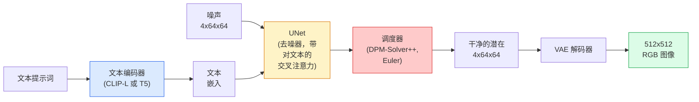

# Stable Diffusion — 架构与微调

> Stable Diffusion 是一个在预训练 VAE 的潜在空间中运行的 DDPM，通过交叉注意力以文本为条件，用快速确定性 ODE 求解器采样，并通过无分类器引导进行控制。

**类型：** 学习 + 使用
**语言：** Python
**前置课程：** 阶段 4 第 10 课（扩散模型）、阶段 7 第 02 课（自注意力）
**时间：** 约 75 分钟

## 学习目标

- 追踪 Stable Diffusion 流水线的五个组件：VAE、文本编码器、U-Net、调度器、安全检查器——以及它们各自实际做什么
- 解释潜在扩散以及为什么在 4x64x64 潜在空间（而非 3x512x512 图像）中训练可将计算减少 48 倍而不损失质量
- 使用 `diffusers` 生成图像、运行图像到图像、图像修补和 ControlNet 引导生成
- 在小自定义数据集上用 LoRA 微调 Stable Diffusion，并在推理时加载 LoRA 适配器

## 问题

直接在 512x512 RGB 图像上训练 DDPM 成本高昂。每个训练步骤反向传播通过一个处理 3x512x512 = 786,432 个输入值的 U-Net，采样通过同一个 U-Net 需要 50+ 次前向传递。在 Stable Diffusion 1.5（2022 年发布）的质量水平上，像素空间扩散需要大约 256 个 GPU 月的训练，在消费级 GPU 上每张图像需要 10-30 秒。

使开源文本到图像变得实用的技巧是**潜在扩散**（Rombach et al., CVPR 2022）。训练一个 VAE，将 3x512x512 图像映射到 4x64x64 潜在张量并返回，然后在该潜在空间中进行扩散。计算量下降 `(3*512*512)/(4*64*64) = 48x`。采样从数十秒降至同一 GPU 上不到两秒。

几乎每个现代图像生成模型——SDXL、SD3、FLUX、HunyuanDiT、Wan-Video——都是潜在扩散模型，在自编码器、去噪器（U-Net 或 DiT）和文本条件化上有变化。学会 Stable Diffusion，你就学会了模板。

## 概念

### 流水线



- **VAE** — 冻结的自编码器。编码器将图像转为潜在（用于 img2img 和训练）。解码器将潜在转回图像。
- **文本编码器** — CLIP 文本编码器（SD 1.x/2.x）、CLIP-L + CLIP-G（SDXL）或 T5-XXL（SD3/FLUX）。产生一系列 token 嵌入。
- **U-Net** — 去噪器。有交叉注意力层，在每个分辨率级别从潜在注意到文本嵌入。
- **调度器** — 采样算法（DDIM、Euler、DPM-Solver++）。选择 sigma，将预测噪声混合回潜在。
- **安全检查器** — 可选的 NSFW / 非法内容过滤器。

### 无分类器引导（CFG）

纯文本条件化对每个提示词 `c` 学习 `epsilon_theta(x_t, t, c)`。CFG 用相同的网络训练，10% 的时间丢弃 `c`（替换为空白嵌入），给出一个同时预测条件和无条件噪声的单一模型。在推理时：

```
eps = eps_uncond + w * (eps_cond - eps_uncond)
```

`w` 是引导尺度。`w=0` 是无条件的，`w=1` 是纯条件的，`w>1` 推动输出更"以提示词为条件"，代价是多样性。SD 默认值是 `w=7.5`。

CFG 是文本到图像在生产质量上工作的原因。没有它，提示词对输出只有微弱的影响；有了它，提示词占主导地位。

### 潜在空间几何

VAE 的 4 通道潜在不仅仅是压缩后的图像。它是一个流形，其中算术大致对应语义编辑（提示词工程和插值都在这里发生），并且扩散 U-Net 被训练来投入全部建模预算。解码一个随机的 4x64x64 潜在不会产生随机外观的图像——它产生垃圾，因为只有特定的潜在子流形解码为有效图像。

两个推论：

1. **Img2img** = 将图像编码到潜在，添加部分噪声，运行去噪器，解码。图像结构保留因为编码是近乎可逆的；内容基于提示词变化。
2. **图像修补** = 与 img2img 相同，但去噪器只更新掩膜区域；未掩膜区域保持在编码的潜在。

### U-Net 架构

SD U-Net 是第 10 课 TinyUNet 的放大版，有三个新增内容：

- **Transformer 块** 在每个空间分辨率上，包含自注意力 + 对文本嵌入的交叉注意力。
- **时间嵌入** 通过正弦编码上的 MLP。
- **跳跃连接** 在匹配分辨率的编码器和解码器之间。

SD 1.5 的总参数：约 860M。SDXL：约 2.6B。FLUX：约 12B。参数的跳跃主要在注意力层。

### LoRA 微调

全量微调 Stable Diffusion 需要 20+ GB 显存并更新 860M 参数。LoRA（低秩适配）保持基础模型冻结，并将小的秩分解矩阵注入注意力层。SD 的 LoRA 适配器通常为 10-50 MB，在单个消费级 GPU 上训练 10-60 分钟，并在推理时作为直接替换加载。

```
原始: W_q : (d_in, d_out)   冻结
LoRA:  W_q + alpha * (A @ B)   其中 A : (d_in, r), B : (r, d_out)

r 通常为 4-32。
```

LoRA 是几乎所有社区微调的分发方式。CivitAI 和 Hugging Face 托管了数百万个。

### 你会看到的调度器

- **DDIM** — 确定性的，约 50 步，简单。
- **Euler ancestral** — 随机的，30-50 步，略微更有创意的样本。
- **DPM-Solver++ 2M Karras** — 确定性的，20-30 步，生产默认。
- **LCM / TCD / Turbo** — 一致性模型和蒸馏变体；1-4 步，代价是一些质量。

在 `diffusers` 中切换调度器是一行变化，有时无需任何重新训练就能修复样本问题。

## 构建它

本课端到端使用 `diffusers` 而非从零重建 Stable Diffusion。你需要重建的组件（VAE、文本编码器、U-Net、调度器）是各自的课程主题；这里的目标是精通生产 API。

### 步骤 1：文本到图像

```python
import torch
from diffusers import StableDiffusionPipeline

pipe = StableDiffusionPipeline.from_pretrained(
    "runwayml/stable-diffusion-v1-5",
    torch_dtype=torch.float16,
).to("cuda")

image = pipe(
    prompt="a dog riding a skateboard in tokyo, studio ghibli style",
    guidance_scale=7.5,
    num_inference_steps=25,
    generator=torch.Generator("cuda").manual_seed(42),
).images[0]
image.save("dog.png")
```

`float16` 将显存减半而无可见质量损失。`num_inference_steps=25` 配合默认 DPM-Solver++ 匹配 DDIM 的 `num_inference_steps=50`。

### 步骤 2：切换调度器

```python
from diffusers import DPMSolverMultistepScheduler, EulerAncestralDiscreteScheduler

pipe.scheduler = DPMSolverMultistepScheduler.from_config(pipe.scheduler.config)
pipe.scheduler = EulerAncestralDiscreteScheduler.from_config(pipe.scheduler.config)
```

调度器状态与 U-Net 权重解耦。你可以在 DDPM 上训练，用任何调度器采样。

### 步骤 3：图像到图像

```python
from diffusers import StableDiffusionImg2ImgPipeline
from PIL import Image

img2img = StableDiffusionImg2ImgPipeline.from_pretrained(
    "runwayml/stable-diffusion-v1-5",
    torch_dtype=torch.float16,
).to("cuda")

init_image = Image.open("dog.png").convert("RGB").resize((512, 512))
out = img2img(
    prompt="a dog riding a skateboard, oil painting",
    image=init_image,
    strength=0.6,
    guidance_scale=7.5,
).images[0]
```

`strength` 是去噪前添加的噪声量（0.0 = 不变，1.0 = 完全重新生成）。0.5-0.7 是风格迁移的标准范围。

### 步骤 4：图像修补

```python
from diffusers import StableDiffusionInpaintPipeline

inpaint = StableDiffusionInpaintPipeline.from_pretrained(
    "runwayml/stable-diffusion-inpainting",
    torch_dtype=torch.float16,
).to("cuda")

image = Image.open("dog.png").convert("RGB").resize((512, 512))
mask = Image.open("dog_mask.png").convert("L").resize((512, 512))

out = inpaint(
    prompt="a cat",
    image=image,
    mask_image=mask,
    guidance_scale=7.5,
).images[0]
```

掩膜中的白色像素是需要重新生成的区域。黑色像素被保留。

### 步骤 5：LoRA 加载

```python
pipe.load_lora_weights("sayakpaul/sd-lora-ghibli")
pipe.fuse_lora(lora_scale=0.8)

image = pipe(prompt="a village square in ghibli style").images[0]
```

`lora_scale` 控制强度；0.0 = 无效果，1.0 = 完全效果。`fuse_lora` 将适配器原位烘焙到权重中以加速，但阻止切换。在加载不同适配器之前调用 `pipe.unfuse_lora()`。

### 步骤 6：LoRA 训练（草图）

真正的 LoRA 训练在 `peft` 或 `diffusers.training` 中。概要：

```python
# 伪代码
for step, batch in enumerate(dataloader):
    images, prompts = batch
    latents = vae.encode(images).latent_dist.sample() * 0.18215

    t = torch.randint(0, num_train_timesteps, (batch_size,))
    noise = torch.randn_like(latents)
    noisy_latents = scheduler.add_noise(latents, noise, t)

    text_emb = text_encoder(tokenizer(prompts))

    pred_noise = unet(noisy_latents, t, text_emb)  # LoRA 权重注入在这里

    loss = F.mse_loss(pred_noise, noise)
    loss.backward()
    optimizer.step()
```

只有 LoRA 矩阵接收梯度；基础 U-Net、VAE 和文本编码器被冻结。在 batch_size=1 并启用梯度检查点的情况下，这适合 8 GB 显存。

## 使用它

在生产环境中，你实际做的决策是：

- **模型家族**：SD 1.5 用于开源社区微调，SDXL 用于更高保真度，SD3 / FLUX 用于最先进且有严格许可要求。
- **调度器**：DPM-Solver++ 2M Karras 用于 20-30 步，LCM-LoRA 用于延迟低于 1s。
- **精度**：4080/4090 上用 `float16`，A100 及更新上 `bfloat16`，显存紧张时用 `int8`（通过 `bitsandbytes` 或 `compel`）。
- **条件化**：纯文本可以工作；更强的控制，在基础流水线之上添加 ControlNet（canny、深度、姿态）。

对于批量生成，`AUTO1111` / `ComfyUI` 是社区工具；对于生产 API，`diffusers` + `accelerate` 或 `optimum-nvidia` 配合 TensorRT 编译。

## 交付它

本课产出：

- `outputs/prompt-sd-pipeline-planner.md` — 一个提示词，给定延迟预算、保真度目标和许可约束，选择 SD 1.5 / SDXL / SD3 / FLUX 加上调度器和精度。
- `outputs/skill-lora-training-setup.md` — 一个技能，为自定义数据集编写完整 LoRA 训练配置，包括描述、秩、批量大小和学习率。

## 练习

1. **（简单）** 用 `guidance_scale` 在 `[1, 3, 5, 7.5, 10, 15]` 生成相同提示词。描述图像如何变化。在哪个引导值上出现伪影？
2. **（中等）** 取任意真实照片，以 `strength` 在 `[0.2, 0.4, 0.6, 0.8, 1.0]` 通过 `StableDiffusionImg2ImgPipeline`。哪个强度在改变风格的同时保留构图？为什么 1.0 完全忽略输入？
3. **（困难）** 在 10-20 张单个主体的图像（宠物、标志、角色）上训练 LoRA，并用该主体生成新颖场景。报告产生最佳身份保留而不对输入图像过拟合的 LoRA 秩和训练步数。

## 关键术语

| 术语 | 人们怎么说 | 它实际意味着什么 |
|------|-----------|----------------|
| 潜在扩散 | "在潜在中扩散" | 在 VAE 潜在空间（4x64x64）而非像素空间（3x512x512）中运行整个 DDPM；节省 48 倍计算 |
| VAE 缩放因子 | "0.18215" | 将 VAE 原始潜在重新缩放到大致单位方差的常数；在每个 SD 流水线中都硬编码 |
| 无分类器引导 | "CFG" | 混合条件和无条件噪声预测；影响最大的单一推理旋钮 |
| 调度器 | "采样器" | 将噪声 + 模型预测转化为去噪潜在轨迹的算法 |
| LoRA | "低秩适配器" | 不触及基础权重的微调注意力层的小秩分解矩阵 |
| 交叉注意力 | "文本-图像注意力" | 从潜在 token 到文本 token 的注意力；在每个 U-Net 级别注入提示词信息 |
| ControlNet | "结构条件化" | 一个单独训练的适配器，用额外输入（canny、深度、姿态、分割）引导 SD |
| DPM-Solver++ | "默认调度器" | 二阶确定性 ODE 求解器；2026 年在低步数（20-30）下最佳质量 |

## 进一步阅读

- [High-Resolution Image Synthesis with Latent Diffusion (Rombach et al., 2022)](https://arxiv.org/abs/2112.10752) — Stable Diffusion 论文；包含证明设计的每个消融实验
- [Classifier-Free Diffusion Guidance (Ho & Salimans, 2022)](https://arxiv.org/abs/2207.12598) — CFG 论文
- [LoRA: Low-Rank Adaptation of Large Language Models (Hu et al., 2021)](https://arxiv.org/abs/2106.09685) — LoRA 最初为 NLP 设计；几乎无需更改就迁移到 SD
- [diffusers 文档](https://huggingface.co/docs/diffusers) — 每个 SD / SDXL / SD3 / FLUX 流水线的参考