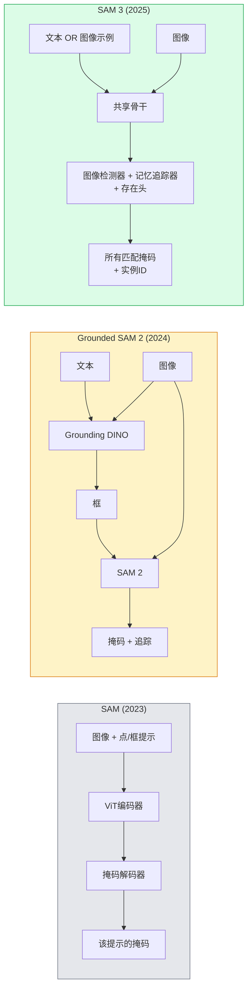

# SAM 3与开放词汇分割

> 给模型一个文本提示和一张图像，为每个匹配的对象获取掩码。SAM 3将这一切变成了单次前向传递。

**类型:** 使用 + 构建
**语言:** Python
**前置条件:** 第四阶段第7课（U-Net），第四阶段第8课（Mask R-CNN），第四阶段第18课（CLIP）
**时间:** ~60分钟

## 学习目标

- 区分SAM（仅视觉提示）、Grounded SAM / SAM 2（检测器 + SAM）和SAM 3（通过可提示概念分割实现原生文本提示）
- 解释SAM 3架构：共享骨干 + 图像检测器 + 基于记忆的视频追踪器 + 存在头 + 解耦的检测器-追踪器设计
- 使用Hugging Face `transformers` SAM 3集成进行文本提示检测、分割和视频追踪
- 根据延迟、概念复杂度和部署目标在SAM 3、Grounded SAM 2、YOLO-World和SAM-MI之间选择

## 问题

2023年的SAM是一个仅支持视觉提示的模型：你点击一个点或画一个框，它返回一个掩码。对于"给我照片中所有的橙子"，你需要一个检测器（Grounding DINO）来生成边界框，然后SAM对每个进行分割。Grounded SAM将其变成了一个流水线，但它是两个冻结模型的级联，不可避免地会有错误累积。

SAM 3（Meta, 2025年11月, ICLR 2026）折叠了这个级联。它接受一个简短的名词短语或图像示例作为提示，并在单次前向传递中返回所有匹配的掩码和实例ID。这就是**可提示概念分割（PCS）**。结合2026年3月的Object Multiplex更新（SAM 3.1），它可以通过视频高效追踪同一概念的多个实例。

本课讨论这代表的结构性转变。2D分割、检测和文本-图像对齐已经合并为一个模型。生产问题不再是"我串联哪个流水线"，而是"哪个可提示模型能端到端地处理我的用例"。

## 概念

### 三代演化



### 可提示概念分割

"概念提示"是一个简短的名词短语（`"yellow school bus"`、`"striped red umbrella"`、`"hand holding a mug"`）或图像示例。模型返回图像中匹配该概念的每个实例的分割掩码，以及每个匹配的唯一实例ID。

这与经典的视觉提示SAM有三点不同：

1. 不需要按实例提示——一个文本提示返回所有匹配。
2. 开放词汇——概念可以是任何能用自然语言描述的东西。
3. 一次返回多个实例，而非每次提示返回一个掩码。

### 关键架构部件

- **共享骨干**——单个ViT处理图像。检测器头和基于记忆的追踪器都从中读取。
- **存在头**——预测概念是否存在于图像中。将"这个在吗？"与"在哪？"解耦。减少对不存在概念的误报。
- **解耦的检测器-追踪器**——图像级检测和视频级追踪有独立的头，因此不会相互干扰。
- **记忆库**——存储跨帧的逐实例特征用于视频追踪（与SAM 2使用的机制相同）。

### 大规模训练

SAM 3在**400万个独特概念**上训练，这些概念由AI + 人工审查的数据引擎迭代标注和纠正生成。新的**SA-CO基准**包含27万个独特概念，是先前基准的50倍。SAM 3在SA-CO上达到人类表现的75-80%，并在图像+视频PCS上将现有系统翻倍。

### SAM 3.1 Object Multiplex

2026年3月更新：**Object Multiplex**引入了一种共享记忆机制，用于同时联合追踪同一概念的多个实例。以前，追踪N个实例意味着N个独立的记忆库。Multiplex将其折叠成一个共享记忆，带有逐实例查询。结果：在不牺牲准确性的情况下，多对象追踪速度大幅提升。

### 2026年Grounded SAM仍然重要的场景

- 当你需要替换特定的开放词汇检测器（DINO-X、Florence-2）。
- 当SAM 3许可证（HF上的受限访问）是障碍时。
- 当你需要比SAM 3暴露的更多检测器阈值控制。
- 用于检测器组件的研究/消融工作。

模块化流水线仍然有位置。对于大多数生产工作，SAM 3是更简单的答案。

### YOLO-World vs SAM 3

- **YOLO-World**——仅开放词汇检测器（无掩码）。实时。最适合需要高fps检测框的场景。
- **SAM 3**——完整分割 + 追踪。较慢但输出更丰富。

生产分工：YOLO-World用于快速仅检测流水线（机器人导航、快速仪表板），SAM 3用于任何需要掩码或追踪的场景。

### SAM-MI效率

SAM-MI（2025-2026）解决了SAM的解码器瓶颈。关键思路：

- **稀疏点提示**——使用几个精心选择的点而非密集提示；将解码器调用减少96%。
- **浅层掩码聚合**——将粗略掩码预测合并为一个更清晰的掩码。
- **解耦掩码注入**——解码器接收预计算的掩码特征而非重新运行。

结果：在开放词汇基准上比Grounded-SAM提速约1.6倍。

### 三种模型的输出格式

所有模型返回相同的一般结构（框 + 标签 + 分数 + 掩码 + ID），这很有帮助——下游流水线不需要根据不同模型进行分支。

## 构建部分

### 步骤1：提示构建

构建一个辅助函数，将用户句子转换为SAM 3概念提示列表。这是"用户输入的内容"与"模型消费的内容"之间的边界。

```python
def split_concepts(sentence):
    """
    多概念提示的启发式分割器。
    返回简短名词短语列表。
    """
    for sep in [",", ";", "and", "or", "&"]:
        if sep in sentence:
            parts = [p.strip() for p in sentence.replace("and ", ",").split(",")]
            return [p for p in parts if p]
    return [sentence.strip()]

print(split_concepts("cats, dogs and balloons"))
```

SAM 3每次前向传递接受一个概念；对于多概念查询，循环或批处理它们。

### 步骤2：后处理辅助函数

将SAM 3的原始输出转换为符合第四阶段第16课流水线契约的干净检测列表。

```python
from dataclasses import dataclass
from typing import List

@dataclass
class ConceptDetection:
    concept: str
    instance_id: int
    box: tuple          # (x1, y1, x2, y2)
    score: float
    mask_rle: str       # 游程编码


def rle_encode(binary_mask):
    flat = binary_mask.flatten().astype("uint8")
    runs = []
    prev, count = flat[0], 0
    for v in flat:
        if v == prev:
            count += 1
        else:
            runs.append((int(prev), count))
            prev, count = v, 1
    runs.append((int(prev), count))
    return ";".join(f"{v}x{c}" for v, c in runs)
```

RLE即使对于许多高分辨率掩码也能保持响应负载小巧。相同格式适用于SAM 2、SAM 3、Grounded SAM 2。

### 步骤3：统一的开放词汇分割接口

将你使用的任何后端（SAM 3、Grounded SAM 2、YOLO-World + SAM 2）包装在单个方法后。后端更换时下游代码无需改变。

```python
from abc import ABC, abstractmethod
import numpy as np

class OpenVocabSeg(ABC):
    @abstractmethod
    def detect(self, image: np.ndarray, concept: str) -> List[ConceptDetection]:
        ...


class StubOpenVocabSeg(OpenVocabSeg):
    """
    确定性存根，用于在不加载真实模型时进行流水线测试。
    """
    def detect(self, image, concept):
        h, w = image.shape[:2]
        return [
            ConceptDetection(
                concept=concept,
                instance_id=0,
                box=(w * 0.2, h * 0.3, w * 0.5, h * 0.8),
                score=0.89,
                mask_rle="0x100;1x50;0x200",
            ),
            ConceptDetection(
                concept=concept,
                instance_id=1,
                box=(w * 0.55, h * 0.25, w * 0.85, h * 0.75),
                score=0.74,
                mask_rle="0x80;1x40;0x220",
            ),
        ]
```

真实的`SAM3OpenVocabSeg`子类将包装`transformers.Sam3Model`和`Sam3Processor`。

### 步骤4：Hugging Face SAM 3使用（参考）

对于实际模型，`transformers`集成：

```python
from transformers import Sam3Processor, Sam3Model
import torch

processor = Sam3Processor.from_pretrained("facebook/sam3")
model = Sam3Model.from_pretrained("facebook/sam3").eval()

inputs = processor(images=pil_image, return_tensors="pt")
inputs = processor.set_text_prompt(inputs, "yellow school bus")

with torch.no_grad():
    outputs = model(**inputs)

masks = processor.post_process_masks(
    outputs.masks, inputs.original_sizes, inputs.reshaped_input_sizes
)
boxes = outputs.boxes
scores = outputs.scores
```

一个提示，单次调用返回所有匹配。

### 步骤5：测量Grounded SAM 2免费给你带来的收益

一个诚实的基准测试：在真实流水线中用SAM 3替换Grounded SAM 2会发生什么？

- 延迟：SAM 3节省一次前向传递（无需独立检测器），但模型本身更重；通常净中性或轻微加速。
- 准确率：SAM 3在稀有或组合概念（"striped red umbrella"）上表现出色。在常见单字概念上相似。
- 灵活性：Grounded SAM 2允许替换检测器（DINO-X、Florence-2、Grounding DINO 1.5）；SAM 3是单体的。

结论：SAM 3是2026年开放词汇分割的默认选择。Grounded SAM 2在你需要检测器灵活性或不同许可证条款时仍然是正确的答案。

## 使用部分

生产部署模式：

- **实时标注**——SAM 3 + CVAT的标签即文本提示功能。标注员选择标签名称；SAM 3预标注每个匹配实例。审查和纠正。
- **视频分析**——SAM 3.1 Object Multiplex用于多对象追踪；将帧送入基于记忆的追踪器。
- **机器人**——SAM 3用于开放词汇操作（"pick up the red cup"）；作为规划原语运行。
- **医学影像**——在医学概念上微调的SAM 3；需要在HF上请求访问。

Ultralytics在其Python包中包装了SAM 3：

```python
from ultralytics import SAM

model = SAM("sam3.pt")
results = model(image_path, prompts="yellow school bus")
```

与YOLO和SAM 2相同的接口。

## 交付物

本课产生：

- `outputs/prompt-open-vocab-stack-picker.md`——根据延迟、概念复杂度和许可证在SAM 3 / Grounded SAM 2 / YOLO-World / SAM-MI之间选择的提示词。
- `outputs/skill-concept-prompt-designer.md`——将用户话语转化为格式良好的SAM 3概念提示（分割、消歧、回退）的技能。

## 练习

1. **（简单）** 在10张图像上使用你选择的概念提示运行SAM 3。与SAM 2 + Grounding DINO 1.5在相同图像上比较。报告每个模型漏掉了哪些概念。
2. **（中等）** 在SAM 3之上构建一个"点击包含/点击排除"UI：文本提示返回候选实例；用户点击保留哪些作为正样本。输出最终概念集为JSON。
3. **（困难）** 在自定义概念集（例如5种电子元件）上微调SAM 3，每种元件20张标注图像。与零样本SAM 3在相同测试集上比较；测量掩码IoU改进。

## 关键术语

| 术语 | 人们怎么说 | 实际含义 |
|------|-----------|---------|
| 开放词汇分割 | "按文本分割" | 为自然语言描述的对象而非固定标签集生成掩码 |
| PCS | "可提示概念分割" | SAM 3的核心任务——给定名词短语或图像示例，分割所有匹配实例 |
| 概念提示 | "文本输入" | 简短名词短语或图像示例；非完整句子 |
| 存在头 | "它在吗？" | SAM 3模块，在定位之前决定概念是否存在于图像中 |
| SA-CO | "SAM 3基准" | 27万概念的开放词汇分割基准；比先前开放词汇基准大50倍 |
| Object Multiplex | "SAM 3.1更新" | 共享记忆多对象追踪；对许多实例进行快速联合追踪 |
| Grounded SAM 2 | "模块化流水线" | 检测器 + SAM 2级联；在检测器可替换时仍然相关 |
| SAM-MI | "高效SAM变体" | 掩码注入使速度比Grounded-SAM快1.6倍 |

## 进一步阅读

- [SAM 3: Segment Anything with Concepts (arXiv 2511.16719)](https://arxiv.org/abs/2511.16719)
- [SAM 3.1 Object Multiplex (Meta AI, March 2026)](https://ai.meta.com/blog/segment-anything-model-3/)
- [SAM 3 Hugging Face模型页面](https://huggingface.co/facebook/sam3)
- [Grounded SAM 2教程 (PyImageSearch)](https://pyimagesearch.com/2026/01/19/grounded-sam-2-from-open-set-detection-to-segmentation-and-tracking/)
- [Ultralytics SAM 3文档](https://docs.ultralytics.com/models/sam-3/)
- [SAM3-I: Instruction-aware SAM (arXiv 2512.04585)](https://arxiv.org/abs/2512.04585)