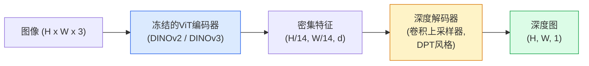

# 单目深度与几何估计

> 深度图是一个单通道图像，每个像素是从相机的距离。从单张RGB帧预测它曾经在无立体视觉或LiDAR的情况下是不可能的。到2026年，冻结的ViT编码器加上一个轻量级头部可以在真实值的几个百分点内完成。

**类型:** 构建 + 使用
**语言:** Python
**前置条件:** 第四阶段第14课（ViT），第四阶段第17课（自监督视觉），第四阶段第7课（U-Net）
**时间:** ~60分钟

## 学习目标

- 区分相对深度和度量深度，并说明每个生产模型（MiDaS、Marigold、Depth Anything V3、ZoeDepth）解决哪一种
- 使用Depth Anything V3（DINOv2骨干）对任意单张图像进行深度预测，无需标定
- 解释为什么单目深度能从单张图像工作（透视线索、纹理梯度、学习先验），以及它无法恢复什么（绝对尺度、被遮挡几何）
- 使用深度图和针孔相机内参将2D检测提升到3D点

## 问题

深度是2D计算机视觉中缺失的轴。给定RGB，你知道物体在像平面中的位置；你不知道它们有多远。深度传感器（立体设备、LiDAR、飞行时间）直接解决此问题，但昂贵、脆弱且范围有限。

单目深度估计——从单张RGB帧预测深度——曾经产生模糊、不可靠的输出。到2026年，大型预训练编码器改变了这一点：Depth Anything V3使用冻结的DINOv2骨干，产生跨室内、室外、医学和卫星域的泛化深度图。Marigold将深度重新定义为条件扩散问题。ZoeDepth回归真实的度量距离。

深度还是2D检测和3D理解之间的桥梁：将检测框的像素乘以深度，你就将2D对象提升到3D点云中。这是每个AR遮挡系统、每个避障流水线和每个"拿起杯子"机器人的核心。

## 概念

### 相对深度 vs 度量深度

- **相对深度**——有序的`z`值，没有真实世界单位。"像素A比像素B更近，但距离比例不以米为单位锚定。"
- **度量深度**——从相机的绝对距离，以米为单位。要求模型学习图像线索和真实距离之间的统计关系。

MiDaS和Depth Anything V3产生相对深度。Marigold产生相对深度。ZoeDepth、UniDepth和Metric3D产生度量深度。度量模型对相机内参敏感；相对模型不敏感。

### 编码器-解码器模式



Depth Anything V3冻结编码器，仅训练DPT风格解码器。编码器提供丰富特征；解码器将它们插值回图像分辨率并回归深度。

### 为什么单张图像能产生深度

2D图像包含许多与深度相关的单目线索：

- **透视**——3D中的平行线在2D中汇聚。
- **纹理梯度**——远离的表面具有更小、更密集的纹理。
- **遮挡顺序**——较近的物体遮挡较远的物体。
- **尺寸恒常性**——已知物体（汽车、人）给出近似尺度。
- **大气透视**——户外场景中，远处物体显得更模糊、更蓝。

在数十亿图像上训练的ViT内化了这些线索。凭借足够的数据和强大的骨干，单目深度在不需要任何显式3D监督的情况下达到合理精度。

### 单目深度无法做什么

- **绝对度量尺度**——没有内参或场景中已知对象。网络可以预测"杯子比勺子远两倍"，但不知道杯子是1米还是10米远。
- **被遮挡几何**——椅子的背面不可见，无法可靠推断。
- **真正无纹理/反射表面**——镜子、玻璃、均匀墙壁。网络报告看似合理但错误的深度。

### Depth Anything V3在2026年

- 普通DINOv2 ViT-L/14作为编码器（冻结）。
- DPT解码器。
- 在来自不同来源的有姿态图像对上训练（不需要超出光度一致性的显式深度监督）。
- 从**任意数量的视觉输入，有或没有已知相机位姿**预测空间一致的几何。
- 在单目深度、任意视角几何、视觉渲染、相机位姿估计方面SOTA。

这是2026年需要深度时调用的即插即用模型。

### Marigold——用于深度的扩散

Marigold（Ke et al., CVPR 2024）将深度估计重新定义为条件图像到图像扩散。条件：RGB。目标：深度图。使用预训练Stable Diffusion 2 U-Net作为骨干。输出深度图在对象边界处异常清晰。权衡：推理比前馈模型慢（10-50个去噪步骤）。

### 内参和针孔相机

要将像素`(u, v)`和深度`d`提升为相机坐标系中的3D点`(X, Y, Z)`：

```
fx, fy, cx, cy = 相机内参
X = (u - cx) * d / fx
Y = (v - cy) * d / fy
Z = d
```

内参来自EXIF元数据、标定图案或单目内参估计器（Perspective Fields、UniDepth）。没有内参，你仍然可以通过假设60-70° FOV和中等分辨率主点来渲染点云——可用于可视化，不可用于测量。

### 评估

两个标准指标：

- **AbsRel**（绝对相对误差）：`mean(|d_pred - d_gt| / d_gt)`。越低越好。生产模型为0.05-0.1。
- **delta < 1.25**（阈值准确率）：`max(d_pred/d_gt, d_gt/d_pred) < 1.25`的像素比例。越高越好。SOTA为0.9+。

对于相对深度（Depth Anything V3、MiDaS），评估使用两个指标的尺度和位移不变版本。

## 构建部分

### 步骤1：深度指标

```python
import torch

def abs_rel_error(pred, target, mask=None):
    if mask is not None:
        pred = pred[mask]
        target = target[mask]
    return (torch.abs(pred - target) / target.clamp(min=1e-6)).mean().item()


def delta_accuracy(pred, target, threshold=1.25, mask=None):
    if mask is not None:
        pred = pred[mask]
        target = target[mask]
    ratio = torch.maximum(pred / target.clamp(min=1e-6), target / pred.clamp(min=1e-6))
    return (ratio < threshold).float().mean().item()
```

在评估之前始终掩码无效深度像素（零、NaN、饱和）。

### 步骤2：尺度和位移对齐

对于相对深度模型，在计算指标之前将预测对齐到真实值。`a * pred + b = target`的最小二乘拟合：

```python
def align_scale_shift(pred, target, mask=None):
    if mask is not None:
        p = pred[mask]
        t = target[mask]
    else:
        p = pred.flatten()
        t = target.flatten()
    A = torch.stack([p, torch.ones_like(p)], dim=1)
    coeffs, *_ = torch.linalg.lstsq(A, t.unsqueeze(-1))
    a, b = coeffs[:2, 0]
    return a * pred + b
```

在评估MiDaS / Depth Anything之前运行`align_scale_shift`后再计算`abs_rel_error`。

### 步骤3：将深度提升为点云

```python
import numpy as np

def depth_to_point_cloud(depth, intrinsics):
    H, W = depth.shape
    fx, fy, cx, cy = intrinsics
    v, u = np.meshgrid(np.arange(H), np.arange(W), indexing="ij")
    z = depth
    x = (u - cx) * z / fx
    y = (v - cy) * z / fy
    return np.stack([x, y, z], axis=-1)


depth = np.random.uniform(0.5, 4.0, (240, 320))
intr = (320.0, 320.0, 160.0, 120.0)
pc = depth_to_point_cloud(depth, intr)
print(f"点云形状: {pc.shape}  (H, W, 3)")
```

一个函数，每个3D提升应用。将点云导出为`.ply`并在MeshLab或CloudCompare中打开。

### 步骤4：合成深度场景冒烟测试

```python
def synthetic_depth(size=96):
    yy, xx = np.meshgrid(np.arange(size), np.arange(size), indexing="ij")
    # 地板：从近（顶部）到远（底部）的线性梯度
    depth = 1.0 + (yy / size) * 4.0
    # 中间的盒子：更近
    mask = (np.abs(xx - size / 2) < size / 6) & (np.abs(yy - size * 0.6) < size / 6)
    depth[mask] = 2.0
    return depth.astype(np.float32)


gt = torch.from_numpy(synthetic_depth(96))
pred = gt + 0.3 * torch.randn_like(gt)  # 模拟预测
aligned = align_scale_shift(pred, gt)
print(f"对齐前  absRel = {abs_rel_error(pred, gt):.3f}")
print(f"对齐后  absRel = {abs_rel_error(aligned, gt):.3f}")
```

### 步骤5：Depth Anything V3使用（参考）

```python
import torch
from transformers import pipeline
from PIL import Image

pipe = pipeline(task="depth-estimation", model="LiheYoung/depth-anything-v2-large")

image = Image.open("street.jpg").convert("RGB")
out = pipe(image)
depth_np = np.array(out["depth"])
```

三行代码。`out["depth"]`是PIL灰度图；转换为numpy进行数学运算。对于Depth Anything V3，一旦发布后交换模型id；API不变。

## 使用部分

- **Depth Anything V3**（Meta AI / 字节跳动，2024-2026）——相对深度的默认选择。生产中速度最快的ViT-large骨干模型。
- **Marigold**（ETH, 2024）——最高视觉质量，推理较慢。
- **UniDepth**（ETH, 2024）——带相机内参估计的度量深度。
- **ZoeDepth**（Intel, 2023）——度量深度；较旧，仍然可靠。
- **MiDaS v3.1**——传统但稳定；比较的良好基线。

典型集成模式：

1. RGB帧到达。
2. 深度模型产生深度图。
3. 检测器产生框。
4. 通过深度将框的质心提升到3D；与点云（如果有的话）合并。
5. 下游：AR遮挡、路径规划、物体尺寸估计、立体替换。

对于实时使用，Depth Anything V2 Small（INT8量化）在消费级GPU上以518x518达到约30 fps。

## 交付物

本课产生：

- `outputs/prompt-depth-model-picker.md`——根据延迟、度量vs相对需求和场景类型在Depth Anything V3、Marigold、UniDepth、MiDaS之间选择的提示词。
- `outputs/skill-depth-to-pointcloud.md`——从深度图构建点云的技能，包括正确的内参处理和导出为`.ply`。

## 练习

1. **（简单）** 在你桌面的任意10张图像上运行Depth Anything V2。将深度保存为灰度PNG并检查。识别一个预测深度看起来错误的物体，解释为什么单目线索失效。
2. **（中等）** 给定RGB + Depth Anything V2的深度，提升为点云并用`open3d`渲染。比较两个场景（室内/室外），注意哪个看起来更可信。
3. **（困难）** 取五对仅在已知物体位置上不同的图像（例如瓶子移近30厘米）。使用UniDepth在两幅图像上预测度量深度。报告预测距离差与真实30厘米的对比。

## 关键术语

| 术语 | 人们怎么说 | 实际含义 |
|------|-----------|---------|
| 单目深度 | "单图像深度" | 从单张RGB帧估计深度，无需立体或LiDAR |
| 相对深度 | "有序深度" | 有序z值，没有真实世界单位 |
| 度量深度 | "绝对距离" | 以米为单位的深度；需要标定或使用度量监督训练的模型 |
| AbsRel | "绝对相对误差" | mean of \|d_pred - d_gt\| / d_gt；标准深度指标 |
| Delta准确率 | "delta < 1.25" | 预测在真实值25%以内的像素比例 |
| 针孔相机 | "fx, fy, cx, cy" | 用于将(u, v, d)提升为(X, Y, Z)的相机模型 |
| DPT | "密集预测Transformer" | 在冻结ViT编码器之上使用的基于卷积的解码器，用于深度 |
| DINOv2骨干 | "它有效的原因" | 自监督特征，无需深度标签即可跨域泛化 |

## 进一步阅读

- [Depth Anything V3论文页面](https://depth-anything.github.io/) — 使用DINOv2编码器的SOTA单目深度
- [Marigold (Ke et al., CVPR 2024)](https://marigoldmonodepth.github.io/) — 基于扩散的深度估计
- [UniDepth (Piccinelli et al., 2024)](https://arxiv.org/abs/2403.18913) — 带内参的度量深度
- [MiDaS v3.1 (Intel ISL)](https://github.com/isl-org/MiDaS) — 经典的相对深度基线
- [DINOv3博客文章 (Meta)](https://ai.meta.com/blog/dinov3-self-supervised-vision-model/) — 提升深度准确率的编码器家族