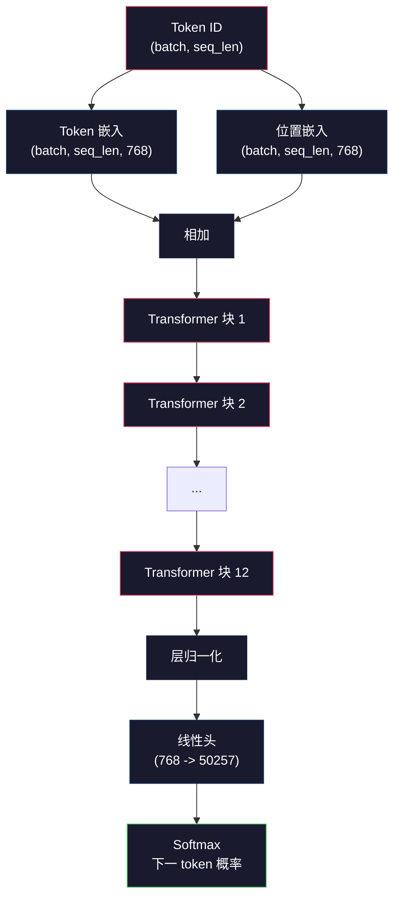

# 预训练迷你 GPT（1.24 亿参数）

> GPT-2 Small 拥有 1.24 亿参数。即 12 个 transformer 层、12 个注意力头和 768 维嵌入。你可以在单个 GPU 上从头开始训练它，只需几个小时。大多数人从不这样做。他们使用预训练检查点。但如果你不自己训练一个，你并不真正理解你所构建产品的模型内部发生了什么。

**类型：** 构建
**语言：** Python（使用 numpy）
**前置要求：** 第 10 阶段，第 01-03 课（分词器、构建分词器、数据管道）
**时间：** 约 120 分钟

## 学习目标

- 从零实现完整的 GPT-2 架构（1.24 亿参数）：token 嵌入、位置嵌入、transformer 块和语言模型头
- 使用下一 token 预测和交叉熵损失在文本语料库上训练 GPT 模型
- 实现带温度采样和 top-k/top-p 过滤的自回归文本生成
- 监控训练损失曲线并验证模型学习连贯的语言模式

## 问题

你知道 transformer 是什么。你读过图表。你能背诵"注意力就是你所需要的一切"并在白板上画标有"多头注意力"的方框。

这些都没有意味着你理解当模型生成文本时发生了什么。

GPT-2 Small 中有 124,438,272 个参数（带权重绑定）。每一个都是由运行训练循环设置的：前向传播、计算损失、反向传播、更新权重。十二个 transformer 块。每块十二个注意力头。一个 768 维嵌入空间。一个 50,257 token 的词汇表。每次模型生成一个 token，所有 1.24 亿参数都参与一个单一的矩阵乘法链，该链接受一个 token ID 序列并产生下一 token 的概率分布。

如果你从未亲手构建过这个，你就是在使用一个黑盒子。你可以用 API。你可以微调。但当出了问题——当模型幻觉、当它重复自己、当它拒绝遵循指令——你对*为什么*没有心智模型。

本课从零构建 GPT-2 Small。不在 PyTorch 中。在 numpy 中。每个矩阵乘法都可见。每个梯度都由你的代码计算。你将精确看到 1.24 亿个数字如何串谋预测下一个词。

## 概念

### GPT 架构

GPT 是一个自回归语言模型。"自回归"意味着它一次生成一个 token，每个 token 以所有之前的 token 为条件。架构是 transformer 解码器块的堆叠。

以下是从 token ID 到下一 token 概率的完整计算图：

1. Token ID 进入。形状：(batch_size, seq_len)。
2. Token 嵌入查找。每个 ID 映射到一个 768 维向量。形状：(batch_size, seq_len, 768)。
3. 位置嵌入查找。每个位置（0, 1, 2, ...）映射到一个 768 维向量。相同形状。
4. 将 token 嵌入 + 位置嵌入相加。
5. 通过 12 个 transformer 块。
6. 最终层归一化。
7. 线性投影到词汇表大小。形状：(batch_size, seq_len, vocab_size)。
8. Softmax 得到概率。

这就是整个模型。没有卷积。没有循环。只是嵌入、注意力、前馈网络和层归一化堆叠 12 次。



### Transformer 块

12 个块中的每一个都遵循相同的模式。Pre-norm 架构（GPT-2 使用 pre-norm，而不是原始 transformer 的 post-norm）：

1. 层归一化
2. 多头自注意力
3. 残差连接（将输入加回来）
4. 层归一化
5. 前馈网络（MLP）
6. 残差连接（将输入加回来）

残差连接至关重要。没有它们，梯度在反向传播到达块 1 时就消失了。有了它们，梯度可以通过"跳跃"路径直接从损失流向任何层。这就是为什么你可以堆叠 12、32 甚至 96 个块（传闻 GPT-4 使用 120 个）。

### 注意力：核心机制

自注意力让每个 token 查看每个之前的 token 并决定对每个的关注程度。以下是数学。

对于每个 token 位置，从输入计算三个向量：
- **查询（Q）**："我在找什么？"
- **键（K）**："我包含什么？"
- **值（V）**："我携带什么信息？"

```
Q = input @ W_q    (768 -> 768)
K = input @ W_k    (768 -> 768)
V = input @ W_v    (768 -> 768)

attention_scores = Q @ K^T / sqrt(d_k)
attention_scores = mask(attention_scores)   # 因果掩码：对未来位置填 -inf
attention_weights = softmax(attention_scores)
output = attention_weights @ V
```

因果掩码是使 GPT 自回归的原因。位置 5 可以关注位置 0-5，但不能关注 6、7、8 等。这防止模型在训练期间通过查看未来 token "作弊"。

**多头注意力**将 768 维空间分为 12 个头，每个 64 维。每个头学习不同的注意力模式。一个头可能跟踪句法关系（主谓一致）。另一个可能跟踪语义相似性（同义词）。另一个可能跟踪位置邻近性（附近的词）。所有 12 个头的输出被拼接并投影回 768 维。

除以 sqrt(d_k)——sqrt(64) = 8——是缩放。没有它，高维向量的点积会变得很大，将 softmax 推向梯度接近零的区域。这是原始"Attention Is All You Need"论文中的关键洞见之一。

### KV 缓存：为什么推理很快

训练期间，你一次处理整个序列。推理期间，你一次生成一个 token。没有优化，生成 token N 需要重新计算所有 N-1 个之前 token 的注意力。每个生成 token 的 O(N^2)，对于长度为 N 的序列总计 O(N^3)。

KV 缓存解决了这个问题。在为每个 token 计算 K 和 V 后，存储它们。生成 token N+1 时，你只需要计算新 token 的 Q，查找所有之前 token 的缓存 K 和 V。这将 K 和 V 计算的每 token 成本从 O(N) 降低到 O(1)。注意力分数计算仍然是 O(N)，因为你关注所有之前的位置，但避免了输入上的冗余矩阵乘法。

### 训练 vs 推理

训练和推理使用相同的计算图，但有两个关键区别：

**训练：教师强制。** 你给模型真实的前缀并让它预测下一 token。所有位置并行处理。你计算所有位置的损失并对它们平均。批次处理整个序列。

**推理：自回归解码。** 你从一个提示开始。模型预测一个 token。你将其附加到序列。用新序列再次预测。逐个 token 直到 [EOS] 或达到最大长度。不能并行化跨 token 位置。

### 生成策略

原始 argmax（贪心解码）是确定性的，但产生重复的、无聊的文本。三个标准修复：

**温度。** 在 softmax 之前除以温度 T 缩放 logits。T < 1 使模型更自信；T > 1 使其更随机。T = 0.7 是 GPT 的典型默认值。

**Top-k 采样。** 只从 k = 50 个最可能 token 中采样；将其余设为 0。防止模型从低概率垃圾中选择。

**Top-p（核）采样。** 从累积概率为 p = 0.9 的最小 token 集中采样。比 top-k 更具动态性——对于尖锐分布允许少量 token，对于平坦分布允许多个。

## 构建

`code/main.py` 实现了从零开始的 GPT-2 Small（1.24 亿参数）全部在 numpy 中。前向传播、反向传播、Adam 优化器、KV 缓存——全部显式。

## 交付

保存为 `outputs/prompt-gpt-architecture-analyzer.md`。

## 练习

1. **简单。** 训练模型在小型文本语料库（例如 tinyshakespeare）上做 50 步。验证损失下降并检查生成的 token 是否开始形成词。
2. **中等。** 比较温度采样（T = 0.5, 0.7, 1.0）生成的文本。哪个产生最具连贯性的文本？在线评估困惑度。
3. **困难。** 分析每个注意力头的注意力模式。在生成期间可视化位置 0-5 的注意力权重。是否有头学习按位置注意？按语义？

## 关键术语

| 术语 | 含义 |
|------|------|
| 自回归 | 一次生成一个 token，以所有之前的为条件。 |
| 因果掩码 | 将未来位置的注意力分数设为 -inf。 |
| KV 缓存 | 存储 K 和 V 以避免推理期间的冗余计算。 |
| 教师强制 | 训练：在所有位置并行输入真实 token。 |
| 温度 | 缩放 logits 以控制随机性；T < 1 = 更确定。 |
| top-p（核） | 从最小集合采样以达到累积概率 p。 |
| Pre-norm | 在注意力和 FFN 之前应用的层归一化（GPT-2）。 |

## 扩展阅读

- [Radford et al. (2019). Language Models are Unsupervised Multitask Learners](https://cdn.openai.com/better-language-models/language_models_are_unsupervised_multitask_learners.pdf)——GPT-2 论文。
- [Vaswani et al. (2017). Attention Is All You Need](https://arxiv.org/abs/1706.03762)——原始 transformer 论文。
- [Karpathy. nanoGPT](https://github.com/karpathy/nanoGPT)——简洁的 GPT-2 实现，约 300 行 Python。
- 本目录中的 `code/main.py`——在 numpy 中从零完整实现 GPT-2 Small。