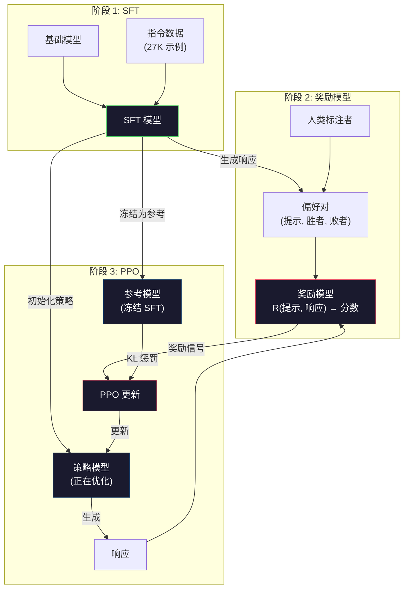

# RLHF：奖励模型 + PPO

> SFT 教会模型遵循指令。但它不教模型哪个响应*更好*。两个语法正确、事实准确的回答在有用性上可能天差地别。RLHF 是你将人类判断编码到模型行为中的方式。它使 Claude 有帮助且使 GPT 有礼貌。

**类型：** 构建
**语言：** Python（使用 numpy）
**前置要求：** 第 10 阶段，第 06 课（指令微调 / SFT）
**时间：** 约 90 分钟

## 学习目标

- 构建一个奖励模型，从人类偏好对（选定 vs 拒绝）中对响应质量评分
- 实现 PPO 训练循环，优化语言模型策略以对抗奖励模型并使用 KL 惩罚
- 解释为什么 RLHF 需要三个模型（SFT、奖励、策略）以及 KL 约束如何防止奖励破解
- 通过比较偏好优化前后的响应质量来评估 RLHF 的效果

## 问题

问一个模型"解释量子计算"，它可能产生：

**响应 A：** "量子计算使用可以存在于叠加态的量子比特，意味着它们可以同时为 0、1 或两者。这使量子计算机能够以指数级快于经典计算机的速度处理某些计算。关键算法包括用于分解大数的 Shor 算法和用于搜索未排序数据库的 Grover 算法。"

**响应 B：** "量子计算是一种使用量子力学现象的计算。它首次于 20 世纪 80 年代被提出。Richard Feynman 建议量子计算机可以模拟量子系统。自那时以来该领域显著增长。许多公司现在正在研究量子计算机。IBM、Google 等取得了进展。Google 于 2019 年声称量子霸权。"

两个响应都是事实准确的。语法都正确。都遵循了指令。但响应 A 显然更好。它更简洁、信息更丰富、结构更好。人类每次都会选 A。

SFT 无法捕捉这种区别。它在"正确"响应上训练模型，但没有机制说"这个响应比那个更好"。它将每个训练示例视为同样好。如果 A 和 B 都出现在 SFT 数据集中，模型会同等学习两者。

RLHF 解决了这个问题。它训练一个奖励模型来预测人类会偏好哪个响应，然后使用该奖励信号推动语言模型产生更高质量的输出。InstructGPT（ChatGPT 的前身）使用 RLHF 大幅提升了 GPT-3 的有用性、真实性和无害性。OpenAI 的内部评估者在 85% 的情况下偏好 InstructGPT 输出而非 GPT-3 输出，尽管 InstructGPT 小了 135 倍（13 亿 vs 1750 亿参数）。

## 概念

### 三个阶段

RLHF 不是一次单独的训练运行。它是一个三阶段顺序管道，每个阶段建立在前一个之上。

**阶段 1：SFT。** 在指令-响应对上训练基础模型（第 06 课）。这给你一个可以遵循指令但不知道哪些响应更好的模型。

**阶段 2：奖励模型。** 收集人类偏好数据：向标注者展示同一提示的两个响应，问"哪个更好？" 训练模型来预测这些偏好。奖励模型接受（提示，响应）作为输入，输出一个标量分数。

**阶段 3：PPO。** 使用奖励模型为语言模型生成训练信号。语言模型生成响应，奖励模型对它们评分，PPO 更新语言模型以产生更高评分的响应。KL 散度惩罚防止语言模型偏离 SFT 检查点太远。



### 奖励模型

奖励模型是一个被重新用作评分器的语言模型。取 SFT 模型，将语言建模头（输出词汇表上的分布）替换为标量头（输出单个数字）。到最后一层之前的架构是相同的。

输入：提示与响应拼接。输出：单个标量奖励分数。

训练数据是人类偏好对。对于每个提示，标注者看到两个响应并选择更好的那个。这创建训练三元组：（提示，偏好响应，被拒绝响应）。

损失函数使用成对偏好的 Bradley-Terry 模型：

```
loss = -log(sigmoid(reward(preferred) - reward(rejected)))
```

这是关键方程。`sigmoid(reward(A) - reward(B))` 给出响应 A 比响应 B 更受偏好的概率。损失推动奖励模型给偏好响应分配更高的分数。

为什么成对比较而不是绝对分数？因为人类在分配绝对质量分数方面非常糟糕（"这个响应是 7.5 分还是 8.3 分（满分 10）？"）但在相对比较方面非常好（"A 比 B 好吗？"）。Bradley-Terry 模型将相对比较转换为一致的绝对评分系统。

**InstructGPT 数字：** OpenAI 从 40 个承包商收集了 33,000 个比较对。每次比较大约需要 5 分钟。这就是 2,750 小时的人力劳动用于奖励模型训练数据。

### PPO：近端策略优化

PPO 是一种强化学习算法。在 RLHF 中，"环境"是奖励模型，"智能体"是语言模型，"动作"是生成 token。

目标函数：

```
最大化：E[R(prompt, response)] - beta * KL(policy || reference)
```

组成部分：

- **R(prompt, response)：** 奖励模型得分。想让它高。
- **KL(policy || reference)：** 当前策略与参考（冻结的 SFT）模型之间的 KL 散度。阻止模型偏离太远并产生无意义文本以愚弄奖励模型。
- **beta：** KL 惩罚系数。更高 beta = 更少偏离参考。典型值：0.01 到 0.1。

PPO 使用重要性采样比率 `r(theta) = pi(new_action) / pi(old_action)` 来使用同一批次数据结合多次更新。裁剪防止更新太大：

```
L_PPO = min(r(theta) * A, clip(r(theta), 1-eps, 1+eps) * A)
```

其中 eps 通常为 0.2，A 是第 09 阶段中描述的 GAE 估计的优势函数。

### KL 惩罚：看不见的主力

KL 惩罚阻止奖励破解。当模型发现产生高奖励分数但与有用对话完全不相关文本的技巧时，奖励破解发生。奖励模型是一个不完美的代理——它有盲点。没有 KL 惩罚，PPO 优化器会无情地利用这些盲点。

例证：一个在人类偏好上训练的奖励模型可能学到人类偏好更长、更自信的响应。PPO（没有 KL 惩罚）发现输出"THE CAPITAL OF FRANCE IS PARIS!!!!!"在奖励模型中比"Paris"得分更高。KL 惩罚阻止模型偏离其 SFT 起点太远——保持其安全和连贯。

### 为什么奖励模型必须与策略不同

你不能使用与优化中相同的模型来计算奖励。奖励模型必须与策略模型分开。如果你使用相同的网络，它奖励自己的输出，错误被放大而不是修正。InstructGPT 对奖励模型使用 60 亿参数模型，尽管主要目标策略是 13 亿参数。

另外：奖励模型看到完整响应（即其输入包含助手 token），但它在推理时不需要生成——它只需要评分。这允许奖励模型架构更简单（尽管通常它仍然是一个完整语言模型，最后一层替换为回归头）。

## 构建

`code/main.py` 使用玩具模型和偏好对实现了一个简化的 RLHF 管道：训练奖励模型，实现 PPO 循环，并测量训练前后的响应质量。

## 交付

保存为 `outputs/prompt-reward-model-designer.md`。

## 练习

1. **简单。** 为 5 个提示创建 10 个人工标注的偏好对。训练玩具奖励模型并验证首选响应得分一致更高。
2. **中等。** 比较不同 beta 值（0.01、0.05、0.1、0.5）下带 KL 惩罚的 PPO。哪个 beta 在保持连贯性的同时产生最好的奖励改进？
3. **困难。** 解释奖励模型和数据的大小的缩放属性：RLHF 中需要多少偏好对才能可靠改进 7B 模型？奖励模型参数量如何影响 PPO 稳定性？

## 关键术语

| 术语 | 含义 |
|------|------|
| RLHF | 从人类反馈中强化学习：使用人类偏好训练奖励模型，然后使用 RL 优化策略。 |
| 奖励模型 | 接受（提示，响应）并输出标量质量得分的模型。 |
| Bradley-Terry | 成对偏好的概率模型：P(A > B) = sigmoid(r_A - r_B)。 |
| PPO | 近端策略优化：使用裁剪重要性比率的稳定策略梯度算法。 |
| KL 惩罚 | 阻止策略偏离参考模型太远的约束。 |
| 奖励破解 | 策略利用奖励模型弱点产生高分但无意义输出的情况。 |
| GAE | 广义优势估计：偏差-方差平衡的优势计算方法。 |

## 扩展阅读

- [Ouyang et al. (2022). Training language models to follow instructions with human feedback](https://arxiv.org/abs/2203.02155)——InstructGPT，原始 RLHF 论文。
- [Stiennon et al. (2020). Learning to summarize with human feedback](https://arxiv.org/abs/2009.01325)——在 RLHF 之前将偏好学习应用于摘要。
- [Schulman et al. (2017). Proximal Policy Optimization Algorithms](https://arxiv.org/abs/1707.06347)——PPO 算法论文。