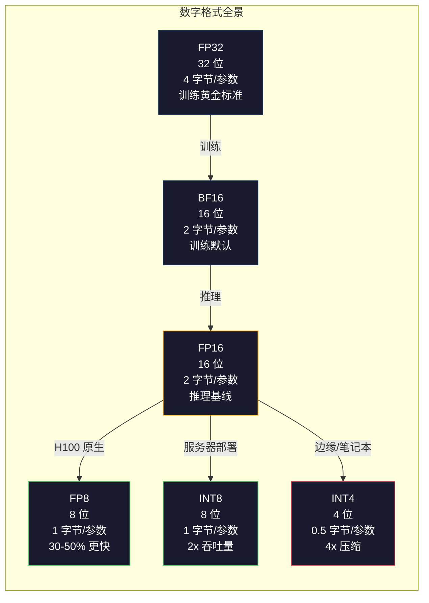

# 量化：让模型变小

> 一个 70B 模型在 FP16 中需要 140GB。仅权重就需要两个 A100。量化到 FP8：一个 80GB GPU。INT4：一台 MacBook。

**类型：** 构建
**语言：** Python（使用 numpy）
**前置要求：** 第 10 阶段，第 01-10 课（从零开始的 LLM）
**时间：** 约 120 分钟

## 学习目标

- 实现从 FP16 到 INT8 和 INT4 的对称和非对称量化，包括逐张量和逐通道缩放
- 计算量化的内存节省并确定哪种精度适合给定 GPU 的显存
- 解释训练后量化（PTQ）和量化感知训练（QAT）之间的区别
- 应用 GPTQ 或 AWQ 量化真实模型并在基准上测量准确度-内存权衡

## 问题

Llama 3 70B 有 700 亿参数。每个参数是一个 16 位浮点数。那是 1400 亿字节。140GB。单个 A100 有 80GB 显存。你甚至无法加载权重，更不用说在单个 GPU 上运行推理了。你需要两个 A100，每个每小时 $2，仅仅为了服务一个模型。

但每参数 16 位是浪费的。神经网络中的大多数权重聚集在零附近。FP16 的全动态范围（从 0.000000059 到 65,504）几乎完全没有被使用。如果你测量 Llama 3 70B 中权重的实际分布，95% 落在 -0.1 到 +0.1 之间。你正在浪费 16 位来表示本可以用 4 位表示的值。

量化用低精度数字替换高精度数字。FP16 到 FP8 将内存减半。FP16 到 INT4 将其削减到四分之一。那个 140GB 模型变成 35GB。它装进单个消费级 GPU。推到 2 位量化（激进、有损，但对某些任务可用），同样的模型在 16GB 笔记本上运行。

代价是准确度。你移除的每个位都会破坏信息。问题是你丢失了多少准确度以及在哪里。一个良好量化的 INT4 模型在大多数基准上保留原始质量的 95-99%。一个天真的 INT4 量化可以完全破坏模型。区别在于技术。

社区使用 GPTQ 将 Llama 3 量化到 INT4，在 WikiText 上显示大约丢失 1-2 个困惑度点。Mistral 发布了 Mixtral 8x22B 的 FP8 检查点，在 MMLU 上可测量的质量损失为零。GGUF 格式驱动 llama.cpp，在带 M 系列芯片的 MacBook 上运行 70B 模型。量化不是技巧。它是每个大于 7B 模型的标准部署路径。

## 概念

### 数字格式：每个位的职责

每个浮点数有三个部分：符号、指数和尾数。符号是一位。指数决定范围（数字能多大或多小）。尾数决定精度（你能得到多少小数位）。

```
FP32:  [1 符号] [8 指数] [23 尾数]  = 32 位
FP16:  [1 符号] [5 指数] [10 尾数]  = 16 位
BF16:  [1 符号] [8 指数] [7  尾数]  = 16 位
FP8:   [1 符号] [4 指数] [3  尾数]  = 8  位 (E4M3)
FP8:   [1 符号] [5 指数] [2  尾数]  = 8  位 (E5M2)
INT8:  [1 符号] [7 数值]             = 8  位 (均匀步长)
INT4:  [1 符号] [3 数值]             = 4  位 (总共 16 个级别)
```

**FP32** 是全精度。23 位尾数给你约 7 位十进制精度。范围：大约 1.2 x 10^-38 到 3.4 x 10^38。训练曾经完全在 FP32 中进行。对于累加（矩阵乘法期间的运行求和）仍然如此。

**FP16** 将位数减半。10 位尾数给出约 3.3 位十进制数字。指数缩小到 5 位，大幅减少范围（最大值约 65,504）。这对于权重（聚集在零附近）是可以的，但对于训练期间可能尖峰的激活和梯度是危险的。FP16 训练需要损失缩放以防止下溢。

**BF16**（Brain Float 16）保留 FP32 的 8 位指数但将尾数缩小到 7 位。与 FP32 相同的范围，比 FP16 更低的精度。Google 专门为深度学习设计它。直觉：范围对神经网络比精度更重要。在 FP16 中下溢为零的 10^-20 梯度在 BF16 中幸存。在 BF16 中四舍五入到 0.0734 的权重 0.07342 足够接近。每个现代训练运行使用 BF16 或 BF16/FP32 混合。

**FP8** 有两种口味。E4M3（4 指数，3 尾数）用于推理期间的权重和激活。E5M2（5 指数，2 尾数）用于训练期间的梯度，其中范围比精度更重要。在 H100 GPU 上的 FP8 推理比 FP16 实现 30-50% 加速，质量损失可忽略。

**INT8** 是整数格式。没有指数，没有尾数。只有从 -128 到 127 的 256 个均匀间隔的值。你需要一个缩放因子将浮点权重映射到这个范围。优势：整数算术比浮点更快且更省电。A100 上的 INT8 矩阵乘法以 624 TOPS 运行，而 FP16 为 312 TFLOPS。

**INT4** 更进一步。只有 16 个可能的值。缩放因子承担重任。质量完全取决于如何选择缩放以及量化哪些权重。最先进的 INT4 方法（GPTQ、AWQ）保留原始模型质量的 95% 以上。



### 量化如何工作

核心操作很简单。取一个浮点值张量，找到缩放因子，乘以，四舍五入到最近整数，存储整数加缩放因子。

**量化：**
```
scale = max(abs(tensor)) / max_int_value
quantized = round(tensor / scale)
```

**反量化：**
```
reconstructed = quantized * scale
```

对于具有对称范围的 INT8（-127 到 127）：
```
scale = max(abs(tensor)) / 127
```

### 对称 vs 非对称

对称量化以零为中心。范围是 [-max_val, +max_val]。简单，但浪费了一半的范围如果权重不均匀分布在零左右。

非对称量化使用 [min_val, max_val] 作为范围，带有零点偏移。对于像激活这样的偏斜分布（例如 ReLU 输出为零或正），非对称量化使用所有 256 个 INT8 级别，而对称只使用 127 个。代价：反量化时需要额外减法（x = (q - zero_point) * scale）。

### 逐通道 vs 逐张量

逐张量量化对整个张量使用一个缩放因子。简单，快速。但如果不同通道有不同的权重尺度（在 LLM 中它们确实如此），一个缩放因子不能很好地适应所有通道。

逐通道量化使用每个通道一个缩放因子（通常是权重矩阵的每行或每列）。更好的准确度，但反量化更昂贵（每个通道乘以不同尺度）。

### GPTQ：训练后量化

GPTQ（Frantar et al.，2022）是 LLM 最广泛使用的 PTQ。核心思想：不是一次性量化所有权重，而是逐列量化，通过其余列更新补偿每列中引入的量化误差。这本质上是重新分配量化误差以避免破坏最敏感的权重。

过程卡在 4 个小时内，在单个 A100 上将 70B 模型量化到 INT4。质量损失：通常 1-2 个困惑度点。

### AWQ：激活感知量化

AWQ（Lin et al.，2023）观察到并非所有权重同等重要——与最大激活幅度相乘的权重最重要。它找到一个每通道缩放因子，保护这些"显著"权重同时量化所有其他权重。比 GPTQ 快约 3 倍，且不需要反向传播。

### QAT：量化感知训练

PTQ 在训练后量化。QAT 模拟训练期间的量化效果，因此模型学会补偿精度损失。更准确，但需要重新训练整个模型（或至少做几个微调 epoch）。对于大于 7B 的模型很少做，因为重新训练的成本超过 PTQ 准确度差距的价值。

## 构建

`code/main.py` 从零实现了对称和非对称 INT8/INT4 量化，并测量量化误差。

## 交付

保存为 `outputs/skill-quantization.md`。

## 练习

1. **简单。** 量化玩具 2 层 MLP 到 INT8。测量前向传播输出中的均方误差（原始 vs 量化）。
2. **中等。** 比较同一模型上逐通道和逐张量 INT4 量化。哪个产生更低的 MSE？为什么？
3. **困难。** 假设 GPTQ 运行——测量在单个 GPU 上 70B 模型的实际量化延迟和内存开销——能否找到最佳阈值来权衡准确度与大小？

## 关键术语

| 术语 | 含义 |
|------|------|
| PTQ | 训练后量化：训练后量化，不重新训练。 |
| QAT | 量化感知训练：模拟量化进行训练。 |
| 缩放因子 | 将浮点值映射到整数范围的乘数。 |
| 零点 | 非对称量化中的偏移量。 |
| GPTQ | 基于列的贪心量化，带误差补偿。 |
| AWQ | 激活感知量化；保护显著权重。 |
| GGUF | llama.cpp 的文件格式；在 CPU 和 Mac GPU 上运行量化模型。 |

## 扩展阅读

- [Frantar et al. (2022). GPTQ: Accurate Post-Training Quantization for Generative Pre-trained Transformers](https://arxiv.org/abs/2210.17323)
- [Lin et al. (2023). AWQ: Activation-aware Weight Quantization for LLM Compression and Acceleration](https://arxiv.org/abs/2306.00978)
- [Dettmers et al. (2023). QLoRA: Efficient Finetuning of Quantized LLMs](https://arxiv.org/abs/2305.14314)——量化 + LoRA 微调。