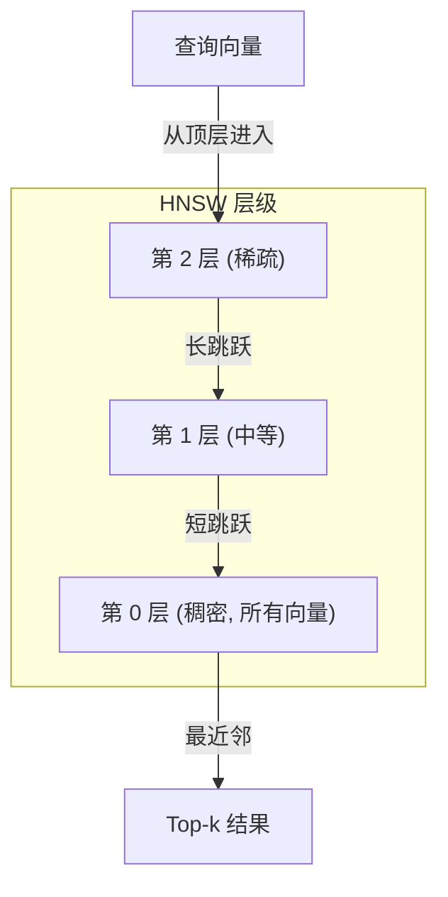

# 嵌入与向量表示

> 文本是离散的，数学是连续的。每次你让 LLM 查找「相似」文档、比较含义或超越关键词搜索，你都在依赖这两个世界之间的桥梁。那座桥梁就是嵌入（Embedding）。不理解嵌入，你就不理解现代 AI——你只是在使用它。

**类型：** 构建
**语言：** Python
**先修要求：** Phase 11，Lesson 01（提示词工程）
**时间：** 约 75 分钟
**相关：** Phase 5 · 22（嵌入模型深度解析）涵盖稠密 vs 稀疏 vs 多向量、Matryoshka 截断和按维度选择模型。本课聚焦于生产管道（向量数据库、HNSW、相似度数学）。在选择模型之前请阅读 Phase 5 · 22。

## 学习目标

- 使用 API 提供商和开源模型生成文本嵌入，并计算它们之间的余弦相似度
- 解释为什么嵌入解决了关键词搜索无法处理的词汇不匹配问题
- 构建一个语义搜索索引，通过含义而非精确关键词匹配来检索文档
- 使用检索基准（precision@k、recall）评估嵌入质量，并为你的任务选择合适的嵌入模型

## 问题

你有 10,000 张支持工单。一位客户写道「my payment didn't go through」。你需要找到相似的过往工单。关键词搜索找到了包含「payment」和「didn't go through」的工单，但错过了「transaction failed」「charge was declined」和「billing error」。这些工单用完全不同的词汇描述了完全相同的问题。

这就是词汇不匹配问题（Vocabulary Mismatch Problem）。人类语言有几十种表达同一件事的方式。关键词搜索将每个词视为没有含义的独立符号。它无法知道「declined」和「didn't go through」指向同一个概念。

你需要一种文本的表示形式，其中含义而非拼写决定相似性。你需要一种方法将「my payment didn't go through」和「transaction was declined」在某个数学空间中靠得很近，同时将「my payment arrived on time」推远——尽管它们共享「payment」这个词。

这种表示形式就是嵌入。

## 概念

### 什么是嵌入？

嵌入是一个表示文本含义的稠密浮点数向量。**稠密（dense）** 这个词很关键——每个维度都携带信息，不像稀疏表示（词袋 Bag-of-Words、TF-IDF），其中大多数维度为零。

「The cat sat on the mat」变成类似 `[0.023, -0.041, 0.087, ..., 0.012]`——一个 768 到 3072 个数字的列表，取决于模型。这些数字编码了含义。你从不直接审视它们，而是比较它们。

### Word2Vec 的突破

2013 年，Tomas Mikolov 和 Google 的同事发表了 Word2Vec。核心洞见：训练一个神经网络从邻近词预测一个词（或从词预测邻近词），隐藏层的权重会变成有意义的向量表示。

那个著名的结果：

```
king - man + woman = queen
```

词嵌入上的向量算术捕捉了语义关系。从「man」到「woman」的方向大致与从「king」到「queen」的方向相同。这是这一领域认识到几何可以编码含义的时刻。

Word2Vec 产生 300 维向量。每个词得到一个向量，无论上下文如何。在「river bank」和「bank account」中的「bank」有相同的嵌入。这一限制推动了接下来十年的研究。

### 从词到句子

词嵌入表示单个 token。生产系统需要嵌入整个句子、段落或文档。出现了四种方法：

**平均池化（Averaging）**：取句子中所有词向量的均值。廉价、有损、对短文本出奇地体面。完全丢失词序——「dog bites man」和「man bites dog」得到相同的嵌入。

**CLS token**：Transformer 模型（BERT，2018）输出一个特殊的 [CLS] token 嵌入，代表整个输入。比平均池化好，但 [CLS] token 是为下句预测训练的，不是为相似度训练的。

**对比学习（Contrastive learning）**：显式训练模型将相似对拉近、不相似对推远。Sentence-BERT（Reimers & Gurevych，2019）使用这种方法，成为现代嵌入模型的基础。给定「How do I reset my password?」和「I need to change my password」，模型学会它们应该具有几乎相同的向量。

**指令调优嵌入（Instruction-tuned embeddings）**：最新方法。E5 和 GTE 等模型接受一个任务前缀（「search_query:」「search_document:」），告诉模型要生成什么类型的嵌入。这让一个模型能服务多个任务。

```mermaid
graph LR
    subgraph "2013: Word2Vec"
        W1["king"] --> V1["[0.2, -0.1, ...]"]
        W2["queen"] --> V2["[0.3, -0.2, ...]"]
    end

    subgraph "2019: Sentence-BERT"
        S1["How do I reset my password?"] --> E1["[0.04, 0.12, ...]"]
        S2["I need to change my password"] --> E2["[0.05, 0.11, ...]"]
    end

    subgraph "2024: 指令调优"}
        I1["search_query: password reset"] --> T1["[0.08, 0.09, ...]"]
        I2["search_document: To reset your password, click..."] --> T2["[0.07, 0.10, ...]"]
    end
```

### 现代嵌入模型

市场已经收敛到少数几个生产级选项（MTEB 评分截至 2026 年初，MTEB v2）：

| 模型 | 提供商 | 维度 | MTEB | 上下文 | 每 1M tokens 成本 |
|-------|----------|-----------|------|---------|------------------|
| Gemini Embedding 2 | Google | 3072 (Matryoshka) | 67.7 (检索) | 8192 | $0.15 |
| embed-v4 | Cohere | 1024 (Matryoshka) | 65.2 | 128K | $0.12 |
| voyage-4 | Voyage AI | 1024/2048 (Matryoshka) | 66.8 | 32K | $0.12 |
| text-embedding-3-large | OpenAI | 3072 (Matryoshka) | 64.6 | 8192 | $0.13 |
| text-embedding-3-small | OpenAI | 1536 (Matryoshka) | 62.3 | 8192 | $0.02 |
| BGE-M3 | BAAI | 1024 (dense+sparse+ColBERT) | 63.0 多语言 | 8192 | 开源 |
| Qwen3-Embedding | 阿里 | 4096 (Matryoshka) | 66.9 | 32K | 开源 |
| Nomic-embed-v2 | Nomic | 768 (Matryoshka) | 63.1 | 8192 | 开源 |

MTEB（Massive Text Embedding Benchmark）v2 涵盖 100+ 个任务，包括检索、分类、聚类、重排序和摘要。分数越高越好。到 2026 年，开源模型（Qwen3-Embedding、BGE-M3）在大多数维度上匹敌或击败闭源托管模型。Gemini Embedding 2 在纯检索方面领先；Voyage/Cohere 在特定领域（金融、法律、代码）领先。始终在你自己的查询上进行基准测试再做决策。

### 相似度度量

给定两个嵌入向量，有三种方法衡量它们有多相似：

**余弦相似度（Cosine similarity）**：两个向量之间夹角的余弦。范围从 -1（相反）到 1（完全同向）。忽略大小——一个 10 词的句子和一个 500 词的文档如果指向同一方向可以得 1.0。这是 90% 用例的默认选择。

```
cosine_sim(a, b) = dot(a, b) / (||a|| * ||b||)
```

**点积（Dot product）**：两个向量的原始内积。当向量被归一化（单位长度）时与余弦相似度相同。计算更快。OpenAI 的嵌入是归一化的，所以点积和余弦给出相同的排序。

```
dot(a, b) = sum(a_i * b_i)
```

**欧氏距离（Euclidean / L2 distance）**：向量空间中的直线距离。越小 = 越相似。对大小差异敏感。当空间中的绝对位置而不仅仅是方向很重要时使用。

```
L2(a, b) = sqrt(sum((a_i - b_i)^2))
```

何时使用哪个：

| 度量 | 使用场景 | 避免场景 |
|--------|----------|------------|
| 余弦相似度 | 比较不同长度的文本；大多数检索任务 | 大小携带信息时 |
| 点积 | 嵌入已经归一化；追求最大速度 | 向量有不同大小时 |
| 欧氏距离 | 聚类；空间最近邻问题 | 比较长度差异巨大的文档时 |

### 向量数据库与 HNSW

暴力相似度搜索将查询与每个存储的向量进行比较。在 100 万向量、1536 维的情况下，每次查询需要 15 亿次乘加运算。太慢了。

向量数据库用近似最近邻（Approximate Nearest Neighbor，ANN）算法解决这个问题。主导算法是 HNSW（Hierarchical Navigable Small World，分层可导航小世界）：

1. 构建一个多层向量图
2. 顶层稀疏——远距离簇之间的长程连接
3. 底层稠密——邻近向量之间的细粒度连接
4. 搜索从顶层开始，贪婪地向下细化
5. 在 O(log n) 时间而非 O(n) 时间内返回近似的 top-k 结果

HNSW 以小幅精度损失（通常 95-99% 召回率）换取巨大的速度提升。在 1000 万向量上，暴力搜索需要数秒，HNSW 只需数毫秒。



生产选项：

| 数据库 | 类型 | 最适合 | 最大规模 |
|----------|------|----------|-----------|
| Pinecone | 托管 SaaS | 零运维生产 | 数十亿 |
| Weaviate | 开源 | 自托管、混合搜索 | 1 亿+ |
| Qdrant | 开源 | 高性能、过滤 | 1 亿+ |
| ChromaDB | 嵌入式 | 原型设计、本地开发 | 100 万 |
| pgvector | Postgres 扩展 | 已在用 Postgres | 1000 万 |
| FAISS | 库 | 进程内、研究 | 10 亿+ |

### 分块（Chunking）策略

文档太长，无法作为单个向量嵌入。一份 50 页的 PDF 涵盖几十个主题——它的嵌入变成了所有内容的平均值，与任何具体内容都不相似。你将文档分割成块，每个块分别嵌入。

**固定大小分块（Fixed-size chunking）**：每 N 个 token 分割，M token 重叠。简单且可预测。当文档没有清晰结构时效果好。512 token 块，50 token 重叠：块 1 是 token 0-511，块 2 是 token 462-973。

**基于句子的分块（Sentence-based chunking）**：在句子边界分割，将句子分组直到达到 token 限制。每个块至少包含一个完整句子。比固定大小更好，因为你永远不会把思路切一半。

**递归分块（Recursive chunking）**：先尝试在最大边界分割（章节标题）。如果仍然太大，尝试段落边界。然后是句子边界。然后是字符限制。这是 LangChain 的 `RecursiveCharacterTextSplitter`，对混合格式的语料库效果好。

**语义分块（Semantic chunking）**：嵌入每个句子，然后分组连续且嵌入相似的句子。当嵌入相似度低于阈值时，开始新的块。昂贵（需要对每个句子单独嵌入）但产生最连贯的块。

| 策略 | 复杂度 | 质量 | 最适合 |
|----------|-----------|---------|----------|
| 固定大小 | 低 | 尚可 | 非结构化文本、日志 |
| 基于句子 | 低 | 好 | 文章、邮件 |
| 递归 | 中 | 好 | Markdown、HTML、混合文档 |
| 语义 | 高 | 最好 | 对检索质量要求极高 |

大多数系统的最佳选择：256-512 token 块，50 token 重叠。

### 双编码器（Bi-Encoders）vs 交叉编码器（Cross-Encoders）

双编码器独立嵌入查询和文档，然后比较向量。快速——你嵌入一次查询，然后与预先计算的文档嵌入比较。这就是你用于检索的方式。

交叉编码器将查询和一个文档作为单一输入，输出一个相关性分数。慢——它需要通过完整模型处理每个查询-文档对。但准确得多，因为它可以同时关注查询和文档 token。

生产模式：双编码器检索 top-100 候选项，交叉编码器将其重排序到 top-10。这就是「检索-重排序」（Retrieve-then-Rerank）管道。


重排序模型：Cohere Rerank 3.5（每 1000 次查询 $2），BGE-reranker-v2（免费，开源），Jina Reranker v2（免费，开源）。

### Matryoshka 嵌入

传统嵌入是全有或全无的。一个 1536 维向量使用 1536 个浮点数。你不能在不对模型重新训练的情况下截断到 256 维。

Matryoshka 表示学习（Matryoshka Representation Learning，Kusupati 等，2022）解决了这个问题。模型被训练成前 N 维捕获最重要的信息，就像俄罗斯套娃一样。将一个 1536 维的 Matryoshka 嵌入截断到 256 维会损失一些精度，但仍然可用。

OpenAI 的 text-embedding-3-small 和 text-embedding-3-large 通过 `dimensions` 参数支持 Matryoshka 截断。请求 256 维而不是 1536 维，存储减少 6 倍，在 MTEB 基准上大约损失 3-5% 精度。

### 二值量化（Binary Quantization）

以 float32 存储的 1536 维嵌入使用 6,144 字节。乘以 1000 万份文档：光向量就要 61 GB。

二值量化将每个浮点数转换为单个比特：正值变成 1，负值变成 0。存储从 6,144 字节降到 192 字节——32 倍的减少。相似度使用汉明距离（Hamming distance，计数不同的比特位）计算，CPU 可以在单条指令中完成。

在检索召回率上精度损失大约 5-10%。常见模式：二值量化用于对数百万向量的第一轮搜索，然后用全精度向量对 top-1000 进行重新评分。这让你以 32 倍更少的内存获得 95%+ 的全精度准确率。

## 构建

我们从零构建一个语义搜索引擎。没有向量数据库，没有外部嵌入 API。纯 Python 配合 numpy 进行数学计算。

### 步骤 1：文本分块

```python
def chunk_text(text, chunk_size=200, overlap=50):
    words = text.split()
    chunks = []
    start = 0
    while start < len(words):
        end = start + chunk_size
        chunk = " ".join(words[start:end])
        chunks.append(chunk)
        start += chunk_size - overlap
    return chunks


def chunk_by_sentences(text, max_chunk_tokens=200):
    sentences = text.replace("\n", " ").split(".")
    sentences = [s.strip() + "." for s in sentences if s.strip()]
    chunks = []
    current_chunk = []
    current_length = 0
    for sentence in sentences:
        sentence_length = len(sentence.split())
        if current_length + sentence_length > max_chunk_tokens and current_chunk:
            chunks.append(" ".join(current_chunk))
            current_chunk = []
            current_length = 0
        current_chunk.append(sentence)
        current_length += sentence_length
    if current_chunk:
        chunks.append(" ".join(current_chunk))
    return chunks
```

### 步骤 2：从零构建嵌入

我们使用带有 L2 归一化的 TF-IDF 实现一个简单的稠密嵌入。这不是神经嵌入，但遵循相同的约定：文本输入，固定大小向量输出，相似文本产生相似向量。

```python
import math
import numpy as np
from collections import Counter

class SimpleEmbedder:
    def __init__(self):
        self.vocab = []
        self.idf = []
        self.word_to_idx = {}

    def fit(self, documents):
        vocab_set = set()
        for doc in documents:
            vocab_set.update(doc.lower().split())
        self.vocab = sorted(vocab_set)
        self.word_to_idx = {w: i for i, w in enumerate(self.vocab)}
        n = len(documents)
        self.idf = np.zeros(len(self.vocab))
        for i, word in enumerate(self.vocab):
            doc_count = sum(1 for doc in documents if word in doc.lower().split())
            self.idf[i] = math.log((n + 1) / (doc_count + 1)) + 1

    def embed(self, text):
        words = text.lower().split()
        count = Counter(words)
        total = len(words) if words else 1
        vec = np.zeros(len(self.vocab))
        for word, freq in count.items():
            if word in self.word_to_idx:
                tf = freq / total
                vec[self.word_to_idx[word]] = tf * self.idf[self.word_to_idx[word]]
        norm = np.linalg.norm(vec)
        if norm > 0:
            vec = vec / norm
        return vec
```

### 步骤 3：相似度函数

```python
def cosine_similarity(a, b):
    dot = np.dot(a, b)
    norm_a = np.linalg.norm(a)
    norm_b = np.linalg.norm(b)
    if norm_a == 0 or norm_b == 0:
        return 0.0
    return float(dot / (norm_a * norm_b))


def dot_product(a, b):
    return float(np.dot(a, b))


def euclidean_distance(a, b):
    return float(np.linalg.norm(a - b))
```

### 步骤 4：带暴力搜索的向量索引

```python
class VectorIndex:
    def __init__(self):
        self.vectors = []
        self.texts = []
        self.metadata = []

    def add(self, vector, text, meta=None):
        self.vectors.append(vector)
        self.texts.append(text)
        self.metadata.append(meta or {})

    def search(self, query_vector, top_k=5, metric="cosine"):
        scores = []
        for i, vec in enumerate(self.vectors):
            if metric == "cosine":
                score = cosine_similarity(query_vector, vec)
            elif metric == "dot":
                score = dot_product(query_vector, vec)
            elif metric == "euclidean":
                score = -euclidean_distance(query_vector, vec)
            else:
                raise ValueError(f"Unknown metric: {metric}")
            scores.append((i, score))
        scores.sort(key=lambda x: x[1], reverse=True)
        results = []
        for idx, score in scores[:top_k]:
            results.append({
                "text": self.texts[idx],
                "score": score,
                "metadata": self.metadata[idx],
                "index": idx
            })
        return results

    def size(self):
        return len(self.vectors)
```

### 步骤 5：语义搜索引擎

```python
class SemanticSearchEngine:
    def __init__(self, chunk_size=200, overlap=50):
        self.embedder = SimpleEmbedder()
        self.index = VectorIndex()
        self.chunk_size = chunk_size
        self.overlap = overlap

    def index_documents(self, documents, source_names=None):
        all_chunks = []
        all_sources = []
        for i, doc in enumerate(documents):
            chunks = chunk_text(doc, self.chunk_size, self.overlap)
            all_chunks.extend(chunks)
            name = source_names[i] if source_names else f"doc_{i}"
            all_sources.extend([name] * len(chunks))
        self.embedder.fit(all_chunks)
        for chunk, source in zip(all_chunks, all_sources):
            vec = self.embedder.embed(chunk)
            self.index.add(vec, chunk, {"source": source})
        return len(all_chunks)

    def search(self, query, top_k=5, metric="cosine"):
        query_vec = self.embedder.embed(query)
        return self.index.search(query_vec, top_k, metric)

    def search_with_scores(self, query, top_k=5):
        results = self.search(query, top_k)
        return [
            {
                "text": r["text"][:200],
                "source": r["metadata"].get("source", "unknown"),
                "score": round(r["score"], 4)
            }
            for r in results
        ]
```

### 步骤 6：比较相似度度量

```python
def compare_metrics(engine, query, top_k=3):
    results = {}
    for metric in ["cosine", "dot", "euclidean"]:
        hits = engine.search(query, top_k=top_k, metric=metric)
        results[metric] = [
            {"score": round(h["score"], 4), "preview": h["text"][:80]}
            for h in hits
        ]
    return results
```

## 使用

使用生产级嵌入 API，架构完全不变。只有嵌入器改变：

```python
from openai import OpenAI

client = OpenAI()

def openai_embed(texts, model="text-embedding-3-small", dimensions=None):
    kwargs = {"model": model, "input": texts}
    if dimensions:
        kwargs["dimensions"] = dimensions
    response = client.embeddings.create(**kwargs)
    return [item.embedding for item in response.data]
```

OpenAI 的 Matryoshka 截断——相同模型，更少维度，更低存储：

```python
full = openai_embed(["semantic search query"], dimensions=1536)
compact = openai_embed(["semantic search query"], dimensions=256)
```

256 维向量使用 6 倍更少的存储。对于 1000 万份文档，是 10 GB vs 61 GB。在标准基准上精度损失大约 3-5%。

使用 Cohere 重排序：

```python
# import cohere
# co = cohere.Client()
# results = co.rerank(
#     model="rerank-3.5",
#     query="How do I reset my password?",
#     documents=retrieved_docs,
#     top_n=5
# )
```

## 交付

本课产出两个制品：

`outputs/prompt-embedding-strategy.md`——一个决策框架，根据你的数据大小、质量要求和基础设施选择合适的分块策略、嵌入模型和相似度度量。

Code Capstone（代码综合项目）：`code/semantic_search.py` 中的 `SemanticSearchEngine`——一个完整的、从零实现的语义搜索引擎，包含 TF-IDF 嵌入、分块和可切换相似度度量。换入 OpenAI 的 `text-embedding-3-small` 或其他生产级嵌入模型，管道其余部分不变。

## 练习

1. 用 20 篇维基百科文章构建一个语义搜索引擎。索引它们，然后用「outer space exploration」「effects of climate change」和「ancient roman history」进行搜索。每类主题的信息检索是否相关？如果不相关，你的嵌入出了什么问题？

2. 比较分块策略。用固定大小（256 tokens）、基于句子和递归分块索引同一文档集。对 10 个查询，衡量每种策略的检索精度。哪种策略产生的块最连贯？

3. 实现二值量化。将你的嵌入向量转换为二进制表示，衡量存储减少和召回率影响。在什么规模下 32 倍内存节省能证明 5-10% 精度损失是合理的？

4. 构建一个检索-重排序管道。用双编码器（FastEmbed、OpenAI 或 Sentence Transformers）检索 top-100，然后用交叉编码器（如 BGE-reranker-v2）重排序到 top-10。衡量添加重排序步骤后召回率的提升。

5. 用 Matryoshka 截断实验。对相同的 100 个查询，以 256、512、768、1024 和 1536 维嵌入进行搜索，衡量每个维度的召回率。找到你特定数据集的精度/存储最优折中点。

## 关键术语

| 术语 | 人们怎么说 | 实际含义 |
|------|----------------|----------------------|
| Embedding | 「一个向量」 | 文本的稠密、固定维度的数值表示，其中语义相似文本产生相似向量 |
| Cosine similarity | 「向量有多接近」 | 两个向量之间夹角的余弦；忽略大小差异，是大多数检索任务的默认度量 |
| HNSW | 「快速搜索」 | 分层可导航小世界（Hierarchical Navigable Small World）——大多数向量数据库中的近似最近邻算法 |
| Chunking | 「分割文档」 | 在嵌入前将长文档分割成更小的重叠片段，使每个块关注一个特定主题 |
| Bi-encoder | 「独立嵌入」 | 分别嵌入查询和文档，然后比较向量；用于快速检索 |
| Cross-encoder | 「一起评分」 | 将查询-文档对作为单一输入处理，关注所有 token；用于准确重排序 |
| Matryoshka | 「嵌套截断」 | 训练嵌入使得截断向量仍能工作；用更少维度换更低存储，精度成本很小 |
| Binary quantization | 「比特翻转」 | 将浮点向量转换为二进制向量以进行 32 倍压缩；使用汉明距离而非点积 |
| Vocabulary mismatch | 「不同的词，相同的意思」 | 关键词搜索失败时的场景：「declined」和「not going through」不共享任何词 |
| Embedding model | 「那个生成向量的东西」 | 一个专门训练用于产生句子级语义表示的神经网络——与 LLM 不同，不是生成式的 |

## 扩展阅读

- Mikolov 等, "Efficient Estimation of Word Representations in Vector Space" (2013) -- 以 king-queen 类比开启了嵌入革命的 Word2Vec 论文
- Reimers & Gurevych, "Sentence-BERT: Sentence Embeddings using Siamese BERT-Networks" (2019) -- 如何训练双编码器用于句子级相似度，现代嵌入模型的基础
- Kusupati 等, "Matryoshka Representation Learning" (2022) -- 可变维度嵌入背后的技术，OpenAI 为 text-embedding-3 采纳
- Malkov & Yashunin, "Efficient and Robust Approximate Nearest Neighbor using Hierarchical Navigable Small World Graphs" (2018) -- HNSW 论文，大多数生产级向量搜索背后的算法
- OpenAI 嵌入指南 (platform.openai.com/docs/guides/embeddings) -- text-embedding-3 模型的实用参考，包括 Matryoshka 降维
- MTEB 排行榜 (huggingface.co/spaces/mteb/leaderboard) -- 跨任务和语言比较所有嵌入模型的实时基准
- [Muennighoff 等, "MTEB: Massive Text Embedding Benchmark" (EACL 2023)](https://arxiv.org/abs/2210.07316) -- 定义了排行榜报告的 8 个任务类别（分类、聚类、对分类、重排序、检索、STS、摘要、双语对齐）的基准；在信任任何单一 MTEB 分数之前阅读。
- [Sentence Transformers 文档](https://www.sbert.net/) -- 关于双编码器 vs 交叉编码器、池化策略以及本课实现的「摄入-分割-嵌入-存储」RAG 管道的规范参考。