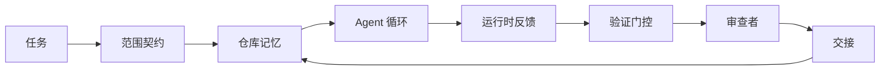

# 代理工作台工程：为什么有能力的模型仍然失败

> 一个有能力的模型不够。可靠的代理需要一个工作台（Workbench）：指令（Instructions）、状态（State）、范围（Scope）、反馈（Feedback）、验证（Verification）、审查（Review）和交接（Handoff）。剥离这些，即使是最前沿的模型产生的成果也不安全、不可交付。

**类型：** 学习 + 构建
**语言：** Python（标准库）
**前置条件：** Phase 14 · 01（Agent 循环），Phase 14 · 26（失败模式）
**时间：** ~45 分钟

## 学习目标

- 将模型能力与执行可靠性分开。
- 列举决定代理是否能交付的七个工作台表面。
- 在小仓库任务上比较纯提示运行与工作台引导运行。
- 产出一份失败模式报告，将每个遗漏的表面映射到其导致的症状。

## 问题

你将一个前沿模型放入真实仓库，要求它添加输入验证。它打开四个文件，编写了看起来合理的代码，声明成功，然后停止。你运行测试。两个失败。第三个被触碰的文件与验证毫无关系。没有记录说明代理假设了什么、它首先尝试了什么、还有什么没做完。

模型对 Python 的理解没有错。它对**工作**的理解错了。它不知道什么算完成、它可以在哪里写入、哪些测试是权威的、以及下一个会话该如何接续。

这不是模型 Bug。这是工作台 Bug。代理周围的环境缺少那些能将一次性生成转变为可靠、可恢复工程的组成部分。

## 概念

工作台是在任务期间包裹模型的运行环境。它有七个表面：

| 表面 | 它承载什么 | 缺失时的失败 |
|------|-----------|-------------|
| 指令（Instructions） | 启动规则、禁止操作、完成的定义 | 代理猜测"交付"意味着什么 |
| 状态（State） | 当前任务、触碰的文件、阻塞项、下一个操作 | 每个会话从零重新开始 |
| 范围（Scope） | 允许的文件、禁止的文件、验收标准 | 编辑泄漏到无关代码中 |
| 反馈（Feedback） | 捕获到循环中的真实命令输出 | 代理在 400 错误上声明成功 |
| 验证（Verification） | 测试、lint、冒烟测试、范围检查 | "看起来不错"进了 main 分支 |
| 审查（Review） | 以不同角色进行的第二遍检查 | 构建者批改自己的作业 |
| 交接（Handoff） | 什么变了、为什么、还剩什么 | 下一个会话重新发现一切 |

工作台独立于模型。你可以更换模型而保留这些表面。你不能更换表面而保持可靠性。



循环在状态文件上闭合，而不是在聊天历史上。聊天是易失的。仓库是记录系统（System of Record）。

### 工作台 vs 提示工程

提示告诉模型你本轮想要什么。工作台告诉模型如何跨轮次、跨会话完成工作。大多数代理失败故事是穿着提示工程外衣的工作台失败。

### 工作台 vs 框架

框架给你一个运行时（LangGraph、AutoGen、Agents SDK）。工作台给代理一个在该运行时内工作的场所。你两者都需要。这个迷你轨道是关于第二个的。

### 从原语出发推理，而非从供应商分类出发

现在有很多关于"工具链工程（Harness Engineering）"的文章。Addy Osmani、OpenAI、Anthropic、LangChain、Martin Fowler、MongoDB、HumanLayer、Augment Code、Thoughtworks、walkinglabs awesome list、以及 Medium 和 Hacker News 上的持续讨论都在讨论。他们对什么是工具链的边界、什么在范围内、使用什么词汇存在分歧。我们不需要选边。七个表面是 UX 层；在每个工作台之下是支撑任何可靠后端的同一组分布式系统原语。

暂时摘下代理标签。一次代理运行是跨越时间、进程和机器的计算。要使其可靠，你需要任何生产系统都需要的相同原语。

| 原语 | 是什么 | 对代理承载什么 |
|------|--------|---------------|
| 函数（Function） | 类型化处理器。尽可能纯函数。拥有其输入和输出。 | 工具调用、规则检查、验证步骤、模型调用 |
| 工作器（Worker） | 拥有一个或多个函数和生命周期的长生命周期进程 | 构建者、审查者、验证者、MCP 服务器 |
| 触发器（Trigger） | 调用函数的事件源 | 代理循环 tick、HTTP 请求、队列消息、cron、文件变更、钩子 |
| 运行时（Runtime） | 决定什么在哪里运行、带什么超时和资源的边界 | Claude Code 的进程、LangGraph 的运行时、工作器容器 |
| HTTP / RPC | 调用者和工作器之间的线路 | 工具调用协议、MCP 请求、模型 API |
| 队列（Queue） | 触发器和工作者之间的持久缓冲区；背压、重试、幂等性 | 任务看板、反馈日志、审查收件箱 |
| 会话持久化（Session Persistence） | 在崩溃、重启、模型切换后存活的状态 | `agent_state.json`、检查点、KV 存储、仓库本身 |
| 授权策略（Authorization Policy） | 谁可以用什么范围调用什么函数 | 允许/禁止的文件、审批边界、MCP 能力列表 |

现在将七个工作台表面映射到这些原语。

- **指令** — 策略 + 函数元数据。规则是检查（函数）。路由器（`AGENTS.md`）是附加到运行时启动的策略。
- **状态** — 会话持久化。运行时每步读取的带键存储。文件、KV 或 DB；持久化语义重要，存储后端不重要。
- **范围** — 每个任务的授权策略。允许/禁止的 glob 是 ACL。需要的审批是权限格。
- **反馈** — 写入队列的调用日志。每个 Shell 调用是一条记录，持久、可重放。
- **验证** — 一个函数。对输入确定性。在任务关闭时触发。失败时关闭。
- **审查** — 一个独立的工作器，对构建者产物有只读授权，对审查报告有只写授权。
- **交接** — 由会话结束触发器发出的持久记录。下一个会话的启动触发器读取它。

代理循环本身是一个工作器，消费事件（用户消息、工具结果、计时器 tick），调用函数（模型，然后是模型选择的工具），写入记录（状态、反馈），并发出触发器（验证、审查、交接）。没有神秘之处；和作业处理器的形状一样。

### 流传的模式，翻译为原语

每个流行的工具链模式都归结为八个原语。翻译表。

| 供应商或社区模式 | 实际是什么 |
|-------------------|-----------|
| Ralph Loop（Claude Code、Codex、agentic_harness 书）——当代理试图过早停止时将原始意图重新注入干净的上下文窗口 | 一个用干净上下文重新入队任务的触发器；会话持久化携带目标前进 |
| Plan / Execute / Verify（PEV） | 三个工作器，每个角色一个，通过状态和阶段间的队列通信 |
| 工具链-计算分离（OpenAI Agents SDK，2026 年 4 月）——将控制平面与执行平面分离 | 重新表述控制平面/数据平面。比代理标签早几十年 |
| Open Agent Passport（OAP，2026 年 3 月）——在执行前根据声明式策略签名并审计每个工具调用 | 由预操作工作器强制执行的授权策略，带签名审计队列 |
| Guides and Sensors（Birgitta Böckeler / Thoughtworks）——前馈规则 + 反馈可观测性 | 授权策略 + 验证函数 + 可观测性追踪 |
| Progressive compaction，5 阶段（Claude Code 逆向工程，2026 年 4 月） | 一个状态管理工作器，在会话持久化上定期运行类 cron 操作，使其保持在预算内 |
| Hooks / middleware（LangChain、Claude Code）——拦截模型和工具调用 | 包裹在运行时调用路径上的触发器 + 函数 |
| Skills as Markdown with progressive disclosure（Anthropic、Flue） | 函数注册表，其中函数元数据即时加载到上下文中 |
| Sandbox agents（Codex、Sandcastle、Vercel Sandbox） | 计算平面：带有隔离文件系统、网络和生命周期的运行时 |
| MCP 服务器 | 通过稳定的 RPC 暴露函数的工作器，带有作为授权的功能列表 |

该表中的每个条目都是代理社区到达一个在分布式系统中已有名称的原语并给它一个新名称。对市场营销有用的标签；对工程词汇不有用。

### 实际数据怎么说

工具链优于模型的主张现在有数据支持了。值得了解，因为它们也是对"等更聪明的模型就好"的唯一诚实的反驳。

- Terminal Bench 2.0 — 相同模型，工具链更改将一个编码代理从 30 名之外提升到第 5 名（LangChain，*Anatomy of an Agent Harness*）。
- Vercel — 删除了 80% 的代理工具；成功率从 80% 跃升至 100%（MongoDB）。
- Harvey — 法律代理仅通过工具链优化将准确率翻倍以上（MongoDB）。
- 88% 的企业 AI 代理项目未能进入生产。失败集中在运行时而非推理（preprints.org，*Harness Engineering for Language Agents*，2026 年 3 月）。
- 一项 2025 年对三个流行开源框架的基准测试研究报告了约 50% 的任务完成率；长上下文 WebAgent 在长上下文条件下从 40-50% 崩溃到 10% 以下，主要来自无限循环和目标丢失（在 2026 年初的文章中广泛覆盖）。

结论不是"工具链永远赢。"模型确实会随着时间吸收工具链技巧。结论是，今天承重的工程在模型周围，而非模型内部，承载这一负担的原语是每个生产系统一直需要的那些。

### 供应商文章在哪里停顿

这部分你不必客气。

- LangChain 的 *Anatomy of an Agent Harness* 列举了十一个组件——提示、工具、钩子、沙箱、编排、记忆、技能、子代理，以及一个运行时"哑循环"。它没有命名队列、作为部署单元的工作器、触发器语义、作为单独关注点的会话持久化或授权策略。它将工具链视为一个你可以配置的对象，而非一个你需要部署的系统。
- Addy Osmani 的 *Agent Harness Engineering* 提出了框架 `Agent = Model + Harness` 和棘轮模式（Ratchet Pattern），但停在了说明工具链由什么构建之前。它读起来像一个立场而非规范。
- Anthropic 和 OpenAI 在表面上走得最深，但停留在自己的运行时内。2026 年 4 月 Agents SDK 中的"工具链-计算分离"公告是第一个明确认可控制平面/数据平面分离的供应商文章。这是一个原语概念，不是新概念。
- agentic_harness 书将工具链视为配置对象（Jaymin West 的 *Agentic Engineering*，第 6 章），其中最有力的表述是"工具链是代理系统中的主要安全边界。"这只是授权策略的重新表述。
- Hacker News 的讨论线程也不断到达同一位置。2026 年 4 月的帖子 *The agent harness belongs outside the sandbox* 主张工具链应该是"更像一个位于一切之外的 Hypervisor，根据上下文和用户授权访问。"这再次是授权策略作为一个独立平面。

你不需要反对这些文章中的任何一篇来注意到空白。他们在为已经存在的系统写 UX 描述。我们在写系统。当系统构建正确时，七个表面从原语中自然流出。当构建错误时，再多的 `AGENTS.md` 打磨也修复不了缺失的队列。

所以当你在别处听到"工具链工程"时，翻译成原语。提示和规则是策略和函数。脚手架是运行时。护栏是授权 + 验证。钩子是触发器。记忆是会话持久化。Ralph Loop 是重新入队。子代理是工作器。沙箱是计算平面。词汇在变；工程不变。工作台是面向代理的 UX；工具链，在能在下一个供应商重新定义中存活的意义上，是正确连接在一起的函数、工作器、触发器、运行时、队列、持久化和策略。

## 构建

`code/main.py` 在小型仓库任务上运行两次。第一次仅使用提示，第二次接入七个表面。同样的模型，同样的任务。脚本统计失败运行时缺失了哪些表面，并打印失败模式报告。

仓库任务有意保持小规模：为单文件 FastAPI 风格处理器添加输入验证并编写通过测试。

运行方式：

```
python3 code/main.py
```

输出：两次运行的并排日志，总结纯提示运行的 `failure_modes.json`，以及工作台运行的一行裁决。

代理是一个小型的基于规则的桩；重点在于表面而非模型。在本迷你轨道的其余部分中，你将每个表面重建为真实的、可复用的产物。

## 使用场景

工作台表面在现实世界中已经存在于以下三个地方，即便没有人这样称呼它：

- **Claude Code、Codex、Cursor。** `AGENTS.md` 和 `CLAUDE.md` 是指令表面。斜杠命令是范围。钩子是验证。
- **LangGraph、OpenAI Agents SDK。** 检查点和会话存储是状态表面。交接是交接表面。
- **真实仓库上的 CI。** 测试、lint 和类型检查是验证。PR 模板是交接。CODEOWNERS 是审查。

工作台工程是使这些表面显式化且可复用的学科，而不是让每个团队重新发现它们。

## 部署

`outputs/skill-workbench-audit.md` 是一个可移植技能，用于审计现有仓库的七个工作台表面，并报告哪些缺失、哪些部分、哪些健康。将其放在任何代理设置旁边；它告诉你该先修复什么。

## 练习

1. 选一个你已经运行代理的仓库。从 0（缺失）到 2（健康）对七个表面打分。你最弱的表面是什么？
2. 扩展 `main.py`，使纯提示运行也产生虚假的"成功"声明。验证验证门控是否本应捕获它。
3. 为你的产品添加第八个表面。论证为什么它不能折叠到现有的七个之一。
4. 用一个幻觉化额外文件写入的不同桩代理重新运行脚本。哪个表面首先捕获它？
5. 将 Phase 14 · 26 中的五种行业重复失败模式映射到七个表面。每个表面设计来吸收哪种模式？

## 关键术语

| 术语 | 人们常说的 | 实际含义 |
|------|-----------|---------|
| 工作台（Workbench） | "设置" | 模型周围经过工程的表面，使工作可靠 |
| 表面（Surface） | "一个文档"或"一个脚本" | 代理每轮读取或写入的命名的、机器可读的输入 |
| 记录系统（System of Record） | "笔记" | 聊天历史消失时代理视为真相的文件 |
| 完成的定义（Definition of Done） | "验收" | 代理无法伪造的客观的、文件支持的检查清单 |
| 工作台审计（Workbench Audit） | "仓库就绪检查" | 对七个表面的检查，在工作开始前标记缺失的部分 |

## 进一步阅读

将这些作为数据点而非权威来阅读。每一篇都是一个不完整的分类。在决定是否采用之前将每个概念翻译回原语（函数、工作器、触发器、运行时、HTTP/RPC、队列、持久化、策略）。

供应商框架：

- [Addy Osmani，Agent Harness Engineering](https://addyosmani.com/blog/agent-harness-engineering/) — `Agent = Model + Harness` 和棘轮模式；基础设施方面薄弱
- [LangChain，The Anatomy of an Agent Harness](https://blog.langchain.com/the-anatomy-of-an-agent-harness/) — 十一个组件：提示、工具、钩子、编排、沙箱、记忆、技能、子代理、运行时；省略队列、部署、授权
- [OpenAI，Harness engineering: leveraging Codex in an agent-first world](https://openai.com/index/harness-engineering/) — Codex 团队对其运行时周围表面的看法
- [OpenAI，Unrolling the Codex agent loop](https://openai.com/index/unrolling-the-codex-agent-loop/) — 代理循环归结为函数调用上的 `while`
- [Anthropic，Effective harnesses for long-running agents](https://www.anthropic.com/engineering/effective-harnesses-for-long-running-agents) — 特定运行时内的长周期表面
- [Anthropic，Harness design for long-running application development](https://www.anthropic.com/engineering/harness-design-long-running-apps) — 应用设计笔记
- [LangChain Deep Agents harness capabilities](https://docs.langchain.com/oss/python/deepagents/harness) — 运行时配置表面

有可用细节的实践者文章：

- [Martin Fowler / Birgitta Böckeler，Harness engineering for coding agent users](https://martinfowler.com/articles/harness-engineering.html) — 指南（前馈）+ 传感器（反馈）；最干净的控制论框架
- [HumanLayer，Skill Issue: Harness Engineering for Coding Agents](https://www.humanlayer.dev/blog/skill-issue-harness-engineering-for-coding-agents) — "这不是模型问题，是配置问题"
- [MongoDB，The Agent Harness: Why the LLM Is the Smallest Part of Your Agent System](https://www.mongodb.com/company/blog/technical/agent-harness-why-llm-is-smallest-part-of-your-agent-system) — 数据：Vercel 80% 到 100%，Harvey 2 倍准确率，Terminal Bench 从前 30 到前 5
- [Augment Code，Harness Engineering for AI Coding Agents](https://www.augmentcode.com/guides/harness-engineering-ai-coding-agents) — 约束优先的讲解
- [Sequoia podcast，Harrison Chase on Context Engineering Long-Horizon Agents](https://sequoiacap.com/podcast/context-engineering-our-way-to-long-horizon-agents-langchains-harrison-chase/) — 运行时关注胜过模型关注

书籍、论文和参考实现：

- [Jaymin West，Agentic Engineering — 第 6 章：Harnesses](https://www.jayminwest.com/agentic-engineering-book/6-harnesses) — 完整书籍级别的处理，将工具链视为主要安全边界
- [preprints.org，Harness Engineering for Language Agents（2026 年 3 月）](https://www.preprints.org/manuscript/202603.1756) — 控制/代理/运行时的学术框架
- [walkinglabs/awesome-harness-engineering](https://github.com/walkinglabs/awesome-harness-engineering) — 跨上下文、评估、可观测性、编排的精选阅读列表
- [ai-boost/awesome-harness-engineering](https://github.com/ai-boost/awesome-harness-engineering) — 替代精选列表（工具、评估、记忆、MCP、权限）
- [andrewgarst/agentic_harness](https://github.com/andrewgarst/agentic_harness) — 带 Redis 支持的记忆和评估套件的生产就绪参考实现
- [HKUDS/OpenHarness](https://github.com/HKUDS/OpenHarness) — 带内置个人代理的开放代理工具链

值得为其分歧而非共识阅读的 Hacker News 讨论：

- [HN: Effective harnesses for long-running agents](https://news.ycombinator.com/item?id=46081704)
- [HN: Improving 15 LLMs at Coding in One Afternoon. Only the Harness Changed](https://news.ycombinator.com/item?id=46988596)
- [HN: The agent harness belongs outside the sandbox](https://news.ycombinator.com/item?id=47990675) — 主张授权作为独立平面

本课程内的交叉引用：

- Phase 14 · 23 — OpenTelemetry GenAI 约定：传感器文献指向的可观测性层
- Phase 14 · 26 — 七个表面设计来吸收的失败模式
- Phase 14 · 27 — 位于授权策略原语上的提示注入防御
- Phase 14 · 29 — 生产运行时（队列、事件、定时）：本课中原语部署所在