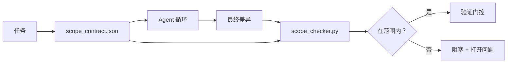

# 范围契约与任务边界

> 模型不知道工作在哪里结束。范围契约（Scope Contract）是一个按任务的文件，说明工作从哪里开始、在哪里结束，以及在溢出时如何回滚。契约将"保持在范围内"从愿望转化为检查。

**类型：** 构建
**语言：** Python（标准库）
**前置条件：** Phase 14 · 32（最小工作台），Phase 14 · 33（规则作为约束）
**时间：** ~50 分钟

## 学习目标

- 编写代理在任务开始读取、验证器在任务结束读取的范围契约。
- 指定允许的文件、禁止的文件、验收标准、回滚计划和审批边界。
- 实现一个范围检查器（Scope Checker），将差异与契约比较并标记违规。
- 使范围蔓延（Scope Creep）可见、自动且可审查。

## 问题

代理会蔓延。任务是"修复登录 Bug"。差异触及登录路由、邮件助手、数据库驱动、README 和发布脚本。每一次触及在当时都有合理的理由。合在一起它们是与审查的不一样的变更。

范围蔓延是代理工作中最未被充分监控的失败模式，因为代理真诚地叙述每一步。修复方法不是更严格的提示。修复方法是磁盘上的一个契约，说明承诺了什么，以及一个将结果与承诺比较的检查。

## 概念



### 范围契约包含什么

| 字段 | 用途 |
|------|------|
| `task_id` | 链接到看板上的任务 |
| `goal` | 审查者可以验证的一句话 |
| `allowed_files` | 代理可以写入的 glob 模式 |
| `forbidden_files` | 代理绝对不能触及的 glob 模式，即使意外 |
| `acceptance_criteria` | 证明完成的测试命令或断言行 |
| `rollback_plan` | 操作员在需要停止时可以执行的一段话 |
| `approvals_required` | 需要显式人类签名的范围外操作 |

没有 `forbidden_files` 的契约是不完整的。否定空间是契约的一半。

### Glob 模式，而非原始路径

真实仓库移文件。将契约固定到 glob 模式（`app/**/*.py`、`tests/test_signup*.py`），使会话之间的重构不会使契约无效。

### 回滚是范围的一部分

列出如何回滚迫使契约作者思考什么可能出错。你不能回滚的契约是不应被批准的契约。

### 范围检查是差异检查

代理写入一个差异。检查器读取差异、允许的 glob、禁止的 glob 以及任何运行的验收命令列表。每个违规是一个标记的发现，验证门控可以拒绝。

## 构建

`code/main.py` 实现：

- `scope_contract.json` Schema（JSON Schema 子集，glob 数组）。
- 一个差异解析器，将触碰文件列表加运行命令列表转换为 `RunSummary`。
- 一个 `scope_check`，根据契约返回 `(violations, in_scope, off_scope)`。
- 两个演示运行：一个在范围内，一个蔓延。检查器用确切的文件和原因标记蔓延。

运行方式：

```
python3 code/main.py
```

输出：契约、两次运行、每次运行的裁决，以及保存的 `scope_report.json`。

## 现实世界中的生产模式

一个实践者运行"specsmaxxing"（在调用代理前用 YAML 写范围契约）报告说在未更改代理的情况下，兔子洞率在三周内从 52% 降至 21%。契约做了工作，不是模型。三种模式使收益持久。

**违规预算，而非二元失败。** `agent-guardrails`（Claude Code、Cursor、Windsurf、Codex 通过 MCP 使用的开源合并门控）为每个任务提供 `violationBudget`：预算内的轻微范围滑动作为警告呈现；只有超出预算时合并门控才拒绝。配合 `violationSeverity: "error" | "warning"`。预算是能交付的门控和被讨厌的团队禁用的门控之间的区别。

**按路径族的严重性不对称。** 对 `docs/**` 的范围外写入通常是 `warn`；对 `scripts/**`、`migrations/**`、`config/prod/**` 的范围外写入始终是 `block`。这种不对称必须在契约中而不是运行时中，因为它特定于项目且按任务变化。

**时间与网络预算并列文件预算。** `time_budget_minutes` 字段限制挂钟时间；运行时拒绝在未经重新批准的情况下超过它。主机名的 `network_egress` 允许列表防止代理静默访问不属于任务的外部 API。这些也是范围维度；文件 glob 是必要的但不充分。

**多契约合并语义（最小权限）。** 当两个范围契约同时适用（例如项目级契约和任务特定契约），合并规则为：**取交集** `allowed_files`（两个契约都必须允许该路径），**取并集** `forbidden_files`（任一可以禁止），`time_budget_minutes` 取最严格（最小值），`approvals_required` 累积。`network_egress` 为 `None` 表示不执行，`[]` 表示全部拒绝，`[...]` 为允许列表；合并时，`None` 服从另一方，两个列表取交集，全部拒绝保持全部拒绝。在契约 Schema 中声明这点使合并是机械且可审查的。

## 使用场景

生产模式：

- **Claude Code 斜杠命令。** 一个 `/scope` 命令写入契约并将其固定为会话上下文。子代理在操作前读取契约。
- **GitHub PR。** 将契约作为 JSON 文件推送到 PR 正文或作为入库产物。CI 对合并差异运行范围检查器。
- **LangGraph 中断。** 范围违规触发中断；处理程序询问人类契约需要增长还是代理需要退缩。

契约随任务旅行。任务关闭时，契约归档到 `outputs/scope/closed/`。

## 部署

`outputs/skill-scope-contract.md` 为任务描述生成范围契约，以及一个在 CI 中对每个代理差异运行的 glob 感知检查器。

## 练习

1. 添加一个 `network_egress` 字段列出允许的外部主机。拒绝触及其他主机的运行。
2. 扩展检查器，对 `docs/**` 软失败，对 `scripts/**` 硬失败。证明这种不对称。
3. 使契约使用静态规则集（无 LLM）从 `goal` 字段推导 `allowed_files`。第一个边缘情况会出什么问题？
4. 添加 `time_budget_minutes`，在挂钟时间超过后拒绝继续。
5. 对同一个差异运行两个契约。两者都适用时的正确合并语义是什么？

## 关键术语

| 术语 | 人们常说的 | 实际含义 |
|------|-----------|---------|
| 范围契约（Scope Contract） | "任务简述" | 列出允许/禁止文件、验收、回滚的按任务 JSON |
| 范围蔓延（Scope Creep） | "它还触碰了……" | 在同一任务中契约之外更改的文件 |
| 回滚计划（Rollback Plan） | "我们可以还原" | 操作员停止运行的一段话手册 |
| 审批边界（Approval Boundary） | "需要签批" | 在契约中列为需要显式人类批准的操作 |
| 差异检查（Diff Check） | "路径审计" | 将触碰文件与契约 glob 比较 |

## 进一步阅读

- [LangGraph 人机交互中断](https://langchain-ai.github.io/langgraph/concepts/human_in_the_loop/)
- [OpenAI Agents SDK 工具审批策略](https://platform.openai.com/docs/guides/agents-sdk)
- [logi-cmd/agent-guardrails — 合并门控与范围验证](https://github.com/logi-cmd/agent-guardrails) — 违规预算、严重性层级
- [Dev|Journal，用 Agent 契约测试防止 AI Agent 配置偏移](https://earezki.com/ai-news/2026-05-05-i-built-a-tiny-ci-tool-to-keep-ai-agent-configs-from-drifting-in-my-repo/) — 无外部依赖的 `--strict` 模式
- [Agentic Coding 不是陷阱（生产日志）](https://dev.to/jtorchia/agentic-coding-is-not-a-trap-i-answered-the-viral-hn-post-with-my-own-production-logs-33d9) — specsmaxxing 收据：52% → 21%
- [OpenCode 权限 glob](https://opencode.ai/docs/agents/) — 细粒度按权限范围
- [Knostic，AI 编码代理安全：威胁模型与保护策略](https://www.knostic.ai/blog/ai-coding-agent-security) — 范围作为最小权限的一部分
- [Augment Code，AI 规格模板](https://www.augmentcode.com/guides/ai-spec-template) — 三层边界系统（must/ask/never）
- Phase 14 · 27 — 与范围锁配合的提示注入防御
- Phase 14 · 33 — 此契约按任务特化的规则集
- Phase 14 · 38 — 检查器报告到的验证门控