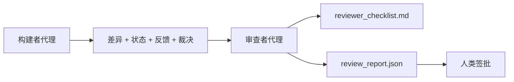

# 审查者代理：将构建者与评分者分离

> 编写代码的代理不能给自己打分。审查者（Reviewer）是一个第二个循环，带有不同的系统提示、不同的目标，以及对构建者产物的只读访问。构建者与审查者之间的差距是大多数可靠性所在。

**类型：** 构建
**语言：** Python（标准库）
**前置条件：** Phase 14 · 38（验证门控）
**时间：** ~55 分钟

## 学习目标

- 说明为什么同一代理无法可靠地审查自己的工作。
- 构建一个审查者代理循环，消费构建者产物并生成结构化审查报告。
- 编写一个审查者评分标准（Reviewer Rubric），对特定维度评分，而非感觉。
- 将审查者接入工作台，使人类审查步骤从真实的产物开始。

## 问题

你让代理修复一个 Bug。它编辑了四个文件，运行了测试，报告完成。验证门控（Phase 14 · 38）确认验收已运行且范围保持。门控说 `passed: true`。你合并。两天后你发现修复只解决了 Bug 的错误一半。

验收是必要的但不充分。审查者问验收不能问的问题：这解决了正确的问题吗？它是否在未标记的情况下扩展了范围？它是否记录了本应被质疑的假设？它是否将工作台留在了下一个会话可以接续的状态？

## 概念



### 审查者评分标准

五个维度，每个 0 到 2 分。

| 维度 | 问题 |
|------|------|
| 问题匹配（Problem Fit） | 变更是否解决了所陈述的任务，而非邻近任务？ |
| 范围纪律（Scope Discipline） | 编辑是否限制在契约内，还是契约有意扩展了？ |
| 假设（Assumptions） | 所有隐藏假设是否写在了某个可审查的地方？ |
| 验证质量（Verification Quality） | 验收命令是否真正证明了目标，还是证明了一个更弱的版本？ |
| 交接就绪（Handoff Readiness） | 下一个会话能否从当前状态干净接续？ |

满分 10 分。低于 7 分为软失败；低于 5 分为硬失败。

### 审查者是一个独立角色，而非独立模型

你可以用与构建者相同的模型运行审查者。学科是角色分离：不同的系统提示、不同的输入、无差异的写入权限。姿态的变化就是信号的变化。

### 审查者不能编辑差异

审查者读取差异、状态、反馈、裁决。它写入一个报告。它不修补差异。如果报告说"修复这个"，下一个构建者轮次执行修复；审查者回到审查。混合角色会破坏差距。

### 审查者评分标准 vs 验证门控

门控（Phase 14 · 38）检查确定性事实：验收是否运行、规则是否通过、范围是否保持。审查者做出定性判断：这是否是正确的工作、是否被记录、交接是否可用。两者都需要。

## 构建

`code/main.py` 实现：

- 一个 `ReviewerInputs` 数据类，捆绑审查者读取的产物。
- 一个评分标准评分器，每个维度一个函数。每个函数对本课是确定性的和桩级的；真实实现会调用 LLM。
- 一个 `review_report.json` 写入器，包含五个分数、总分和裁决（`pass`、`soft_fail`、`hard_fail`）。
- 两个演示案例：一个干净变更和一个"正确测试，错误问题"变更。

运行方式：

```
python3 code/main.py
```

输出：两个审查报告写入磁盘，一个维度分数的控制台表。

## 现实世界中的生产模式

收据：Cloudflare 2026 年 4 月的 AI 代码审查系统，在 30 天内跨 5,169 个仓库的 48,095 个合并请求上运行了 131,246 次审查。中位审查在 3 分 39 秒内完成。最多七个专家审查者（安全、性能、代码质量、文档、发布管理、合规、Engineering Codex）在审查协调器（Review Coordinator）下并行运行，协调器去重发现并判断严重性。顶级模型专门留给协调器；专家在更便宜的层级运行。

四种模式使此在大规模上有效。

**专家池，而非一个大审查者。** 一个带有 5 维度评分标准的审查者适用于个人仓库。一旦代码库有安全关键、性能关键和文档表面，就拆分到专家中，使用更小的提示。协调器做去重；专家从不运行完整评分标准。模型层级分离自然发生：便宜的专家，昂贵的协调器。

**偏差缓解作为设计要求，而非优化。** LLM 评判者表现出四种可靠的偏差（Adnan Masood，2026 年 4 月）：位置偏差（GPT-4 在 (A,B) 与 (B,A) 排序上约 40% 不一致）、冗长偏差（向更长输出约 15% 分数膨胀）、自我偏好（评判者偏好来自同一模型家族的输出）、权威（评判者对引用已知作者的输出过度评分）。缓解措施：评估两种排序，仅统计一致的胜利；使用 1-4 量表明确奖励简洁性；跨模型家族轮换评判者；评分前剥离作者名称。

**校准集（Calibration Set），而非感觉。** 一个 10-20 个任务的历史集，带有已知的正确裁决。在每次提示更改时对校准集运行审查者。如果与历史记录的一致性低于 80%，评分标准在审查者交付之前需要修订。这是每个团队最终都会重新发现的；最好从一开始就用。

**与门控的混合规范。** 验证门控（Phase 14 · 38）处理确定性检查（验收是否运行、测试是否通过、范围是否保持）。审查者处理语义检查（这是否是正确的工作、假设是否记录、交接是否可用）。Anthropic 的 2026 年指南对此分离是明确的：不要要求审查者重做门控已经证明的事情。

## 使用场景

生产模式：

- **Claude Code 子代理。** 审查者子代理在构建者关闭任务后运行。它在 PR 上发布带有评分标准分数的评论。
- **OpenAI Agents SDK 交接。** 构建者在任务完成时交接给审查者。审查者可以带着发现列表交回，或上交给人类。
- **双模型配对。** 构建者运行在更快更便宜的模型上。审查者运行在更强的模型上，上下文更小，专注于判断。

审查者是当人类不能自己做每次审查时工作台长出的第二双眼睛。

## 部署

`outputs/skill-reviewer-agent.md` 生成项目特定的审查者评分标准、连接到构建者产物的审查者代理桩，以及与验证门控的集成，使人类审查从书面报告而非空白页开始。

## 练习

1. 添加一个特定于你产品领域的第六个维度。辩护为什么它不被现有的五个吸收。
2. 用两个不同的系统提示（简洁、冗长）运行审查者。哪个产生人类更可能阅读的报告？
3. 为每个维度添加 `confidence` 字段。当最低维度置信度低于 0.6 时拒绝交付报告。
4. 构建一个校准集：10 个历史任务关闭，带有已知的正确裁决。对它们运行审查者。它在哪些地方与历史记录不一致？
5. 添加"请求更多证据"的能力：审查者可以在评分前要求构建者运行特定测试。正确的退避是什么，使此不循环？

## 关键术语

| 术语 | 人们常说的 | 实际含义 |
|------|-----------|---------|
| 审查者评分标准（Reviewer Rubric） | "检查清单" | 五维度 0-2 评分，每个维度带一个书面问题 |
| 软失败（Soft Fail） | "需要修订" | 总分低于 7；构建者获得需要解决的发现 |
| 硬失败（Hard Fail） | "拒绝" | 总分低于 5 或任何维度为 0；停止并暴露给人类 |
| 角色分离（Role Separation） | "不同的提示" | 相同模型可以是两个角色；学科在于输入和姿态 |
| 置信度底线（Confidence Floor） | "不要交付低信号报告" | 当评分标准不确定时拒绝发出裁决 |

## 进一步阅读

- [OpenAI Agents SDK 交接](https://platform.openai.com/docs/guides/agents-sdk/handoffs)
- [Anthropic Claude Code 子代理](https://docs.anthropic.com/en/docs/agents-and-tools/claude-code/sub-agents)
- [Cloudflare，大规模编排 AI 代码审查](https://blog.cloudflare.com/ai-code-review/) — 7 专家 + 协调器架构，30 天内 131k 次运行
- [Agent-as-a-Judge：用代理评估代理（OpenReview / ICLR）](https://openreview.net/forum?id=DeVm3YUnpj) — DevAI 基准测试，366 个层次化解决方案需求
- [Adnan Masood，基于评分标准的评估与 LLM-as-a-Judge：方法论、偏差、实证验证](https://medium.com/@adnanmasood/rubric-based-evals-llm-as-a-judge-methodologies-and-empirical-validation-in-domain-context-71936b989e80) — 4 种偏差和缓解措施
- [MLflow，LLM-as-a-Judge 评估](https://mlflow.org/llm-as-a-judge) — 分离构建者/评估者的生产工具
- [LangChain，如何用人类纠正校准 LLM-as-a-Judge](https://www.langchain.com/articles/llm-as-a-judge) — 校准集工作流
- [Evidently AI，LLM-as-a-judge：完整指南](https://www.evidentlyai.com/llm-guide/llm-as-a-judge)
- [Arize，LLM as a Judge — 入门与预构建评估器](https://arize.com/llm-as-a-judge/)
- Phase 14 · 05 — Self-Refine 与 CRITIC（单代理自我审查基线）
- Phase 14 · 30 — 评估驱动的代理开发（校准集生成器）
- Phase 14 · 38 — 审查者读取的验证门控
- Phase 14 · 40 — 审查者报告馈入的交接包