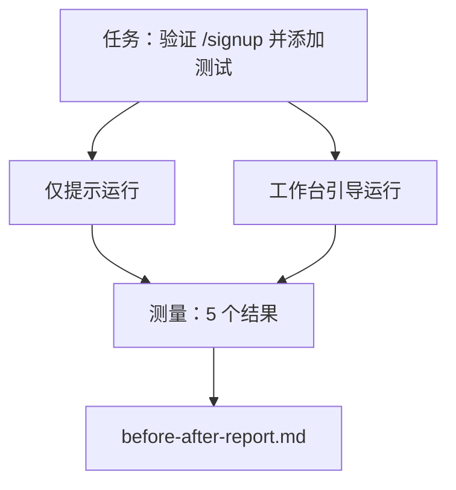

# 真实仓库上的工作台

> 如果十一个关于表面的课程不能在与真实代码库接触时存活下来，它们就毫无价值。本课在一个小型示例应用上运行相同的任务两次：仅提示 vs 工作台引导。数字说明一切。

**类型：** 构建
**语言：** Python（标准库）
**前置条件：** Phase 14 · 32 至 14 · 40
**时间：** ~60 分钟

## 学习目标

- 将七个工作台表面汇聚到一个小型应用上。
- 运行相同的任务两次（仅提示与工作台引导）并测量五个结果。
- 阅读前后对比报告，决定哪些表面给予了最大的杠杆。
- 在面对"但我的模型已经足够好"的质疑时为工作台辩护。

## 问题

在玩具任务上的演示无法说服任何人。工作台的理由在于：当一个真实感任务在真实感仓库上以更少失败、更少回滚以及下一个会话可用的包交付生产时。

本课交付那个真实感仓库，并通过两个流水线运行相同的任务。结果是一份你可以交给怀疑者的前后对比报告。

## 概念



### 示例应用

`sample_app/` 中的一个最小 FastAPI 风格处理器：

- `app.py` 包含 `/signup`（尚无验证）。
- `test_app.py` 包含一个乐观路径测试。
- `README.md` 和 `scripts/release.sh` 作为禁区诱饵。

### 任务

> 为 `/signup` 添加输入验证：拒绝短于 8 个字符的密码，返回 422 并带有类型化错误信封。添加一个证明新行为的测试。

### 两个流水线

仅提示：

1. 读取 README。
2. 读取 `app.py`。
3. 编辑文件。
4. 声明完成。

工作台引导：

1. 运行初始化脚本（第 35 课）。
2. 读取范围契约（第 36 课）。
3. 读取状态（第 34 课）。
4. 仅编辑允许的文件。
5. 通过反馈运行器运行验收命令（第 37 课）。
6. 运行验证门控（第 38 课）。
7. 运行审查者（第 39 课）。
8. 生成交接（第 40 课）。

### 测量的五个结果

| 结果 | 为什么重要 |
|------|-----------|
| `tests_actually_run` | 大多数"测试通过"声明是不可验证的 |
| `acceptance_met` | 证明目标的测试必须是实际运行的测试 |
| `files_outside_scope` | 范围蔓延是主导的静默失败 |
| `handoff_quality` | 下个会话为之付费或受益 |
| `reviewer_total` | 门控之上的定性判断 |

## 构建

`code/main.py` 对相同的示例应用夹具编排两个流水线。两个流水线都是脚本化的（循环中无 LLM），因此测量可重现。脚本将对比写入 `before-after-report.md` 和 `comparison.json`。

运行方式：

```
python3 code/main.py
```

输出：每个流水线的结果控制台表，脚本旁边保存的 markdown 报告，以及给任何想绘制图表的人的 JSON。

## 现实世界中的生产模式

怀疑者的问题是"工作台到底有多大帮助？"2026 年的数字比解释更有说服力。

**Terminal Bench 从 Top 30 到 Top 5，相同模型。** LangChain 的 *Anatomy of an Agent Harness*（2026 年 4 月）：一个编码代理仅通过更改工具链（Harness）从 Terminal Bench 2.0 前 30 名之外跃升至第五名。相同模型。不同表面。25 位排名差距。

**Vercel 通过删除工具从 80% 到 100%。** Vercel 报告删除其代理 80% 的工具将成功率从 80% 提升至 100%。更小的工具表面、更清晰的范围、更少的失败路径。否定空间获胜。

**Harvey 仅通过工具链实现 2 倍准确率。** 法律代理仅通过工具链优化将准确率翻倍以上，无模型变更。

**88% 的企业 AI 代理项目未能进入生产。** preprints.org 的 *Harness Engineering for Language Agents* 论文（2026 年 3 月）将失败追溯至运行时而非推理：过时状态、脆弱的重试、过度增长的上下文、中间错误恢复不佳。

**长上下文崩溃。** WebAgent 基线 40-50% 成功率在长上下文条件下降至 10% 以下，主要来自无限循环和目标丢失。Ralph Loop 和交接包的存在就是为了吸收这一点。

**假阴性（False Negative）依然存在。** 单步事实性任务、单行 lint、格式化运行、模型逐字记忆的任何内容——这些在仅提示下运行更快。基准测试应诚实地列举它们，使工作台不被框架为过度设计。

结论不是"工具链永远赢。"模型确实随着时间吸收工具链技巧。结论是，今天工程负载位于七个表面上，数字证明了这一点。

## 使用场景

本课是你在以下情况下引用的案例文件：

- 有人问为什么每个 PR 都携带 `agent-rules.md` 和范围契约。
- 一个团队想"仅这个 Sprint"放弃验证门控。
- 一个新的代理产品发布，你需要一个可移植的基准测试来决定它实际是否节省时间。

数字比解释走得远。

## 部署

`outputs/skill-workbench-benchmark.md` 是一个可移植的评估工具链，对任何代理产品运行两个流水线，针对项目自己的示例应用，并报告五个结果。

## 练习

1. 添加第六个结果：`time-to-first-meaningful-edit`。你如何干净地测量它？
2. 在你代码库的真实第二天任务上运行对比。工作台数字在哪里下滑？
3. 添加一个"假阴性"通过：仅提示会更快的任务，工作台开销是实际成本。辩护仍然保留工作台。
4. 将脚本化的"代理"替换为真实的 LLM 调用。哪些结果变得更嘈杂？
5. 创作一份面向非工程师的单页摘要。什么能够通过删减？

## 关键术语

| 术语 | 人们常说的 | 实际含义 |
|------|-----------|---------|
| 示例应用（Sample App） | "玩具仓库" | 小但足够真实以锻炼所有七个表面 |
| 流水线（Pipeline） | "工作流" | 代理遵循的表面读/写顺序序列 |
| 前后对比报告（Before/After Report） | "收据" | 你交给怀疑者的产物 |
| 假阴性（False Negative） | "工作台过度设计" | 仅提示更快的任务；诚实地列举是有用的 |
| 工作台基准测试（Workbench Benchmark） | "可靠性分数" | 在你的代码库上运行对比的可移植工具链 |

## 进一步阅读

- [LangChain，Anatomy of an Agent Harness](https://blog.langchain.com/the-anatomy-of-an-agent-harness/) — Terminal Bench Top 30 到 Top 5 收据
- [MongoDB，The Agent Harness：为什么 LLM 是代理系统中最小的部分](https://www.mongodb.com/company/blog/technical/agent-harness-why-llm-is-smallest-part-of-your-agent-system) — Vercel + Harvey 数字
- [preprints.org，语言代理的工具链工程](https://www.preprints.org/manuscript/202603.1756) — 88% 企业失败率，运行时根因
- [HN：仅更改工具链，一个下午提升 15 个 LLM 的编码能力](https://news.ycombinator.com/item?id=46988596) — 跨 15 个模型复制
- [Cloudflare，大规模编排 AI 代码审查](https://blog.cloudflare.com/ai-code-review/) — 生产环境中 30 天内 131k 次审查运行
- [Anthropic，构建有效代理](https://www.anthropic.com/research/building-effective-agents)
- Phase 14 · 32 至 14 · 40 — 本课端到端锻炼的表面
- Phase 14 · 19 — SWE-bench、GAIA、AgentBench 作为本课补充的宏观基准测试
- Phase 14 · 30 — 评估驱动的代理开发，同一工具链接入