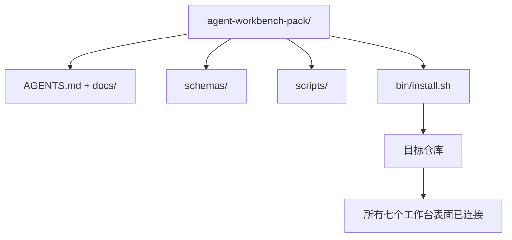

# 综合项目：交付一个可复用的代理工作台包

> 这个迷你轨道以一个你放入任何仓库的包结束。将十一个关于表面的课程压缩为一个你可以 `cp -r` 并在第二天早上让代理可靠工作的目录。这个综合项目是本课程所交易的产物。

**类型：** 构建
**语言：** Python（标准库）
**前置条件：** Phase 14 · 31 至 14 · 41
**时间：** ~75 分钟

## 学习目标

- 将七个工作台表面打包成一个可直接放入的目录。
- 固定 Schema、脚本和模板，使新仓库获得一个已知良好的基线。
- 添加一个单一的安装脚本，幂等地铺设包。
- 决定什么留在包内、什么留在包外，为每个决策辩护。

## 问题

一个存在于 Google Doc、聊天历史和三个半记住的脚本中的工作台是一个每个季度都要重建的工作台。解决方法是版本化的包：一个仓库或目录，包含表面、Schema、脚本和一个单命令安装器。

你将以磁盘上交付的 `outputs/agent-workbench-pack/` 和将其放入任何目标仓库的 `bin/install.sh` 结束本课。

## 概念



### 包布局

```
outputs/agent-workbench-pack/
├── AGENTS.md
├── docs/
│   ├── agent-rules.md
│   ├── reliability-policy.md
│   ├── handoff-protocol.md
│   └── reviewer-rubric.md
├── schemas/
│   ├── agent_state.schema.json
│   ├── task_board.schema.json
│   └── scope_contract.schema.json
├── scripts/
│   ├── init_agent.py
│   ├── run_with_feedback.py
│   ├── verify_agent.py
│   └── generate_handoff.py
├── bin/
│   └── install.sh
└── README.md
```

### 什么留在内，什么留在外

在内：

- 表面 Schema。它们是契约。
- 以上四个脚本。它们是运行时。
- 四个文档。它们是规则和评分标准。

在外：

- 项目特定的任务。任务属于目标仓库的看板，不在包中。
- 供应商 SDK 调用。包是框架无关的。
- 入职散文。包与团队现有的入职文档相邻而立，而非在其内部。

### 安装器

一个简短的 `bin/install.sh`（或 `bin/install.py`）：

1. 拒绝在没有 `--force` 的情况下覆盖已有包。
2. 将包复制到目标仓库。
3. 如果存在 `.github/workflows/`，则接入 CI。
4. 打印下一步：填充看板、设置验收命令、运行初始化脚本。

### 版本控制

包携带一个 `VERSION` 文件。需要迁移的 Schema 升级和脚本更改升级主版本号。仅文档更改升级补丁版本号。目标仓库的 `agent_state.json` 记录它初始化时对准的包版本。

## 构建

`code/main.py` 将包组装到课程旁边的 `outputs/agent-workbench-pack/` 中，使用本迷你轨道之前课程中的 Schema 和脚本以及你已编写的文档作为种子。

运行方式：

```
python3 code/main.py
```

脚本复制并固定表面，编写 README，打印包树，并零退出。重新运行是幂等的。

## 现实世界中的生产模式

一个包只有在其能够承受分叉、更新和不利的上游时才有价值。四种模式使其可行。

**`VERSION` 是契约，而非营销。** 主版本升级需要状态迁移。次版本升级需要检查器重新运行。补丁版本升级仅为文档更改。安装器在每次安装时将 `.workbench-version` 写入目标仓库；如果目标的锁定与包的 `VERSION` 不一致，`lint_pack.py` 拒绝交付。这就是 `npm`、`Cargo` 和 `pyproject.toml` 在 10 年变动中存活的方式；关于代理的任何事都没有改变规则。

**跨工具分发的单一源。** Nx 提供单一 `nx ai-setup`，从单个配置铺设 `AGENTS.md`、`CLAUDE.md`、`.cursor/rules/`、`.github/copilot-instructions.md` 和一个 MCP 服务器。包应做相同的事；安装器生成符号链接（`ln -s AGENTS.md CLAUDE.md`），使单一真相源扇出到每个编码代理。为支持一个工具而分叉包是一种失败模式。

**`uninstall.sh` 在非平凡状态时拒绝。** 卸载包不得删除用户的 `agent_state.json`、`task_board.json` 或 `outputs/`。卸载器删除 Schema、脚本、文档和 `AGENTS.md`（有 `--keep-agents-md` 退出选项），并在状态文件有任何未提交更改时拒绝继续。状态属于用户；包不拥有它。

**Skill-as-publishable，SkillKit 风格分发。** 包作为 SkillKit 技能交付：`skillkit install agent-workbench-pack` 从单一源将其铺设到 32 个 AI 代理中。包仓库是真相源；SkillKit 是分发渠道。供应商锁定崩塌；七个表面保持不变。

## 使用场景

包交付的三种方式：

- **作为一个你放入仓库的目录。** `cp -r outputs/agent-workbench-pack /path/to/repo`。
- **作为一个公共模板仓库。** Fork 并自定义，用 `VERSION` 控制偏移。
- **作为一个 SkillKit 技能。** 接入你的代理产品，使单一命令铺设它。

包是配方。每次安装是一次按量供应。

## 部署

`outputs/skill-workbench-pack.md` 生成项目调整后的包：规则根据团队历史打磨，范围 glob 匹配仓库，评分标准维度扩展一个领域特定条目。

## 练习

1. 决定哪个可选第五份文档值得提升到规范包中。辩护删减。
2. 将安装器改写为带 `--dry-run` 标志的 Python。与 bash 比较人体工程学。
3. 添加 `bin/uninstall.sh`，安全地删除包，并在状态文件有非平凡历史时拒绝。什么算非平凡？
4. 添加 `lint_pack.py`，在包偏离 `VERSION` 时失败。将其接入包自己仓库的 CI。
5. 编写从手动工作台到此包的迁移手册。最小化停机时间的操作顺序是什么？

## 关键术语

| 术语 | 人们常说的 | 实际含义 |
|------|-----------|---------|
| 工作台包（Workbench Pack） | "启动工具包" | 携带所有七个表面的版本化目录 |
| 安装器（Installer） | "设置脚本" | 幂等铺设包的 `bin/install.sh` |
| 包版本（Pack Version） | "VERSION" | 主版本升级用于 Schema/脚本更改，补丁版本用于仅文档 |
| 直接放入包（Drop-in Pack） | "cp -r 即用" | 包在第一天无需按仓库定制即可工作 |
| 可 Fork 模板（Forkable Template） | "GitHub 模板" | GitHub 的 "Use this template" 可从中克隆的公共仓库 |

## 进一步阅读

- Phase 14 · 31 至 14 · 41 — 此包捆绑的每个表面
- [SkillKit](https://github.com/rohitg00/skillkit) — 将此技能安装到 32 个 AI 代理中
- [Nx Blog，教你的 AI Agent 在单仓中工作](https://nx.dev/blog/nx-ai-agent-skills) — 跨六个工具的单一源生成器
- [agents.md — 开放规范](https://agents.md/) — 你的包路由器必须实现的内容
- [HKUDS/OpenHarness](https://github.com/HKUDS/OpenHarness) — 包等价物的参考实现
- [andrewgarst/agentic_harness](https://github.com/andrewgarst/agentic_harness) — 带评估套件的 Redis 支持参考
- [Augment Code，好的 AGENTS.md 就是模型升级](https://www.augmentcode.com/blog/how-to-write-good-agents-dot-md-files) — 包文档质量标准
- [Anthropic，长时间运行代理的有效工具链](https://www.anthropic.com/engineering/effective-harnesses-for-long-running-agents)
- [Anthropic，长时间运行应用开发的工具链设计](https://www.anthropic.com/engineering/harness-design-long-running-apps)
- Phase 14 · 30 — 消费包验证门控的评估驱动代理开发
- Phase 14 · 41 — 此包改进的前后对比基准测试