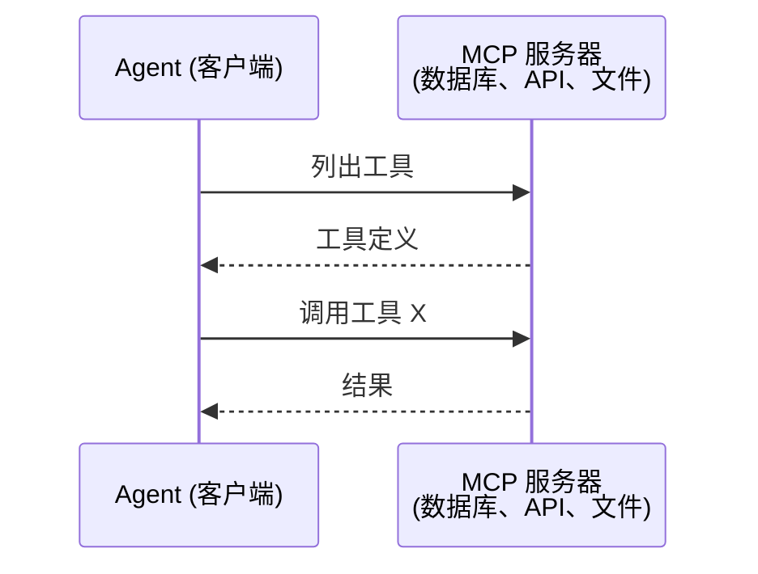
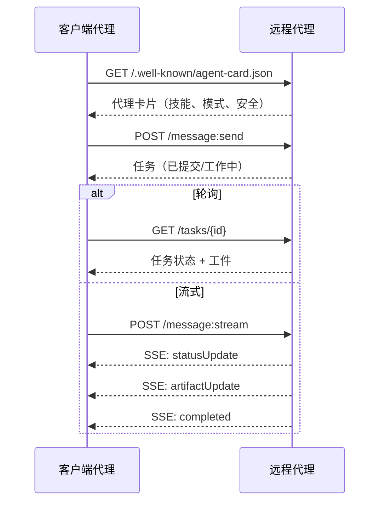
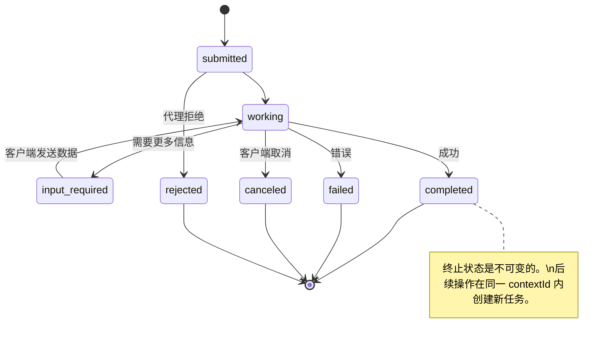
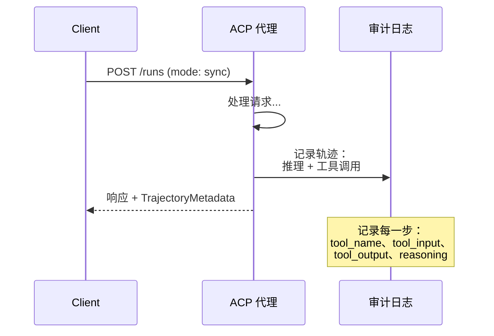
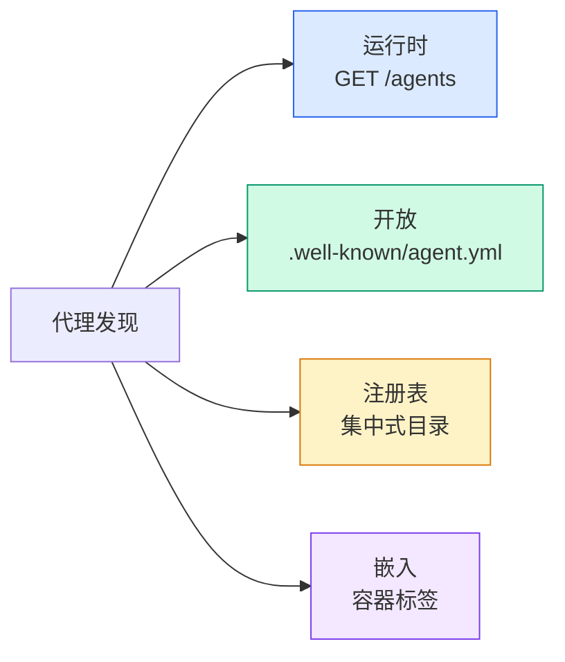
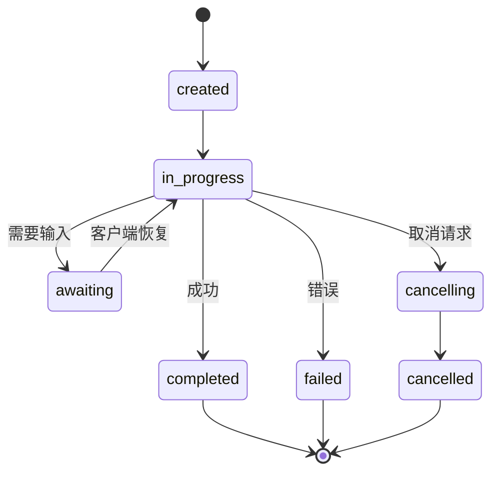
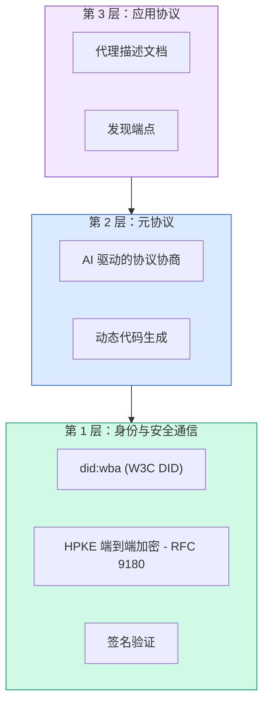
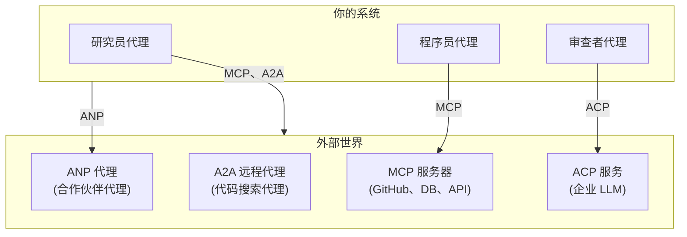

# 通信协议

> 不能说同一种语言的代理不是团队。他们是向虚空呼喊的陌生人。

**类型：** 构建
**语言：** TypeScript
**前置知识：** 第 14 阶段（Agent 工程）、第 16.01 课（为什么需要多 Agent）
**时间：** 约 120 分钟

## 学习目标

- 实现 MCP 工具发现和调用，使代理能够使用外部服务器暴露的工具
- 构建 A2A 代理卡片（Agent Card）和任务端点，允许一个代理通过 HTTP 将工作委托给另一个代理
- 比较 MCP（工具访问）、A2A（代理到代理）、ACP（企业审计）和 ANP（去中心化信任），并解释哪个协议解决哪个问题
- 在单个系统中连接多个协议，代理通过 MCP 发现工具并通过 A2A 委托任务

## 问题

你把系统拆分为多个代理。研究员、程序员、审查者。他们各自擅长自己的工作。但现在你需要他们真正互相通信。

你的第一次尝试是显而易见的：传递字符串。研究员返回一大段文本，程序员尽其所能否解析它。在程序员误解研究摘要之前，或者两个代理相互死锁等待对方之前，或者你需要由不同团队构建的代理协作之前，这能工作。突然间「只是传递字符串」就崩溃了。

这就是通信协议问题。如果没有代理如何交换信息的共享契约，多代理系统就是脆弱的、不可审计的，并且无法扩展到超过你亲自编写的少数几个代理。

AI 生态系统以四种协议作为回应，每种解决问题的不同切片：

- **MCP** 用于工具访问
- **A2A** 用于代理到代理协作
- **ACP** 用于企业可审计性
- **ANP** 用于去中心化身份和信任

本课深入。你将阅读每个规范的真实传输格式，构建工作实现，并将所有四个连接到一个统一系统中。

## 概念

### 协议格局

将这四种协议视为层，每层解决不同的问题：

```mermaid
block-beta
  columns 1
  block:ANP["ANP — 代理如何信任陌生人？\n去中心化身份（DID）、端到端加密、元协议"]
  end
  block:A2A["A2A — 代理如何协作完成目标？\n代理卡片、任务生命周期、流式、谈判"]
  end
  block:ACP["ACP — 代理如何在可审计系统中通信？\n运行、轨迹元数据、会话连续性"]
  end
  block:MCP["MCP — 代理如何使用工具？\n工具发现、执行、上下文共享"]
  end

  style ANP fill:#f3e8ff,stroke:#7c3aed
  style A2A fill:#dbeafe,stroke:#2563eb
  style ACP fill:#fef3c7,stroke:#d97706
  style MCP fill:#d1fae5,stroke:#059669
```

它们不是竞争者。它们在不同层级解决不同问题。

### MCP（回顾）

MCP 在第 13 阶段有深入覆盖。快速回顾：MCP 标准化了 LLM 如何连接到外部工具和数据源。它是一个**客户端-服务器**协议，代理（客户端）发现并调用服务器暴露的工具。



MCP 是**代理到工具**的通信。它不帮助代理之间互相通信。

### A2A（Agent2Agent 协议）

**创建者：** Google（现在在 Linux Foundation 下为 `lf.a2a.v1`）
**规范版本：** 1.0.0
**问题：** 自主代理如何协作、谈判和相互委托任务？

A2A 是**点对点代理协作**的协议。MCP 连接代理到工具，A2A 连接代理到其他代理。每个代理在知名 URL 发布**代理卡片（Agent Card）**，其他代理发现、谈判并向其委托任务。

#### A2A 如何工作



#### 真实的代理卡片

这是 A2A 代理卡片在野外实际的样子。通过 `GET /.well-known/agent-card.json` 提供：

```json
{
  "name": "Research Agent",
  "description": "搜索文档并总结发现",
  "version": "1.0.0",
  "supportedInterfaces": [
    {
      "url": "https://research-agent.example.com/a2a/v1",
      "protocolBinding": "JSONRPC",
      "protocolVersion": "1.0"
    },
    {
      "url": "https://research-agent.example.com/a2a/rest",
      "protocolBinding": "HTTP+JSON",
      "protocolVersion": "1.0"
    }
  ],
  "provider": {
    "organization": "Your Company",
    "url": "https://example.com"
  },
  "capabilities": {
    "streaming": true,
    "pushNotifications": false
  },
  "defaultInputModes": ["text/plain", "application/json"],
  "defaultOutputModes": ["text/plain", "application/json"],
  "skills": [
    {
      "id": "web-research",
      "name": "网络研究",
      "description": "搜索网络并综合发现",
      "tags": ["research", "search", "summarization"],
      "examples": ["研究 React 19 的最新变化"]
    },
    {
      "id": "doc-analysis",
      "name": "文档分析",
      "description": "阅读和分析技术文档",
      "tags": ["docs", "analysis"],
      "inputModes": ["text/plain", "application/pdf"],
      "outputModes": ["application/json"]
    }
  ],
  "securitySchemes": {
    "bearer": {
      "httpAuthSecurityScheme": {
        "scheme": "Bearer",
        "bearerFormat": "JWT"
      }
    }
  },
  "security": [{ "bearer": [] }]
}
```

关键要点：
- **Skills** 是代理能做什么。每个都有 ID、标签和支持的输入/输出 MIME 类型。这是客户端代理决定该远程代理能否处理其请求的方式。
- **supportedInterfaces** 列出多种协议绑定。一个代理可以同时支持 JSON-RPC、REST 和 gRPC。
- **Security** 内建于卡片中。客户端在发出任何请求之前就知道需要什么认证。

#### 任务生命周期

任务是 A2A 中的核心工作单元。它们通过定义的状态移动：



全部 8 个状态（规范还定义了 `UNSPECIFIED` 作为哨兵值，此处省略）：

| 状态 | 是否终止？ | 含义 |
|---|---|---|
| `TASK_STATE_SUBMITTED` | 否 | 已确认，尚未处理 |
| `TASK_STATE_WORKING` | 否 | 正在积极处理中 |
| `TASK_STATE_INPUT_REQUIRED` | 否 | 代理需要客户端的更多信息 |
| `TASK_STATE_AUTH_REQUIRED` | 否 | 需要认证 |
| `TASK_STATE_COMPLETED` | 是 | 成功完成 |
| `TASK_STATE_FAILED` | 是 | 带错误完成 |
| `TASK_STATE_CANCELED` | 是 | 完成前被取消 |
| `TASK_STATE_REJECTED` | 是 | 代理拒绝了任务 |

一旦任务到达终止状态，它就是不可变的。没有进一步的消息。后续操作在同一 `contextId` 内创建新任务。

#### 传输格式

A2A 使用 JSON-RPC 2.0。以下是真实消息交换的样子：

**客户端发送任务：**
```json
{
  "jsonrpc": "2.0",
  "id": 1,
  "method": "SendMessage",
  "params": {
    "message": {
      "messageId": "msg-001",
      "role": "ROLE_USER",
      "parts": [{ "text": "研究 React 19 编译器特性" }]
    },
    "configuration": {
      "acceptedOutputModes": ["text/plain", "application/json"],
      "historyLength": 10
    }
  }
}
```

**代理响应任务：**
```json
{
  "jsonrpc": "2.0",
  "id": 1,
  "result": {
    "task": {
      "id": "task-abc-123",
      "contextId": "ctx-xyz-789",
      "status": {
        "state": "TASK_STATE_COMPLETED",
        "timestamp": "2026-03-27T10:30:00Z"
      },
      "artifacts": [
        {
          "artifactId": "art-001",
          "name": "research-results",
          "parts": [{
            "data": {
              "findings": [
                "React 19 编译器自动记忆化组件",
                "不再需要手动的 useMemo/useCallback",
                "编译器在构建时运行，而非运行时"
              ]
            },
            "mediaType": "application/json"
          }]
        }
      ]
    }
  }
}
```

**通过 SSE 的流式：**
```text
POST /message:stream HTTP/1.1
Content-Type: application/json
A2A-Version: 1.0

data: {"task":{"id":"task-123","status":{"state":"TASK_STATE_WORKING"}}}

data: {"statusUpdate":{"taskId":"task-123","status":{"state":"TASK_STATE_WORKING","message":{"role":"ROLE_AGENT","parts":[{"text":"正在搜索文档..."}]}}}}

data: {"artifactUpdate":{"taskId":"task-123","artifact":{"artifactId":"art-1","parts":[{"text":"部分发现..."}]},"append":true,"lastChunk":false}}

data: {"statusUpdate":{"taskId":"task-123","status":{"state":"TASK_STATE_COMPLETED"}}}
```

### ACP（Agent Communication Protocol，代理通信协议）

**创建者：** IBM / BeeAI
**规范版本：** 0.2.0（OpenAPI 3.1.1）
**状态：** 正在 Linux Foundation 下合并到 A2A
**问题：** 代理如何以完全可审计性、会话连续性和轨迹追踪进行通信？

ACP 是**企业协议**。与许多摘要所声称的不同，ACP **不**使用 JSON-LD。它是一个通过 OpenAPI 定义的直接 REST/JSON API。它的特别之处是**轨迹元数据（TrajectoryMetadata）**：每个代理响应可以携带一份详细的日志，记录产生它的推理步骤和工具调用。



#### ACP 中的代理发现

ACP 定义了四种发现方法：



**AgentManifest** 比 A2A 的 Agent Card 更简单：

```json
{
  "name": "summarizer",
  "description": "总结文档并附带来源引用",
  "input_content_types": ["text/plain", "application/pdf"],
  "output_content_types": ["text/plain", "application/json"],
  "metadata": {
    "tags": ["summarization", "RAG"],
    "framework": "BeeAI",
    "capabilities": [
      {
        "name": "文档摘要",
        "description": "将长文档浓缩为关键点"
      }
    ],
    "recommended_models": ["llama3.3:70b-instruct-fp16"],
    "license": "Apache-2.0",
    "programming_language": "Python"
  }
}
```

#### 运行生命周期

ACP 使用「Runs」而非「Tasks」。一个 Run 是具有三种模式的代理执行：

| 模式 | 行为 |
|---|---|
| `sync` | 阻塞。响应包含完整结果。 |
| `async` | 立即返回 202。轮询 `GET /runs/{id}` 获取状态。 |
| `stream` | SSE 流。代理工作时触发事件。 |



#### 轨迹元数据（审计轨迹）

这是 ACP 的关键差异点。每个消息部分可以包含元数据，显示代理确切做了什么：

```json
{
  "role": "agent/researcher",
  "parts": [
    {
      "content_type": "text/plain",
      "content": "旧金山天气为 72F，晴天。",
      "metadata": {
        "kind": "trajectory",
        "message": "我需要查询此位置的天气",
        "tool_name": "weather_api",
        "tool_input": { "location": "San Francisco, CA" },
        "tool_output": { "temperature": 72, "condition": "sunny" }
      }
    }
  ]
}
```

对于受监管行业来说这是金矿。每个答案都带有可证明的推理链：调用了哪些工具、使用了什么输入、收到了什么输出。没有黑箱。

ACP 还支持用于来源归因的**引用元数据（CitationMetadata）**：

```json
{
  "kind": "citation",
  "start_index": 0,
  "end_index": 47,
  "url": "https://weather.gov/sf",
  "title": "NWS 旧金山预报"
}
```

### ANP（Agent Network Protocol，代理网络协议）

**创建者：** 开源社区（由 GaoWei Chang 创立）
**仓库：** [github.com/agent-network-protocol/AgentNetworkProtocol](https://github.com/agent-network-protocol/AgentNetworkProtocol)
**问题：** 来自不同组织的代理如何在没有中央权威的情况下相互信任？

ANP 是**去中心化身份协议**。它使用 W3C 去中心化标识符（Decentralized Identifier，DID）和端到端加密构建信任。与 A2A 中通过已知端点发现代理不同，ANP 让代理通过密码学证明其身份。

ANP 有三层：



#### DID 文档（真实结构）

ANP 使用一种名为 `did:wba`（基于 Web 的代理）的自定义 DID 方法。DID `did:wba:example.com:user:alice` 解析到 `https://example.com/user/alice/did.json`：

```json
{
  "@context": [
    "https://www.w3.org/ns/did/v1",
    "https://w3id.org/security/suites/jws-2020/v1",
    "https://w3id.org/security/suites/secp256k1-2019/v1"
  ],
  "id": "did:wba:example.com:user:alice",
  "verificationMethod": [
    {
      "id": "did:wba:example.com:user:alice#key-1",
      "type": "EcdsaSecp256k1VerificationKey2019",
      "controller": "did:wba:example.com:user:alice",
      "publicKeyJwk": {
        "crv": "secp256k1",
        "x": "NtngWpJUr-rlNNbs0u-Aa8e16OwSJu6UiFf0Rdo1oJ4",
        "y": "qN1jKupJlFsPFc1UkWinqljv4YE0mq_Ickwnjgasvmo",
        "kty": "EC"
      }
    },
    {
      "id": "did:wba:example.com:user:alice#key-x25519-1",
      "type": "X25519KeyAgreementKey2019",
      "controller": "did:wba:example.com:user:alice",
      "publicKeyMultibase": "z9hFgmPVfmBZwRvFEyniQDBkz9LmV7gDEqytWyGZLmDXE"
    }
  ],
  "authentication": [
    "did:wba:example.com:user:alice#key-1"
  ],
  "keyAgreement": [
    "did:wba:example.com:user:alice#key-x25519-1"
  ],
  "humanAuthorization": [
    "did:wba:example.com:user:alice#key-1"
  ],
  "service": [
    {
      "id": "did:wba:example.com:user:alice#agent-description",
      "type": "AgentDescription",
      "serviceEndpoint": "https://example.com/agents/alice/ad.json"
    }
  ]
}
```

关键要点：
- **密钥分离**被强制执行。签名密钥（secp256k1）与加密密钥（X25519）分离。
- **`humanAuthorization`** 是 ANP 独有的。这些密钥在使用前需要显式的人类批准（生物识别、密码、HSM）。资金转移等高风险操作经过此路径。
- **`keyAgreement`** 密钥用于 HPKE 端到端加密（RFC 9180）。
- **service** 部分链接到代理描述文档。

### 比较协议

| 问题 | MCP | A2A | ACP | ANP |
|---|---|---|---|---|
| 代理能使用工具吗？ | **是** | 否 | 否 | 否 |
| 代理能相互通信吗？ | 否 | **是** | **是** | **是** |
| 代理能流式传输中间状态吗？ | 否 | **是** | **是** | 否 |
| 人类能审计代理决策吗？ | 部分（通过工具调用日志） | 部分（通过工件） | **是**（TrajectoryMetadata） | 否 |
| 代理能跨组织信任吗？ | 否（通过 OAuth 等解决方案） | 否（通过 OAuth 等解决方案） | 否 | **是**（DID + E2EE） |
| 代理能发现其他代理吗？ | 否 | **是**（Agent Card） | **是**（AgentManifest） | **是**（AD） |
| 代理能自行协商协议吗？ | 否 | 否 | 否 | **是**（元协议） |

### 全部连接在一起

在实际系统中，这些协议共存在不同的边界：



协议分离是干净的。代理在工具边界使用 MCP。当任务是另一个代理的核心能力时，它们切换到 A2A。当合规性要求审计轨迹时，它们使用 ACP。当它们需要信任来自另一个组织的代理时，它们使用 ANP。

### 不要把它们视为竞争对手

常见的陷阱：「我应该使用 MCP 还是 A2A？」这是错误的问题。正确的思维模型是一个协议栈：

```
信任 (ANP) → 协作 (A2A) → 审计 (ACP) → 工具 (MCP)
```

每层添加能力。一个代理系统可能对同一外部服务同时使用 MCP 和 A2A：MCP 用于其工具端点，A2A 用于其代理端点。或者你可能使用 MCP 进行工具访问，但通过 ACP 代理路由所有工具调用以记录轨迹。

## 构建

### 步骤 1：连接 MCP 的工具代理

```typescript
// 连接到 MCP 服务器并调用工具的代理
async function createMCPToolAgent() {
  const client = new Client(
    { name: "tool-agent", version: "1.0.0" },
    { capabilities: { tools: {} } }
  );

  const transport = new StdioClientTransport({
    command: "npx",
    args: ["-y", "@modelcontextprotocol/server-github"],
  });

  await client.connect(transport);
  const tools = await client.listTools();

  return {
    name: "tool-agent",
    systemPrompt: "你是一个可以使用外部工具的代理",
    tools: tools.tools, // MCP 工具定义
    // MCP 工具调用逻辑
    async callTool(name: string, args: Record<string, unknown>) {
      return client.callTool({ name, arguments: args });
    },
  };
}
```

### 步骤 2：通过 A2A 暴露代理

```typescript
// A2A 代理卡片端点
app.get("/.well-known/agent-card.json", (req, res) => {
  res.json({
    name: "Research Agent",
    description: "搜索文档并总结发现",
    version: "1.0.0",
    supportedInterfaces: [{
      url: "https://agent.example.com/a2a/v1",
      protocolBinding: "HTTP+JSON",
      protocolVersion: "1.0"
    }],
    capabilities: { streaming: true, pushNotifications: false },
    defaultInputModes: ["text/plain"],
    defaultOutputModes: ["application/json"],
    skills: [
      { id: "web-research", name: "网络研究",
        description: "搜索网络并综合发现",
        tags: ["research", "search"] }
    ]
  });
});

// A2A 任务端点
app.post("/a2a/v1", async (req, res) => {
  const { message } = req.body;
  const taskId = generateTaskId();

  // 创建任务并立即返回
  const task = {
    id: taskId,
    contextId: req.body.contextId || taskId,
    status: { state: "TASK_STATE_SUBMITTED", timestamp: new Date().toISOString() }
  };

  // 异步处理
  processTask(taskId, message).catch(console.error);

  res.json({ task });
});

// 任务状态端点
app.get("/a2a/v1/tasks/:taskId", async (req, res) => {
  const task = await getTask(req.params.taskId);
  res.json({ task });
});
```

### 步骤 3：连接 MCP + A2A

```typescript
// 协调研究代理 + 工具代理的主代理
async function orchestrate(task: string) {
  // 步骤 1：通过 MCP 连接工具
  const toolAgent = await createMCPToolAgent();

  // 步骤 2：通过 A2A 卡发现研究代理
  const card = await fetch("https://research-agent.example.com/.well-known/agent-card.json")
    .then(r => r.json());

  // 步骤 3：向研究代理委托子任务
  const researchTask = await fetch(card.supportedInterfaces[0].url, {
    method: "POST",
    headers: { "Content-Type": "application/json" },
    body: JSON.stringify({
      message: {
        messageId: "msg-" + Date.now(),
        role: "ROLE_USER",
        parts: [{ text: task }]
      }
    })
  }).then(r => r.json());

  // 步骤 4：轮询直到研究完成
  let taskResult = await pollUntilComplete(researchTask.task.id, card.supportedInterfaces[0].url);

  // 步骤 5：将研究成果传给工具代理进行编码
  const code = await toolAgent.callTool("write_code", {
    research: taskResult.task.artifacts[0].parts[0].data
  });

  return code;
}
```

### 步骤 4：添加 ACP 审计（可选，用于合规）

```typescript
// 将代理包装在 ACP 层中，记录轨迹
async function acpTrackedA2AAgent(cardUrl: string) {
  const innerAgent = await connectA2AAgent(cardUrl);

  return {
    async run(input: string): Promise<ACPRun> {
      const run = { id: generateRunId(), state: "in_progress", trajectory: [] };

      // 每次工具调用记录到轨迹
      const trackCall = (toolName: string, input: any, output: any) => {
        run.trajectory.push({
          kind: "trajectory",
          tool_name: toolName,
          tool_input: input,
          tool_output: output,
          message: `Called ${toolName}`
        });
      };

      const result = await innerAgent.execute(input, { onToolCall: trackCall });
      run.state = "completed";
      run.result = result;

      return run; // 现在包含可审计轨迹
    }
  };
}
```

## 实践

`outputs/skills.md` 包含三个技能文件，每个代理角色一个——工具执行者、远程委托者、审计追踪者——每个包含适合该角色的系统提示、工具列表和协议绑定。

## 交付

将以下内容交付生产：

1. 协议分离：代理在工具边界使用 MCP，在代理边界使用 A2A，在合规边界使用 ACP
2. 代理卡片：你构建的每个代理在 `/.well-known/agent-card.json` 处提供一张 A2A 卡片
3. 轨迹：如果合规性很重要，所有代理输出都携带 ACP 风格的轨迹元数据
4. 信任：对于跨组织代理，注册 ANP DID 文档
5. 轮询超时：所有异步 A2A 任务轮询循环都有最大 TTL（任务生命周期）

## 练习

1. 修改 MCP 代理以连接到三个不同的 MCP 服务器（GitHub、文件系统和数据库）。验证所有三个工具集都可用而不会发生名称冲突。
2. 在两个 A2A 代理之间实现完整的任务生命周期：已提交 → 工作中 → 输入要求 → 工作中 → 已完成。编写测试覆盖每个状态转换。
3. 并排实现相同的代理功能，一个用 A2A，一个用 ACP。比较消息开销（额外的往返、有效载荷大小）和审计能力。
4. 为一个跨组织代理场景设置 ANP：代理 A（你的组织）信任代理 B（合作伙伴组织）。验证 DID 解析是否有效，E2EE 消息交换是否成功。
5. 设计一个同时使用所有四种协议的代理编排：从 MCP 服务器发现工具，通过 A2A 委托子任务，通过 ACP 记录所有内容以供审计，并通过 ANP 验证外部代理的身份。

## 关键术语

| 术语 | 人们说的 | 实际含义 |
|------|---------|---------|
| A2A | 「代理人的 HTTP」 | 带有任务生命周期的代理到代理委托协议。 |
| ACP | 「审计协议」 | 基于轨迹的代理通信，专为企业审计而设计。 |
| ANP | 「去中心化信任」 | 基于 DID + E2EE 的代理身份协议。 |
| 代理卡片（Agent Card） | 「代理的名片」 | 在 `/.well-known/agent-card.json` 处的 JSON 文档，列出技能、界面和安全要求。 |
| 任务（Task） | 「代理的待办事项」 | 长期运行的工作单元，具有状态生命周期。A2A 的核心抽象。 |
| 轨迹元数据（TrajectoryMetadata） | 「决策日志」 | ACP 的审计字段：每个工具调用、推理步骤和输出都被记录。 |
| 已提交 → 工作中 → 已完成 | 「任务流」 | A2A 状态机：8 个状态，4 个终止状态。后续操作在同一 contextId 内创建新任务。 |
| DID 文档 | 「去中心化身份」 | W3C 标准文档，证明代理的公钥。托管在 `.well-known/did.json`。 |

## 扩展阅读

- [A2A 规范 v1.0](https://a2a-protocol.org/latest/specification/) — 官方 Google/ LF 任务代理协议
- [MCP 规范 2025-11-25](https://modelcontextprotocol.io/specification/2025-11-25) — Anthropic 的工具连接标准
- [ACP GitHub（ibm/bee-agent-communication-protocol）](https://github.com/i-am-bee/bee-agent-communication-protocol) — IBM 的审计协议
- [ANP GitHub](https://github.com/agent-network-protocol/AgentNetworkProtocol) — 去中心化代理身份
- [Liu 等人 — 代理互操作性协议综述](https://arxiv.org/html/2505.02279v1) — MCP + A2A + ACP + ANP 的比较调查