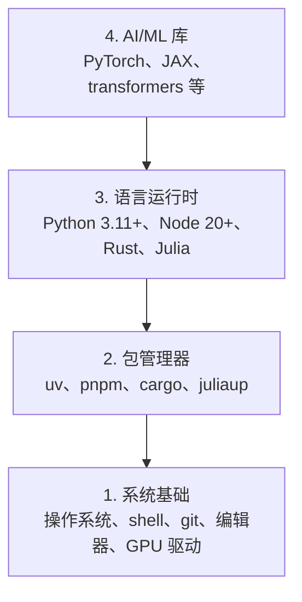

# 开发环境

> 你的工具塑造你的思维。一次设置，正确设置。

**类型：** 构建
**使用语言：** Python、Node.js、Rust
**前置课程：** 无
**预计时间：** ~45 分钟

## 学习目标

- 从零搭建 Python 3.11+、Node.js 20+ 和 Rust 工具链
- 配置虚拟环境和包管理器，实现可复现的构建
- 验证 CUDA/MPS 的 GPU 访问权限并运行测试张量操作
- 理解四层技术栈：系统层、包层、运行时层、AI 库层

## 问题

你将通过 200 多节课程学习 AI 工程，涉及 Python、TypeScript、Rust 和 Julia。如果你的环境有问题，每节课都会变成与工具的对抗，而不是学习。

大多数人会跳过环境配置。然后他们会花几个小时调试导入错误、版本冲突和缺失的 CUDA 驱动。我们要一次到位，正确设置。

## 概念

AI 工程环境有四个层次：



我们自下而上安装。每一层都依赖于下面一层。

## 构建它

> **国内用户请注意**：以下每个步骤都提供了国内镜像配置。由于网络限制，直接使用官方源可能很慢或无法访问，建议优先使用镜像。推荐的镜像源包括：
> - 清华大学 TUNA 镜像：<https://mirrors.tuna.tsinghua.edu.cn>
> - 中国科学技术大学 USTC 镜像：<https://mirrors.ustc.edu.cn>
> - 阿里云镜像：<https://mirrors.aliyun.com>
> - 华为云镜像：<https://mirrors.huaweicloud.com>

### 步骤 1：系统基础

检查你的系统并安装基础软件。

```bash
# macOS（使用国内 Homebrew 镜像）
export HOMEBREW_BREW_GIT_REMOTE="https://mirrors.huaweicloud.com/brew.git"
export HOMEBREW_CORE_GIT_REMOTE="https://mirrors.huaweicloud.com/homebrew-core.git"
export HOMEBREW_BOTTLE_DOMAIN="https://mirrors.huaweicloud.com/homebrew-bottles"

xcode-select --install
/bin/bash -c "$(curl -fsSL https://mirrors.huaweicloud.com/misc/brew/install.sh)"
brew install git curl wget

# Ubuntu/Debian
# 注意：Ubuntu 24.04+ 使用 deb822 格式，源配置在 /etc/apt/sources.list.d/ubuntu.sources
# 以下命令兼容两种格式，根据系统自动选择
if [ -f /etc/apt/sources.list.d/ubuntu.sources ]; then

  sudo cp /etc/apt/sources.list.d/ubuntu.sources /etc/apt/sources.list.d/ubuntu.sources.bak
  sudo sed -i 's|http://archive.ubuntu.com|https://mirrors.huaweicloud.com|g' /etc/apt/sources.list.d/ubuntu.sources
  sudo sed -i 's|http://security.ubuntu.com|https://mirrors.huaweicloud.com|g' /etc/apt/sources.list.d/ubuntu.sources
else

  sudo cp /etc/apt/sources.list /etc/apt/sources.list.bak
  sudo sed -i 's|http://archive.ubuntu.com|https://mirrors.huaweicloud.com|g' /etc/apt/sources.list
  sudo sed -i 's|http://security.ubuntu.com|https://mirrors.huaweicloud.com|g' /etc/apt/sources.list
fi
sudo apt update && sudo apt install -y build-essential git curl wget

# Windows（使用 WSL2）
wsl --install -d Ubuntu-24.04
```

#### WSL2 网络配置

WSL2 运行在独立虚拟机中，有自己的虚拟网卡和 IP，**不能直接共享 Windows 宿主机的网络**。这会导致：
- 代理不互通（Windows 上开了代理，WSL2 里不走）
- DNS 解析异常

**方案一：镜像网络模式（WSL 2.0+，需 Windows 11）**

> 注意：你的 Windows 版本需为 Windows 11 或更高版本。Windows 10 不支持此功能。

在 Windows 中创建 `%USERPROFILE%\.wslconfig`（即 `C:\Users\<你的用户名>\.wslconfig`，文件默认不存在，用记事本新建即可）：

```ini
[wsl2]
networkingMode=mirrored
dnsTunneling=true
autoProxy=true
```

> 在记事本保存时，文件名填写 `".wslconfig"`（带引号），防止自动添加 `.txt` 后缀。

保存后**在 Windows PowerShell / 终端**（不是 WSL2 里面）执行：

```powershell
wsl --shutdown
```

重新进入 WSL2 后，网络与宿主机一致，也可通过代理上网。验证：`ip addr show eth0` 中的 IP 应和宿主机在同一网段（如 `192.168.x.x`），而非虚拟 NAT 地址（`172.x.x.x`）。

**方案二：手动配置代理（Windows 10 / 所有 WSL 版本通用）**

在 WSL2 的 `~/.bashrc` 中添加：

```bash
# 获取 Windows 宿主机的 IP
host_ip=$(cat /etc/resolv.conf | grep nameserver | awk '{print $2}')
# 设置代理（7890 改为你的代理端口，如 Clash 默认 7890）
export http_proxy="http://$host_ip:7890"
export https_proxy="http://$host_ip:7890"
```

然后 `source ~/.bashrc` 生效。验证：

```bash
curl -s https://www.google.com | head -c 100
```

如果你使用 Clash Verge，也可直接在设置中启用「允许局域网连接」，然后在 WSL 中设置环境变量指向 Windows IP。

> **备用 apt 镜像**：华为云 `mirrors.huaweicloud.com`、清华 `mirrors.tuna.tsinghua.edu.cn`、阿里云 `mirrors.aliyun.com`、中科大 `mirrors.ustc.edu.cn`。选择其一即可。

### 步骤 2：使用 uv 安装 Python

我们使用 `uv` —— 它比 pip 快 10-100 倍，并且自动处理虚拟环境。

```bash
# 安装 uv（国内镜像加速）
curl -LsSf https://mirrors.ustc.edu.cn/astral/uv/install.sh | sh
# 或使用官方源（中国大陆可能较慢）
# curl -LsSf https://astral.sh/uv/install.sh | sh

# 安装后配置国内 PyPI 镜像
uv config set index-url https://pypi.tuna.tsinghua.edu.cn/simple

uv python install 3.12

uv venv
source .venv/bin/activate  # Windows 上使用 .venv\Scripts\activate

uv pip install numpy matplotlib jupyter
```

**验证 Python 环境：**

```python
import sys
print(f"Python {sys.version}")

import numpy as np
print(f"NumPy {np.__version__}")
a = np.array([1, 2, 3])
print(f"向量: {a}，与其自身的点积: {np.dot(a, a)}")
```

> **备用 PyPI 镜像**：
> - 华为云：`https://mirrors.huaweicloud.com/repository/pypi/simple`
> - 阿里云：`https://mirrors.aliyun.com/pypi/simple/`
> - 中科大：`https://pypi.mirrors.ustc.edu.cn/simple/`
> - 腾讯云：`https://mirrors.cloud.tencent.com/pypi/simple/`
>
> 临时使用：`uv pip install <包名> --index-url <镜像地址>`

### 步骤 3：安装 Node.js

用于 TypeScript 课程（Agent、MCP 服务器、Web 应用）。直接从华为云镜像下载 Node.js 二进制文件，无需版本管理器。

```bash
# 安装 Node.js（直接从国内镜像下载，无需版本管理器）
# NODE_VERSION=22.14.0
NODE_VERSION=24.16.0
curl -fsSL https://mirrors.huaweicloud.com/node/v${NODE_VERSION}/node-v${NODE_VERSION}-linux-x64.tar.xz -o node-v24.16.0-linux-x64.tar.xz
sudo tar -xf node-v24.16.0-linux-x64.tar.xz -C /usr/local/
sudo mv /usr/local/node-v${NODE_VERSION}-linux-x64 /usr/local/node

# 将 Node.js 加入 PATH
echo 'export PATH=/usr/local/node/bin:$PATH' >> ~/.bashrc
export PATH=/usr/local/node/bin:$PATH

# 验证安装
node -v
npm -v

# 配置 npm 国内镜像
npm config set registry https://registry.npmmirror.com

# 安装 pnpm
npm install -g pnpm
pnpm config set registry https://registry.npmmirror.com
```

> **其他平台**：
> - **macOS (ARM/x64)**：将 URL 中 `linux-x64` 替换为 `darwin-arm64` 或 `darwin-x64`
> - **Windows**：直接下载安装包 <https://mirrors.huaweicloud.com/node/v${NODE_VERSION}/node-v${NODE_VERSION}-x64.msi>
>
> **如需切换 Node.js 版本**，可手动替换 `NODE_VERSION` 变量值重新执行，或之后按需安装 fnm/nvm 等版本管理器。

> **备用 npm 镜像**：
> - 腾讯云：`https://mirrors.cloud.tencent.com/npm/`
> - 阿里云（即 npmmirror）：`https://registry.npmmirror.com`
> - 华为云：`https://mirrors.huaweicloud.com/repository/npm/`

### 步骤 4：安装 Rust

用于性能关键的课程（推理、系统）。

```bash
# 安装 Rust（国内镜像加速）
export RUSTUP_DIST_SERVER=https://mirrors.ustc.edu.cn/rust-static
export RUSTUP_UPDATE_ROOT=https://mirrors.ustc.edu.cn/rust-static/rustup
curl --proto '=https' --tlsv1.2 -sSf https://mirrors.ustc.edu.cn/rust-static/rustup/rustup-init.sh | sh
# 或使用官方源（中国大陆可能较慢）
# curl --proto '=https' --tlsv1.2 -sSf https://sh.rustup.rs | sh

# 配置 cargo 国内镜像（创建或编辑 ~/.cargo/config.toml）
cat >> ~/.cargo/config.toml << 'EOF'
[source.crates-io]
replace-with = "ustc"

[source.ustc]
registry = "sparse+https://mirrors.ustc.edu.cn/crates.io-index/"
EOF

rustc --version
cargo --version
```

> **备用 Rust 镜像**：
> - 华为云：`RUSTUP_DIST_SERVER=https://mirrors.huaweicloud.com/rust-static`、cargo 镜像 `registry = "sparse+https://mirrors.huaweicloud.com/crates.io-index/"`
> - 清华：`RUSTUP_DIST_SERVER=https://mirrors.tuna.tsinghua.edu.cn/rustup`、cargo 镜像 `registry = "sparse+https://mirrors.tuna.tsinghua.edu.cn/git/crates.io-index.git"`
> - 上海交通大学：`RUSTUP_DIST_SERVER=https://mirrors.sjtug.sjtu.edu.cn/rust-static/`
>
> Rust 工具链安装完成后，**建议将上述 `RUSTUP_DIST_SERVER` 和 `RUSTUP_UPDATE_ROOT` 环境变量写入 shell 配置文件（`~/.bashrc` 或 `~/.zshrc`）**，以便后续 `rustup update` 也能使用镜像加速。

### 步骤 5：安装 Julia（可选）

用于 Julia 擅长的数学密集型课程。

```bash
# 安装 Julia（国内镜像加速）
export JULIAUP_SERVER=https://mirrors.ustc.edu.cn/julia
curl -fsSL https://mirrors.ustc.edu.cn/julia/installers/juliaup/install.sh | sh
# 或使用官方源
# curl -fsSL https://install.julialang.org | sh

# 配置 Julia 包注册表镜像
mkdir -p ~/.julia
cat >> ~/.julia/config/startup.jl << 'EOF'
ENV["JULIA_PKG_SERVER"] = "https://mirrors.ustc.edu.cn/julia/static/pkg-server"
EOF

julia -e 'println("Julia ", VERSION)'
```

> **备用 Julia 镜像**：
> - 华为云：`JULIAUP_SERVER=https://mirrors.huaweicloud.com/julia`、`JULIA_PKG_SERVER=https://mirrors.huaweicloud.com/julia/static/pkg-server`
> - 清华：`JULIAUP_SERVER=https://mirrors.tuna.tsinghua.edu.cn/julia`、`JULIA_PKG_SERVER=https://mirrors.tuna.tsinghua.edu.cn/julia/static/pkg-server`
> - 上海交通大学：`https://mirrors.sjtug.sjtu.edu.cn/julia/`

### 步骤 6：GPU 设置（如果有 GPU）

```bash
# NVIDIA 驱动确认
nvidia-smi

# 安装带 CUDA 的 PyTorch（国内镜像加速）
uv pip install torch torchvision torchaudio \
  --index-url https://mirrors.tuna.tsinghua.edu.cn/pytorch/whl/cu124
# 或使用官方源（中国大陆可能较慢）
# uv pip install torch torchvision torchaudio --index-url https://download.pytorch.org/whl/cu129
```

```python
import torch
print(f"CUDA 可用: {torch.cuda.is_available()}")
if torch.cuda.is_available():
    print(f"GPU: {torch.cuda.get_device_name(0)}")
    print(f"显存: {torch.cuda.get_device_properties(0).total_memory / 1024**3:.1f} GB")

# 测试张量操作
x = torch.randn(3, 3).cuda()
y = torch.randn(3, 3).cuda()
print(f"GPU 张量乘法结果:\n{(x @ y)[:2, :2]}")
```

> **备用 PyTorch 镜像**：
> - 华为云：`https://mirrors.huaweicloud.com/pytorch/whl/cu124`
> - 中科大：`https://mirrors.ustc.edu.cn/pytorch/whl/cu124`
> - 阿里云：`https://mirrors.aliyun.com/pytorch/whl/cu124`
>
> **没有 GPU？** 没问题。大多数课程可以在 CPU 上运行。对于训练密集的课程，可以使用 Google Colab 或云 GPU。
>
> **Windows 原生（非 WSL2）用户**：安装 CUDA 驱动后，PyTorch 同样支持 Windows。使用镜像安装时注意选择对应操作系统的 wheel。

### 步骤 7：验证一切

运行验证脚本：

```bash
# 如果已激活虚拟环境（推荐）
python phases/00-setup-and-tooling/01-dev-environment/code/verify.py

# 或使用 uv run（自动使用项目虚拟环境，无需手动激活）
uv run python phases/00-setup-and-tooling/01-dev-environment/code/verify.py
```

> **注意**：`uv run` 会在项目根目录的 `.venv` 中执行命令。如果你已手动激活虚拟环境（`source .venv/bin/activate`），直接用 `python` 即可。两者选其一，不要混用 `uv python`——`uv python` 是 Python 版本管理子命令，不是用来运行脚本的。

## 使用它

你的环境现在已准备好应对本课程中的每一节课。以下是各语言的使用场景：

| 语言 | 使用场景 | 包管理器 | 国内镜像 |
|------|---------|------------|---------|
| Python | 阶段 1-12（机器学习、深度学习、NLP、视觉、音频、大语言模型） | uv | PyPI 清华镜像 |
| TypeScript | 阶段 13-17（工具、Agent、集群、基础设施） | pnpm | npmmirror 镜像 |
| Rust | 阶段 12、15-17（性能关键的系统） | cargo | USTC crates.io 镜像 |
| Julia | 阶段 1（数学基础） | Pkg | USTC Julia 镜像 |

## 交付

本课程生成一个验证脚本，任何人都可以运行来检查他们的设置。

参见 `outputs/prompt-env-check.md` 获取帮助 AI 助手诊断环境问题的提示词。

## 练习

1. 运行验证脚本并修复所有错误
2. 为本课程创建一个 Python 虚拟环境并安装 PyTorch
3. 验证国内镜像配置：运行 `uv pip install` 观察下载速度是否明显提升
4. 用四种语言各写一个「hello world」并运行它们