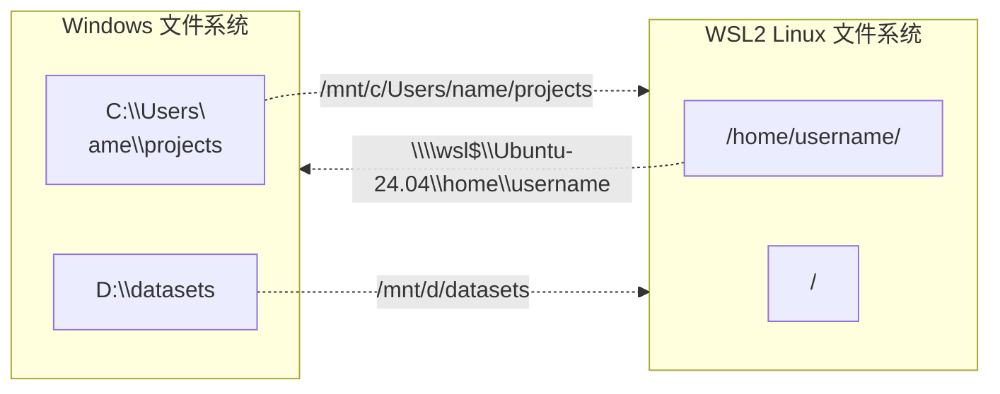

# WSL2 完全使用指南

> 在 Windows 上获得原生 Linux 体验。不需要双系统，不需要虚拟机。

**类型：** 构建
**使用语言：** Bash、PowerShell
**前置课程：** 阶段 0，第 01 课
**预计时间：** \~60 分钟

## 学习目标

- 理解 WSL2 的架构原理及其与 WSL1 的核心差异
- 在 Windows 10 上完成 WSL2 的安装与配置（含 BIOS 虚拟化开启）
- 掌握 WSL 常用命令：发行版管理、版本切换、导入导出
- 配置 Windows 与 Linux 之间的文件互访与互操作
- 搭建基于 WSL2 的完整开发环境：VS Code Remote、Docker、GPU 加速
- 通过 `.wslconfig` 对内存、CPU、网络进行性能调优
- 诊断并解决常见安装与运行故障

## 问题

绝大多数 AI 工具链和服务器环境都运行在 Linux 上。PyTorch、JAX、CUDA、Docker 容器——它们对 Linux 的支持远超 Windows。过去你有三个选择：

1. **双系统**：重启切换，割裂的工作流
2. **传统虚拟机（VMware/VirtualBox）**：资源开销大，文件共享慢
3. **云服务器开发**：延迟高，离线不可用

WSL2 是第四个、也是目前最优的选择：它在 Windows 内核中运行一个完整的 Linux 内核，通过轻量级 Hyper-V 虚拟机实现，文件 I/O 性能比 WSL1 提升最多 20 倍，同时支持 GPU 直通和 GUI 应用。

## 概念

### WSL1 vs WSL2 架构对比


| 特性                  | WSL1            | WSL2                     |
| ------------------- | --------------- | ------------------------ |
| 架构                  | 系统调用翻译层         | 真实 Linux 内核 + 轻量 VM      |
| 内核完整性               | 模拟系统调用，部分不兼容    | Microsoft 维护的完整 Linux 内核 |
| 文件 I/O（跨系统）         | 极慢              | 快（ext4 虚拟磁盘）             |
| 文件 I/O（Linux 内部）    | 快               | 极快                       |
| 文件 I/O（Windows 挂载点） | 快               | 较慢（走 9P 协议）              |
| Docker 支持           | 不完整             | 完整原生支持                   |
| GPU/CUDA            | 不支持             | 完整支持                     |
| GUI 应用              | 需手动配置 X Server  | 原生支持（WSLg）               |
| 网络                  | 与 Windows 共享 IP | 独立 IP（NAT），可桥接           |
| 内存占用                | 低               | 较高（可配置上限）                |

**结论：除非你有特殊的跨系统文件读写性能需求（在** **`/mnt/c`** **下频繁操作），否则一律用 WSL2。**

### Windows 与 Linux 文件系统的关系



**关键规则：**

- 在 WSL2 内访问 Windows 文件：`/mnt/c/`、`/mnt/d/`（走 9P 协议，较慢）
- 在 Windows 中访问 WSL2 文件：`\\wsl$\<发行版名>\`（走网络协议）
- **项目代码放在 WSL2 内部**（`/home/user/projects`），享受原生 ext4 性能
- **大型数据集可放在 Windows 侧**（如 `D:\datasets`），通过 `/mnt/d/datasets` 读取

## 构建它

### 阶段 A：确认系统就绪

#### 步骤 0：检查 WSL 版本（关键前置步骤）

在正式安装前，先确认你当前的 WSL 是 inbox 旧版还是 Store 新版。这一步直接影响后续安装方式。

```powershell
wsl --version
```

- **如果正常输出版本号**（如 `WSL 版本: 2.7.3.0`）→ 已是 Store 新版，直接跳到步骤 1
- **如果提示 `命令行选项无效: --version`** → 你是 inbox 旧版，需先升级

**inbox 版本的限制：**
- 不支持 `wsl --version`
- 不支持 `wsl --install --web-download`
- 内核较旧（如 5.10.16），缺少 systemd、WSLg、内存回收等新特性

**升级 inbox → Store 版（二选一）：**

1. **Microsoft Store（推荐）**：搜索安装 "Windows Subsystem for Linux Preview"
2. **手动下载 MSI**：浏览器打开 https://aka.ms/wsl2kernel 下载安装内核更新包

升级后重新打开终端，`wsl --version` 应正常输出版本信息，且内核升至 6.x。

```powershell
# 升级后验证
wsl --version
# WSL 版本: 2.7.3.0
# 内核版本: 6.6.114.1-1
# WSLg 版本: 1.0.73
```

#### 步骤 1：检查 Windows 版本

按 `Win + R`，输入 `winver`，确认版本：

- **Windows 10**：版本 2004 及以上（Build 19041+）
- **Windows 11**：任何版本

如果你的版本低于 2004，请先通过 Windows Update 升级。

```powershell
# PowerShell 中查看版本
[System.Environment]::OSVersion.Version
```

#### 步骤 2：在 BIOS 中启用硬件虚拟化

WSL2 依赖 Hyper-V，必须先开启 CPU 虚拟化。

1. 重启电脑，进入 BIOS/UEFI 设置（通常按 `F2`、`F10`、`Del` 或 `Esc`）
2. 找到以下选项之一并设为 **Enabled**：
   - **Intel**：Intel Virtualization Technology (VT-x)
   - **AMD**：AMD SVM Mode
3. 保存并退出

```powershell
# 在 Windows 中验证虚拟化已启用
systeminfo | findstr "Virtualization"
# 应输出：Virtualization Enabled In Firmware: Yes
```

> 如果命令输出 `No`，说明虚拟化未在 BIOS 中开启，或你的 CPU 不支持。后续安装会失败。

### 阶段 B：安装 WSL2

#### 方法一：一键安装（推荐，Windows 10 2004+/Windows 11）

```powershell
# 以管理员身份打开 PowerShell，执行：
wsl --install  或 wsl.exe --update
```

这条命令会自动完成：

1. 启用 "Windows Subsystem for Linux" 功能
2. 启用 "Virtual Machine Platform" 功能
3. 下载并安装 WSL2 内核更新包
4. 将 WSL2 设为默认版本
5. 安装 Ubuntu（默认发行版）

```powershell
# 如果想指定其他发行版：
wsl --install -d Debian
wsl --install -d Ubuntu-24.04

# 查看所有可安装的发行版：
wsl --list --online
```

安装完成后，**重启计算机**。

#### 方法二：手动安装（旧版 Windows 10 或 Server Core）

如果你的 Windows 10 版本较早（1903/1909），需手动安装。

**1) 启用 WSL 功能**

```powershell
# 以管理员身份运行 PowerShell
dism.exe /online /enable-feature /featurename:Microsoft-Windows-Subsystem-Linux /all /norestart
```

**2) 启用虚拟机平台**

```powershell
dism.exe /online /enable-feature /featurename:VirtualMachinePlatform /all /norestart
```

**3) 重启计算机**

```powershell
shutdown /r /t 0
```

**4) 下载 WSL2 内核更新包**

前往 <https://aka.ms/wsl2kernel> 下载 `wsl_update_x64.msi`，双击安装。

**5) 将 WSL2 设为默认版本**

```powershell
wsl --set-default-version 2
```

**6) 安装 Linux 发行版**

打开 Microsoft Store，搜索以下发行版之一并安装：

- Ubuntu（最推荐，社区最大）
- Ubuntu 24.04 LTS
- Debian
- Kali Linux
- Fedora Remix

或通过命令行安装：

```powershell
wsl --install -d Ubuntu-24.04
```

#### 网络问题排查（国内用户常见）

`wsl --install` 和 `wsl --list --online` 依赖 Microsoft Store 服务器，在国内网络环境下经常超时。

**症状：** 报错 `0x80072ee2`（`WININET_E_TIMEOUT`），进度条卡住不动。

**解决方案（按推荐顺序）：**

```powershell
# 1️⃣ 使用 --web-download 绕过 Store（仅 WSL Store 新版 2.x+ 支持）
wsl --install --web-download -d Ubuntu-24.04

# 2️⃣ 开启代理后重试
$env:HTTP_PROXY="http://127.0.0.1:7890"
$env:HTTPS_PROXY="http://127.0.0.1:7890"
wsl --install --web-download -d Ubuntu-24.04

# 3️⃣ 手动下载 AppX 包安装
# 浏览器打开 https://aka.ms/wslubuntu2404 下载 .AppxBundle
# 将下载的 .AppxBundle 解压两次：
#   Expand-Archive *.AppxBundle → 得到 .appx
#   Expand-Archive *.appx → 得到 ubuntu.exe 和系统文件
# 运行 ubuntu.exe 完成注册（详见下方故障排除）
```

> ⚠️ **注意：** `--web-download` 仅 WSL Store 新版（2.x+）支持。inbox 旧版需先升级（见阶段 A 步骤 0），否则会报 `unrecognized option: web-download`。

### 阶段 C：首次启动与用户配置

安装完成后，从开始菜单启动你的 Linux 发行版。首次启动会进行初始化，然后要求创建用户：

```
Installing, this may take a few minutes...
Please create a default UNIX user account.
Enter new UNIX username: yourname
New password:
Retype new password:
```

> **注意：** 这个用户名和密码是独立的 Linux 凭证，与 Windows 账户无关。sudo 密码就是这个。

创建完成后，你就获得了一个完整的 Linux 环境：

```bash
# 验证系统信息
uname -a
# Linux YOUR-PC 5.15.153.1-microsoft-standard-WSL2 #1 SMP ...

cat /etc/os-release
# Ubuntu 24.04 LTS

# 查看 WSL 版本
wsl.exe --list --verbose
#   NAME            STATE           VERSION
# * Ubuntu-24.04    Running         2
```

### 阶段 D：WSL 核心命令速查

```bash
# ===== 发行版管理 =====

# 列出所有已安装的发行版及其状态
wsl.exe --list --verbose
wsl.exe -l -v

# 设置默认发行版（wsl 命令默认进入的）
wsl --set-default Ubuntu-24.04

# 启动特定发行版
wsl -d Debian

# 关闭所有 WSL 实例
wsl --shutdown

# 关闭特定发行版
wsl -t Ubuntu-24.04

# ===== 版本管理 =====

# 将现有 WSL1 发行版升级为 WSL2
wsl --set-version Ubuntu-24.04 2

# 查看某个发行版的当前版本
wsl -l -v

# ===== 导入导出（迁移/备份）=====

# 导出发行版为 tar 文件（备份或迁移到其他盘）
wsl --export Ubuntu-24.04 D:\wsl\ubuntu-backup.tar

# 从 tar 文件导入（可指定安装位置）
wsl --import MyUbuntu D:\wsl\MyUbuntu D:\backup\ubuntu-backup.tar --version 2

# 注销/删除发行版（数据会丢失！）
wsl --unregister Ubuntu-24.04

# ===== 在 Windows 中执行 Linux 命令 =====

wsl ls -la
wsl -d Ubuntu-24.04 python train.py
```

### 阶段 E：WSL2 内部初始配置

```bash
# 更新包列表和已安装的包
sudo apt update && sudo apt upgrade -y

# 安装核心开发工具
sudo apt install -y build-essential git curl wget vim unzip

# 配置 Git（与 Windows 共享凭据）
git config --global user.name "Your Name"
git config --global user.email "your.email@example.com"

# 设置 locale（可选，避免编码问题）
# Ubuntu 24.04 默认只有 C.UTF-8，需要手动生成所需 locale
# 注意：修改后需重新登录或执行 exec $SHELL 才能在当前终端生效

# 方案 A：使用英文 locale（推荐，避免终端编码兼容性问题）
sudo locale-gen en_US.UTF-8
sudo update-locale LANG=en_US.UTF-8

# 方案 B：使用中文 locale（终端需支持 UTF-8，如 Windows Terminal）
sudo locale-gen zh_CN.UTF-8
sudo update-locale LANG=zh_CN.UTF-8

# 注意：不要直接修改 /etc/default/locale 中的 LC_ALL，这会导致
# -bash: warning: setlocale: LC_ALL: cannot change locale 警告。
```

### 阶段 F：文件系统互操作

#### 在 WSL2 中访问 Windows 文件

```bash
# Windows 的 C 盘挂载在 /mnt/c
ls /mnt/c/Users/

# D 盘
ls /mnt/d/

# 复制文件：Windows → WSL2
cp /mnt/d/datasets/mydata.csv ~/projects/data/

# 复制文件：WSL2 → Windows
cp ~/projects/results.csv /mnt/c/Users/name/Desktop/
```

#### 在 Windows 中访问 WSL2 文件

在文件资源管理器地址栏输入：

```
\\wsl$\Ubuntu-24.04\home\yourname
```

或直接在 WSL2 终端中打开 Windows 资源管理器：

```bash
explorer.exe .
```

> **安全警告：** 尽量不要在 Windows 侧直接修改 WSL2 内部的 Linux 文件。这会绕过 Linux 的权限系统，可能导致文件损坏。如果必须跨系统操作，优先在 `/mnt/c` 下工作，或使用 VS Code Remote 连接。

#### 性能最佳实践

```bash
# ✅ 正确：项目代码放在 WSL2 内部，享受 ext4 原生性能
cd ~/projects/
git clone https://github.com/user/repo.git

# ❌ 避免：把项目放在 /mnt/c 用 WSL2 编译
# 跨文件系统的编译/IO 会慢 5-10 倍

# ⚠️ 可以接受：从 /mnt/d 读取大型静态数据集
python train.py --data-dir /mnt/d/datasets/imagenet

# ✅ 更好：将常用数据集复制到 WSL2 内部
cp -r /mnt/d/datasets/imagenet ~/data/
```

### 阶段 G：搭建开发环境

#### VS Code Remote-WSL 集成

这是 WSL2 开发最推荐的方式。VS Code 运行在 Windows 上，但代码和终端运行在 WSL2 中。

```bash
# 1. 在 Windows 中安装 VS Code

# 2. 安装 Remote Development 扩展包

# 3. 在 WSL2 终端中，进入项目目录并启动 VS Code
cd ~/projects/my-ai-project
code .
```

首次运行 `code .` 时，VS Code 会自动在 WSL2 中安装 VS Code Server。之后你就能在 Windows 的 VS Code 界面中，使用 WSL2 的终端、解释器和文件系统。

#### Docker 与 WSL2 集成

国内网络环境下，Docker 官方源（`get.docker.com`、`docker.com`）可能无法直接访问，请按以下步骤：

**方案 A：安装 Docker Desktop for Windows（带图形界面）**

1. 从国内镜像下载安装包，浏览器打开：
   ```
   https://mirrors.aliyun.com/docker-toolbox/windows/docker-for-windows/beta/
   或 https://hub.nuaa.cf/docker/docker-install/releases
   ```
   或在 [阿里云镜像站](https://mirrors.aliyun.com/docker-ce/windows/stable/) 下载最新 `.exe`

2. 安装时务必勾选 **"Use WSL 2 instead of Hyper-V"**
3. 安装完成后，Docker Desktop 会自动集成到 WSL2 中

**方案 B：在 WSL2 中安装原生 Docker Engine（免 Docker Desktop）**

```bash
# 使用国内镜像安装 Docker Engine（阿里云镜像）
curl -fsSL https://get.docker.com | sed 's/docker\.com/mirrors.aliyun.com\/docker-ce/g' | sudo sh

# 或使用 DaoCloud 镜像
curl -fsSL https://get.docker.com | sed 's|https://download.docker.com|https://mirrors.aliyun.com/docker-ce|g' | sudo sh

# 将当前用户加入 docker 组（避免每次 sudo）
sudo usermod -aG docker $USER

# 启用 systemd 启动 Docker（如果 WSL 已启用 systemd）
sudo systemctl enable docker
sudo systemctl start docker
```

**配置 Docker 镜像加速器（关键！拉取镜像提速）**

配置 `/etc/docker/daemon.json`，填入国内镜像源：

```bash
sudo mkdir -p /etc/docker
sudo tee /etc/docker/daemon.json <<-'EOF'
{
  "registry-mirrors": [
    "https://docker.1ms.run",
    "https://docker.xuanyuan.me"
  ]
}
EOF
```

> 常用可用镜像加速地址（按需选一个即可）：
> - `https://docker.1ms.run` （南京大学镜像）
> - `https://docker.xuanyuan.me` （玄缘镜像）
> - `https://docker.m.daocloud.io` （DaoCloud）
> - `https://dockerpull.com` （公开镜像）
> - `https://dockerproxy.cn` （代理镜像）
> - `https://hub-mirror.c.163.com` （网易）
> - `https://mirror.ccs.tencentyun.com` （腾讯云）
> - `https://registry.cn-hangzhou.aliyuncs.com` （阿里云，需注册账号获取加速地址）

**重启 Docker 使镜像配置生效：**

```bash
sudo systemctl daemon-reload
sudo systemctl restart docker

# 验证镜像加速生效
docker info | grep -A 5 "Registry Mirrors"
```

**验证 Docker 可用：**

```bash
# 使用国内镜像拉取测试镜像（避免 timeout）
docker pull alpine:latest
docker run --rm alpine echo "Docker 安装成功！"
```

> 如果 `docker pull` 仍然超时，说明配置的镜像源当前不可用，换一个镜像地址重试。

#### GPU 加速（CUDA on WSL2）

WSL2 支持 GPU 直通，无需在 Linux 侧安装 NVIDIA 驱动。

```bash
# 1. 确保 Windows 侧已安装 NVIDIA 驱动（支持 WSL 的版本）

# 2. 在 WSL2 中安装 CUDA Toolkit（不带驱动）
wget https://developer.download.nvidia.com/compute/cuda/repos/wsl-ubuntu/x86_64/cuda-wsl-ubuntu.pin
sudo mv cuda-wsl-ubuntu.pin /etc/apt/preferences.d/cuda-repository-pin-600
wget https://developer.download.nvidia.com/compute/cuda/12.4.0/local_installers/cuda-repo-wsl-ubuntu-12-4-local_12.4.0-1_amd64.deb
sudo dpkg -i cuda-repo-wsl-ubuntu-12-4-local_12.4.0-1_amd64.deb
sudo cp /var/cuda-repo-wsl-ubuntu-12-4-local/cuda-*-keyring.gpg /usr/share/keyrings/
sudo apt update
sudo apt install -y cuda-toolkit-12-4

# 3. 验证 GPU 可用
nvidia-smi
# 应该显示你的 GPU 信息
```

#### 安装 Python AI 工具链

```bash
# 使用 uv 安装 Python（推荐，速度最快）
curl -LsSf https://astral.sh/uv/install.sh | sh

uv python install 3.12
uv venv
source .venv/bin/activate

# 安装 PyTorch（CUDA 版本）
uv pip install torch torchvision torchaudio

# 验证 CUDA 可用
python -c "import torch; print(f'CUDA: {torch.cuda.is_available()}'); print(f'GPU: {torch.cuda.get_device_name(0)}')"
```

### 阶段 H：性能调优 —— .wslconfig

在 Windows 用户目录下创建 `C:\Users\<你的用户名>\.wslconfig`：

```ini
[wsl2]

# 内存限制（默认 50% 系统内存，可根据需要调整）
# 训练大型模型时建议给到 60%-80%
memory=16GB

# 虚拟处理器数量（建议不超过物理核心数）
processors=8

# Swap 交换文件大小（0 表示禁用）
# 训练时如果内存不够，可以设置 swap 防止 OOM
swap=16GB

# 交换文件路径
swapFile=D:\\wsl\\swap.vhdx

# 网络模式
# mirrored: 镜像网络（Win11 22H2+，与 Windows 共享 IP）
# NAT: 默认模式，WSL2 独立 IP
networkingMode=NAT

# 是否自动回收未使用的内存
autoMemoryReclaim=gradual

# localhost 转发（默认为 true，允许从 Windows 访问 WSL2 的 localhost）
localhostForwarding=true

# 内核命令行参数（高级）
# kernelCommandLine=vsyscall=emulate

# 是否允许 WSL2 内的虚拟机嵌套（用于在 WSL2 中运行 Docker 等）
nestedVirtualization=true
```

修改 `.wslconfig` 后需要重启 WSL2 才能生效：

```powershell
wsl --shutdown
# 然后重新启动任意 WSL2 发行版
```

**调优建议：**

- **CPU 密集型任务**（编译、模型推理）：`processors` 设为物理核心数 -1，留一个核心给 Windows
- **内存密集型任务**（大模型训练）：`memory` 设为可用内存的 70%，配合 `swap`
- **IO 密集型任务**：确保项目代码放在 WSL2 内部（ext4），而非 `/mnt/c`

### 阶段 I：高级功能

#### 运行 Linux GUI 应用（WSLg）

WSL2 内置了 WSLg（Windows Subsystem for Linux GUI），无需额外配置。

```bash
# 安装并运行 Linux 图形应用
sudo apt install -y gedit nautilus

# 直接在终端启动，窗口会出现在 Windows 桌面上
gedit &
nautilus ~ &
```

#### systemd 支持

WSL2 默认不启用 systemd。如需使用（如运行 Docker 守护进程），在 `/etc/wsl.conf` 中配置：

```bash
sudo vim /etc/wsl.conf
```

```ini
[boot]
systemd=true

[interop]
enabled=true
appendWindowsPath=true

[network]
generateResolvConf=true
```

保存后重启 WSL2：

```powershell
wsl --shutdown
```

#### 多发行版管理

```bash
# 安装多个发行版
wsl --install -d Ubuntu-24.04
wsl --install -d Debian
wsl --install -d kali-linux

# 切换默认发行版
wsl --set-default Debian

# 查看所有发行版
wsl -l -v
#   NAME            STATE           VERSION
# * Debian          Running         2
#   Ubuntu-24.04    Stopped         2
#   kali-linux      Stopped         2
```

#### WSL2 发行版迁移到其他磁盘

如果你想把 WSL2 的虚拟磁盘从 C 盘迁移到空间更大的 D 盘：

```powershell
# 1. 关闭所有 WSL 实例
wsl --shutdown

# 2. 导出
wsl --export Ubuntu-24.04 D:\wsl\ubuntu-backup.tar

# 3. 注销原发行版
wsl --unregister Ubuntu-24.04

# 4. 在新位置导入
wsl --import Ubuntu-24.04 D:\wsl\Ubuntu-24.04 D:\wsl\ubuntu-backup.tar --version 2

# 5. 恢复默认用户（导入后默认以 root 登录）
#    注意：wsl --import 不会生成 ubuntu2404.exe 启动器，
#    必须通过 /etc/wsl.conf 设置默认用户：
wsl -d Ubuntu-24.04 -u root -- bash -c "printf '[user]\ndefault=你的用户名\n' > /etc/wsl.conf"

# 6. 重启 WSL 使配置生效
wsl --shutdown

# 7. 清理备份文件
del D:\wsl\ubuntu-backup.tar
```

## 故障排除

### 安装问题

**错误：`WslRegisterDistribution failed with error: 0x800701bc`**

表示 WSL2 内核未更新。下载安装 [WSL2 内核更新包](https://aka.ms/wsl2kernel)。

**错误：`WslRegisterDistribution failed with error: 0x80370102`**

虚拟化未启用。进入 BIOS 开启 Intel VT-x 或 AMD SVM。

**错误：`Please enable the Virtual Machine Platform Windows feature`**

```powershell
# 以管理员身份运行
dism.exe /online /enable-feature /featurename:VirtualMachinePlatform /all /norestart
shutdown /r /t 0
```

### 运行问题

**WSL2 占用内存过高**

编辑 `C:\Users\<用户名>\.wslconfig`，设置 `memory` 限制。

**跨系统文件操作极慢**

不要把项目放在 `/mnt/c` 下编译。将项目移到 `~/projects/` 内。

**WSL2 无法联网 / DNS 解析失败**

```bash
# 编辑 resolv.conf
sudo rm /etc/resolv.conf
sudo bash -c 'echo "nameserver 8.8.8.8" > /etc/resolv.conf'
sudo bash -c 'echo "nameserver 1.1.1.1" >> /etc/resolv.conf'
sudo chattr +i /etc/resolv.conf   # 防止被覆盖
```

**`wsl --install`** **卡在 0.0%**

```powershell
wsl --install --web-download -d Ubuntu-24.04
```

**中文 Windows 终端输出乱码**

WSL 在中文 Windows 的 PowerShell 中输出时可能出现乱码（如 `鎿嶄綔鎴愬姛` 而非 `操作成功`）。

```powershell
# 临时解决：设置 UTF-8 编码
$OutputEncoding = [System.Text.Encoding]::UTF8
[Console]::OutputEncoding = [System.Text.Encoding]::UTF8

# 永久解决：使用 Windows Terminal 代替传统 PowerShell
# 从 Microsoft Store 安装 "Windows Terminal" 后，
# 它默认使用 UTF-8，WSL 输出不会乱码

# 或设置系统级 UTF-8（Win10 1903+）
# 控制面板 → 区域 → 管理 → 更改系统区域设置 → 勾选
# "Beta 版: 使用 Unicode UTF-8 提供全球语言支持"
```

**查看 WSL 状态时中文输出错乱**

```bash
# 在 WSL 内部执行 wsl.exe 命令时添加 LANG 环境变量
LANG=en_US.UTF-8 wsl.exe -l -v
```

### 版本与状态诊断

```bash
# 查看 WSL 状态和版本
wsl --status

# 查看所有发行版
wsl -l -v

# 查看 WSL 版本号
wsl --version

# 更新 WSL
wsl --update
```

## 最佳实践清单

1. **始终使用 WSL2**，不要使用 WSL1（除非有特定的跨系统 IO 性能需求）
2. **项目代码放在 WSL2 内部**（`~/projects/`），享受 ext4 原生性能
3. **大型静态数据集可放在 Windows 侧**（如 `D:\datasets`），通过 `/mnt/d/` 读取
4. **使用 VS Code Remote-WSL** 进行开发，这是最流畅的体验
5. **配置** **`.wslconfig`** 限制内存和 CPU，防止 WSL2 占用过多资源
6. **定期导出备份**：`wsl --export Ubuntu-24.04 D:\backup\ubuntu-$(date +%Y%m%d).tar`
7. **不要直接通过 Windows 资源管理器修改 WSL2 内部文件**，可能损坏权限
8. **把 Git 仓库 clone 到 WSL2 内部**，不要在 `/mnt/c` 下操作
9. **使用** **`wsl --shutdown`** **而非关机** 来真正停止 WSL2 VM，释放内存
10. **在 WSL2 中维护** **`apt`** **包更新**：`sudo apt update && sudo apt upgrade -y`

## 延伸阅读

- [Microsoft WSL 官方文档](https://learn.microsoft.com/en-us/windows/wsl/)
- [WSL2 常见问题解答](https://learn.microsoft.com/en-us/windows/wsl/faq)
- [WSL2 中的高级设置配置](https://learn.microsoft.com/en-us/windows/wsl/wsl-config)
- [在 WSL2 上使用 GPU 加速 ML 训练](https://learn.microsoft.com/en-us/windows/ai/directml/gpu-cuda-in-wsl)
- [WSL2 文件系统性能对比](https://devblogs.microsoft.com/commandline/do-not-change-linux-files-using-windows-apps-and-tools/)

