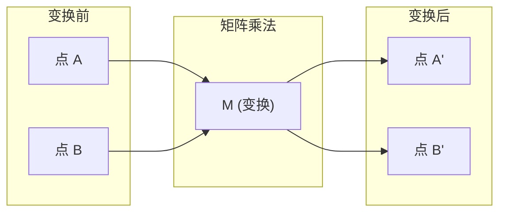
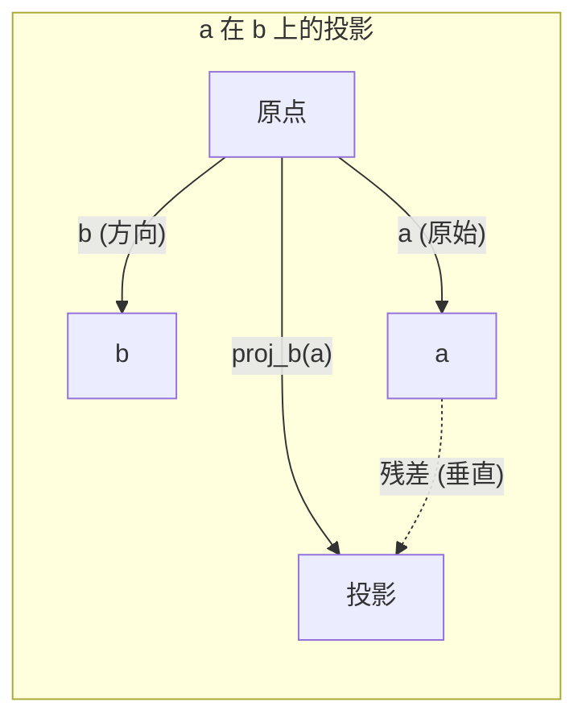

# 线性代数直觉

> 每个 AI 模型不过是穿着花哨帽子的矩阵数学。

**类型：** 学习
**使用语言：** Python、Julia
**前置课程：** 阶段 0
**预计时间：** ~60 分钟

## 学习目标

- 从零在 Python 中实现向量和矩阵操作（加法、点积、矩阵乘法）
- 从几何角度解释点积、投影和 Gram-Schmidt 过程
- 使用行简化判断向量组的线性无关性、秩和基
- 将线性代数概念与 AI 应用联系起来：嵌入、注意力分数和 LoRA

## 问题

打开任何一篇 ML 论文，第一页你就会看到向量、矩阵、点积和变换。没有线性代数的直觉，这些只是符号。有了直觉，你就能看到神经网络实际上在做什么——在空间中移动点。

你不需要成为数学家。你需要看到这些操作在几何上的含义，然后自己编写代码。

## 概念

### 向量是点（也是方向）

向量就是一组数字。但这些数字有含义——它们是空间中的坐标。

**二维向量 [3, 2]：**

| x | y | 点 |
|---|---|-----|
| 3 | 2 | 向量从原点 (0,0) 指向平面上的 (3, 2) |

该向量的模长为 sqrt(3^2 + 2^2) = sqrt(13)，方向指向右上。

在 AI 中，向量代表一切：
- 一个词 → 768 个数字的向量（其在嵌入空间中的「含义」）
- 一张图片 → 数百万像素值的向量
- 一个用户 → 偏好向量

### 矩阵是变换

一个矩阵将一个向量变换为另一个向量。它可以旋转、缩放、拉伸或投影。



在 AI 中，矩阵就是模型：
- 神经网络权重 → 将输入变换为输出的矩阵
- 注意力分数 → 决定关注什么的矩阵
- 嵌入 → 将词映射为向量的矩阵

### 点积衡量相似度

两个向量的点积告诉你它们有多相似。

```
a · b = a₁×b₁ + a₂×b₂ + ... + aₙ×bₙ

同向：     a · b > 0  (相似)
垂直：     a · b = 0  (无关)
反向：     a · b < 0  (不相似)
```

这正是搜索引擎、推荐系统和 RAG 的工作方式——找到高点积的向量。

### 线性无关

如果一组向量中没有任何一个可以写成其他向量的组合，则它们是线性无关的。如果 v1、v2、v3 是无关的，它们张成一个三维空间。如果其中一个是其他向量的组合，它们只能张成一个平面。

为什么这对 AI 重要：你的特征矩阵应该有线性无关的列。如果两个特征完全相关（线性相关），模型无法区分它们的影响。这会导致回归中的多重共线性——权重矩阵变得不稳定，小的输入变化会产生剧烈的输出波动。

**具体示例：**

```
v1 = [1, 0, 0]
v2 = [0, 1, 0]
v3 = [2, 1, 0]   # v3 = 2*v1 + v2
```

v1 和 v2 是无关的——两者都不是对方的标量倍数或组合。但 v3 = 2*v1 + v2，所以 {v1, v2, v3} 是一个相关集合。这三个向量都在 xy 平面上。无论如何组合它们，都无法到达 [0, 0, 1]。你有三个向量却只有两个自由度。

在数据集中：如果 feature_3 = 2*feature_1 + feature_2，添加 feature_3 不会给模型带来任何新信息。更糟糕的是，它使正规方程变得奇异——权重没有唯一解。

### 基与秩

基是一组最少的线性无关向量，张成整个空间。基向量的数量就是空间的维数。

三维空间的标准基是 {[1,0,0], [0,1,0], [0,0,1]}。但三维空间中任何三个无关向量都构成有效基。基的选择就是坐标系的选择。

矩阵的秩 = 线性无关列数 = 线性无关行数。如果秩 < min(rows, cols)，矩阵是秩亏的。这意味着：
- 系统有无穷多个解（或无解）
- 信息在变换中丢失
- 矩阵不可逆

| 情况 | 秩 | 对 ML 的意义 |
|------|-----|--------------|
| 满秩（秩 = min(m, n)） | 最大可能 | 唯一的最小二乘解存在。模型条件良好。 |
| 秩亏（秩 < min(m, n)） | 低于最大值 | 特征冗余。有无穷多个权重解。需要正则化。 |
| 秩为 1 | 1 | 每列是某个向量的缩放副本。所有数据在一条直线上。 |
| 接近秩亏（小奇异值） | 数值上低 | 矩阵病态。微小输入噪声导致大输出变化。使用 SVD 截断或岭回归。 |

### 投影

将向量 **a** 投影到向量 **b** 上得到 a 在 b 方向上的分量：

```
proj_b(a) = (a·b / b·b) * b
```

残差 (a - proj_b(a)) 垂直于 b。这种正交分解是最小二乘拟合的基础。

投影在 ML 中随处可见：
- 线性回归最小化观测点到列空间的距离——解就是一个投影
- PCA 将数据投影到最大方差的方向上
- Transformer 中的注意力计算查询在键上的投影



**示例：** a = [3, 4], b = [1, 0]

proj_b(a) = (3*1 + 4*0) / (1*1 + 0*0) * [1, 0] = 3 * [1, 0] = [3, 0]

投影丢弃了 y 分量。这就是最简单形式的降维——扔掉你不关心的方向。

### Gram-Schmidt 过程

将任意一组无关向量转换为正交归一基。正交归一意味着每个向量长度为 1 且每对向量互相垂直。

算法：
1. 取第一个向量，归一化
2. 取第二个向量，减去其在第一个向量上的投影，归一化
3. 取第三个向量，减去其在所有之前向量上的投影，归一化
4. 对剩余向量重复

```
输入: v1, v2, v3, ... (线性无关)

u1 = v1 / |v1|

w2 = v2 - (v2·u1) * u1
u2 = w2 / |w2|

w3 = v3 - (v3·u1) * u1 - (v3·u2) * u2
u3 = w3 / |w3|

输出: u1, u2, u3, ... (正交归一基)
```

这就是 QR 分解内部的工作方式。Q 是正交归一基，R 捕获投影系数。QR 分解用于：
- 解线性方程组（比高斯消元法更稳定）
- 计算特征值（QR 算法）
- 最小二乘回归（标准的数值方法）

## 构建它

### 步骤 1：从零实现向量（Python）

```python
class Vector:
    def __init__(self, components):
        self.components = list(components)
        self.dim = len(self.components)

    def __add__(self, other):
        return Vector([a + b for a, b in zip(self.components, other.components)])

    def __sub__(self, other):
        return Vector([a - b for a, b in zip(self.components, other.components)])

    def dot(self, other):
        return sum(a * b for a, b in zip(self.components, other.components))

    def magnitude(self):
        return self.dot(self) ** 0.5

    def normalize(self):
        mag = self.magnitude()
        return Vector([c / mag for c in self.components])

    def project_onto(self, other):
        return other.scale(self.dot(other) / other.dot(other))

    def scale(self, scalar):
        return Vector([c * scalar for c in self.components])
```

### 步骤 2：从零实现矩阵操作

参见 `code/` 目录中的完整实现。

### 步骤 3：Gram-Schmidt 实现

```python
def gram_schmidt(vectors):
    result = []
    for v in vectors:
        w = v
        for u in result:
            w = w - u.scale(v.dot(u) / u.dot(u))
        result.append(w.normalize())
    return result
```

### 步骤 4：计算矩阵的秩

```python
def rank(matrix):
    rows = len(matrix)
    cols = len(matrix[0])
    n = min(rows, cols)
    tol = 1e-10
    rank = 0
    for i in range(n):
        if abs(matrix[i][i]) > tol:
            rank += 1
    return rank
```

## 使用它

运行向量操作演示：

```bash
python phases/01-math-foundations/01-linear-algebra-intuition/code/vector_demo.py
```

这会练习向量运算、投影和 Gram-Schmidt 正交归一化。

## 练习

1. 实现 Gram-Schmidt 过程并应用于一组三个三维向量。验证结果向量是正交归一的。
2. 为多个 3x3 矩阵计算秩，确认它匹配线性无关列的数量。
3. 取两个三维向量，计算一个在另一个上的投影，确认残差垂直于投影轴。
4. 解释为什么如果一个 ML 特征矩阵有线性相关的列，它会导致优化问题。

## 关键术语

| 术语 | 人们常说的 | 实际含义 |
|------|-----------|---------|
| 向量 | "一个列表" | 空间中有方向和大小的有序数字集合 |
| 矩阵 | "一个网格" | 一个二维数组，可以将向量从一个空间变换到另一个空间 |
| 点积 | "相似度分数" | 两个向量对应元素乘积之和，衡量对齐程度 |
| 线性无关 | "不冗余" | 当没有向量能表示成其他向量的组合时 |
| 基 | "坐标系" | 一组能通过线性组合张成整个空间的无关向量 |
| 秩 | "维度" | 矩阵中线性无关的行数/列数 |
| 投影 | "阴影" | 将向量分解为平行和垂直于给定方向的分量 |