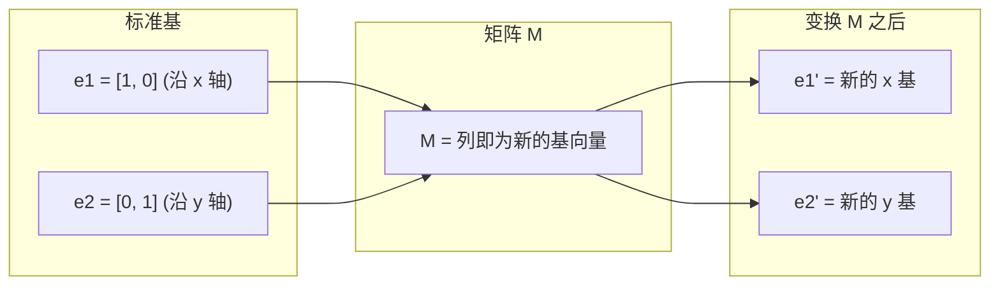

# 矩阵变换

> 矩阵是一台重塑空间的机器。了解它对每个点做了什么，你就理解了整个变换。

**类型：** 构建
**使用语言：** Python、Julia
**前置课程：** 阶段 1，第 01-02 课（线性代数直觉，向量与矩阵运算）
**预计时间：** ~75 分钟

## 学习目标

- 构造旋转、缩放、剪切和反射矩阵，并将其应用于二维和三维点
- 通过矩阵乘法组合多个变换，并验证顺序很重要
- 通过特征方程计算 2x2 矩阵的特征值和特征向量
- 解释为什么特征值决定 PCA 方向、RNN 稳定性和谱聚类行为

## 问题

你读到 PCA 时看到「找到协方差矩阵的特征向量」。你读到模型稳定性时看到「检查所有特征值的模是否小于 1」。你读到数据增强时看到「施加随机旋转」。在理解矩阵对空间几何上的作用之前，这些都是无意义的。

矩阵不仅仅是数字网格。它们是空间机器。旋转矩阵旋转点。缩放矩阵拉伸它们。剪切矩阵倾斜它们。神经网络对数据施加的每个变换都是这些操作之一或它们的组合。本课让这些操作变得具体。

## 概念

### 变换即矩阵

二维中的每个线性变换都可以写成一个 2x2 矩阵。矩阵精确地告诉你基向量 [1, 0] 和 [0, 1] 会落到哪里。其他一切都由此决定。



### 旋转

角度为 θ 的二维旋转保持距离和角度不变。它将每个点沿圆弧移动。

```
R(θ) = | cos θ  -sin θ |
       | sin θ   cos θ |
```

在三维中，你围绕轴旋转：

```
Rz(theta) = | cos  -sin  0 |     绕 z 轴旋转
            | sin   cos  0 |     (x-y 平面旋转，z 不变)
            |  0     0   1 |

Rx(theta) = | 1   0     0    |   绕 x 轴旋转
            | 0  cos  -sin   |   (y-z 平面旋转，x 不变)
            | 0  sin   cos   |

Ry(theta) = |  cos  0  sin |     绕 y 轴旋转
            |   0   1   0  |     (x-z 平面旋转，y 不变)
            | -sin  0  cos |
```

### 缩放

缩放沿每个轴独立拉伸或压缩。

```
S = | sx  0  |     sx 沿 x 轴缩放，sy 沿 y 轴缩放
    | 0   sy |
```

### 剪切

剪切倾斜一个轴，同时保持另一个轴不变。它将矩形变成平行四边形。

```
Shx = | 1  k |     将 x 偏移 k*y
      | 0  1 |

Shy = | 1  0 |     将 y 偏移 k*x
      | k  1 |
```

### 反射

反射将点镜像到轴的对面。

```
反射矩阵:
- 关于 y 轴反射: | -1  0 |
                |  0  1 |
- 关于 x 轴反射: | 1   0 |
                | 0  -1 |
```

### 复合：链式变换

先应用变换 A 再应用 B 等同于将它们的矩阵相乘：`result = B @ A @ point`。顺序很重要。先旋转再缩放与先缩放再旋转的结果不同。

复合: `S @ R = [[0, -2], [0.5, 0]]` 与 `R @ S = [[0, -0.5], [2, 0]]`

不同的结果。矩阵乘法不满足交换律。

### 特征值和特征向量

大多数向量在矩阵作用后方向会改变。特征向量是特殊的：矩阵只缩放它们，从不旋转。缩放因子就是特征值。

```
A @ v = lambda * v

v 是特征向量（不变的方向）
lambda 是特征值（拉伸的倍数）

示例: A = | 2  1 |
          | 1  2 |

特征向量 [1, 1] 对应特征值 3:
  A @ [1,1] = [3, 3] = 3 * [1, 1]     (相同方向，缩放为 3 倍)

特征向量 [1, -1] 对应特征值 1:
  A @ [1,-1] = [1, -1] = 1 * [1, -1]  (相同方向，不变)
```

该矩阵沿 [1, 1] 方向拉伸空间 3 倍，并保持 [1, -1] 不变。其他所有方向都是这两者的混合。

## 构建它

完整实现见 `code/matrix_transformations.py`。这构建了旋转、缩放、剪切和反射矩阵，并演示了复合和特征值计算。

## 练习

1. 对单位正方形 [0,0], [1,0], [1,1], [0,1] 施加 45 度旋转，验证距离保持不变
2. 计算 2x2 缩放矩阵的特征值和特征向量，解释为什么它们是对角线上的缩放因子
3. 复合旋转和缩放，交换顺序，验证结果不同
4. 预测特征值全部大于 1 的矩阵在反复应用时会做什么（提示：梯度爆炸）

## 关键术语

| 术语 | 人们常说的 | 实际含义 |
|------|-----------|---------|
| 旋转 | "转圈" | 保持长度不变，沿圆弧移动点的变换 |
| 缩放 | "拉伸" | 沿每个轴乘以不同因子的变换 |
| 剪切 | "倾斜" | 偏移一个坐标而不移动另一个的变换 |
| 特征向量 | "特殊方向" | 矩阵不旋转、只缩放的向量 |
| 特征值 | "缩放因子" | 矩阵应用于特征向量时的缩放量 |