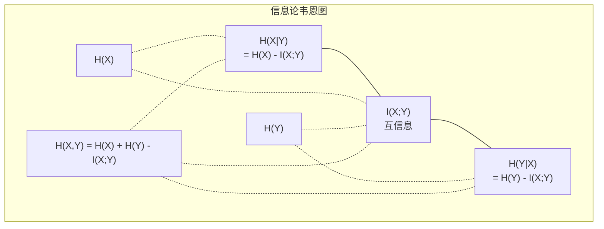

# 信息论

> 信息论衡量的是惊讶程度。损失函数正是建立在这一基础之上的。

**类型：** 学习
**使用语言：** Python
**前置课程：** 阶段 1，第 06 课（概率）
**预计时间：** ~60 分钟

## 学习目标

- 从零计算熵、交叉熵和 KL 散度，并解释它们之间的关系
- 推导为什么最小化交叉熵损失等价于最大化对数似然
- 计算特征与目标变量之间的互信息，以此来对特征重要性进行排序
- 将困惑度解释为语言模型在每个位置上等价选择的词汇量大小

## 问题

你在每个分类模型中都调用 `CrossEntropyLoss()`。你在每篇语言模型论文中都看到「困惑度」。你在 VAE、知识蒸馏和 RLHF 中读到 KL 散度。这些概念并非互不相关——它们本质上是同一个核心理念的不同表现形式。

信息论为你提供了一套推理不确定性、压缩和预测的思维框架。克劳德·香农在 1948 年发明了它来解决通信问题。实际上，训练神经网络本身就是一个通信问题：模型试图通过有噪信道（学习到的权重）来传输正确的标签。

本课从零构建每个公式，让你看清它们的来源和原理。

## 概念

### 信息量（惊讶程度）

当不太可能的事情发生时，它携带的信息量更大。硬币正面朝上？不意外。中彩票？非常意外。

事件的信息量，给定其发生概率 p，为：

```
I(x) = -log(p(x))
```

以 2 为底的对数得到比特（bit）。自然对数得到奈特（nat）。思想相同，只是单位不同。

```
事件                    概率          惊讶程度（比特）
公平硬币正面朝上         0.5          1.0
掷骰子出 6 点            0.167        2.58
千分之一概率的事件       0.001        9.97
确定事件                1.0          0.0
```

确定事件携带的信息量为零——你早就知道它会发生。

### 熵（平均惊讶程度）

熵是分布中所有可能结果上的期望惊讶程度。

```
H(P) = -sum( p(x) * log(p(x)) )  对所有 x
```

对于二元变量，公平硬币的熵最大：1 比特。有偏硬币（99% 正面朝上）的熵很低：0.08 比特。因为你基本上已经知道结果，所以每次抛掷几乎不提供新信息。

```
公平硬币：  H = -(0.5 * log₂(0.5) + 0.5 * log₂(0.5)) = 1.0 比特
有偏硬币：  H = -(0.99 * log₂(0.99) + 0.01 * log₂(0.01)) = 0.08 比特
```

熵衡量的是分布中不可消除的不确定性。熵是数据压缩的理论下限，你无法将数据压缩到低于熵的程度。

### 交叉熵（你每天都在用的损失函数）

交叉熵衡量的是：当你用分布 Q 来编码实际来自分布 P 的事件时，所产生的平均惊讶程度。

```
H(P, Q) = -sum( p(x) * log(q(x)) )  对所有 x
```

P 是真实分布（标签），Q 是你模型的预测分布。如果 Q 完美匹配 P，交叉熵就等于熵。任何不匹配都会使交叉熵变大。

在分类任务中，P 是 one-hot 向量（真实类别概率为 1，其余为 0），这使交叉熵简化为：

```
H(P, Q) = -log(q(真实类别))
```

这就是分类任务中交叉熵损失公式的全部内涵——最大化正确类别的预测概率。

### KL 散度（分布之间的差异度量）

KL 散度衡量的是用 Q 替代 P 所带来的额外惊讶程度。

```
D_KL(P || Q) = sum( p(x) * log(p(x) / q(x)) )  对所有 x
             = H(P, Q) - H(P)
```

交叉熵 = 熵 + KL 散度。由于训练期间真实分布 P 的熵是常数，最小化交叉熵等同于最小化 KL 散度。你正在将模型的预测分布向真实分布靠拢。

KL 散度不对称：D_KL(P || Q) ≠ D_KL(Q || P)。它不是真正的距离度量指标。

### 互信息

互信息衡量知道一个变量能告诉你关于另一个变量的多少信息。

```
I(X; Y) = H(X) - H(X|Y)
        = H(X) + H(Y) - H(X, Y)
```

如果 X 和 Y 互相独立，互信息为零——知道其中一个对另一个毫无帮助。如果完全相关，互信息等于任一变量自身的熵。

在特征选择中，特征与目标之间的互信息高意味着该特征有预测价值，低则意味着该特征是噪声。

### 条件熵

H(Y|X) 衡量在已知 X 之后，对 Y 还残留多少不确定性。

```
H(Y|X) = H(X,Y) - H(X)
```

两种极端情况：
- 如果 X 完全决定了 Y，则 H(Y|X) = 0。已知 X 即消除了对 Y 的全部不确定性。例如：X = 摄氏温度，Y = 华氏温度。
- 如果 X 对 Y 毫无信息量，则 H(Y|X) = H(Y)。已知 X 不会减少你对 Y 的任何不确定性。例如：X = 硬币抛掷结果，Y = 明天的天气。

条件熵永远非负且不超过 H(Y)：

```
0 <= H(Y|X) <= H(Y)
```

在机器学习中，条件熵出现在决策树中。每次分裂时，算法选择使得 H(Y|X) 最小化的特征 X——即最能消除关于标签 Y 不确定性的特征。

### 联合熵

H(X,Y) 是 X 和 Y 的联合分布的熵。

```
H(X,Y) = -Σ Σ p(x,y) * log(p(x,y))  对所有 x, y
```

关键性质：

```
H(X,Y) <= H(X) + H(Y)
```

当 X 和 Y 独立时取等号。如果它们共享信息，联合熵将小于各自熵之和，这个"缺失"的熵恰好就是互信息。



核心关系：
- H(X,Y) = H(X) + H(Y|X) = H(Y) + H(X|Y)
- I(X;Y) = H(X) - H(X|Y) = H(Y) - H(Y|X)
- H(X,Y) = H(X) + H(Y) - I(X;Y)

### 互信息（深入探讨）

互信息 I(X;Y) 量化了知道一个变量能减少另一个变量多少不确定性。

```
I(X;Y) = H(X) - H(X|Y)
       = H(Y) - H(Y|X)
       = H(X) + H(Y) - H(X,Y)
       = Σ Σ p(x,y) * log(p(x,y) / (p(x) * p(y)))
```

性质：
- I(X;Y) ≥ 0 恒成立。观察一个变量永远不会让你损失信息。
- I(X;Y) = 0 当且仅当 X 和 Y 独立。
- I(X;Y) = I(Y;X)。与 KL 散度不同，互信息是对称的。
- I(X;X) = H(X)。一个变量与自身共享全部信息。

**用互信息做特征选择。** 在机器学习中，你需要的是对目标变量有信息量的特征。互信息提供了一种有原则的特征排序方法：

1. 对每个特征 Xᵢ，计算 I(Xᵢ; Y)，其中 Y 是目标变量。
2. 按互信息得分对特征排序。
3. 保留得分最高的 k 个特征。

这适用于特征与目标之间的任何关系——线性、非线性、单调的，或者不单调的。皮尔逊相关系数只能捕捉线性关系，互信息则能捕捉一切统计依赖。

| 方法 | 能检测的关系 | 计算复杂度 | 支持分类变量？ |
|------|------------|-----------|---------------|
| 皮尔逊相关系数 | 线性关系 | O(n) | 否 |
| 斯皮尔曼相关系数 | 单调关系 | O(n log n) | 否 |
| 互信息 | 任意统计依赖 | O(n log n)（分箱） | 是 |

### 标签平滑与交叉熵

标准分类使用硬标签（hard target）：[0, 0, 1, 0]。真实类别概率为 1，其余为 0。标签平滑（Label Smoothing）将这些硬标签替换为软标签：

```
软标签 = (1 - ε) * 硬标签 + ε / 类别数
```

当 ε = 0.1、有 4 个类别时：
- 硬标签：  [0, 0, 1, 0]
- 软标签：  [0.025, 0.025, 0.925, 0.025]

从信息论的角度看，标签平滑增加了目标分布的熵。one-hot 硬标签的熵为 0——没有任何不确定性。软标签具有正熵。

这种做法为什么有效：
- 防止模型将 logits 推向极端值（要完美匹配 one-hot 目标，交叉熵会要求 logits 趋于无穷大）
- 起到正则化作用：模型不能 100% 确定
- 改善校准度（calibration）：预测的概率更真实地反映了不确定性
- 缩小训练和推理行为之间的差距

使用标签平滑后的交叉熵损失变为：

```
L = (1 - ε) * CE(硬标签, 预测) + ε * H_uniform(预测)
```

第二项惩罚偏离均匀分布的预测——直接对置信度进行正则化。

### 为什么交叉熵是分类任务的首选损失函数

三个视角，得出相同的结论。

**信息论视角。** 交叉熵衡量的是你用模型分布替代真实分布时浪费了多少比特。最小化它就是让模型成为现实世界最高效的编码器。

**最大似然视角。** 对 N 个训练样本，真实类别为 yᵢ：

```
似然      = Π q(yᵢ)
对数似然  = Σ log(q(yᵢ))
负对数似然 = -Σ log(q(yᵢ))
```

最后一行就是交叉熵损失。最小化交叉熵 = 在模型下最大化训练数据的似然。

**梯度视角。** 交叉熵对 logits 的梯度恰好是 (预测 - 真实)。干净、稳定、计算高效。这就是为什么它能与 softmax 完美搭配。

### 比特 vs 奈特

唯一的区别在于对数的底数。

```
以 2 为底的对数  → 比特（bit）       （信息论的传统单位）
以 e 为底的对数  → 奈特（nat）       （机器学习的默认单位）
以 10 为底的对数 → 哈特利（hartley）  （极少使用）
```

1 奈特 = 1/ln(2) 比特 ≈ 1.4427 比特。PyTorch 和 TensorFlow 默认使用自然对数（奈特）。

### 困惑度

困惑度是交叉熵的指数。它告诉你模型在每一步等价于从多少个等概率选项中做选择。

```
困惑度 = 2^H(P,Q)   （使用比特时）
困惑度 = e^H(P,Q)   （使用奈特时）
```

一个困惑度为 50 的语言模型，平均而言，就像每次要从 50 个可能的 next token 中均匀地猜一个。困惑度越低越好。

GPT-2 在常见基准上的困惑度约为 30。现代模型在已有充分数据的领域可以达到个位数。

## 构建它

### 第一步：信息量与熵

```python
import math

def information_content(p, base=2):
    if p <= 0 or p > 1:
        return float('inf') if p <= 0 else 0.0
    return -math.log(p) / math.log(base)

def entropy(probs, base=2):
    return sum(
        p * information_content(p, base)
        for p in probs if p > 0
    )

fair_coin = [0.5, 0.5]
biased_coin = [0.99, 0.01]
fair_die = [1/6] * 6

print(f"公平硬币的熵：   {entropy(fair_coin):.4f} 比特")
print(f"有偏硬币的熵：   {entropy(biased_coin):.4f} 比特")
print(f"公平骰子的熵：   {entropy(fair_die):.4f} 比特")
```

### 第二步：交叉熵与 KL 散度

```python
def cross_entropy(p, q, base=2):
    total = 0.0
    for pi, qi in zip(p, q):
        if pi > 0:
            if qi <= 0:
                return float('inf')
            total += pi * (-math.log(qi) / math.log(base))
    return total

def kl_divergence(p, q, base=2):
    return cross_entropy(p, q, base) - entropy(p, base)

true_dist = [0.7, 0.2, 0.1]
good_model = [0.6, 0.25, 0.15]
bad_model = [0.1, 0.1, 0.8]

print(f"真实分布的熵：       {entropy(true_dist):.4f} 比特")
print(f"交叉熵（好模型）：    {cross_entropy(true_dist, good_model):.4f} 比特")
print(f"交叉熵（差模型）：    {cross_entropy(true_dist, bad_model):.4f} 比特")
print(f"KL 散度（好模型）：   {kl_divergence(true_dist, good_model):.4f} 比特")
print(f"KL 散度（差模型）：   {kl_divergence(true_dist, bad_model):.4f} 比特")
```

### 第三步：交叉熵作为分类损失

```python
def softmax(logits):
    max_logit = max(logits)
    exps = [math.exp(z - max_logit) for z in logits]
    total = sum(exps)
    return [e / total for e in exps]

def cross_entropy_loss(true_class, logits):
    probs = softmax(logits)
    return -math.log(probs[true_class])

logits = [2.0, 1.0, 0.1]
true_class = 0

probs = softmax(logits)
loss = cross_entropy_loss(true_class, logits)

print(f"Logits:      {logits}")
print(f"Softmax:     {[f'{p:.4f}' for p in probs]}")
print(f"真实类别：    {true_class}")
print(f"损失：        {loss:.4f} 奈特")
print(f"困惑度：      {math.exp(loss):.2f}")
```

### 第四步：交叉熵等价于负对数似然

```python
import random

random.seed(42)

n_samples = 1000
n_classes = 3
true_labels = [random.randint(0, n_classes - 1) for _ in range(n_samples)]
model_logits = [[random.gauss(0, 1) for _ in range(n_classes)] for _ in range(n_samples)]

ce_loss = sum(
    cross_entropy_loss(label, logits)
    for label, logits in zip(true_labels, model_logits)
) / n_samples

nll = -sum(
    math.log(softmax(logits)[label])
    for label, logits in zip(true_labels, model_logits)
) / n_samples

print(f"交叉熵损失：      {ce_loss:.6f}")
print(f"负对数似然：      {nll:.6f}")
print(f"差值：            {abs(ce_loss - nll):.2e}")
```

### 第五步：互信息

```python
def mutual_information(joint_probs, base=2):
    rows = len(joint_probs)
    cols = len(joint_probs[0])

    margin_x = [sum(joint_probs[i][j] for j in range(cols)) for i in range(rows)]
    margin_y = [sum(joint_probs[i][j] for i in range(rows)) for j in range(cols)]

    mi = 0.0
    for i in range(rows):
        for j in range(cols):
            pxy = joint_probs[i][j]
            if pxy > 0:
                mi += pxy * math.log(pxy / (margin_x[i] * margin_y[j])) / math.log(base)
    return mi

independent = [[0.25, 0.25], [0.25, 0.25]]
dependent = [[0.45, 0.05], [0.05, 0.45]]

print(f"互信息（独立）： {mutual_information(independent):.4f} 比特")
print(f"互信息（相关）： {mutual_information(dependent):.4f} 比特")
```

## 实际应用

下面是使用 NumPy 的等效实现，也就是你在实际工程中的写法：

```python
import numpy as np

def np_entropy(p):
    p = np.asarray(p, dtype=float)
    mask = p > 0
    result = np.zeros_like(p)
    result[mask] = p[mask] * np.log(p[mask])
    return -result.sum()

def np_cross_entropy(p, q):
    p, q = np.asarray(p, dtype=float), np.asarray(q, dtype=float)
    mask = p > 0
    return -(p[mask] * np.log(q[mask])).sum()

def np_kl_divergence(p, q):
    return np_cross_entropy(p, q) - np_entropy(p)

true = np.array([0.7, 0.2, 0.1])
pred = np.array([0.6, 0.25, 0.15])
print(f"熵：       {np_entropy(true):.4f} 奈特")
print(f"交叉熵：   {np_cross_entropy(true, pred):.4f} 奈特")
print(f"KL 散度：  {np_kl_divergence(true, pred):.4f} 奈特")
```

你从零构建了 `torch.nn.CrossEntropyLoss()` 的内部实现。现在你明白为什么训练中损失会下降了：模型的预测分布正在向真实分布靠拢，以"浪费的奈特"来衡量。

完整实现 `phases/01-math-foundations/09-information-theory/code/information_theory.py`
## 练习

1. 假设英文字母均匀分布（26 个字母），计算其熵。然后用实际字母频率估算熵。哪个更高？为什么？

2. 一个模型对某个样本输出 logits [5.0, 2.0, 0.5]，真实类别为 1。手算交叉熵损失，然后用你的 `cross_entropy_loss` 函数验证。怎样的 logits 才能得到零损失？

3. 证明 KL 散度不对称。选择两个分布 P 和 Q，分别计算 D_KL(P || Q) 和 D_KL(Q || P)。解释为什么它们不同。

4. 构建一个函数，计算一个 token 预测序列的困惑度。给定一组 (真实 token 索引, 预测 logits) 对，返回该序列的困惑度。

## 关键术语

| 术语 | 人们常说的 | 实际含义 |
|------|-----------|---------|
| 信息量 | "惊讶程度" | 编码一个事件所需的比特（或奈特）数：-log(p) |
| 熵 | "不确定性" | 分布中所有结果的平均惊讶程度。衡量不可消除的不确定性。 |
| 交叉熵 | "损失函数" | 用模型分布 Q 编码来自真实分布 P 的事件时，产生的平均惊讶程度。 |
| KL 散度 | "分布之间的距离" | 用 Q 替代 P 所浪费的额外比特数。等于交叉熵减熵。不对称。 |
| 互信息 | "X 和 Y 的相关程度" | 知道 Y 后对 X 不确定性的减少量。为零表示互相独立。 |
| Softmax | "将 logits 转为概率" | 指数化并归一化。将任意实数向量映射为合法的概率分布。 |
| 困惑度 | "模型有多困惑" | 交叉熵的指数。模型在每一步等价于从多少个等概率选项中选择。 |
| 比特 | "香农的单位" | 以 2 为底的对数度量的信息。1 比特足以消除一次公平硬币抛掷的不确定性。 |
| 奈特 | "机器学习的单位" | 以自然对数度量的信息。PyTorch 和 TensorFlow 默认使用。 |
| 负对数似然 | "NLL 损失" | 对于 one-hot 标签，与交叉熵损失完全相同。最小化它 = 最大化正确预测的概率。 |

## 延伸阅读

- [Shannon 1948: A Mathematical Theory of Communication](https://people.math.harvard.edu/~ctm/home/text/others/shannon/entropy/entropy.pdf) —— 原论文，至今仍可读性极强
- [Visual Information Theory (Chris Olah)](https://colah.github.io/posts/2015-09-Visual-Information/) —— 熵和 KL 散度最好的可视化解释
- [PyTorch CrossEntropyLoss 文档](https://pytorch.org/docs/stable/generated/torch.nn.CrossEntropyLoss.html) —— 框架如何实现你刚刚构建的内容