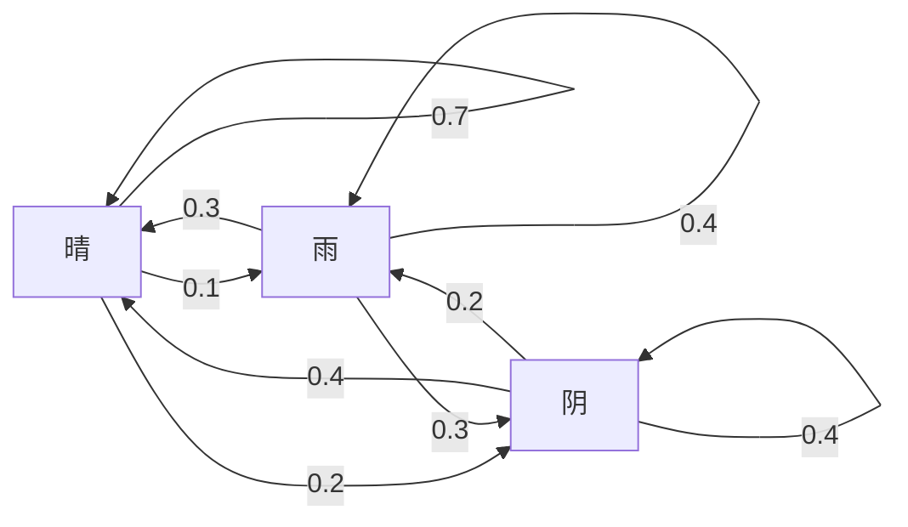
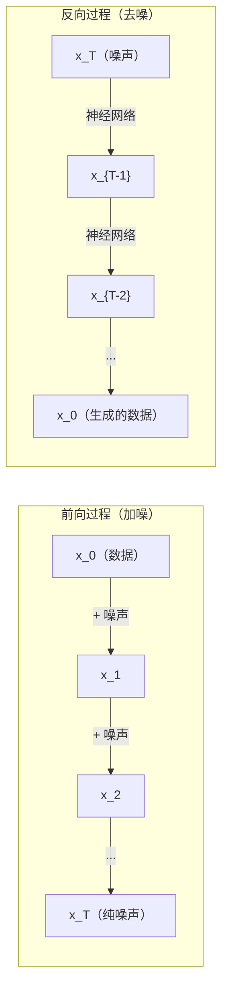

# 随机过程

> 有结构的随机性。随机游走、马尔可夫链和扩散模型背后的数学。

**类型：** Learn
**语言：** Python
**前置知识：** 阶段 1，第 06-07 课（概率、贝叶斯）
**时间：** 约 75 分钟

## 学习目标

- 模拟一维和二维随机游走，验证位移的 sqrt(n) 标度律
- 构建马尔可夫链模拟器，并通过特征分解计算其平稳分布
- 实现 Metropolis-Hastings MCMC 和 Langevin 动力学，从目标分布中采样
- 将前向扩散过程与布朗运动联系起来，并解释反向过程如何生成数据

## 问题

许多 AI 系统涉及随时间演化的随机性。不是静态的随机性——而是有结构的、序列化的随机性，其中每一步都依赖于之前发生的事。

语言模型逐个 token 生成文本。每个 token 都依赖于之前的上下文。模型输出概率分布，从中采样，然后继续。这就是一个随机过程。

扩散模型逐步向图像添加噪声，直到它变成纯粹的静态噪声。然后它们逆转这个过程，逐步去噪，直到一幅新图像浮现。前向过程是一个马尔可夫链。反向过程是一个学习到的逆向运行的马尔可夫链。

强化学习智能体在环境中采取行动。每个行动以一定概率导致一个新状态。智能体在随机世界中遵循随机策略。整个过程就是一个马尔可夫决策过程。

MCMC 采样——贝叶斯推断的支柱——构造一个马尔可夫链，其平稳分布就是你想从中采样的后验分布。

所有这些都建立在四个基础思想上：
1. 随机游走——最简单的随机过程
2. 马尔可夫链——具有转移矩阵的结构化随机性
3. Langevin 动力学——带噪声的梯度下降
4. Metropolis-Hastings——从任意分布中采样

## 概念

### 随机游走

从位置 0 开始。每一步，掷一枚公平硬币。正面：向右移动 (+1)。反面：向左移动 (-1)。

经过 n 步后，你的位置是 n 个随机 +/-1 值的总和。期望位置是 0（游走无偏）。但离原点的期望距离以 sqrt(n) 增长。

这违反直觉。游走是公平的——没有偏向任何方向。但随时间推移，它离起点越来越远。n 步后的标准差是 sqrt(n)。

```
第 0 步：  位置 = 0
第 1 步：  位置 = +1 或 -1
第 2 步：  位置 = +2, 0 或 -2
...
第 100 步：  离原点的期望距离 ~ 10 (sqrt(100))
第 10000 步：离原点的期望距离 ~ 100 (sqrt(10000))
```

**在二维中**，游走以等概率向上、向下、向左或向右移动。相同的 sqrt(n) 标度律适用于离原点的距离。路径描绘出类似分形的图案。

**为什么是 sqrt(n)？** 每一步以等概率为 +1 或 -1。经过 n 步后，位置 S_n = X_1 + X_2 + ... + X_n，其中每个 X_i 是 +/-1。每步的方差为 1，且各步独立，因此 Var(S_n) = n。标准差 = sqrt(n)。根据中心极限定理，S_n / sqrt(n) 收敛到标准正态分布。

这个 sqrt(n) 标度律在 ML 中随处可见。SGD 噪声按 1/sqrt(batch_size) 缩放。嵌入维度按 sqrt(d) 缩放。平方根是独立随机累加的标志。

**与布朗运动的联系。** 取步长为 1/sqrt(n)、每单位时间 n 步的随机游走。当 n 趋于无穷时，游走收敛到布朗运动 B(t)——一个连续时间过程，其中 B(t) 服从正态分布，均值为 0，方差为 t。

布朗运动是扩散的数学基础。它模拟流体中粒子的随机颤动、股票价格的波动，以及——关键的是——扩散模型中的噪声过程。

**赌徒破产问题。** 一个随机游走者从位置 k 开始，在 0 和 N 处设有吸收壁。到达 N 之前先到达 0 的概率是多少？对于公平游走：P(到达 N) = k/N。这出奇地简单而优雅。它与鞅理论相关——公平随机游走是一个鞅（未来期望值 = 当前值）。

### 马尔可夫链

马尔可夫链是一个按照固定概率在状态之间转移的系统。关键性质：下一个状态只依赖于当前状态，而不依赖于历史。

```
P(X_{t+1} = j | X_t = i, X_{t-1} = ...) = P(X_{t+1} = j | X_t = i)
```

这就是马尔可夫性质。这意味着你可以用一个转移矩阵 P 来描述整个动力学：

```
P[i][j] = 从状态 i 转移到状态 j 的概率
```

P 的每一行之和为 1（必须去往某个地方）。

**示例——天气：**

```
状态：晴 (0)、雨 (1)、阴 (2)

P = [[0.7, 0.1, 0.2],    （如果是晴：70% 晴、10% 雨、20% 阴）
     [0.3, 0.4, 0.3],    （如果是雨：30% 晴、40% 雨、30% 阴）
     [0.4, 0.2, 0.4]]    （如果是阴：40% 晴、20% 雨、40% 阴）
```

从任意状态开始。经过多次转移后，状态分布收敛到平稳分布 pi，其中 pi * P = pi。这是 P 的特征值为 1 的左特征向量。

对于天气链，平稳分布可能是 [0.53, 0.18, 0.29]——长期来看，无论起始状态如何，53% 的时间是晴天。



**计算平稳分布。** 有两种方法：

1. **幂方法**：将任意初始分布反复乘以 P。经过足够次迭代后，它会收敛。
2. **特征值方法**：找到 P 的特征值为 1 的左特征向量。这是 P^T 的特征值为 1 的特征向量。

两种方法都要求链满足收敛条件。

**收敛条件。** 马尔可夫链收敛到唯一平稳分布，如果它是：
- **不可约的**：每个状态都可以从其他每个状态到达
- **非周期的**：链不会以固定周期循环

你在 ML 中遇到的大多数链都满足这两个条件。

**吸收态。** 如果一个状态一旦进入就无法离开（P[i][i] = 1），那么它就是吸收态。吸收马尔可夫链模拟具有终止状态的过程——结束的游戏、流失的客户、遇到文本结束 token 的 token 序列。

**混合时间。** 链需要多少步才能"接近"平稳分布？正式定义是，总变差距离从平稳分布下降到某个阈值以下所需的步数。快速混合 = 所需步数少。P 的谱间隙（1 减去第二大的特征值）控制着混合时间。间隙越大 = 混合越快。

### 与语言模型的联系

语言模型中的 token 生成近似是一个马尔可夫过程。给定当前上下文，模型输出下一个 token 的概率分布。温度控制着尖锐程度：

```
P(token_i) = exp(logit_i / temperature) / sum(exp(logit_j / temperature))
```

- 温度 = 1.0：标准分布
- 温度 < 1.0：更尖锐（更确定性）
- 温度 > 1.0：更平坦（更随机）
- 温度 -> 0：argmax（贪心）

Top-k 采样截断到 k 个最高概率的 token。Top-p（nucleus）采样截断到累积概率超过 p 的最小 token 集合。两者都修改了马尔可夫转移概率。

### 布朗运动

随机游走的连续时间极限。位置 B(t) 具有三个性质：
1. B(0) = 0
2. B(t) - B(s) 服从正态分布，均值为 0，方差为 t - s（对于 t > s）
3. 不重叠区间上的增量是独立的

布朗运动是连续的但在任何地方都不可微——它在每个尺度上都颤动。路径在平面中具有分形维度 2。

在离散模拟中，你可以通过以下方式近似布朗运动：

```
B(t + dt) = B(t) + sqrt(dt) * z,    其中 z ~ N(0, 1)
```

sqrt(dt) 的标度很重要。它来自应用于随机游走的中心极限定理。

### Langevin 动力学

梯度下降寻找函数的最小值。Langevin 动力学寻找与 exp(-U(x)/T) 成正比的概率分布，其中 U 是能量函数，T 是温度。

```
x_{t+1} = x_t - dt * gradient(U(x_t)) + sqrt(2 * T * dt) * z_t
```

两个力作用于粒子：
1. **梯度力** (-dt * gradient(U))：推向低能量区域（类似梯度下降）
2. **随机力** (sqrt(2*T*dt) * z)：推向随机方向（探索）

在温度 T = 0 时，这是纯粹的梯度下降。在高温度下，它几乎是随机游走。在合适的温度下，粒子探索能量景观并在低能量区域花费更多时间。

**与扩散模型的联系。** 扩散模型的前向过程是：

```
x_t = sqrt(alpha_t) * x_{t-1} + sqrt(1 - alpha_t) * noise
```

这是一个马尔可夫链，逐步将数据与噪声混合。经过足够步数后，x_T 是纯高斯噪声。

反向过程——从噪声回到数据——也是一个马尔可夫链，但其转移概率由神经网络学习。网络学习预测每一步添加的噪声，然后减去它。



### MCMC：马尔可夫链蒙特卡罗

有时你需要从一个可以计算（除常数因子外）但不能直接采样的分布 p(x) 中采样。贝叶斯后验是经典例子——你知道似然乘以先验，但归一化常数难以计算。

**Metropolis-Hastings** 构造一个平稳分布为 p(x) 的马尔可夫链：

1. 从某个位置 x 开始
2. 从提议分布 Q(x'|x) 中提议一个新位置 x'
3. 计算接受比：a = p(x') * Q(x|x') / (p(x) * Q(x'|x))
4. 以概率 min(1, a) 接受 x'。否则保持在 x。
5. 重复。

如果 Q 是对称的（例如，Q(x'|x) = Q(x|x') = N(x, sigma^2)），则比率简化为 a = p(x') / p(x)。你只需要概率之比——归一化常数会抵消。

链保证在温和条件下收敛到 p(x)。但如果提议太小（随机游走）或太大（高拒绝率），收敛会很慢。调整提议是 MCMC 的艺术。

**为什么有效。** 接受比确保细致平衡：处于 x 并移动到 x' 的概率等于处于 x' 并移动到 x 的概率。细致平衡意味着 p(x) 是链的平稳分布。所以经过足够步数后，样本来自 p(x)。

**实际考虑：**
- **预热期（Burn-in）**：丢弃前 N 个样本。链需要时间从起始点到达平稳分布。
- **稀释（Thinning）**：保留每第 k 个样本以减少自相关性。
- **多链**：从不同起点运行多条链。如果它们收敛到相同分布，你就有收敛的证据。
- **接受率**：对于 d 维高斯提议，最优接受率约为 23%（Roberts & Rosenthal, 2001）。太高意味着链几乎不动。太低意味着它拒绝一切。

### AI 中的随机过程

| 过程 | AI 应用 |
|------|--------|
| 随机游走 | RL 中的探索、Node2Vec 嵌入 |
| 马尔可夫链 | 文本生成、MCMC 采样 |
| 布朗运动 | 扩散模型（前向过程） |
| Langevin 动力学 | 基于分数的生成模型、SGLD |
| 马尔可夫决策过程 | 强化学习 |
| Metropolis-Hastings | 贝叶斯推断、后验采样 |

## Build It

### 第 1 步：随机游走模拟器

```python
import numpy as np

def random_walk_1d(n_steps, seed=None):
    rng = np.random.RandomState(seed)
    steps = rng.choice([-1, 1], size=n_steps)
    positions = np.concatenate([[0], np.cumsum(steps)])
    return positions


def random_walk_2d(n_steps, seed=None):
    rng = np.random.RandomState(seed)
    directions = rng.choice(4, size=n_steps)
    dx = np.zeros(n_steps)
    dy = np.zeros(n_steps)
    dx[directions == 0] = 1   # 右
    dx[directions == 1] = -1  # 左
    dy[directions == 2] = 1   # 上
    dy[directions == 3] = -1  # 下
    x = np.concatenate([[0], np.cumsum(dx)])
    y = np.concatenate([[0], np.cumsum(dy)])
    return x, y
```

一维游走存储累积和。每一步是 +1 或 -1。经过 n 步后，位置是和。方差随 n 线性增长，因此标准差以 sqrt(n) 增长。

### 第 2 步：马尔可夫链

```python
class MarkovChain:
    def __init__(self, transition_matrix, state_names=None):
        self.P = np.array(transition_matrix, dtype=float)
        self.n_states = len(self.P)
        self.state_names = state_names or [str(i) for i in range(self.n_states)]

    def step(self, current_state, rng=None):
        if rng is None:
            rng = np.random.RandomState()
        probs = self.P[current_state]
        return rng.choice(self.n_states, p=probs)

    def simulate(self, start_state, n_steps, seed=None):
        rng = np.random.RandomState(seed)
        states = [start_state]
        current = start_state
        for _ in range(n_steps):
            current = self.step(current, rng)
            states.append(current)
        return states

    def stationary_distribution(self):
        eigenvalues, eigenvectors = np.linalg.eig(self.P.T)
        idx = np.argmin(np.abs(eigenvalues - 1.0))
        stationary = np.real(eigenvectors[:, idx])
        stationary = stationary / stationary.sum()
        return np.abs(stationary)
```

平稳分布是 P 的特征值为 1 的左特征向量。我们通过计算 P^T 的特征向量来找到它（转置将左特征向量转换为右特征向量）。

### 第 3 步：Langevin 动力学

```python
def langevin_dynamics(grad_U, x0, dt, temperature, n_steps, seed=None):
    rng = np.random.RandomState(seed)
    x = np.array(x0, dtype=float)
    trajectory = [x.copy()]
    for _ in range(n_steps):
        noise = rng.randn(*x.shape)
        x = x - dt * grad_U(x) + np.sqrt(2 * temperature * dt) * noise
        trajectory.append(x.copy())
    return np.array(trajectory)
```

梯度将 x 推向低能量区域。噪声防止其陷入困境。在平衡状态下，样本分布与 exp(-U(x)/temperature) 成正比。

### 第 4 步：Metropolis-Hastings

```python
def metropolis_hastings(target_log_prob, proposal_std, x0, n_samples, seed=None):
    rng = np.random.RandomState(seed)
    x = np.array(x0, dtype=float)
    samples = [x.copy()]
    accepted = 0
    for _ in range(n_samples - 1):
        x_proposed = x + rng.randn(*x.shape) * proposal_std
        log_ratio = target_log_prob(x_proposed) - target_log_prob(x)
        if np.log(rng.rand()) < log_ratio:
            x = x_proposed
            accepted += 1
        samples.append(x.copy())
    acceptance_rate = accepted / (n_samples - 1)
    return np.array(samples), acceptance_rate
```

算法提议一个新点，检查它是否有更高的概率（或以与比率成正比概率接受），然后重复。接受率应在 23-50% 左右才能良好混合。

## Use It

在实践中，你使用成熟的库来实现这些算法。但理解其机制对于调试和调优至关重要。

```python
import numpy as np

rng = np.random.RandomState(42)
walk = np.cumsum(rng.choice([-1, 1], size=10000))
print(f"最终位置：{walk[-1]}")
print(f"期望距离：{np.sqrt(10000):.1f}")
print(f"实际距离：{abs(walk[-1])}")
```

### 使用 numpy 处理转移矩阵

```python
import numpy as np

P = np.array([[0.7, 0.1, 0.2],
              [0.3, 0.4, 0.3],
              [0.4, 0.2, 0.4]])

distribution = np.array([1.0, 0.0, 0.0])
for _ in range(100):
    distribution = distribution @ P

print(f"平稳分布：{np.round(distribution, 4)}")
```

将初始分布反复乘以 P。经过足够次迭代后，无论从何处开始，它都会收敛到平稳分布。这是寻找主导左特征向量的幂方法。

### 与真实框架的联系

- **PyTorch 扩散模型：** Hugging Face `diffusers` 中的 `DDPMScheduler` 实现了前向和反向马尔可夫链
- **NumPyro / PyMC：** 使用 MCMC（NUTS 采样器，改进了 Metropolis-Hastings）进行贝叶斯推断
- **Gymnasium (RL)：** 环境 step 函数定义了一个马尔可夫决策过程

### 验证马尔可夫链收敛

```python
import numpy as np

P = np.array([[0.9, 0.1], [0.3, 0.7]])

eigenvalues = np.linalg.eigvals(P)
spectral_gap = 1 - sorted(np.abs(eigenvalues))[-2]
print(f"特征值：{eigenvalues}")
print(f"谱间隙：{spectral_gap:.4f}")
print(f"近似混合时间：{1/spectral_gap:.1f} 步")
```

谱间隙告诉你链遗忘初始状态的速度。间隙 0.2 意味着大约 5 步混合。间隙 0.01 意味着大约 100 步。在运行长时间模拟之前始终检查这一点——混合缓慢的链会浪费计算资源。

## Ship It

本课产出：
- `outputs/prompt-stochastic-process-advisor.md` -- 帮助识别哪个随机过程框架适用于给定问题的提示词

完整实现：`phases/01-math-foundations/22-stochastic-processes/code/stochastic.py`


## 关联

| 概念 | 出现位置 |
|------|---------|
| 随机游走 | Node2Vec 图嵌入、RL 中的探索 |
| 马尔可夫链 | LLM 中的 token 生成、MCMC 采样 |
| 布朗运动 | DDPM 中的前向扩散过程、基于 SDE 的模型 |
| Langevin 动力学 | 基于分数的生成模型、随机梯度 Langevin 动力学 (SGLD) |
| 平稳分布 | MCMC 收敛目标、PageRank |
| Metropolis-Hastings | 贝叶斯后验采样、模拟退火 |
| 温度 | LLM 采样、RL 中的 Boltzmann 探索、模拟退火 |
| 混合时间 | MCMC 收敛速度、谱间隙分析 |
| 吸收态 | 序列结束 token、RL 中的终止状态 |
| 细致平衡 | MCMC 采样器的正确性保证 |

扩散模型值得特别关注。DDPM（Ho et al., 2020）定义了一个前向马尔可夫链：

```
q(x_t | x_{t-1}) = N(x_t; sqrt(1-beta_t) * x_{t-1}, beta_t * I)
```

其中 beta_t 是噪声调度表。经过 T 步后，x_T 近似为 N(0, I)。反向过程由一个预测噪声的神经网络参数化：

```
p_theta(x_{t-1} | x_t) = N(x_{t-1}; mu_theta(x_t, t), sigma_t^2 * I)
```

生成的每一步都是学习到的马尔可夫链中的一步。理解马尔可夫链就是理解扩散模型如何以及为何能生成数据。

SGLD（随机梯度 Langevin 动力学）将小批量梯度下降与 Langevin 噪声相结合。你不是计算完整梯度，而是使用随机估计并添加校准噪声。随着学习率衰减，SGLD 从优化过渡到采样——你免费获得了近似的贝叶斯后验样本。这是从神经网络获取不确定性估计的最简单方法之一。

贯穿所有这些联系的关键洞见：随机过程不仅是理论工具，它们是现代 AI 系统内部的计算机制。当你调整 LLM 的温度时，你在调整一个马尔可夫链。当你训练扩散模型时，你在学习逆转一个类似布朗运动的过程。当你运行贝叶斯推断时，你在构造一个收敛到后验分布的链。

## 练习

1. **模拟 1000 次 10000 步的随机游走。** 绘制最终位置的分布。验证它近似服从高斯分布，均值为 0，标准差为 sqrt(10000) = 100。

2. **构建一个文本生成器，使用马尔可夫链。** 在小语料库上训练：对每个单词，统计转移到下一个单词的次数。构建转移矩阵。通过从链中采样生成新句子。

3. **比较 MCMC 采样器。** 实现 Metropolis-Hastings 并从混合高斯分布中采样。尝试不同的提议标准差（0.1、1.0、10.0）。观察接受率和样本质量如何变化。

4. **模拟布朗运动。** 生成 1000 条布朗运动路径，每条 1000 步。验证在 t=1000 时，位置分布近似为 N(0, 1000)。绘制几条路径以可视化"颤动"。

5. **在双井势能上运行 Langevin 动力学。** U(x) = (x^2 - 1)^2。这个势能有两个最小值，分别在 x = -1 和 x = 1。在不同温度下运行 Langevin 动力学。在低温下，粒子应该主要停留在一个井中。在高温下，它应该在两个井之间跳跃。

## 关键术语

| 术语 | 人们怎么说 | 实际含义 |
|------|-----------|---------|
| 随机游走 | "随机走动的粒子" | S_n = sum_{i=1}^n X_i，其中 X_i 是独立步骤，期望位移 = sqrt(n) |
| 马尔可夫链 | "无记忆的随机过程" | P(X_{t+1} | X_t, ...) = P(X_{t+1} | X_t)，未来只依赖于现在 |
| 平稳分布 | "长期概率" | pi = pi * P，链遗忘其起点的分布 |
| 吸收态 | "终结状态" | P[i][i] = 1，一旦进入就无法离开 |
| 布朗运动 | "连续随机游走" | B(t) ~ N(0, t)，连续但处处不可微 |
| Langevin 动力学 | "带噪声的梯度下降" | x_t = x_t - dt * grad(U) + sqrt(2T*dt) * N(0,1) |
| MCMC | "通过模拟采样" | 构造一个平稳分布为目标分布的马尔可夫链 |
| Metropolis-Hastings | "接受-拒绝采样" | 提议移动，比较概率，概率性接受 |
| 温度 | "随机性控制" | 更高温度 = 更平坦的分布，更多探索 |
| 混合时间 | "收敛速度" | 链逼近平稳分布所需的步数 |

## 扩展阅读

- **Ho, Jain, & Abbeel (2020)** -- "Denoising Diffusion Probabilistic Models." 定义扩散模型前向和反向马尔可夫链的论文。
- **Roberts & Rosenthal (2004)** -- "General State Space Markov Chains and MCMC Algorithms." 关于 MCMC 收敛性和调优的全面综述。
- **Murray (2007)** -- "Advances in Markov Chain Monte Carlo Methods." 博士论文，涵盖 MCMC 采样器及其属性。
- **Welling & Teh (2011)** -- "Bayesian Learning via Stochastic Gradient Langevin Dynamics." 将 SGD 与 Langevin 动力学结合，实现可扩展的贝叶斯推断。