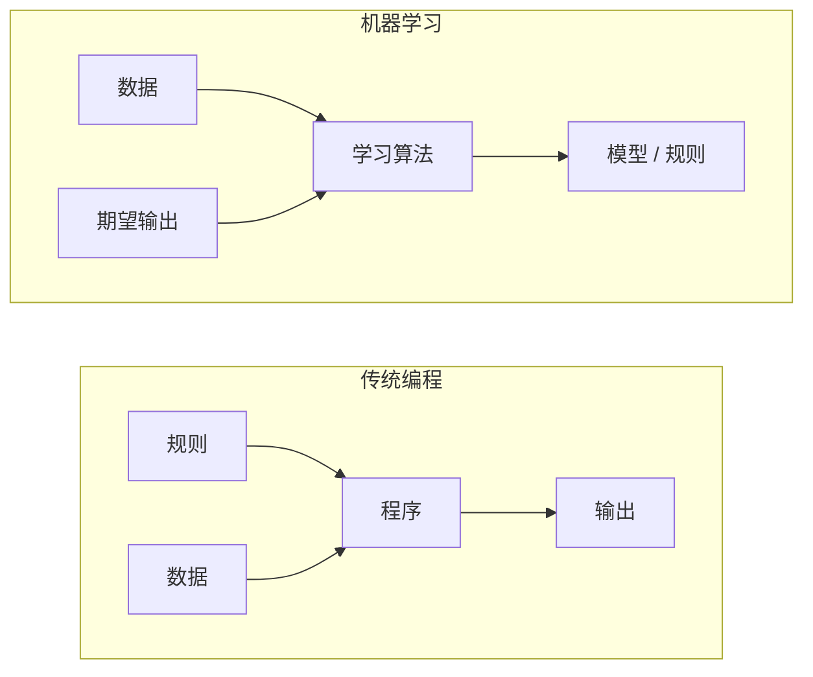
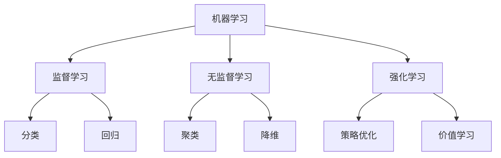
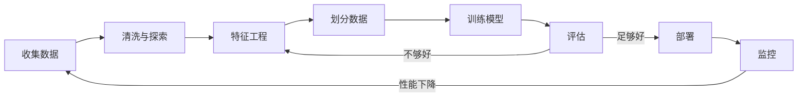
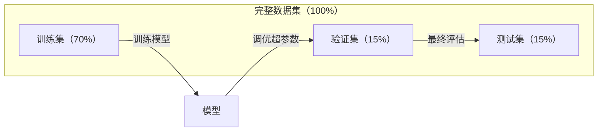
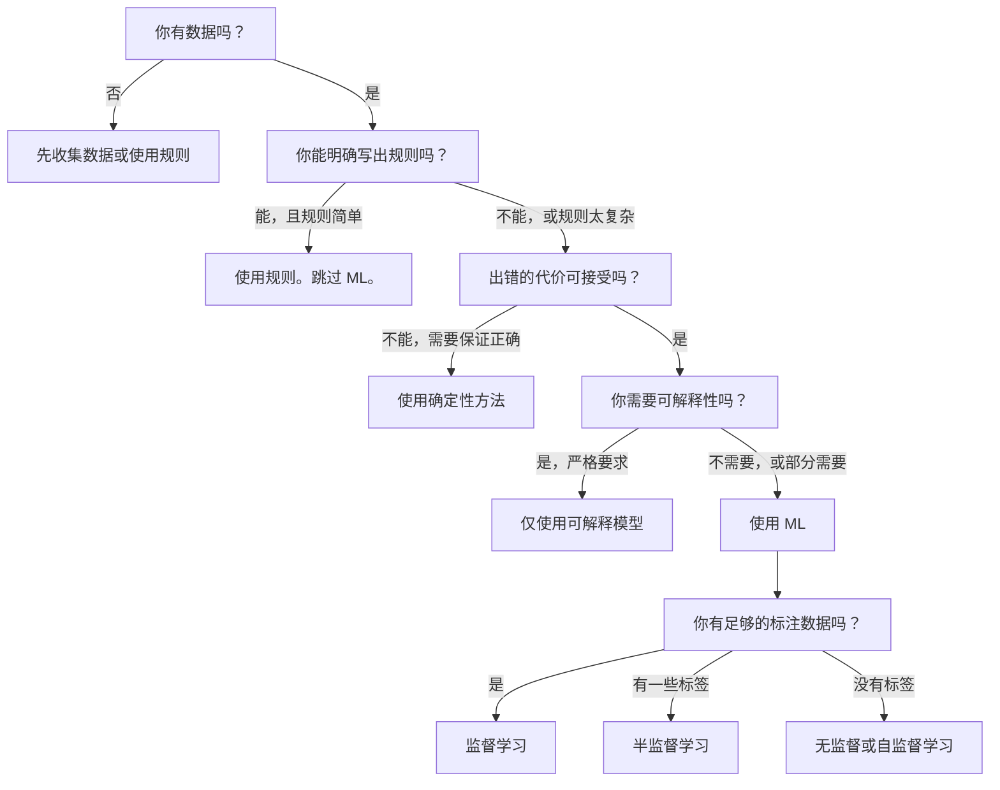

# 什么是机器学习

> 机器学习是教计算机在数据中寻找模式，而不是手工编写规则。

**类型：** Learn
**语言：** Python
**前置知识：** 阶段 1（数学基础）
**时间：** 约 45 分钟

## 学习目标

- 解释监督学习、无监督学习和强化学习之间的区别，并识别给定问题适用哪种类型
- 从零实现最近质心分类器，并与随机基线进行评估比较
- 区分分类和回归任务，并为每种任务选择合适的损失函数
- 评估一个给定的业务问题是否适合使用 ML，还是更适合用确定性规则来解决

## 问题

你想构建一个垃圾邮件过滤器。传统方法：坐下来编写数百条规则。"如果邮件包含'免费赚钱'，标记为垃圾邮件。如果感叹号超过 3 个，标记为垃圾邮件。"你花费数周编写规则。然后垃圾邮件发送者改变了措辞，你的规则失效了。你编写更多规则。这个循环永无止境。

机器学习翻转了这个过程。你不用编写规则，而是给计算机数千封已标记的邮件（"垃圾邮件"或"非垃圾邮件"），让它自行找出规则。计算机会发现你从未想到的模式。当垃圾邮件发送者改变策略时，你只需在新数据上重新训练，而不是重写代码。

这种从"编写规则"到"从数据中学习"的转变是机器学习的核心。每个推荐引擎、语音助手、自动驾驶汽车和语言模型都以这种方式工作。

## 概念

### 从数据中学习，而非从规则中学习

传统编程和机器学习以相反的方向解决问题。



传统编程：你编写规则。程序将规则应用于数据以产生输出。

机器学习：你提供数据和期望输出。算法发现规则。

训练产出的"模型"就是规则，以数字（权重、参数）编码。它从见过的样本中泛化，对从未见过的数据进行预测。

### 机器学习的三种类型



**监督学习**：你有输入-输出对。模型学习将输入映射到输出。
- "这里有 10,000 张标记为猫或狗的照片。学会区分它们。"
- "这里有房屋特征和价格。学会预测价格。"

**无监督学习**：你只有输入，没有标签。模型自行寻找结构。
- "这里有 10,000 条客户购买历史。找到自然分组。"
- "这里有 1,000 维的数据点。降维到 2 维同时保持结构。"

**强化学习**：智能体在环境中采取行动并获得奖励或惩罚。它学习一种策略来最大化总奖励。
- "玩这个游戏。赢 +1 分，输 -1 分。找出策略。"
- "控制这个机器臂。拾起物体 +1 分，每秒浪费 -0.01 分。"

你在实践中构建的大多数项目使用监督学习。无监督学习常用于预处理和探索。强化学习支撑游戏 AI、机器人和语言模型的 RLHF。

### 超越三大类型

以上三种类别很清晰，但现实世界中的 ML 经常模糊界限。

**半监督学习** 使用少量标记数据和大量未标记数据。你可能只有 100 张有标签的医学图像和 100,000 张无标签的。技术包括：

- **标签传播：** 构建一个连接相似数据点的图。标签从已标记节点通过图传播到未标记邻居。
- **伪标签：** 在已标记数据上训练模型，用它预测未标记数据的标签，然后在所有数据上重新训练。模型自举自己的训练集。
- **一致性正则化：** 模型应该对输入及其轻微扰动版本给出相同的预测。这即使没有标签也能工作。

**自监督学习** 从数据本身创建监督信号。完全不需要人工标注。模型从数据的结构中创建自己的预测任务。

- **掩码语言建模（BERT）：** 隐藏句子中 15% 的单词，训练模型预测缺失的单词。"标签"来自原始文本。
- **对比学习（SimCLR）：** 取一张图片，创建两个增强版本。训练模型识别它们来自同一张图片，同时将它们与其他图片的增强版本区分开。
- **下一个 token 预测（GPT）：** 给定所有之前的单词，预测下一个单词。每个文本文档都成为一个训练样本。

这些不是与三大类型分离的类别，而是结合了监督和无监督思想的策略。自监督学习在技术上是监督学习（模型预测某个目标），但标签是自动生成的，而不是由人标注的。

### 分类 vs 回归

这是两种主要的监督学习任务。

| 方面 | 分类 | 回归 |
|------|------|------|
| 输出 | 离散类别 | 连续数值 |
| 示例 | "这封邮件是垃圾邮件吗？" | "房价会是多少？" |
| 输出空间 | {猫, 狗, 鸟} | 任意实数 |
| 损失函数 | 交叉熵、准确率 | 均方误差、MAE |
| 决策 | 类别之间的边界 | 拟合数据的曲线 |

分类回答"哪个类别？"，回归回答"多少？"

有些问题可以两种方式构建。预测股票涨还是跌是分类。预测精确价格是回归。

### ML 工作流

每个机器学习项目都遵循相同的流程，无论使用什么算法。



**收集数据**：收集原始数据。更多数据几乎总是更好，但质量比数量更重要。

**清洗与探索**：处理缺失值、删除重复项、可视化分布、发现异常。这一步通常占项目总时间的 60-80%。

**特征工程**：将原始数据转换为模型可以使用的特征。将日期转为星期几。归一化数值列。编码分类变量。好的特征比花哨的算法更重要。

**划分数据**：分为训练集、验证集和测试集。模型在训练数据上训练，在验证数据上调优超参数，在测试数据上报告最终性能。

**训练模型**：将训练数据输入算法。算法调整内部参数以最小化损失函数。

**评估**：在验证/测试数据上测量性能。如果性能不能接受，返回尝试不同的特征、算法或超参数。

**部署**：将模型投入生产，对新的数据进行预测。

**监控**：随时间跟踪性能。数据分布会变化（数据漂移），模型会退化。当性能下降时，重新训练。

### 训练集、验证集和测试集的划分

这是初学者最容易搞错的最重要概念。你必须在模型从未在训练中见过的数据上评估模型。否则你衡量的是记忆，而不是学习。



| 划分 | 用途 | 何时使用 | 典型大小 |
|------|------|---------|---------|
| 训练集 | 模型从中学习 | 训练期间 | 60-80% |
| 验证集 | 调优超参数、比较模型 | 每次训练运行后 | 10-20% |
| 测试集 | 最终无偏性能估计 | 一次，最后 | 10-20% |

测试集是神圣的。你只能看一次。如果你不断根据测试性能调整模型，你实际上是在测试集上训练，报告的数字将毫无意义。

对于小数据集，使用 k 折交叉验证：将数据分成 k 份，在 k-1 份上训练，在剩下的一份上验证，轮换，并平均结果。

### 过拟合 vs 欠拟合


**欠拟合**：模型太简单，无法捕捉数据中的模式。直线试图拟合曲线关系。训练误差高，测试误差高。

**过拟合**：模型太复杂，记忆了训练数据，包括其中的噪声。一条弯弯曲曲的曲线经过每个训练点，但在新数据上失败。训练误差低，测试误差高。

**良好拟合**：模型捕捉真实模式而不是记忆噪声。训练误差和测试误差都合理低。

过拟合的迹象：
- 训练准确率远高于验证准确率
- 模型在训练数据上表现良好但在新数据上表现差
- 增加更多训练数据能提升性能（模型之前是在记忆，而不是学习）

过拟合的修复方法：
- 获取更多训练数据
- 降低模型复杂度（更少参数、更简单架构）
- 正则化（对大的权重施加惩罚）
- Dropout（训练时随机将神经元置零）
- 早停（当验证误差开始上升时停止训练）

欠拟合的修复方法：
- 使用更复杂的模型
- 添加更多特征
- 减少正则化
- 训练更长时间

### 偏差-方差权衡

这是过拟合和欠拟合背后的数学框架。

**偏差**：模型错误假设导致的误差。当真关系是非线性时，线性模型具有高偏差。高偏差导致欠拟合。

**方差**：模型对训练数据中小波动的敏感性导致的误差。高方差模型在训练数据的不同子集上训练时会产生非常不同的预测。高方差导致过拟合。

| 模型复杂度 | 偏差 | 方差 | 结果 |
|-----------|------|------|------|
| 太低（曲线数据用线性模型） | 高 | 低 | 欠拟合 |
| 正好 | 中 | 中 | 良好泛化 |
| 太高（10 个点用 20 次多项式） | 低 | 高 | 过拟合 |

总误差 = 偏差² + 方差 + 不可约噪声

你无法减少不可约噪声（它是数据本身的随机性）。你想找到偏差² + 方差最小的甜蜜点。

### 没有免费午餐定理

没有在所有问题上都表现最好的单一算法。在一类问题上表现好的算法在另一类问题上会表现差。这就是为什么数据科学家会尝试多种算法并比较结果。

在实践中，选择取决于：
- 你有多少数据
- 有多少特征
- 关系是线性的还是非线性的
- 你需不需要可解释性
- 你能负担多少算力

### 何时不使用机器学习

ML 很强大但并非总是正确的工具。在使用模型之前，先问自己是否真的需要。

**以下情况不要使用 ML：**

- **规则简单且定义清晰。** 税务计算、排序算法、单位换算。如果你能用几个 if 语句写出逻辑，模型只会增加复杂性和无益的成本。
- **你没有数据或数据极少。** ML 需要样本来学习。只有 10 个数据点时，你无法训练任何有意义的东西。先收集数据。
- **错误的代价是灾难性的，你需要保证正确性。** 医疗剂量计算、核反应堆控制、密码学验证。ML 模型是概率性的。它们有时会出错。如果"有时出错"不可接受，使用确定性方法。
- **查表或启发式方法能解决问题。** 如果简单的阈值或表格覆盖了 99% 的情况，添加 ML 增加了维护成本却没有实质改善。
- **你无法解释决策，而可解释性是必需的。** 受监管行业（贷款、保险、刑事司法）有时要求每个决策都完全可解释。有些 ML 模型是可解释的（线性回归、小型决策树）。大多数不是。
- **问题的变化速度快于你的重训练速度。** 如果规则每天变化而重训练需要一周，模型总是过时的。

使用以下决策流程图：



## Build It

`code/ml_intro.py` 中的代码从零实现了最近质心分类器——最简单的 ML 算法。它展示了核心思想：从数据中学习，然后对新数据进行预测。

### 第 1 步：从零构建最近质心分类器

最近质心分类器计算训练数据中每个类别的中心（均值）。预测时，它将每个新点分配给中心最近的类别。

```python
class NearestCentroid:
    def fit(self, X, y):
        self.classes = np.unique(y)
        self.centroids = np.array([
            X[y == c].mean(axis=0) for c in self.classes
        ])

    def predict(self, X):
        distances = np.array([
            np.sqrt(((X - c) ** 2).sum(axis=1))
            for c in self.centroids
        ])
        return self.classes[distances.argmin(axis=0)]
```

这就是整个算法。Fit 计算两个均值。Predict 计算距离。没有梯度下降、没有迭代、没有超参数。

### 第 2 步：在合成数据上训练

我们生成一个二维分类数据集，两个类别有轻微重叠。质心分类器在类别中心之间画出一条线性决策边界。

```python
rng = np.random.RandomState(42)
X_class0 = rng.randn(100, 2) + np.array([1.0, 1.0])
X_class1 = rng.randn(100, 2) + np.array([-1.0, -1.0])
X = np.vstack([X_class0, X_class1])
y = np.array([0] * 100 + [1] * 100)
```

### 第 3 步：与基线比较

每个 ML 模型都应与一个简单基线进行比较。这里基线预测随机类别。如果你的 ML 模型不能胜过随机猜测，就有问题了。

```python
baseline_preds = rng.choice([0, 1], size=len(y_test))
baseline_acc = np.mean(baseline_preds == y_test)
```

质心分类器在这个干净的数据集上应该达到约 90%+ 的准确率。随机基线约为 50%。

### 这为什么重要

最近质心分类器极其简单。它没有超参数、没有迭代、没有梯度下降。然而它捕捉了 ML 的基本模式：

1. **学习** 从训练数据中获得表示（质心）
2. **预测** 使用该表示对新数据进行预测（最近距离）
3. **评估** 与基线对比（随机猜测）

每个 ML 算法，从逻辑回归到 Transformer，都遵循同样的三步模式。表示变得更复杂，但工作流保持不变。

### 第 4 步：质心分类器的局限

最近质心分类器假设每个类别形成一个单独的团块。它画出线性决策边界。它会在以下情况失败：

- 类别有多个簇（例如，数字"1"可以用多种不同方式书写）
- 决策边界是非线性的（例如，一个类别环绕另一个类别）
- 特征有非常不同的尺度（距离被最大尺度的特征主导）

这些局限引出了你将学习的所有其他算法。K 近邻处理多簇。决策树处理非线性边界。特征缩放解决尺度问题。每节课建立在前一节课的局限之上。

## Use It

sklearn 提供了 `NearestCentroid` 和合成数据生成器：

```python
from sklearn.neighbors import NearestCentroid
from sklearn.datasets import make_classification
from sklearn.model_selection import train_test_split

X, y = make_classification(
    n_samples=500, n_features=2, n_redundant=0,
    n_clusters_per_class=1, random_state=42
)
X_train, X_test, y_train, y_test = train_test_split(X, y, test_size=0.3)

clf = NearestCentroid()
clf.fit(X_train, y_train)
print(f"准确率：{clf.score(X_test, y_test):.3f}")
```

## Ship It

本课产出 `outputs/prompt-ml-problem-framer.md` —— 一个将模糊的业务问题转化为具体 ML 任务的提示词。给它一个问题描述（"我们想减少流失"或"预测下季度需求"），它会识别学习类型、定义预测目标、列出候选特征、选择成功指标、建立基线，并标记数据泄露或类别不平衡等陷阱。在任何 ML 项目开始时使用它，避免构建错误的东西。

完整实现：`phases/02-ml-fundamentals/01-what-is-machine-learning/code/ml_intro.py`


## 关键术语

| 术语 | 人们怎么说 | 实际含义 |
|------|-----------|---------|
| 模型 | "AI" | 一个具有可学习参数的数学函数，将输入映射到输出 |
| 训练 | "教 AI" | 运行优化算法调整模型参数，使预测与已知输出匹配 |
| 特征 | "输入列" | 数据的一个可测量属性，模型用它进行预测 |
| 标签 | "答案" | 训练样本的已知输出，用于计算误差信号 |
| 超参数 | "你调整的设置" | 在训练前设置的参数，控制学习过程（学习率、层数） |
| 损失函数 | "模型错得多离谱" | 衡量预测与实际输出差距的函数，训练试图最小化它 |
| 过拟合 | "它背诵了考试" | 模型学习了训练特定的噪声而非一般模式，因此在新数据上失败 |
| 欠拟合 | "它什么都没学到" | 模型太简单，无法捕捉数据中的真实模式 |
| 泛化 | "在新数据上有效" | 模型对未训练过的数据做出准确预测的能力 |
| 交叉验证 | "在不同块上测试" | 反复将数据分为训练/测试折并平均结果，给出更稳健的性能估计 |
| 正则化 | "保持权重小" | 在损失函数中加入惩罚项，阻止过于复杂的模型 |
| 数据漂移 | "世界变了" | 新数据的统计分布随时间变化，降低模型性能 |

## 练习

1. 取任意数据集（如 Iris、Titanic）。按 70/15/15 分为训练/验证/测试。解释为什么不应在测试集上调优超参数。

2. 在 2D 数据上训练最近质心分类器。画出质心和决策边界。对于什么形状的簇，这个分类器会失败？给出具体例子。

3. 选择一个你遇到的业务问题。写成这样："输入：[描述数据]，输出：[想预测什么]，学习类型：[监督/无监督/强化]，成功指标：[指标]，基线：[简单基线]"。

4. 在越来越复杂的合成数据集上比较你从零实现的 NearestCentroid 和 sklearn 的版本。它们应该产生相同的结果。如果不相同，调试你的实现。

5. 探索 sklearn 的 `make_classification` 函数。改变 `n_clusters_per_class`。为什么当每个类别有多个簇时，质心分类器会失败？直观解释原因。

## 扩展阅读

- **Domingos (2012)** -- "A Few Useful Things to Know About Machine Learning." 每个 ML 从业者必读。涵盖数据为王、过拟合以及为什么特征工程比算法选择更重要。
- **Mitchell (1997)** -- "Machine Learning." 经典教科书。定义 ML 为："一个计算机程序被称为从经验 E 中学习关于任务 T 和性能度量 P 的内容，如果它在 T 上的性能（由 P 衡量）随着经验 E 而提高。"
- **Ng (2018)** -- "Machine Learning Yearning." 关于如何构建 ML 项目和结构化 ML 问题的实用指南。