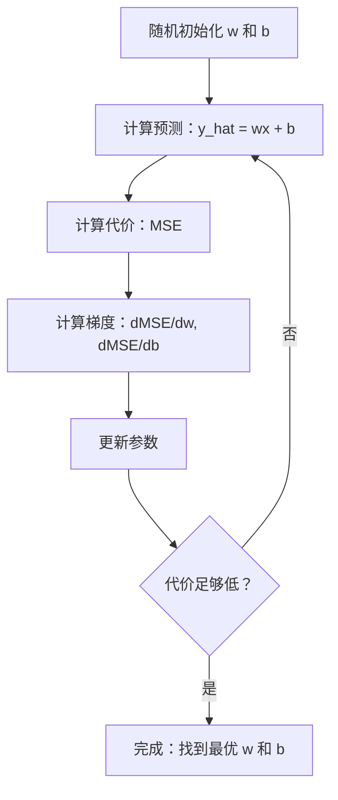

# 线性回归

> 线性回归画出一条穿过数据的最佳直线。它是机器学习的"hello world"。

**类型：** Build
**语言：** Python
**前置知识：** 阶段 1（线性代数、微积分、优化），阶段 2 第 1 课
**时间：** 约 90 分钟

## 学习目标

- 推导均方误差的梯度下降更新规则，并从零实现线性回归
- 比较梯度下降和正规方程的计算复杂度，以及何时使用每种方法
- 构建带有特征标准化的多元线性回归模型，并解释学习到的权重
- 解释 Ridge 回归（L2 正则化）如何通过惩罚大权重来防止过拟合

## 问题

你有数据：房屋面积和售价。你想根据面积预测新房子的价格。你可以在散点图上目测，但你需要一个公式。你需要一条最佳拟合数据的直线，以便代入任意面积获得价格预测。

线性回归给你那条线。更重要的是，它引入了完整的 ML 训练循环：定义模型、定义代价函数、优化参数。每个 ML 算法都遵循相同的模式。在这里用最简单的情况掌握它，你就到处都能认出它。

这不仅仅用于简单问题。线性回归在生产系统中用于需求预测、A/B 测试分析、金融建模，并作为每个回归任务的基线。

## 概念

### 模型

线性回归假设输入 (x) 和输出 (y) 之间存在线性关系：

```
y = wx + b
```

- `w`（权重/斜率）：x 增加 1 时 y 变化多少
- `b`（偏置/截距）：x = 0 时 y 的值

对于多个输入（特征），扩展为：

```
y = w1*x1 + w2*x2 + ... + wn*xn + b
```

或者用向量形式：`y = w^T * x + b`

目标：找到使预测的 y 尽可能接近所有训练样本中实际 y 的 w 和 b 值。

### 代价函数（均方误差）

如何衡量"尽可能接近"？你需要一个单一数字来捕捉你的预测错得有多离谱。最常用的选择是均方误差（MSE）：

```
MSE = (1/n) * sum((y_predicted - y_actual)^2)
```

为什么要平方？两个原因。首先，它惩罚大误差的程度比小误差更重（误差 10 的代价是误差 1 的 100 倍，而不是 10 倍）。其次，平方函数处处平滑可微，使优化变得直接。

代价函数创建一个曲面。对于单个权重 w 和偏置 b，MSE 曲面看起来像一个碗（凸抛物面）。碗底是 MSE 最小的地方。训练意味着找到那个底部。

### 梯度下降

梯度下降通过沿下坡方向迈步找到碗底。



梯度告诉你两件事：每个参数该往哪个方向移动，以及移动多少。

对于 MSE，其中 y_hat = wx + b：

```
dMSE/dw = (2/n) * sum((y_hat - y) * x)
dMSE/db = (2/n) * sum(y_hat - y)
```

更新规则：

```
w = w - learning_rate * dMSE/dw
b = b - learning_rate * dMSE/db
```

学习率控制步长。太大：你会越界并发散。太小：训练旷日持久。典型起始值：0.01、0.001 或 0.0001。

### 正规方程（闭式解）

对于线性回归，有一个直接公式可以在没有任何迭代的情况下给出最优权重：

```
w = (X^T * X)^(-1) * X^T * y
```

这通过一步求逆矩阵来解出 w。它对小数据集完美适用。对于大数据集（数百万行或数千个特征），梯度下降更优，因为矩阵求逆在特征数上复杂度是 O(n^3)。

### 多元线性回归

有多个特征时，模型变为：

```
y = w1*x1 + w2*x2 + ... + wn*xn + b
```

一切同样有效：MSE 是代价函数，梯度下降同时更新所有权重。唯一的区别是你在拟合一个超平面而不是直线。

特征缩放在这里很重要。如果一个特征范围是 0 到 1，另一个是 0 到 1,000,000，梯度下降会很难训练，因为代价曲面变成长条形。在训练前标准化特征（减去均值，除以标准差）。

### 多项式回归

如果关系不是线性的怎么办？你仍然可以通过创建多项式特征来使用线性回归：

```
y = w1*x + w2*x^2 + w3*x^3 + b
```

这仍然是"线性"回归，因为模型在权重 (w1, w2, w3) 上是线性的。你只是使用了 x 的非线性特征。

更高次多项式可以拟合更复杂的曲线，但有过度拟合的风险。一个 10 次多项式将经过 10 点数据集中的每个点，但会在新数据上预测很差。

### R² 分数

MSE 告诉你错得多离谱，但这个数字取决于 y 的尺度。R²（决定系数）给出一个与尺度无关的度量：

```
R^2 = 1 - (残差平方和) / (均值偏差平方和)
    = 1 - SS_res / SS_tot
```

- R² = 1.0：完美预测
- R² = 0.0：模型不比每次都预测均值更好
- R² < 0.0：模型比预测均值更差

### 正则化预览（Ridge 回归）

当你有许多特征时，模型可能通过分配大权重来过拟合。Ridge 回归（L2 正则化）添加惩罚项：

```
Cost = MSE + lambda * sum(w_i^2)
```

惩罚项阻止大权重。超参数 lambda 控制权衡：更高的 lambda 意味着更小的权重和更多的正则化。这在后面的课程中深入讲解。现在只需知道它的存在以及它为什么有帮助。

## Build It

### 第 1 步：生成样本数据

```python
import random
import math

random.seed(42)

TRUE_W = 3.0
TRUE_B = 7.0
N_SAMPLES = 100

X = [random.uniform(0, 10) for _ in range(N_SAMPLES)]
y = [TRUE_W * x + TRUE_B + random.gauss(0, 2.0) for x in X]

print(f"生成了 {N_SAMPLES} 个样本")
print(f"真实关系：y = {TRUE_W}x + {TRUE_B}（+ 噪声）")
print(f"前 5 个点：{[(round(X[i], 2), round(y[i], 2)) for i in range(5)]}")
```

### 第 2 步：用梯度下降从零实现线性回归

```python
class LinearRegression:
    def __init__(self, learning_rate=0.01):
        self.w = 0.0
        self.b = 0.0
        self.lr = learning_rate
        self.cost_history = []

    def predict(self, X):
        return [self.w * x + self.b for x in X]

    def compute_cost(self, X, y):
        predictions = self.predict(X)
        n = len(y)
        cost = sum((pred - actual) ** 2 for pred, actual in zip(predictions, y)) / n
        return cost

    def compute_gradients(self, X, y):
        predictions = self.predict(X)
        n = len(y)
        dw = (2 / n) * sum((pred - actual) * x for pred, actual, x in zip(predictions, y, X))
        db = (2 / n) * sum(pred - actual for pred, actual in zip(predictions, y))
        return dw, db

    def fit(self, X, y, epochs=1000, print_every=200):
        for epoch in range(epochs):
            dw, db = self.compute_gradients(X, y)
            self.w -= self.lr * dw
            self.b -= self.lr * db
            cost = self.compute_cost(X, y)
            self.cost_history.append(cost)
            if epoch % print_every == 0:
                print(f"  第 {epoch:4d} 轮 | 代价：{cost:.4f} | w：{self.w:.4f} | b：{self.b:.4f}")
        return self

    def r_squared(self, X, y):
        predictions = self.predict(X)
        y_mean = sum(y) / len(y)
        ss_res = sum((actual - pred) ** 2 for actual, pred in zip(y, predictions))
        ss_tot = sum((actual - y_mean) ** 2 for actual in y)
        return 1 - (ss_res / ss_tot)


print("=== 训练线性回归（梯度下降）===")
model = LinearRegression(learning_rate=0.005)
model.fit(X, y, epochs=1000, print_every=200)
print(f"\n学到的：y = {model.w:.4f}x + {model.b:.4f}")
print(f"真实的：y = {TRUE_W}x + {TRUE_B}")
print(f"R²：{model.r_squared(X, y):.4f}")
```

### 第 3 步：正规方程（闭式解）

```python
class LinearRegressionNormal:
    def __init__(self):
        self.w = 0.0
        self.b = 0.0

    def fit(self, X, y):
        n = len(X)
        x_mean = sum(X) / n
        y_mean = sum(y) / n
        numerator = sum((X[i] - x_mean) * (y[i] - y_mean) for i in range(n))
        denominator = sum((X[i] - x_mean) ** 2 for i in range(n))
        self.w = numerator / denominator
        self.b = y_mean - self.w * x_mean
        return self

    def predict(self, X):
        return [self.w * x + self.b for x in X]

    def r_squared(self, X, y):
        predictions = self.predict(X)
        y_mean = sum(y) / len(y)
        ss_res = sum((actual - pred) ** 2 for actual, pred in zip(y, predictions))
        ss_tot = sum((actual - y_mean) ** 2 for actual in y)
        return 1 - (ss_res / ss_tot)


print("\n=== 正规方程（闭式解）===")
model_normal = LinearRegressionNormal()
model_normal.fit(X, y)
print(f"学到的：y = {model_normal.w:.4f}x + {model_normal.b:.4f}")
print(f"R²：{model_normal.r_squared(X, y):.4f}")
```

### 第 4 步：多元线性回归

```python
class MultipleLinearRegression:
    def __init__(self, n_features, learning_rate=0.01):
        self.weights = [0.0] * n_features
        self.bias = 0.0
        self.lr = learning_rate
        self.cost_history = []

    def predict_single(self, x):
        return sum(w * xi for w, xi in zip(self.weights, x)) + self.bias

    def predict(self, X):
        return [self.predict_single(x) for x in X]

    def compute_cost(self, X, y):
        predictions = self.predict(X)
        n = len(y)
        return sum((pred - actual) ** 2 for pred, actual in zip(predictions, y)) / n

    def fit(self, X, y, epochs=1000, print_every=200):
        n = len(y)
        n_features = len(X[0])
        for epoch in range(epochs):
            predictions = self.predict(X)
            errors = [pred - actual for pred, actual in zip(predictions, y)]
            for j in range(n_features):
                grad = (2 / n) * sum(errors[i] * X[i][j] for i in range(n))
                self.weights[j] -= self.lr * grad
            grad_b = (2 / n) * sum(errors)
            self.bias -= self.lr * grad_b
            cost = self.compute_cost(X, y)
            self.cost_history.append(cost)
            if epoch % print_every == 0:
                print(f"  第 {epoch:4d} 轮 | 代价：{cost:.4f}")
        return self

    def r_squared(self, X, y):
        predictions = self.predict(X)
        y_mean = sum(y) / len(y)
        ss_res = sum((actual - pred) ** 2 for actual, pred in zip(y, predictions))
        ss_tot = sum((actual - y_mean) ** 2 for actual in y)
        return 1 - (ss_res / ss_tot)


random.seed(42)
N = 100
X_multi = []
y_multi = []
for _ in range(N):
    size = random.uniform(500, 3000)
    bedrooms = random.randint(1, 5)
    age = random.uniform(0, 50)
    price = 50 * size + 10000 * bedrooms - 1000 * age + 50000 + random.gauss(0, 20000)
    X_multi.append([size, bedrooms, age])
    y_multi.append(price)


def standardize(X):
    n_features = len(X[0])
    means = [sum(X[i][j] for i in range(len(X))) / len(X) for j in range(n_features)]
    stds = []
    for j in range(n_features):
        variance = sum((X[i][j] - means[j]) ** 2 for i in range(len(X))) / len(X)
        stds.append(variance ** 0.5)
    X_scaled = []
    for i in range(len(X)):
        row = [(X[i][j] - means[j]) / stds[j] if stds[j] > 0 else 0 for j in range(n_features)]
        X_scaled.append(row)
    return X_scaled, means, stds


y_mean_val = sum(y_multi) / len(y_multi)
y_std_val = (sum((yi - y_mean_val) ** 2 for yi in y_multi) / len(y_multi)) ** 0.5
y_scaled = [(yi - y_mean_val) / y_std_val for yi in y_multi]

X_scaled, x_means, x_stds = standardize(X_multi)

print("\n=== 多元线性回归（3 个特征）===")
print("特征：房屋面积、卧室数、房龄")
multi_model = MultipleLinearRegression(n_features=3, learning_rate=0.01)
multi_model.fit(X_scaled, y_scaled, epochs=1000, print_every=200)

print(f"\n权重（标准化）：{[round(w, 4) for w in multi_model.weights]}")
print(f"偏置（标准化）：{multi_model.bias:.4f}")
print(f"R²：{multi_model.r_squared(X_scaled, y_scaled):.4f}")
```

### 第 5 步：多项式回归

```python
class PolynomialRegression:
    def __init__(self, degree, learning_rate=0.01):
        self.degree = degree
        self.weights = [0.0] * degree
        self.bias = 0.0
        self.lr = learning_rate

    def make_features(self, X):
        return [[x ** (d + 1) for d in range(self.degree)] for x in X]

    def predict(self, X):
        features = self.make_features(X)
        return [sum(w * f for w, f in zip(self.weights, row)) + self.bias for row in features]

    def fit(self, X, y, epochs=1000, print_every=200):
        features = self.make_features(X)
        n = len(y)
        for epoch in range(epochs):
            predictions = [sum(w * f for w, f in zip(self.weights, row)) + self.bias for row in features]
            errors = [pred - actual for pred, actual in zip(predictions, y)]
            for j in range(self.degree):
                grad = (2 / n) * sum(errors[i] * features[i][j] for i in range(n))
                self.weights[j] -= self.lr * grad
            grad_b = (2 / n) * sum(errors)
            self.bias -= self.lr * grad_b
            if epoch % print_every == 0:
                cost = sum(e ** 2 for e in errors) / n
                print(f"  第 {epoch:4d} 轮 | 代价：{cost:.6f}")
        return self

    def r_squared(self, X, y):
        predictions = self.predict(X)
        y_mean = sum(y) / len(y)
        ss_res = sum((actual - pred) ** 2 for actual, pred in zip(y, predictions))
        ss_tot = sum((actual - y_mean) ** 2 for actual in y)
        return 1 - (ss_res / ss_tot)


random.seed(42)
X_poly = [x / 10.0 for x in range(0, 50)]
y_poly = [0.5 * x ** 2 - 2 * x + 3 + random.gauss(0, 1.0) for x in X_poly]

x_max = max(abs(x) for x in X_poly)
X_poly_norm = [x / x_max for x in X_poly]
y_poly_mean = sum(y_poly) / len(y_poly)
y_poly_std = (sum((yi - y_poly_mean) ** 2 for yi in y_poly) / len(y_poly)) ** 0.5
y_poly_norm = [(yi - y_poly_mean) / y_poly_std for yi in y_poly]

print("\n=== 多项式回归（2 次 vs 5 次）===")
print("真实关系：y = 0.5x^2 - 2x + 3")

print("\n2 次：")
poly2 = PolynomialRegression(degree=2, learning_rate=0.1)
poly2.fit(X_poly_norm, y_poly_norm, epochs=2000, print_every=500)
print(f"  R²：{poly2.r_squared(X_poly_norm, y_poly_norm):.4f}")

print("\n5 次：")
poly5 = PolynomialRegression(degree=5, learning_rate=0.1)
poly5.fit(X_poly_norm, y_poly_norm, epochs=2000, print_every=500)
print(f"  R²：{poly5.r_squared(X_poly_norm, y_poly_norm):.4f}")

print("\n2 次拟合真实曲线良好。5 次在训练数据上拟合略好")
print("但在新数据上有过拟合风险。")
```

### 第 6 步：Ridge 回归（L2 正则化）

```python
class RidgeRegression:
    def __init__(self, n_features, learning_rate=0.01, alpha=1.0):
        self.weights = [0.0] * n_features
        self.bias = 0.0
        self.lr = learning_rate
        self.alpha = alpha

    def predict_single(self, x):
        return sum(w * xi for w, xi in zip(self.weights, x)) + self.bias

    def predict(self, X):
        return [self.predict_single(x) for x in X]

    def fit(self, X, y, epochs=1000, print_every=200):
        n = len(y)
        n_features = len(X[0])
        for epoch in range(epochs):
            predictions = self.predict(X)
            errors = [pred - actual for pred, actual in zip(predictions, y)]
            mse = sum(e ** 2 for e in errors) / n
            reg_term = self.alpha * sum(w ** 2 for w in self.weights)
            cost = mse + reg_term
            for j in range(n_features):
                grad = (2 / n) * sum(errors[i] * X[i][j] for i in range(n))
                grad += 2 * self.alpha * self.weights[j]
                self.weights[j] -= self.lr * grad
            grad_b = (2 / n) * sum(errors)
            self.bias -= self.lr * grad_b
            if epoch % print_every == 0:
                print(f"  第 {epoch:4d} 轮 | 代价：{cost:.4f} | L2 惩罚：{reg_term:.4f}")
        return self


print("\n=== Ridge 回归（L2 正则化）===")
print("与多元回归相同的数据，alpha=0.1")
ridge = RidgeRegression(n_features=3, learning_rate=0.01, alpha=0.1)
ridge.fit(X_scaled, y_scaled, epochs=1000, print_every=200)
print(f"\nRidge 权重：{[round(w, 4) for w in ridge.weights]}")
print(f"普通权重：{[round(w, 4) for w in multi_model.weights]}")
print("由于 L2 惩罚，Ridge 权重更小（向零收缩）。")
```

## Use It

现在用 scikit-learn 做同样的事，这是你在生产中实际使用的工具。

```python
from sklearn.linear_model import LinearRegression as SklearnLR
from sklearn.linear_model import Ridge
from sklearn.preprocessing import PolynomialFeatures, StandardScaler
from sklearn.model_selection import train_test_split
from sklearn.metrics import mean_squared_error, r2_score
import numpy as np

np.random.seed(42)
X_sk = np.random.uniform(0, 10, (100, 1))
y_sk = 3.0 * X_sk.squeeze() + 7.0 + np.random.normal(0, 2.0, 100)

X_train, X_test, y_train, y_test = train_test_split(X_sk, y_sk, test_size=0.2, random_state=42)

lr = SklearnLR()
lr.fit(X_train, y_train)
y_pred = lr.predict(X_test)

print("=== Scikit-learn 线性回归 ===")
print(f"系数（w）：{lr.coef_[0]:.4f}")
print(f"截距（b）：{lr.intercept_:.4f}")
print(f"R²（测试）：{r2_score(y_test, y_pred):.4f}")
print(f"MSE（测试）：{mean_squared_error(y_test, y_pred):.4f}")

poly = PolynomialFeatures(degree=2, include_bias=False)
X_poly_sk = poly.fit_transform(X_train)
X_poly_test = poly.transform(X_test)

lr_poly = SklearnLR()
lr_poly.fit(X_poly_sk, y_train)
print(f"\n多项式 2 次 R²：{r2_score(y_test, lr_poly.predict(X_poly_test)):.4f}")

scaler = StandardScaler()
X_train_scaled = scaler.fit_transform(X_train)
```

## Ship It

本课产出：
- `phases/02-ml-fundamentals/02-linear-regression/code/linear_regression.py` -- 从零实现的线性回归
- `outputs/skill-linear-model-builder.md` -- 用于设计和诊断线性模型的技能参考

## 练习

1. 生成 y = 2x + 5 + noise 的合成数据。用不同的学习率（0.1、0.01、0.001）训练线性回归。绘制代价随时间变化图。哪个学习率收敛最快且不发散？

2. 使用 sklearn 的 `make_regression` 生成有 20 个特征的数据。训练线性回归。绘制权重大小排序图。解释为什么有些权重对预测的贡献更大。

3. 创建一维数据，其中 y = x^3 + noise。分别用 1 次、3 次和 10 次多项式拟合。绘制拟合曲线。解释为什么 1 次欠拟合，3 次正好，10 次过拟合。

4. 自己实现正规方程。在二维数据上验证结果与梯度下降相同。对于 10,000 个点，计时两种方法。哪种更快，快多少？

5. 用 `sklearn.linear_model.LinearRegression` 拟合数据集。检查 `coef_` 和 `intercept_` 属性。确认它们与你自己实现的相匹配。

## 关键术语

| 术语 | 人们怎么说 | 实际含义 |
|------|-----------|---------|
| 权重（斜率） | "系数" | w：x 增加 1 时 y 变化多少。直线的斜率 |
| 偏置（截距） | "常数项" | b：当所有 x = 0 时的预测值 |
| 代价/损失 | "误差" | 衡量预测与实际值差距的单一数字。越小 = 越好 |
| 梯度 | "坡度" | 代价函数关于每个参数的导数。指向最陡上升方向 |
| 学习率 | "步长" | 每步更新参数的量。太小 = 慢。太大 = 不稳定 |
| Epoch | "训练轮次" | 模型观察每个训练样本一次的完整遍历 |
| 正规方程 | "一步到位法" | 通过解方程 w = (X^T X)^(-1) X^T y 直接获得最优权重的公式 |
| R² | "拟合度" | 1 减去方差残差比。1.0 = 完美。0 = 与预测均值一样差 |
| 多项式回归 | "曲线拟合" | 线性回归，使用 x、x²、x³ 等作为特征来拟合曲线 |
| 特征缩放 | "使所有特征大小相同" | 减去均值，除以标准差。对多特征的梯度下降至关重要 |
| L2 正则化 | "Ridge 回归" | 在代价函数中加入 sum(w²) 惩罚项以收缩权重、防止过拟合 |