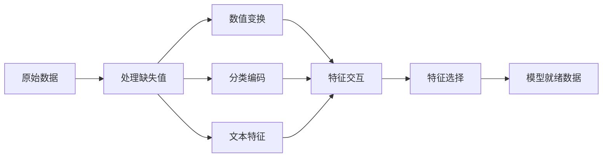

# 特征工程与选择

> 一个好特征价值千个数据点。

**类型：** Build
**语言：** Python
**前置知识：** 阶段 1（ML 统计，线性代数），阶段 2 第 1-7 课
**时间：** 约 90 分钟

## 学习目标

- 实现数值变换（标准化、min-max 缩放、log 变换、分箱），解释何时适用每种变换
- 为分类特征构建独热、标签和目标编码，识别目标编码中的数据泄露风险
- 从零构造 TF-IDF 向量化器，解释为什么它对文本分类比原始词计数表现更好
- 应用基于过滤的特征选择（方差阈值、相关性、互信息）降低维度

## 问题

你有一个数据集。你选了一个算法。你训练了它。结果平庸。你试了一个更花哨的算法。仍然平庸。你花了一周调参。边际改进。

然后有人将原始数据转换为更好的特征，一个简单的逻辑回归击败了你的调优梯度提升集成。

这种情况不断发生。在经典 ML 中，数据的表示比算法选择更重要。带有"面积平方英尺"和"卧室数量"的房价模型，无论学习者多复杂，都会击败使用"原始字符串地址"的模型。算法只能使用你给它的数据工作。

特征工程是将原始数据转换为表示，使模型更容易发现模式的过程。特征选择是丢弃不增加信号只增加噪声的特征的过程。它们一起是经典 ML 中杠杆率最高的活动。

## 概念

### 特征流水线



### 数值特征

原始数字很少是模型就绪的。常见变换：

**缩放：** 将特征放到相同范围，让基于距离的算法（K-Means、KNN、SVM）平等对待所有特征。Min-max 缩放映射到 [0, 1]。标准化（z-score）映射到 mean=0, std=1。

**Log 变换：** 压缩右偏分布（收入、人口、词计数）。将乘法关系转换为加法关系。

**分箱：** 将连续值转换为类别。当特征与目标的关系是非线性但分段的时有用（例如年龄组）。

**多项式特征：** 创建 x^2、x^3、x1*x2 项。让线性模型捕获非线性关系，代价是更多特征。

### 分类特征

模型需要数字。类别需要编码。

**独热编码：** 为每个类别创建一个二进制列。"color = red/blue/green"变为三列：is_red、is_blue、is_green。对于低基数特征效果很好，但类别多会爆炸。

**标签编码：** 将每个类别映射到整数：red=0, blue=1, green=2。引入虚假排序（模型可能认为 green > blue > red）。只适合基于树的模型，它们在单个值上分裂。

**目标编码：** 将每个类别替换为该类别目标变量的均值。强大但危险：数据泄露风险很高。必须只在训练数据上计算，然后应用到测试数据。

### 文本特征

**计数向量化：** 统计每个词在文档中出现多少次。"the cat sat on the mat"变为 {the: 2, cat: 1, sat: 1, on: 1, mat: 1}。

**TF-IDF：** 词频-逆文档频率。按词在文档中的唯一性加权。像"the"这样的常见词权重低。稀有、有区分度的词权重高。

```
TF(word, doc) = count(word in doc) / doc 中总词数
IDF(word) = log(总文档数 / 包含 word 的文档数)
TF-IDF = TF * IDF
```

### 缺失值

真实数据有洞。策略：

- **删除行：** 只在缺失数据稀少且随机时使用
- **均值/中位数插补：** 简单，保留分布形状（中位数对离群点更鲁棒）
- **众数插补：** 用于分类特征
- **指示列：** 在插补前添加二进制列"这个值是否缺失"。数据缺失这个事实本身就可以提供信息
- **前向/后向填充：** 用于时间序列数据

### 特征交互

有时关系在于组合。"身高"和"体重"单独不如"BMI = 体重 / 身高^2"有预测性。特征交互倍增特征空间，所以使用领域知识选择正确的交互。

### 特征选择

更多特征不总是更好。不相关的特征增加噪声，增加训练时间，还会导致过拟合。

**过滤方法（预模型）：**
- 相关性：移除高度相互相关的特征（冗余）
- 互信息：衡量知道一个特征减少多少关于目标的不确定性
- 方差阈值：移除几乎不变的特征

**包装方法（基于模型）：**
- L1 正则化（Lasso）：将不相关特征权重精确驱动到零
- 递归特征消除：训练，移除最不重要的特征，重复

**为什么选择重要：** 一个有 10 个好特征的模型通常会胜过一个有 10 个好特征和 90 个噪声的模型。噪声特征给模型提供了在不泛化的训练数据模式上过拟合的机会。

## Build It

### 第 1 步：从零实现数值变换

```python
import math


def min_max_scale(values):
    min_val = min(values)
    max_val = max(values)
    if max_val == min_val:
        return [0.0] * len(values)
    return [(v - min_val) / (max_val - min_val) for v in values]


def standardize(values):
    n = len(values)
    mean = sum(values) / n
    variance = sum((v - mean) ** 2 for v in values) / n
    std = math.sqrt(variance) if variance > 0 else 1.0
    return [(v - mean) / std for v in values]


def log_transform(values):
    return [math.log(v + 1) for v in values]


def bin_values(values, n_bins=5):
    min_val = min(values)
    max_val = max(values)
    bin_width = (max_val - min_val) / n_bins
    if bin_width == 0:
        return [0] * len(values)
    result = []
    for v in values:
        bin_idx = int((v - min_val) / bin_width)
        bin_idx = min(bin_idx, n_bins - 1)
        result.append(bin_idx)
    return result


def polynomial_features(row, degree=2):
    n = len(row)
    result = list(row)
    if degree >= 2:
        for i in range(n):
            result.append(row[i] ** 2)
        for i in range(n):
            for j in range(i + 1, n):
                result.append(row[i] * row[j])
    return result
```

### 第 2 步：从零实现分类编码

```python
def one_hot_encode(values):
    categories = sorted(set(values))
    cat_to_idx = {cat: i for i, cat in enumerate(categories)}
    n_cats = len(categories)

    encoded = []
    for v in values:
        row = [0] * n_cats
        row[cat_to_idx[v]] = 1
        encoded.append(row)

    return encoded, categories


def label_encode(values):
    categories = sorted(set(values))
    cat_to_int = {cat: i for i, cat in enumerate(categories)}
    return [cat_to_int[v] for v in values], cat_to_int


def target_encode(feature_values, target_values, smoothing=10):
    global_mean = sum(target_values) / len(target_values)

    category_stats = {}
    for feat, target in zip(feature_values, target_values):
        if feat not in category_stats:
            category_stats[feat] = {"sum": 0.0, "count": 0}
        category_stats[feat]["sum"] += target
        category_stats[feat]["count"] += 1

    encoding = {}
    for cat, stats in category_stats.items():
        cat_mean = stats["sum"] / stats["count"]
        weight = stats["count"] / (stats["count"] + smoothing)
        encoding[cat] = weight * cat_mean + (1 - weight) * global_mean

    return [encoding[v] for v in feature_values], encoding
```

### 第 3 步：从零实现文本特征

```python
def count_vectorize(documents):
    vocab = {}
    idx = 0
    for doc in documents:
        for word in doc.lower().split():
            if word not in vocab:
                vocab[word] = idx
                idx += 1

    vectors = []
    for doc in documents:
        vec = [0] * len(vocab)
        for word in doc.lower().split():
            vec[vocab[word]] += 1
        vectors.append(vec)

    return vectors, vocab


def tfidf(documents):
    n_docs = len(documents)

    vocab = {}
    idx = 0
    for doc in documents:
        for word in doc.lower().split():
            if word not in vocab:
                vocab[word] = idx
                idx += 1

    doc_freq = {}
    for doc in documents:
        seen = set()
        for word in doc.lower().split():
            if word not in seen:
                doc_freq[word] = doc_freq.get(word, 0) + 1
                seen.add(word)

    vectors = []
    for doc in documents:
        words = doc.lower().split()
        word_count = len(words)
        tf_map = {}
        for word in words:
            tf_map[word] = tf_map.get(word, 0) + 1

        vec = [0.0] * len(vocab)
        for word, count in tf_map.items():
            tf = count / word_count
            idf = math.log(n_docs / doc_freq[word])
            vec[vocab[word]] = tf * idf
        vectors.append(vec)

    return vectors, vocab
```

### 第 4 步：从零实现缺失值插补

```python
def impute_mean(values):
    present = [v for v in values if v is not None]
    if not present:
        return [0.0] * len(values), 0.0
    mean = sum(present) / len(present)
    return [v if v is not None else mean for v in values], mean


def impute_median(values):
    present = sorted(v for v in values if v is not None)
    if not present:
        return [0.0] * len(values), 0.0
    n = len(present)
    if n % 2 == 0:
        median = (present[n // 2 - 1] + present[n // 2]) / 2
    else:
        median = present[n // 2]
    return [v if v is not None else median for v in values], median


def impute_mode(values):
    present = [v for v in values if v is not None]
    if not present:
        return values, None
    counts = {}
    for v in present:
        counts[v] = counts.get(v, 0) + 1
    mode = max(counts, key=counts.get)
    return [v if v is not None else mode for v in values], mode


def add_missing_indicator(values):
    return [0 if v is not None else 1 for v in values]
```

### 第 5 步：从零实现特征选择

```python
def correlation(x, y):
    n = len(x)
    mean_x = sum(x) / n
    mean_y = sum(y) / n
    cov = sum((xi - mean_x) * (yi - mean_y) for xi, yi in zip(x, y)) / n
    std_x = math.sqrt(sum((xi - mean_x) ** 2 for xi in x) / n)
    std_y = math.sqrt(sum((yi - mean_y) ** 2 for yi in y) / n)
    if std_x == 0 or std_y == 0:
        return 0.0
    return cov / (std_x * std_y)


def mutual_information(feature, target, n_bins=10):
    feat_min = min(feature)
    feat_max = max(feature)
    bin_width = (feat_max - feat_min) / n_bins if feat_max != feat_min else 1.0
    feat_binned = [
        min(int((f - feat_min) / bin_width), n_bins - 1) for f in feature
    ]

    n = len(feature)
    target_classes = sorted(set(target))

    feat_bins = sorted(set(feat_binned))
    p_feat = {}
    for b in feat_bins:
        p_feat[b] = feat_binned.count(b) / n

    p_target = {}
    for t in target_classes:
        p_target[t] = target.count(t) / n

    mi = 0.0
    for b in feat_bins:
        for t in target_classes:
            joint_count = sum(
                1 for fb, tv in zip(feat_binned, target) if fb == b and tv == t
            )
            p_joint = joint_count / n
            if p_joint > 0:
                mi += p_joint * math.log(p_joint / (p_feat[b] * p_target[t]))

    return mi


def variance_threshold(features, threshold=0.01):
    n_features = len(features[0])
    n_samples = len(features)
    selected = []

    for j in range(n_features):
        col = [features[i][j] for i in range(n_samples)]
        mean = sum(col) / n_samples
        var = sum((v - mean) ** 2 for v in col) / n_samples
        if var >= threshold:
            selected.append(j)

    return selected


def remove_correlated(features, threshold=0.9):
    n_features = len(features[0])
    n_samples = len(features)

    to_remove = set()
    for i in range(n_features):
        if i in to_remove:
            continue
        col_i = [features[r][i] for r in range(n_samples)]
        for j in range(i + 1, n_features):
            if j in to_remove:
                continue
            col_j = [features[r][j] for r in range(n_samples)]
            corr = abs(correlation(col_i, col_j))
            if corr >= threshold:
                to_remove.add(j)

    return [i for i in range(n_features) if i not in to_remove]
```

### 第 6 步：完整流水线和演示

```python
import random


def make_housing_data(n=200, seed=42):
    random.seed(seed)
    data = []
    for _ in range(n):
        sqft = random.uniform(500, 5000)
        bedrooms = random.choice([1, 2, 3, 4, 5])
        age = random.uniform(0, 50)
        neighborhood = random.choice(["downtown", "suburbs", "rural"])
        has_pool = random.choice([True, False])

        sqft_with_missing = sqft if random.random() > 0.05 else None
        age_with_missing = age if random.random() > 0.08 else None

        price = (
            50 * sqft
            + 20000 * bedrooms
            - 1000 * age
            + (50000 if neighborhood == "downtown" else 10000 if neighborhood == "suburbs" else 0)
            + (15000 if has_pool else 0)
            + random.gauss(0, 20000)
        )

        data.append({
            "sqft": sqft_with_missing,
            "bedrooms": bedrooms,
            "age": age_with_missing,
            "neighborhood": neighborhood,
            "has_pool": has_pool,
            "price": price,
        })
    return data


if __name__ == "__main__":
    data = make_housing_data(200)

    print("=== 原始数据样本 ===")
    for row in data[:3]:
        print(f"  {row}")

    sqft_raw = [d["sqft"] for d in data]
    age_raw = [d["age"] for d in data]
    prices = [d["price"] for d in data]

    print("\n=== 缺失值处理 ===")
    sqft_missing = sum(1 for v in sqft_raw if v is None)
    age_missing = sum(1 for v in age_raw if v is None)
    print(f"  sqft 缺失：{sqft_missing}/{len(sqft_raw)}")
    print(f"  age 缺失：{age_missing}/{len(age_raw)}")

    sqft_indicator = add_missing_indicator(sqft_raw)
    age_indicator = add_missing_indicator(age_raw)
    sqft_imputed, sqft_fill = impute_median(sqft_raw)
    age_imputed, age_fill = impute_mean(age_raw)
    print(f"  sqft 用中位数填充：{sqft_fill:.0f}")
    print(f"  age 用均值填充：{age_fill:.1f}")

    print("\n=== 数值变换 ===")
    sqft_scaled = standardize(sqft_imputed)
    age_scaled = min_max_scale(age_imputed)
    sqft_log = log_transform(sqft_imputed)
    age_binned = bin_values(age_imputed, n_bins=5)
    print(f"  sqft 标准化：mean={sum(sqft_scaled)/len(sqft_scaled):.4f}, std={math.sqrt(sum(v**2 for v in sqft_scaled)/len(sqft_scaled)):.4f}")
    print(f"  age 最小最大：[{min(age_scaled):.2f}, {max(age_scaled):.2f}]")
    print(f"  age 分箱：{sorted(set(age_binned))}")

    print("\n=== 分类编码 ===")
    neighborhoods = [d["neighborhood"] for d in data]

    ohe, ohe_cats = one_hot_encode(neighborhoods)
    print(f"  独热类别：{ohe_cats}")
    print(f"  样本编码：{neighborhoods[0]} -> {ohe[0]}")

    le, le_map = label_encode(neighborhoods)
    print(f"  标签编码映射：{le_map}")

    te, te_map = target_encode(neighborhoods, prices, smoothing=10)
    print(f"  目标编码：{({k: round(v) for k, v in te_map.items()})}")

    print("\n=== 文本特征 ===")
    descriptions = [
        "large modern house with pool",
        "small cozy cottage near downtown",
        "spacious family home with large yard",
        "modern apartment downtown with view",
        "rustic cabin in rural area",
    ]
    cv, cv_vocab = count_vectorize(descriptions)
    print(f"  词汇表大小：{len(cv_vocab)}")
    print(f"  文档 0 非零特征：{sum(1 for v in cv[0] if v > 0)}")

    tf, tf_vocab = tfidf(descriptions)
    print(f"  TF-IDF 词汇表大小：{len(tf_vocab)}")
    top_words = sorted(tf_vocab.keys(), key=lambda w: tf[0][tf_vocab[w]], reverse=True)[:3]
    print(f"  文档 0 前 3 个 TF-IDF 词：{top_words}")

    print("\n=== 多项式特征 ===")
    sample_row = [sqft_scaled[0], age_scaled[0]]
    poly = polynomial_features(sample_row, degree=2)
    print(f"  输入：{[round(v, 4) for v in sample_row]}")
    print(f"  多项式：{[round(v, 4) for v in poly]}")
    print(f"  特征：[x1, x2, x1^2, x2^2, x1*x2]")

    print("\n=== 特征选择 ===")
    feature_matrix = [
        [sqft_scaled[i], age_scaled[i], float(sqft_indicator[i]), float(age_indicator[i])]
        + ohe[i]
        for i in range(len(data))
    ]

    print(f"  总特征数：{len(feature_matrix[0])}")
