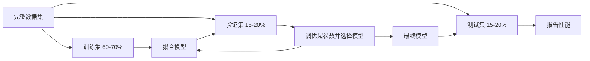

# 模型评估

> 模型的好坏取决于你衡量它的方式。

**类型：** Build
**语言：** Python
**前置知识：** 阶段 1（概率与分布，ML 统计），阶段 2 第 1-8 课
**时间：** 约 90 分钟

## 学习目标

- 从零实现 K 折和分层 K 折交叉验证，解释为什么分层对不平衡数据重要
- 从零计算精确率、召回率、F1、AUC-ROC 和回归指标（MSE、RMSE、MAE、R 平方）
- 解释学习曲线以诊断模型是否存在高偏差或高方差
- 识别常见评估错误，包括数据泄露、错误指标选择和测试集污染

## 问题

你训练了一个模型。它在你的数据上获得 95% 准确率。这好吗？

也许。也许不好。如果你 95% 的数据属于一个类别，一个总是预测那个类别的模型也得到 95% 准确率，但完全没用。如果你在你训练过的同一数据上评估，95% 这个数字毫无意义，因为模型只是记住了答案。如果你的数据集有时间成分，你在分裂前随机打乱，你的模型可能用未来数据预测过去。

模型评估是大多数 ML 项目出错的地方。错误的指标让坏模型看起来好。错误的分裂让模型作弊。错误的比较让你选择更差的模型。正确评估不是可选的。它是生产中工作的模型和看到真实数据立即失败的模型之间的区别。

## 概念

### 训练、验证、测试



三个分裂，三个目的：

- **训练集：** 模型从这个数据学习。它在训练期间看到这些样本。
- **验证集：** 用于调优超参数和在模型间选择。模型从不训练在这个数据上，但你的决策受它影响。
- **测试集：** 只接触一次，在最后，报告最终性能。如果你看了测试性能然后回去改模型，它就不再是测试集了。它变成了第二个验证集。

测试集是你的留出保证，报告性能反映了模型在真正未见过的数据上的表现。

### K 折交叉验证

对于小数据集，单次训练/验证分裂浪费数据并给出噪声估计。K 折交叉验证对训练和验证都使用所有数据：

```mermaid
flowchart TB
    subgraph 折 1["折 1"]
        direction LR
        V1["验证"] --- T1a["训练"] --- T1b["训练"] --- T1c["训练"] --- T1d["训练"]
    end
    subgraph 折 2["折 2"]
        direction LR
        T2a["训练"] --- V2["验证"] --- T2b["训练"] --- T2c["训练"] --- T2d["训练"]
    end
    subgraph 折 3["折 3"]
        direction LR
        T3a["训练"] --- T3b["训练"] --- V3["验证"] --- T3c["训练"] --- T3d["训练"]
    end
    subgraph 折 4["折 4"]
        direction LR
        T4a["训练"] --- T4b["训练"] --- T4c["训练"] --- V4["验证"] --- T4d["训练"]
    end
    subgraph 折 5["折 5"]
        direction LR
        T5a["训练"] --- T5b["训练"] --- T5c["训练"] --- T5d["训练"] --- V5["验证"]
    end
    折 1 --> R["平均分数"]
    折 2 --> R
    折 3 --> R
    折 4 --> R
    折 5 --> R
```

1. 将数据分裂为 K 个等大小的折
2. 对每个折，在 K-1 个折上训练，在剩余的折上验证
3. 对 K 个验证分数取平均

K=5 或 K=10 是标准选择。每个数据点恰好被用于验证一次。平均分数比任何单次分裂更稳定。

**分层 K 折：** 在每个折中保留类别分布。如果你的数据集是 70% A 类和 30% B 类，每折将大致具有相同比例。这对不平衡数据集很重要，因为随机分裂可能将所有少数类样本放在一个折中。

### 分类指标

**混淆矩阵：** 基础。对于二元分类：

|  | 预测为正 | 预测为负 |
|--|---|---|
| 实际为正 | 真阳性 (TP) | 假阴性 (FN) |
| 实际为负 | 假阳性 (FP) | 真阴性 (TN) |

从这个矩阵，所有其他指标都推导出来：

- **准确率** = (TP + TN) / (TP + TN + FP + FN)。正确预测的比例。类别不平衡时有误导性。
- **精确率** = TP / (TP + FP)。在所有预测为正的样本中，有多少实际为正？假阳性代价高时使用（例如垃圾邮件过滤器将真邮件标记为垃圾）。
- **召回率** = TP / (TP + FN)。在所有实际为正的样本中，我们抓到了多少？假阴性代价高时使用（例如癌症筛查漏掉肿瘤）。
- **F1 分数** = 2 * 精确率 * 召回率 / (精确率 + 召回率)。精确率和召回率的调和平均。在两者都不明显占优时平衡它们。
- **AUC-ROC：** 接收者操作特征曲线下面积。在不同分类阈值下画真正率与假正率。AUC = 0.5 表示随机猜测，AUC = 1.0 表示完美分离。阈值独立：它衡量模型将正例排在负例之上的能力，不管你选什么阈值。

### 回归指标

- **MSE**（均方误差）= mean((y_true - y_pred)^2)。对大方差的二次惩罚。对离群点敏感。
- **RMSE**（均方根误差）= sqrt(MSE)。与目标变量相同单位。比 MSE 更容易解释。
- **MAE**（平均绝对误差）= mean(|y_true - y_pred|)。对所有误差线性对待。比 MSE 对离群点更鲁棒。
- **R 平方** = 1 - SS_res / SS_tot。模型解释的方差比例。R^2 = 1.0 是完美。R^2 = 0.0 表示模型不优于总是预测均值。如果模型比均值更差，R^2 可以是负数。

### 学习曲线

画训练和验证分数作为训练集大小的函数：

- **高偏差（欠拟合）：** 两条曲线都收敛到低分数。添加更多数据不会帮助。你需要更复杂的模型。
- **高方差（过拟合）：** 训练分数高但验证分数低得多。两者之间的差距很大。添加更多数据应该有帮助。

### 验证曲线

画训练和验证分数作为超参数的函数：

- 在低复杂度处：两个分数都低（欠拟合）
- 在正确复杂度处：两个分数都高且接近
- 在高复杂度处：训练分数保持高但验证分数下降（过拟合）

最优超参数值在验证分数峰值处。

### 常见评估错误

**数据泄露：** 测试集信息泄露到训练中。例子：在分裂前对整个数据集拟合缩放器，在时间序列预测中包含未来数据，使用从目标派生出的特征。始终先分裂，再预处理。

**类别不平衡：** 99% 的交易合法，1% 是欺诈。总是预测"合法"的模型得到 99% 准确率。应使用精确率、召回率、F1 或 AUC-ROC。

**错误指标：** 当应该优化召回率时优化准确率（医疗诊断），当数据有重离群点时优化 RMSE（应使用 MAE）。

**不使用分层分裂：** 对于不平衡数据，随机分裂可能将很少的少数类样本放入验证折，给出不稳定估计。

**测试太频繁：** 每次你看测试性能并调整，你就对测试集过拟合了。测试集是单次使用的。

## Build It

### 第 1 步：训练/验证/测试分裂

```python
import random
import math


def train_val_test_split(X, y, train_ratio=0.6, val_ratio=0.2, seed=42):
    random.seed(seed)
    n = len(X)
    indices = list(range(n))
    random.shuffle(indices)

    train_end = int(n * train_ratio)
    val_end = int(n * (train_ratio + val_ratio))

    train_idx = indices[:train_end]
    val_idx = indices[train_end:val_end]
    test_idx = indices[val_end:]

    X_train = [X[i] for i in train_idx]
    y_train = [y[i] for i in train_idx]
    X_val = [X[i] for i in val_idx]
    y_val = [y[i] for i in val_idx]
    X_test = [X[i] for i in test_idx]
    y_test = [y[i] for i in test_idx]

    return X_train, y_train, X_val, y_val, X_test, y_test
```

### 第 2 步：K 折和分层 K 折交叉验证

```python
def kfold_split(n, k=5, seed=42):
    random.seed(seed)
    indices = list(range(n))
    random.shuffle(indices)

    fold_size = n // k
    folds = []

    for i in range(k):
        start = i * fold_size
        end = start + fold_size if i < k - 1 else n
        val_idx = indices[start:end]
        train_idx = indices[:start] + indices[end:]
        folds.append((train_idx, val_idx))

    return folds


def stratified_kfold_split(y, k=5, seed=42):
    random.seed(seed)

    class_indices = {}
    for i, label in enumerate(y):
        class_indices.setdefault(label, []).append(i)

    for label in class_indices:
        random.shuffle(class_indices[label])

    folds = [{"train": [], "val": []} for _ in range(k)]

    for label, indices in class_indices.items():
        fold_size = len(indices) // k
        for i in range(k):
            start = i * fold_size
            end = start + fold_size if i < k - 1 else len(indices)
            val_part = indices[start:end]
            train_part = indices[:start] + indices[end:]
            folds[i]["val"].extend(val_part)
            folds[i]["train"].extend(train_part)

    return [(f["train"], f["val"]) for f in folds]


def cross_validate(X, y, model_fn, k=5, metric_fn=None, stratified=False):
    n = len(X)

    if stratified:
        folds = stratified_kfold_split(y, k)
    else:
        folds = kfold_split(n, k)

    scores = []
    for train_idx, val_idx in folds:
        X_train = [X[i] for i in train_idx]
        y_train = [y[i] for i in train_idx]
        X_val = [X[i] for i in val_idx]
        y_val = [y[i] for i in val_idx]

        model = model_fn()
        model.fit(X_train, y_train)
        predictions = [model.predict(x) for x in X_val]

        if metric_fn:
            score = metric_fn(y_val, predictions)
        else:
            score = sum(1 for yt, yp in zip(y_val, predictions) if yt == yp) / len(y_val)
        scores.append(score)

    return scores
```

### 第 3 步：混淆矩阵和分类指标

```python
def confusion_matrix(y_true, y_pred):
    tp = sum(1 for yt, yp in zip(y_true, y_pred) if yt == 1 and yp == 1)
    tn = sum(1 for yt, yp in zip(y_true, y_pred) if yt == 0 and yp == 0)
    fp = sum(1 for yt, yp in zip(y_true, y_pred) if yt == 0 and yp == 1)
    fn = sum(1 for yt, yp in zip(y_true, y_pred) if yt == 1 and yp == 0)
    return tp, tn, fp, fn


def accuracy(y_true, y_pred):
    tp, tn, fp, fn = confusion_matrix(y_true, y_pred)
    total = tp + tn + fp + fn
    return (tp + tn) / total if total > 0 else 0.0


def precision(y_true, y_pred):
    tp, tn, fp, fn = confusion_matrix(y_true, y_pred)
    return tp / (tp + fp) if (tp + fp) > 0 else 0.0


def recall(y_true, y_pred):
    tp, tn, fp, fn = confusion_matrix(y_true, y_pred)
    return tp / (tp + fn) if (tp + fn) > 0 else 0.0


def f1_score(y_true, y_pred):
    p = precision(y_true, y_pred)
    r = recall(y_true, y_pred)
    return 2 * p * r / (p + r) if (p + r) > 0 else 0.0


def roc_curve(y_true, y_scores):
    thresholds = sorted(set(y_scores), reverse=True)
    tpr_list = []
    fpr_list = []

    total_positives = sum(y_true)
    total_negatives = len(y_true) - total_positives

    for threshold in thresholds:
        y_pred = [1 if s >= threshold else 0 for s in y_scores]
        tp = sum(1 for yt, yp in zip(y_true, y_pred) if yt == 1 and yp == 1)
        fp = sum(1 for yt, yp in zip(y_true, y_pred) if yt == 0 and yp == 1)

        tpr = tp / total_positives if total_positives > 0 else 0.0
        fpr = fp / total_negatives if total_negatives > 0 else 0.0

        tpr_list.append(tpr)
        fpr_list.append(fpr)

    return fpr_list, tpr_list, thresholds


def auc_roc(y_true, y_scores):
    fpr_list, tpr_list, _ = roc_curve(y_true, y_scores)

    pairs = sorted(zip(fpr_list, tpr_list))
    fpr_sorted = [p[0] for p in pairs]
    tpr_sorted = [p[1] for p in pairs]

    area = 0.0
    for i in range(1, len(fpr_sorted)):
        width = fpr_sorted[i] - fpr_sorted[i - 1]
        height = (tpr_sorted[i] + tpr_sorted[i - 1]) / 2
        area += width * height

    return area
```

### 第 4 步：回归指标

```python
def mse(y_true, y_pred):
    n = len(y_true)
    return sum((yt - yp) ** 2 for yt, yp in zip(y_true, y_pred)) / n


def rmse(y_true, y_pred):
    return math.sqrt(mse(y_true, y_pred))


def mae(y_true, y_pred):
    n = len(y_true)
    return sum(abs(yt - yp) for yt, yp in zip(y_true, y_pred)) / n


def r_squared(y_true, y_pred):
    mean_y = sum(y_true) / len(y_true)
    ss_res = sum((yt - yp) ** 2 for yt, yp in zip(y_true, y_pred))
    ss_tot = sum((yt - mean_y) ** 2 for yt in y_true)
    if ss_tot == 0:
        return 0.0
    return 1.0 - ss_res / ss_tot
```

### 第 5 步：学习曲线

```python
def learning_curve(X, y, model_fn, metric_fn, train_sizes=None, val_ratio=0.2, seed=42):
    random.seed(seed)
    n = len(X)
    indices = list(range(n))
    random.shuffle(indices)

    val_size = int(n * val_ratio)
    val_idx = indices[:val_size]
    pool_idx = indices[val_size:]

    X_val = [X[i] for i in val_idx]
    y_val = [y[i] for i in val_idx]

    if train_sizes is None:
        train_sizes = [int(len(pool_idx) * r) for r in [0.1, 0.2, 0.4, 0.6, 0.8, 1.0]]

    train_scores = []
    val_scores = []

    for size in train_sizes:
        subset = pool_idx[:size]
        X_train = [X[i] for i in subset]
        y_train = [y[i] for i in subset]

        model = model_fn()
        model.fit(X_train, y_train)

        train_pred = [model.predict(x) for x in X_train]
        val_pred = [model.predict(x) for x in X_val]

        train_scores.append(metric_fn(y_train, train_pred))
        val_scores.append(metric_fn(y_val, val_pred))

    return train_sizes, train_scores, val_scores
```

### 第 6 步：用于测试的简单分类器，加上完整演示

```python
class SimpleLogistic:
    def __init__(self, lr=0.1, epochs=100):
        self.lr = lr
        self.epochs = epochs
        self.weights = None
        self.bias = 0.0

    def sigmoid(self, z):
        z = max(-500, min(500, z))
        return 1.0 / (1.0 + math.exp(-z))

    def fit(self, X, y):
        n_features = len(X[0])
        self.weights = [0.0] * n_features
        self.bias = 0.0

        for _ in range(self.epochs):
            for xi, yi in zip(X, y):
                z = sum(w * x for w, x in zip(self.weights, xi)) + self.bias
                pred = self.sigmoid(z)
                error = yi - pred
                for j in range(n_features):
                    self.weights[j] += self.lr * error * xi[j]
                self.bias += self.lr * error

    def predict_proba(self, x):
        z = sum(w * xi for w, xi in zip(self.weights, x)) + self.bias
        return self.sigmoid(z)

    def predict(self, x):
        return 1 if self.predict_proba(x) >= 0.5 else 0


class SimpleLinearRegression:
    def __init__(self, lr=0.001, epochs=200):
        self.lr = lr
        self.epochs = epochs
        self.weights = None
        self.bias = 0.0

    def fit(self, X, y):
        n_features = len(X[0])
        self.weights = [0.0] * n_features
        self.bias = 0.0
        n = len(X)

        for _ in range(self.epochs):
            for xi, yi in zip(X, y):
                pred = sum(w * x for w, x in zip(self.weights, xi)) + self.bias
                error = yi - pred
                for j in range(n_features):
                    self.weights[j] += self.lr * error * xi[j] / n
                self.bias += self.lr * error / n

    def predict(self, x):
        return sum(w * xi for w, xi in zip(self.weights, x)) + self.bias


def standardize(values):
    n = len(values)
    mean = sum(values) / n
    var = sum((v - mean) ** 2 for v in values) / n
    std = math.sqrt(var) if var > 0 else 1.0
    return [(v - mean) / std for v in values], mean, std


def make_classification_data(n=300, seed=42):
    random.seed(seed)
    X = []
    y = []
    for _ in range(n):
        x1 = random.gauss(0, 1)
        x2 = random.gauss(0, 1)
        label = 1 if (x1 + x2 + random.gauss(0, 0.5)) > 0 else 0
        X.append([x1, x2])
        y.append(label)
    return X, y


def make_regression_data(n=200, seed=42):
    random.seed(seed)
    X = []
    y = []
    for _ in range(n):
        x1 = random.uniform(0, 10)
        x2 = random.uniform(0, 5)
        target = 3 * x1 + 2 * x2 + random.gauss(0, 2)
        X.append([x1, x2])
        y.append(target)
    return X, y


def make_imbalanced_data(n=300, minority_ratio=0.05, seed=42):
    random.seed(seed)
    X = []
    y = []
    for _ in range(n):
        if random.random() < minority_ratio:
            x1 = random.gauss(3, 0.5)
            x2 = random.gauss(3, 0.5)
            label = 1
        else:
            x1 = random.gauss(0, 1)
            x2 = random.gauss(0, 1)
            label = 0
        X.append([x1, x2])
        y.append(label)
    return X, y


if __name__ == "__main__":
```

整个代码见 `code/evaluation.py`。

## Use It

使用 scikit-learn：

```python
from sklearn.model_selection import cross_val_score, StratifiedKFold, learning_curve
from sklearn.linear_model import LogisticRegression
from sklearn.metrics import classification_report, roc_auc_score

cv = StratifiedKFold(n_splits=5, shuffle=True, random_state=42)
scores = cross_val_score(model, X, y, cv=cv, scoring="f1")
print(f"CV F1: {scores.mean():.4f} +/- {scores.std():.4f}")

train_sizes, train_scores, val_scores = learning_curve(
    model, X, y, cv=cv, scoring="accuracy", train_sizes=np.linspace(0.1, 1.0, 10)
)
```

你的从零实现与 scikit-learn 使用相同的数学。不同之处：scikit-learn 增加了解析器选项、自动正则化、更好的数值稳定性和并行执行。

## Ship It

本课产出：
- `phases/02-ml-fundamentals/09-model-evaluation/code/evaluation.py` -- 所有评估工具和指标从零实现

## 练习

1. 生成一个二元分类数据集。实现 5 折交叉验证并比较单次训练/测试分裂 vs 交叉验证的方差。展示交叉验证给出更稳定的估计。

2. 为每个测试样本画出 sigmoid 输出与 z = wx + b 的关系。

3. 使用真实数据集（如 sklearn 的 breast_cancer）。训练逻辑回归。打印混淆矩阵。解释为什么精确率和召回率可能不同，以及你何时会优先选择其中一个。

4. 实现带有 softmax 的 3 类逻辑回归。

5. 变化决策阈值从 0.1 到 0.9。绘制精确率和召回率与阈值的关系。找到一个最大化 F1 的阈值。

## 关键术语

| 术语 | 实际含义 |
|------|---------|
| 训练集 | 模型学习的数据。它看到这些样本并更新参数 |
| 验证集 | 用于在模型间选择和调优超参数。模型不训练在这上面 |
| 测试集 | 使用一次，在最后。报告最终性能。仅使用一次 |
| K 折交叉验证 | 将数据分成 K 份。每份轮流作为验证，其余用于训练。平均分数 |
| 分层 K 折 | 保留类别比例的 K 折。不平衡数据必需 |
| 数据泄露 | 测试数据污染训练。始终先分裂，后预处理 |
| 混淆矩阵 | 分类评估的基础。TP、TN、FP、FN |
| AUC-ROC | 衡量模型将正例排在负例之上的能力。1.0 完美，0.5 随机 |
| 学习曲线 | 训练/验证误差 vs 训练集大小。诊断偏差 vs 方差的最快方式 |

## 延伸阅读

- [Raschka - Model Evaluation (Chapter 6)](https://sebastianraschka.com/blog/2021/model-evaluation.html) - 模型评估、交叉验证和超参数调优的综合指南
- [scikit-learn Model Selection Guide](https://scikit-learn.org/stable/model_selection.html) - 官方交叉验证和超参数调优指南