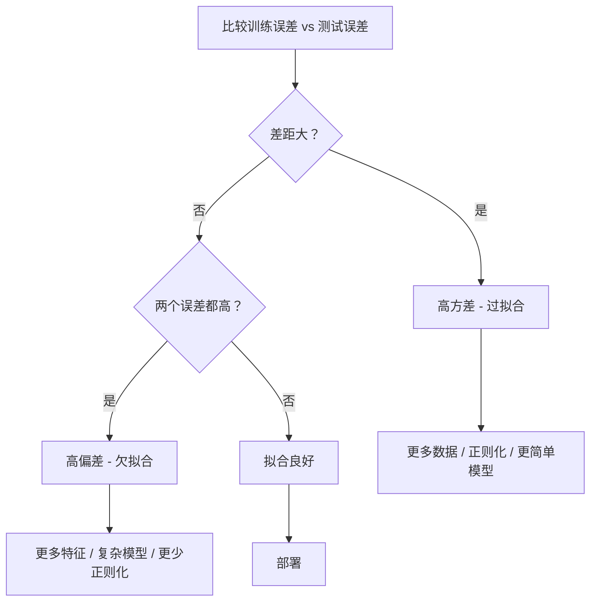
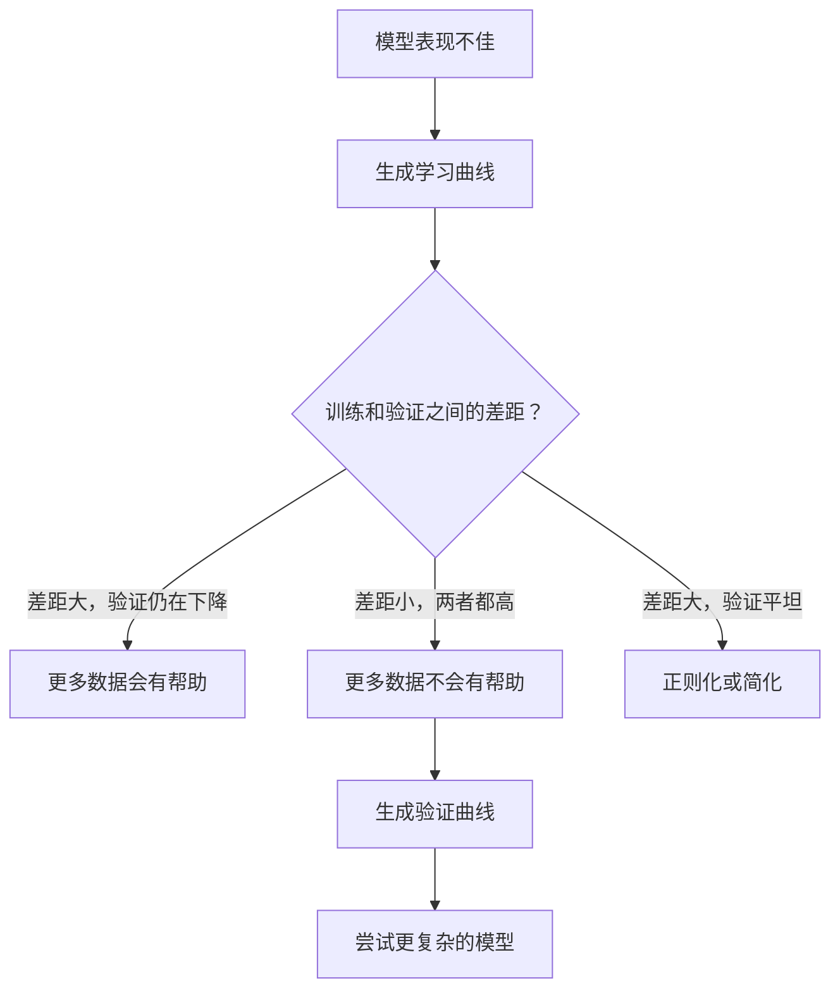

# 偏差-方差权衡

> 每个模型误差来自三个来源之一：偏差、方差或噪声。你只能控制前两个。

**类型：** Learn
**语言：** Python
**前置知识：** 阶段 2 第 01-09 课（ML 基础、回归、分类、评估）
**时间：** 约 75 分钟

## 学习目标

- 推导预期预测误差的偏差-方差分解，解释不可消除噪声的作用
- 使用训练和测试误差模式诊断模型是高偏差还是高方差
- 解释正则化技术（L1、L2、dropout、早停）如何用偏差换取方差
- 实现实验可视化不同复杂度模型之间的偏差-方差权衡

## 问题

你训练了一个模型。它在测试数据上有一些误差。误差从哪里来？

如果你的模型太简单（在曲线数据上的线性回归），它会持续错过真实模式。这是偏差。如果你的模型太复杂（15 个数据点上的 20 次多项式），它会完美拟合训练数据但在新数据上给出完全不同的预测。这是方差。

对于固定模型容量，你不能同时最小化两者。压低偏差，方差就上升。压低方差，偏差就上升。理解这个权衡是机器学习中最有用的诊断技能。它告诉你是否让你的模型更复杂或更简单，是否获取更多数据还是设计更好的特征，是否更多或更少地正则化。

## 概念

### 偏差：系统误差

偏差衡量你的模型平均预测离真实值有多远。如果你在许多不同的训练集上训练同一模型（从相同分布中抽取）并平均预测，偏差就是该平均值与真实值之间的差距。

高偏差意味着模型太僵硬，无法捕捉真实模式。拟合到抛物线的直线总会错过曲线，无论你给它多少数据。这是欠拟合。

```
高偏差（欠拟合）：
  模型总是预测大致相同但错误的值。
  训练误差：高
  测试误差：高
  两者之间的差距：小
```

### 方差：对训练数据的敏感度

方差衡量当你在不同数据子集上训练时，预测变化有多大。如果训练集的小变化导致模型的大变化，方差就高。

高方差意味着模型拟合训练数据中的噪声，而不是底层信号。20 次多项式会穿过的每个训练点，但在点之间剧烈震荡。这是过拟合。

```
高方差（过拟合）：
  模型完美拟合训练数据但在新数据上失败。
  训练误差：低
  测试误差：高
  两者之间的差距：大
```

### 分解

对于任意点 x，平方损失下的预期预测误差精确分解为：

```
预期误差 = 偏差^2 + 方差 + 不可消除噪声

其中：
  偏差^2   = (E[f_hat(x)] - f(x))^2
  方差     = E[(f_hat(x) - E[f_hat(x)])^2]
  噪声     = E[(y - f(x))^2]             (sigma^2)
```

- `f(x)` 是真实函数
- `f_hat(x)` 是模型的预测
- `E[...]` 是对不同训练集的期望
- `y` 是观察到的标签（真实函数加噪声）

噪声项不能被消除。没有模型能在噪声数据上做得比 sigma^2 更好。你的工作是找到偏差^2 和方差之间的正确平衡。

### 模型复杂度 vs 误差


经典的 U 形曲线：

| 复杂度 | 偏差 | 方差 | 总误差 |
|-----------|------|----------|-------------|
| 太低 | 高 | 低 | 高（欠拟合） |
| 刚好 | 适中 | 适中 | 最低 |
| 太高 | 低 | 高 | 高（过拟合） |

### 正则化作为偏差-方差控制

正则化故意增加偏差以减少方差。它约束模型使其不能追逐噪声。

- **L2（Ridge）：** 将所有权重向零收缩。保留所有特征但减少其影响。
- **L1（Lasso）：** 将一些权重精确推到零。执行特征选择。
- **Dropout：** 训练期间随机禁用神经元。强制冗余表示。
- **早停：** 在模型完全拟合训练数据之前停止训练。

正则化强度（lambda、dropout 率、轮次数）直接控制你在偏差-方差曲线上的位置。更多正则化意味着更多偏差，更少方差。

### 双重下降：现代视角

经典理论说：过了最佳点后，更多复杂度总会有害。但 2019 年以来的研究显示了意外之事。如果你继续增加模型容量，远远超过插值阈值（模型有足够参数完美拟合训练数据），测试误差可以再次下降。


这种"双重下降"现象解释了为什么大量过参数化的神经网络（参数远超训练样本）仍然泛化良好。经典偏差-方差权衡不是错的，但对于现代领域是不完整的。

| 状态 | 参数 vs 样本 | 行为 |
|--------|----------------------|----------|
| 欠参数化 | p << n | 经典权衡适用 |
| 插值阈值 | p ~ n | 方差达到峰值，测试误差激增 |
| 过参数化 | p >> n | 隐式正则化介入，测试误差下降 |

对于实际目的：如果你使用神经网络或大型树集成，不要在插值阈值处停止。要么远低于它（带显式正则化），要么远高于它。最糟糕的位置恰好就在阈值处。

### 诊断你的模型



| 症状 | 诊断 | 修复 |
|---------|-----------|-----|
| 高训练误差，高测试误差 | 偏差 | 更多特征，复杂模型，更少正则化 |
| 低训练误差，高测试误差 | 方差 | 更多数据，正则化，更简单模型，dropout |
| 低训练误差，低测试误差 | 拟合良好 | 上线 |
| 训练误差下降，测试误差上升 | 过拟合进行中 | 早停 |

### 集成方法与方差减少

集成方法是对抗方差的最实用工具。

**Bagging（自助聚合）** 在训练数据的不同自助样本上训练多个模型，然后平均它们的预测。每个单独模型方差高，但平均值方差低得多。随机森林是应用于决策树的 bagging。

为什么数学上有效：如果你平均 N 个独立预测，每个方差为 sigma^2，平均的方差是 sigma^2 / N。模型并非真正独立（它们都看到相似数据），所以减少小于 1/N，但仍然可观。

**Boosting** 通过顺序构建模型减少偏差，每个新模型关注到目前为止集成的错误。梯度提升和 AdaBoost 是主要例子。Boosting 如果添加太多模型可能会过拟合，因此需要早停或正则化。

| 方法 | 主要效果 | 偏差变化 | 方差变化 |
|--------|---------------|-------------|-----------------|
| Bagging | 减少方差 | 不变 | 减少 |
| Boosting | 减少偏差 | 减少 | 可能增加 |
| Stacking | 减少两者 | 取决于元学习器 | 取决于基模型 |
| Dropout | 隐式 bagging | 轻微增加 | 减少 |

**实用规则：** 如果你的基模型方差高（深树、高次多项式），使用 bagging。如果你的基模型偏差高（浅树桩、简单线性模型），使用 boosting。

### 学习曲线

学习曲线画训练和验证误差作为训练集大小的函数。它们是你拥有的最实用诊断工具。与单次训练/测试比较不同，学习曲线展示模型的轨迹，告诉你更多数据是否有帮助。

如何解读：

| 场景 | 训练误差 | 验证误差 | 差距 | 含义 | 做什么 |
|----------|---------------|-----------------|-----|---------------|------------|
| 高偏差 | 高 | 高 | 小 | 模型无法捕捉模式 | 更多特征，复杂模型，更少正则化 |
| 高方差 | 低 | 高 | 大 | 模型记忆训练数据 | 更多数据，正则化，更简单模型 |
| 拟合良好 | 适中 | 适中 | 小 | 模型泛化良好 | 上线 |
| 高方差改善中 | 低 | 随更多数据下降 | 缩小 | 数据可修复的方差问题 | 收集更多数据 |
| 高偏差平坦 | 高且平坦 | 高且平坦 | 小且平坦 | 更多数据不会帮助 | 改变模型架构 |

关键洞见：如果两条曲线都已平稳且差距小但两个误差都高，更多数据无用。你需要更好的模型。如果差距大且仍在缩小，更多数据会有帮助。

### 如何生成学习曲线

有两种方法：

**方法 1：变化训练集大小，固定模型。** 保持模型和超参数不变。在越来越大的训练数据子集上训练。在每个大小处测量训练误差和验证误差。这是标准学习曲线。

**方法 2：变化模型复杂度，固定数据。** 保持数据不变。扫描复杂度参数（多项式次数、树深度、层数）。在每个复杂度处测量训练误差和验证误差。这是验证曲线，直接展示偏差-方差权衡。

两种方法互为补充。第一种告诉你更多数据是否有帮助。第二种告诉你不同模型是否有帮助。在决定下一步之前两种都运行。



## Build It

`code/bias_variance.py` 中的代码运行完整的偏差-方差分解实验。以下是步骤方法。

### 第 1 步：从已知函数生成合成数据

我们使用 `f(x) = sin(1.5x) + 0.5x` 加高斯噪声。知道真实函数让我们可以计算精确的偏差和方差。

```python
def true_function(x):
    return np.sin(1.5 * x) + 0.5 * x

def generate_data(n_samples=30, noise_std=0.5, x_range=(-3, 3), seed=None):
    rng = np.random.RandomState(seed)
    x = rng.uniform(x_range[0], x_range[1], n_samples)
    y = true_function(x) + rng.normal(0, noise_std, n_samples)
    return x, y
```

### 第 2 步：自助采样和多项式拟合

对每个多项式次数，我们抽取许多自助训练集，拟合多项式，记录在固定测试网格上的预测。这给我们每个测试点的预测分布。

```python
def fit_polynomial(x_train, y_train, degree, lam=0.0):
    X = np.column_stack([x_train ** d for d in range(degree + 1)])
    if lam > 0:
        penalty = lam * np.eye(X.shape[1])
        penalty[0, 0] = 0
        w = np.linalg.solve(X.T @ X + penalty, X.T @ y_train)
    else:
        w = np.linalg.lstsq(X, y_train, rcond=None)[0]
    return w
```

我们在 200 个不同的自助样本上拟合。每个自助样本从相同底层分布中抽取，但包含不同的点。

### 第 3 步：计算偏差^2、方差分解

每个测试点有 200 组预测，我们可以直接从定义计算分解：

```python
mean_pred = predictions.mean(axis=0)
bias_sq = np.mean((mean_pred - y_true) ** 2)
variance = np.mean(predictions.var(axis=0))
total_error = np.mean(np.mean((predictions - y_true) ** 2, axis=1))
```

- `mean_pred` 是从自助样本估计的 E[f_hat(x)]
- `bias_sq` 是平均预测与真实值之间的平方差距
- `variance` 是各自助样本预测的平均离散度
- `total_error` 大约等于 bias^2 + variance + noise

### 第 4 步：学习曲线

学习曲线在保持模型复杂度固定的同时扫描训练集大小。它们显示你的模型是数据受限还是容量受限。

```python
def demo_learning_curves():
    sizes = [10, 15, 20, 30, 50, 75, 100, 150, 200, 300]
    degree = 5

    for n in sizes:
        train_errors = []
        test_errors = []
        for seed in range(50):
            x_train, y_train = generate_data(n_samples=n, seed=seed * 100)
            w = fit_polynomial(x_train, y_train, degree)
            train_pred = predict_polynomial(x_train, w)
            train_mse = np.mean((train_pred - y_train) ** 2)
            test_pred = predict_polynomial(x_test, w)
            test_mse = np.mean((test_pred - y_test) ** 2)
            train_errors.append(train_mse)
            test_errors.append(test_mse)
        # 对多次运行取平均得到学习曲线点
```

对于高方差模型（5 次多项式，少量数据），你看到：
- 训练误差开始时低，随着更多数据使记忆更难而增加
- 测试误差开始时高，随着模型获得更多信号而下降
- 差距随更多数据缩小

对于高偏差模型（1 次），两个误差都迅速收敛到相同的高值，更多数据没有帮助。

### 第 5 步：正则化扫描

代码还包含 `demo_regularization_sweep()`，它固定高次多项式（15 次）并扫描 Ridge 正则化强度从 0.001 到 100。这从不同角度展示偏差-方差权衡：不改变模型复杂度，而是改变约束强度。

```python
def demo_regularization_sweep():
    alphas = [0.001, 0.005, 0.01, 0.05, 0.1, 0.5, 1.0, 5.0, 10.0, 50.0, 100.0]
    for alpha in alphas:
        results = bias_variance_decomposition([15], lam=alpha)
        r = results[15]
        print(f"alpha={alpha:.3f}  bias={r['bias_sq']:.4f}  var={r['variance']:.4f}")
```

在低 alpha 处，15 次多项式几乎不受约束。方差占主导，因为模型追逐每个自助样本中的噪声。在高 alpha 处，惩罚如此强以至于模型实际上成为接近常数的函数。偏差占主导。最优 alpha 位于这两个极端之间。

这与变化多项式次数是同一个 U 曲线，但由连续旋钮控制而不是离散的。在实践中，正则化是控制权衡的首选方式，因为它允许细粒度控制而无需改变特征集。

## Use It

sklearn 提供 `learning_curve` 和 `validation_curve` 来自动化这些诊断，无需手写自助循环。

### 验证曲线：扫描模型复杂度

```python
from sklearn.model_selection import validation_curve
from sklearn.pipeline import make_pipeline
from sklearn.preprocessing import PolynomialFeatures
from sklearn.linear_model import Ridge

degrees = list(range(1, 16))
train_scores_all = []
val_scores_all = []

for d in degrees:
    pipe = make_pipeline(PolynomialFeatures(d), Ridge(alpha=0.01))
    train_scores, val_scores = validation_curve(
        pipe, X, y, param_name="polynomialfeatures__degree",
        param_range=[d], cv=5, scoring="neg_mean_squared_error"
    )
    train_scores_all.append(-train_scores.mean())
    val_scores_all.append(-val_scores.mean())
```

这直接给出偏差-方差权衡曲线。验证分数相对于训练分数最差的地方，方差占主导。两者都差的地方，偏差占主导。

### 学习曲线：扫描训练集大小

```python
from sklearn.model_selection import learning_curve

pipe = make_pipeline(PolynomialFeatures(5), Ridge(alpha=0.01))
train_sizes, train_scores, val_scores = learning_curve(
    pipe, X, y, train_sizes=np.linspace(0.1, 1.0, 10),
    cv=5, scoring="neg_mean_squared_error"
)
train_mse = -train_scores.mean(axis=1)
val_mse = -val_scores.mean(axis=1)
```

画 `train_mse` 和 `val_mse` 对 `train_sizes`。形状告诉你关于模型的一切。

### 带正则化扫描的交叉验证

```python
from sklearn.model_selection import cross_val_score

alphas = [0.001, 0.01, 0.1, 1.0, 10.0, 100.0]
for alpha in alphas:
    pipe = make_pipeline(PolynomialFeatures(10), Ridge(alpha=alpha))
    scores = cross_val_score(pipe, X, y, cv=5, scoring="neg_mean_squared_error")
    print(f"alpha={alpha:>7.3f}  MSE={-scores.mean():.4f} +/- {scores.std():.4f}")
```

这扫描固定模型复杂度的正则化强度。你会看到相同的偏差-方差权衡：低 alpha 意味着高方差，高 alpha 意味着高偏差。

### 全部结合起来：完整诊断工作流

在实践中，你按顺序运行这些诊断：

1. 训练你的模型。计算训练和测试误差。
2. 如果两者都高：你有偏差问题。跳到第 4 步。
3. 如果训练低但测试高：你有方差问题。生成学习曲线看更多数据是否有帮助。如果没有，正则化。
4. 生成验证曲线扫描你的主要复杂度参数。找到最佳点。
5. 在最佳点处，生成学习曲线。如果差距仍然大，你需要更多数据或正则化。
6. 使用 `cross_val_score` 尝试 Ridge/Lasso 的不同 alpha 值。选择交叉验证误差最低的 alpha。

对于大多数表格数据集，这需要 10-15 分钟的计算并节省数小时的猜测。

## Ship It

本课产出：`outputs/prompt-model-diagnostics.md`

完整实现：`phases/02-ml-fundamentals/10-bias-variance/code/bias_variance.py`

## 练习

1. 使用已知函数生成数据。训练 1、3、5、7、9 和 15 次多项式。对每个计算偏差^2 和方差。画偏差^2、方差和总误差 vs 多项式次数的图。识别偏差和方差相交的点。

2. 生成学习曲线：对于 5 次多项式，在 10 到 300 数据点之间变化训练集大小。同时画训练误差和测试误差。解释为什么训练误差随更多数据增加，测试误差随更多数据减少。

3. 实现早停：在噪声回归数据集上训练高次多项式。每 10 次迭代后，在验证集上评估。当验证误差连续 5 次检查不下降时停止。展示早停选择了一个比完全收敛更好泛化的参数集。

4. 用两个模型实验双重下降：线性回归（足够少的参数以避免过拟合）和神经网络（极度过参数化）。展示在插值阈值附近的经典偏差-方差权衡和过参数化区域的重下降。

## 关键术语

| 术语 | 实际含义 |
|------|---------|
| 偏差 | 系统误差。模型平均预测与真实值之间的差距。太简单的模型偏差高 |
| 方差 | 对训练数据的敏感度。在不同训练集上训练时预测的变化程度 |
| 不可消除噪声 | sigma^2。数据中不能被任何模型消除的误差 |
| 偏差-方差分解 | E[误差] = Bias^2 + Variance + Noise。精确适用于平方损失 |
| 欠拟合 | 高偏差。模型太简单无法捕捉数据模式 |
| 过拟合 | 高方差。模型拟合噪声而不是信号 |
| 学习曲线 | 训练/验证误差 vs 训练集大小。诊断偏差/方差问题的最实用工具 |
| 验证曲线 | 训练/验证误差 vs 模型复杂度参数。直接展示权衡 |
| 正则化 | 故意增加偏差以减少方差。L1、L2、dropout、早停 |
| 早停 | 在训练误差收敛之前停止训练。一种正则化形式 |
| Bagging | 在不同自助样本上训练模型并平均。减少方差 |
| Boosting | 顺序训练模型，每个新模型关注先前错误的。减少偏差 |
| 双重下降 | 现象：测试误差在参数 ~ 样本时达到峰值，然后在大大超过后下降 |
| 自助样本 | 带放回采样。每次自助包含原始数据约 63% 的不同样本 |