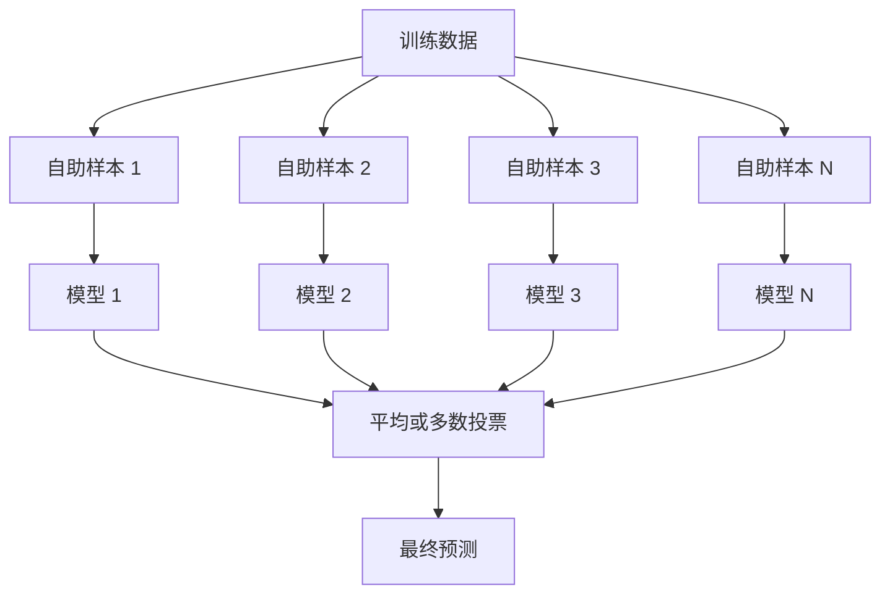
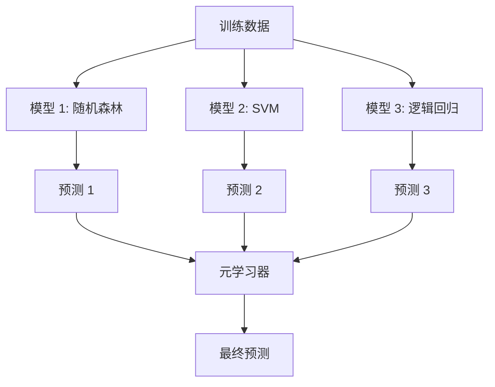

# 集成方法

> 一群弱学习器，正确组合起来，就会变成一个强学习器。这不是比喻，而是一个定理。

**类型：** Build
**语言：** Python
**前置知识：** 阶段 2 第 10 课（偏差-方差权衡）
**时间：** 约 120 分钟

## 学习目标

- 从零实现 AdaBoost 和梯度提升，解释提升如何逐步减少偏差
- 构建一个袋装集成，演示平均去相关模型如何在不增加偏差的情况下减少方差
- 对比袋装法、提升法和堆叠法，理解每种方法针对的误差分量
- 评估集成多样性，解释为什么多数投票准确率随更多独立弱学习器的加入而提高

## 问题

单棵决策树训练快且易于解释，但会过拟合。单个线性模型在复杂边界上欠拟合。你可以花几天时间设计完美的模型架构。或者你可以组合一堆不完美的模型，得到比任何单个模型都好的结果。

集成方法做的就是这件事。它们是在表格数据上赢得 Kaggle 竞赛的最可靠技术，驱动着大多数生产 ML 系统，并展示了偏差-方差权衡的实际运作。袋装法减少方差。提升法减少偏差。堆叠法学习在不同输入上应该信任哪个模型。

## 概念

### 为什么集成有效

假设你有 N 个独立的分类器，每个准确率为 p > 0.5。多数投票的准确率为：

```
P(多数正确) = sum over k > N/2 of C(N,k) * p^k * (1-p)^(N-k)
```

对于 21 个分类器，每个准确率为 60%，多数投票准确率约为 74%。有 101 个分类器时，上升到 84%。当模型犯不同的错误时，误差会相互抵消。

关键要求是**多样性**。如果所有模型犯相同的错误，组合它们没有任何帮助。集成通过以下方式产生多样化的模型：

- 不同的训练子集（袋装法）
- 不同的特征子集（随机森林）
- 序贯误差校正（提升法）
- 不同的模型族（堆叠法）

### 袋装法（自助聚合）

袋装法通过在训练数据的不同自助样本上训练每个模型来创造多样性。



自助样本是从原始数据中有放回抽取的，大小与原始数据相同。约 63.2% 的不同样本出现在每个自助样本中。剩下的约 36.8%（袋外样本）提供免费的验证集。

袋装法在不显著增加偏差的情况下减少方差。每棵单独的树对其自助样本过拟合，但每棵树的过拟合方式不同，所以平均后噪声被抵消。

**随机森林**是带有额外变化的袋装法：在每次分裂时，只考虑随机特征子集。这迫使树之间更大的多样性。特征候选数通常为分类用 `sqrt(n_features)`，回归用 `n_features / 3`。

### 提升法（序贯误差校正）

提升法序贯训练模型。每个新模型关注之前模型出错的样本。


提升法减少偏差。每个新模型修正集成当前的系统性错误。最终预测是所有模型的加权和，更好的模型获得更高的权重。

权衡：提升法如果运行太多轮可能会过拟合，因为它不断拟合更难样本，其中一些可能只是噪声。

### AdaBoost

AdaBoost（自适应提升）是第一个实用的提升算法。它适用于任何基学习器，通常是决策树桩（深度为 1 的树）。

算法：

```
1. 初始化样本权重：w_i = 1/N 对全部 i

2. 对 t = 1 到 T：
   a. 在加权数据上训练弱学习器 h_t
   b. 计算加权误差：
      err_t = sum(w_i * I(h_t(x_i) != y_i)) / sum(w_i)
   c. 计算模型权重：
      alpha_t = 0.5 * ln((1 - err_t) / err_t)
   d. 更新样本权重：
      w_i = w_i * exp(-alpha_t * y_i * h_t(x_i))
   e. 归一化权重和为 1

3. 最终预测：H(x) = sign(sum(alpha_t * h_t(x)))
```

误差较低的模型获得更高的 alpha。被误分类的样本获得更高权重，下一个模型将重点关注它们。

### 梯度提升

梯度提升将提升法推广到任意损失函数。它不是重新加权样本，而是将每个新模型拟合到当前集成残差（损失函数的负梯度）上。

```
1. 初始化：F_0(x) = argmin_c sum(L(y_i, c))

2. 对 t = 1 到 T：
   a. 计算伪残差：
      r_i = -dL(y_i, F_{t-1}(x_i)) / dF_{t-1}(x_i)
   b. 将树 h_t 拟合到残差 r_i
   c. 找最优步长：
      gamma_t = argmin_gamma sum(L(y_i, F_{t-1}(x_i) + gamma * h_t(x_i)))
   d. 更新：
      F_t(x) = F_{t-1}(x) + learning_rate * gamma_t * h_t(x)

3. 最终预测：F_T(x)
```

对于平方误差损失，伪残差就是实际残差：`r_i = y_i - F_{t-1}(x_i)`。每棵树实际上拟合的是前一个集成的误差。

学习率（收缩率）控制每棵树的贡献大小。更小的学习率需要更多树但泛化更好。典型值：0.01 到 0.3。

### XGBoost：为什么它统治表格数据

XGBoost（极端梯度提升）是带有工程优化的梯度提升，使其快速、准确且抗过拟合：

- **正则化目标：** 叶权重的 L1 和 L2 惩罚防止单棵树过于自信
- **二阶近似：** 同时使用损失的一阶和二阶导数，给出更好的分裂决策
- **稀疏感知分裂：** 原生处理缺失值，学习每次分裂缺失数据的最佳方向
- **列子采样：** 像随机森林一样，在每次分裂时采样特征以增加多样性
- **加权分位数草图：** 在分布式数据上高效找到连续特征的分裂点
- **缓存感知块结构：** 内存布局针对 CPU 缓存行优化

对于表格数据，XGBoost（及其后继 LightGBM）持续超越神经网络。这在短期内不会改变。如果你的数据适合行和列的表格形式，从梯度提升开始。

### 堆叠法（元学习）

堆叠法使用多个基模型的预测作为元学习器的特征。



元学习器学习在不同输入上应该信任哪个基模型。如果随机森林在某些区域更好而 SVM 在其他区域更好，元学习器将学会相应地分配。

为避免数据泄露，基模型预测必须通过训练集上的交叉验证生成。永远不要在同一数据上训练基模型并生成元特征。

### 投票法

最简单的集成。直接组合预测。

- **硬投票：** 对类别标签多数投票。
- **软投票：** 平均预测概率，选择平均概率最高的类别。通常更好，因为它使用了置信度信息。

## Build It

### 第 1 步：决策树桩（基学习器）

`code/ensembles.py` 中的代码从零实现所有内容。我们从决策树桩开始：只有一个分裂点的树。

```python
class DecisionStump:
    def __init__(self):
        self.feature_idx = None
        self.threshold = None
        self.polarity = 1
        self.alpha = None

    def fit(self, X, y, weights):
        n_samples, n_features = X.shape
        best_error = float("inf")

        for f in range(n_features):
            thresholds = np.unique(X[:, f])
            for thresh in thresholds:
                for polarity in [1, -1]:
                    pred = np.ones(n_samples)
                    pred[polarity * X[:, f] < polarity * thresh] = -1
                    error = np.sum(weights[pred != y])
                    if error < best_error:
                        best_error = error
                        self.feature_idx = f
                        self.threshold = thresh
                        self.polarity = polarity

    def predict(self, X):
        n = X.shape[0]
        pred = np.ones(n)
        idx = self.polarity * X[:, self.feature_idx] < self.polarity * self.threshold
        pred[idx] = -1
        return pred
```

### 第 2 步：从零实现 AdaBoost

```python
class AdaBoostScratch:
    def __init__(self, n_estimators=50):
        self.n_estimators = n_estimators
        self.stumps = []
        self.alphas = []

    def fit(self, X, y):
        n = X.shape[0]
        weights = np.full(n, 1 / n)

        for _ in range(self.n_estimators):
            stump = DecisionStump()
            stump.fit(X, y, weights)
            pred = stump.predict(X)

            err = np.sum(weights[pred != y])
            err = np.clip(err, 1e-10, 1 - 1e-10)

            alpha = 0.5 * np.log((1 - err) / err)
            weights *= np.exp(-alpha * y * pred)
            weights /= weights.sum()

            stump.alpha = alpha
            self.stumps.append(stump)
            self.alphas.append(alpha)

    def predict(self, X):
        total = sum(a * s.predict(X) for a, s in zip(self.alphas, self.stumps))
        return np.sign(total)
```

### 第 3 步：从零实现梯度提升

```python
class GradientBoostingScratch:
    def __init__(self, n_estimators=100, learning_rate=0.1, max_depth=3):
        self.n_estimators = n_estimators
        self.lr = learning_rate
        self.max_depth = max_depth
        self.trees = []
        self.initial_pred = None

    def fit(self, X, y):
        self.initial_pred = np.mean(y)
        current_pred = np.full(len(y), self.initial_pred)

        for _ in range(self.n_estimators):
            residuals = y - current_pred
            tree = SimpleRegressionTree(max_depth=self.max_depth)
            tree.fit(X, residuals)
            update = tree.predict(X)
            current_pred += self.lr * update
            self.trees.append(tree)

    def predict(self, X):
        pred = np.full(X.shape[0], self.initial_pred)
        for tree in self.trees:
            pred += self.lr * tree.predict(X)
        return pred
```

### 第 4 步：与 sklearn 对比

代码验证从零实现产生与 sklearn 的 `AdaBoostClassifier` 和 `GradientBoostingClassifier` 相似的准确率，并并排比较所有方法。

## Use It

### 何时使用每种方法

| 方法 | 减少 | 最适合 | 注意 |
|--------|---------|----------|---------------|
| 袋装法 / 随机森林 | 方差 | 噪声数据，多特征 | 无助偏差 |
| AdaBoost | 偏差 | 干净数据，简单基学习器 | 对异常值和噪声敏感 |
| 梯度提升 | 偏差 | 表格数据，竞赛 | 训练慢，不调参易过拟合 |
| XGBoost / LightGBM | 两者 | 生产级表格 ML | 超参数多 |
| 堆叠法 | 两者 | 获取最后 1-2% 准确率 | 复杂，元学习器过拟合风险 |
| 投票法 | 方差 | 快速组合多种模型 | 只在模型多样化时有帮助 |

### 表格数据的生产栈

对于大多数表格预测问题，按以下顺序尝试：

1. **LightGBM 或 XGBoost**，使用默认参数
2. 调优 n_estimators、learning_rate、max_depth、min_child_weight
3. 如果需要最后 0.5%，使用 3-5 个多样化模型构建堆叠集成
4. 全程使用交叉验证

在表格数据上，神经网络几乎总是比梯度提升差，尽管持续有研究尝试。TabNet、NODE 等架构偶尔能匹配但很少能击败调优良好的 XGBoost。

## Ship It

本课产出：
- `outputs/prompt-ensemble-selector.md` -- 一个帮助你为给定数据集选择正确集成方法的提示词
- `outputs/skill-ensemble-builder.md` -- 完整的选择指南

## 练习

1. 修改 AdaBoost 实现，记录每轮后的训练准确率。绘制准确率与估计器数量的关系图。它何时收敛？

2. 通过在回归树中添加随机特征子采样，从零实现随机森林。训练 100 棵树，`max_features=sqrt(n_features)`，平均预测结果。与单棵树比较方差减少。

3. 在梯度提升实现中添加早停：记录每轮后的验证损失，连续 10 轮不下降时停止。实际需要多少棵树？

4. 使用三个基模型（逻辑回归、决策树、K 近邻）和逻辑回归元学习器构建堆叠集成。使用 5 折交叉验证生成元特征。与每个单独的基模型比较。

5. 在同一数据集上使用默认参数运行 XGBoost。将其准确率与你从零实现的梯度提升比较。计时两者。速度差异多大？

## 关键术语

| 术语 | 人们说的 | 实际含义 |
|------|----------------|----------------------|
| 袋装法 | "在随机子集上训练" | 自助聚合：在自助样本上训练模型，平均预测以减少方差 |
| 提升法 | "关注困难样本" | 序贯训练模型，每个修正集成当前的错误，以减少偏差 |
| AdaBoost | "重新加权数据" | 通过样本权重更新进行提升；误分类点在下一次获得更高权重 |
| 梯度提升 | "拟合残差" | 通过将每个新模型拟合到损失函数负梯度进行提升 |
| XGBoost | "Kaggle 武器" | 带正则化、二阶优化和系统级加速技巧的梯度提升 |
| 堆叠法 | "模型堆模型" | 使用基模型的预测作为元学习器的输入特征 |
| 随机森林 | "许多随机化树" | 决策树袋装法，每次分裂添加随机特征子采样以增加多样性 |
| 集成多样性 | "犯不同的错误" | 模型必须在其错误上不相关，集成才能优于单个模型 |
| 袋外误差 | "免费验证" | 未出现在自助抽样中的样本（约 36.8%）作为验证集，无需预留 |

## 延伸阅读

- [Schapire & Freund: Boosting: Foundations and Algorithms](https://mitpress.mit.edu/9780262526036/) -- AdaBoost 创作者的专著
- [Friedman: Greedy Function Approximation: A Gradient Boosting Machine (2001)](https://statweb.stanford.edu/~jhf/ftp/trebst.pdf) -- 原始梯度提升论文
- [Chen & Guestrin: XGBoost (2016)](https://arxiv.org/abs/1603.02754) -- XGBoost 论文
- [Wolpert: Stacked Generalization (1992)](https://www.sciencedirect.com/science/article/abs/pii/S0893608005800231) -- 原始堆叠法论文
- [scikit-learn Ensemble Methods](https://scikit-learn.org/stable/modules/ensemble.html) -- 实用参考