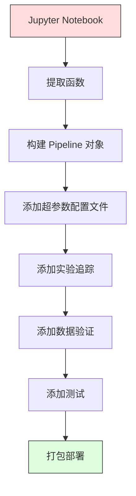

# ML 流水线

> 模型不是一个产品。流水线才是。流水线包含了从原始数据到部署预测的全过程，每一步都必须是可复现的。

**类型：** Build
**语言：** Python
**前置知识：** 阶段 2 第 12 课（超参数调优）
**时间：** 约 120 分钟

## 学习目标

- 从零构建一个 ML 流水线，将缺失值填补、缩放、编码和模型训练链接为单个可复现对象
- 识别数据泄露场景，解释流水线如何通过仅在训练数据上拟合变换器来防止泄露
- 构建对数值和类别特征应用不同预处理的 ColumnTransformer
- 实现流水线序列化，证明同一已拟合流水线在训练和生产中产生相同结果

## 问题

你有一个 notebook，加载数据，用中位数填补缺失值，缩放特征，训练模型，打印准确率。它有效。你部署它。

一个月后，有人重新训练模型并得到不同结果。中位数是在包含测试数据的完整数据集上计算的（数据泄露）。缩放参数没有保存，推理使用不同的统计量。特征工程代码在训练和服务之间复制粘贴，副本出现了差异。生产中出现了一个编码器从未见过的新分类值。

这些不是假设。它们是 ML 系统在生产中失败的最常见原因。流水线通过将每个变换步骤打包成一个有序的、可复现的对象来解决所有这些问题。

## 概念

### 什么是流水线

流水线是一个有序的数据变换序列，后跟一个模型。每个步骤将前一步的输出作为输入。整个流水线在训练数据上拟合一次。在推理时，同一个已拟合流水线变换新数据并产生预测。


流水线保证：
- 变换仅在训练数据上拟合（无泄露）
- 相同的变换在推理时应用
- 整个对象可以被序列化并作为单个工件部署
- 交叉验证在每折上应用流水线，防止微妙的泄露

### 数据泄露：无声杀手

当来自测试集或未来数据的信息污染训练时，数据泄露发生。流水线防止最常见的形式。

**泄露（错误）：**
```python
X = df.drop("target", axis=1)
scaler = StandardScaler()
X_scaled = scaler.fit_transform(X)  # 缩放器看到了测试数据！
X_train, X_test = X_scaled[:800], X_scaled[800:]
```

**正确：**
```python
X_train, X_test = X[:800], X[800:]
scaler = StandardScaler()
X_train_scaled = scaler.fit_transform(X_train)
X_test_scaled = scaler.transform(X_test)  # 仅变换，不拟合
```

使用流水线，你不需要考虑这些。流水线自动处理。

### sklearn Pipeline

sklearn 的 `Pipeline` 将变换器和一个估计器链接起来。它暴露 `.fit()`、`.predict()` 和 `.score()`，按顺序应用所有步骤。

```python
from sklearn.pipeline import Pipeline
from sklearn.preprocessing import StandardScaler
from sklearn.linear_model import LogisticRegression

pipe = Pipeline([
    ("scaler", StandardScaler()),
    ("model", LogisticRegression()),
])

pipe.fit(X_train, y_train)
predictions = pipe.predict(X_test)
```

当你调用 `pipe.fit(X_train, y_train)`：
1. Scaler 在 X_train 上调用 `fit_transform`
2. Model 在缩放后的 X_train 上调用 `fit`

当你调用 `pipe.predict(X_test)`：
1. Scaler 在 X_test 上调用 `transform`（不是 fit_transform）
2. Model 在缩放后的 X_test 上调用 `predict`

缩放器在拟合期间从未看到测试数据。这就是全部要点。

### ColumnTransformer：不同列不同流水线

真实数据集有数值列和分类列，需要不同的预处理。`ColumnTransformer` 处理这个。

```python
from sklearn.compose import ColumnTransformer
from sklearn.preprocessing import StandardScaler, OneHotEncoder
from sklearn.impute import SimpleImputer

numeric_pipe = Pipeline([
    ("impute", SimpleImputer(strategy="median")),
    ("scale", StandardScaler()),
])

categorical_pipe = Pipeline([
    ("impute", SimpleImputer(strategy="most_frequent")),
    ("encode", OneHotEncoder(handle_unknown="ignore")),
])

preprocessor = ColumnTransformer([
    ("num", numeric_pipe, ["age", "income", "score"]),
    ("cat", categorical_pipe, ["city", "gender", "plan"]),
])

full_pipeline = Pipeline([
    ("preprocess", preprocessor),
    ("model", GradientBoostingClassifier()),
])
```

OneHotEncoder 中的 `handle_unknown="ignore"` 对生产至关重要。当出现新类别时，它产生零向量而不是崩溃。

### 实验追踪

流水线使训练可复现，但你还需要追踪不同实验之间发生了什么：使用了哪些超参数、哪个数据集版本、指标是什么、运行了什么代码。

**MLflow** 是最常见的开源解决方案：

```python
import mlflow

with mlflow.start_run():
    mlflow.log_param("max_depth", 5)
    mlflow.log_param("n_estimators", 100)
    mlflow.log_param("learning_rate", 0.1)

    pipe.fit(X_train, y_train)
    accuracy = pipe.score(X_test, y_test)

    mlflow.log_metric("accuracy", accuracy)
    mlflow.sklearn.log_model(pipe, "model")
```

每次运行都记录参数、指标、工件和完整模型。你可以比较运行、复现任何实验、部署任何模型版本。

### 模型版本管理

实验追踪之后，你需要管理模型版本。哪个模型在生产中？哪个在预发布？哪个是上周的？

MLflow 的模型注册表提供：
- **版本追踪：** 每个保存的模型获得一个版本号
- **阶段转换：** "Staging"、"Production"、"Archived"
- **审批工作流：** 模型必须明确提升到生产
- **回滚：** 立即切换回之前的版本

### 使用 DVC 数据版本管理

代码用 git 做版本管理。数据也应该做版本管理，但 git 不能处理大文件。DVC（数据版本控制）解决这个问题。

```
dvc init
dvc add data/training.csv
git add data/training.csv.dvc data/.gitignore
git commit -m "追踪训练数据"
dvc push
```

DVC 将实际数据存储在远程存储（S3、GCS、Azure），并在 git 中保留一个记录散列的 `.dvc` 小文件。当你 checkout 一个 git 提交时，`dvc checkout` 恢复使用的确切数据。这意味着每个 git 提交都同时固定了代码和数据。完全可复现。

### 可复现实验

一个可复现实验需要四样东西：

1. **固定随机种子：** 为 numpy、random 和框架设置种子
2. **固定依赖：** requirements.txt 或 poetry.lock 包含确切版本
3. **版本化数据：** DVC 或类似工具
4. **配置文件：** 所有超参数在配置文件中，不硬编码

```python
import numpy as np
import random

def set_seed(seed=42):
    random.seed(seed)
    np.random.seed(seed)
    try:
        import torch
        torch.manual_seed(seed)
        torch.cuda.manual_seed_all(seed)
        torch.backends.cudnn.deterministic = True
    except ImportError:
        pass
```

### 从 Notebook 到生产流水线



典型进展：

1. **Notebook 探索：** 快速实验、可视化、特征想法
2. **提取函数：** 将预处理、特征工程、评估移到模块中
3. **构建 Pipeline：** 将变换链接为 sklearn Pipeline 或自定义类
4. **配置管理：** 将所有超参数移到 YAML/JSON 配置中
5. **实验追踪：** 添加 MLflow 或 wandb 日志
6. **数据验证：** 在训练前检查模式、分布和缺失值模式
7. **测试：** 变换器单元测试，完整流水线集成测试
8. **部署：** 序列化流水线，包装为 API（FastAPI、Flask），容器化

### 常见流水线错误

| 错误 | 为什么不好 | 修复方法 |
|---------|-------------|-----|
| 分裂前在全部数据上拟合 | 数据泄露 | 使用 Pipeline 配合 cross_val_score |
| 流水线外的特征工程 | 训练和服务时变换不同 | 将所有变换放入 Pipeline |
| 不处理未知类别 | 生产中新值导致崩溃 | OneHotEncoder(handle_unknown="ignore") |
| 硬编码列名 | 模式变化时损坏 | 从配置中使用列名列表 |
| 无数据验证 | 错误数据上静默错误预测 | 预测前添加模式检查 |
| 训练/服务偏差 | 模型在生产中看到不同特征 | 训练和服务使用同一个 Pipeline 对象 |

## Build It

`code/pipeline.py` 中的代码从零构建完整 ML 流水线：

### 第 1 步：自定义变换器

```python
class CustomTransformer:
    def __init__(self):
        self.means = None
        self.stds = None

    def fit(self, X):
        self.means = np.mean(X, axis=0)
        self.stds = np.std(X, axis=0)
        self.stds[self.stds == 0] = 1.0
        return self

    def transform(self, X):
        return (X - self.means) / self.stds

    def fit_transform(self, X):
        return self.fit(X).transform(X)
```

### 第 2 步：从零实现 Pipeline

```python
class PipelineFromScratch:
    def __init__(self, steps):
        self.steps = steps

    def fit(self, X, y=None):
        X_current = X.copy()
        for name, step in self.steps[:-1]:
            X_current = step.fit_transform(X_current)
        name, model = self.steps[-1]
        model.fit(X_current, y)
        return self

    def predict(self, X):
        X_current = X.copy()
        for name, step in self.steps[:-1]:
            X_current = step.transform(X_current)
        name, model = self.steps[-1]
        return model.predict(X_current)
```

### 第 3 步：流水线交叉验证

代码演示了流水线交叉验证如何防止数据泄露：缩放器在每折的训练数据上单独拟合。

### 第 4 步：使用 sklearn 的完整生产流水线

包含 `ColumnTransformer`、多个预处理路径和模型的完整流水线，配合适当的交叉验证和实验日志。

## Ship It

本课产出：
- `outputs/prompt-ml-pipeline.md` -- 构建和调试 ML 流水线的技能
- `phases/02-ml-fundamentals/13-ml-pipelines/code/pipeline.py` -- 从零实现到 sklearn 的完整流水线

## 练习

1. 构建处理 3 个数值列和 2 个分类列数据集的流水线。使用 `ColumnTransformer` 对数值应用中位数填补 + 缩放，对分类应用众数填补 + one-hot 编码。用 5 折交叉验证训练。

2. 故意引入数据泄露：分裂前在整个数据集上拟合缩放器。将交叉验证分数（泄露）与流水线交叉验证分数（干净）比较。差异多大？

3. 用 `joblib.dump` 序列化你的流水线。在单独脚本中加载并运行预测。验证预测完全相同。

4. 向流水线添加自定义变换器，为两个最重要的数值列创建多项式特征（2 次）。它应该放在流水线中的什么位置？

5. 为流水线设置 MLflow 追踪。用不同超参数运行 5 个实验。使用 MLflow UI 比较运行并选择最佳模型。

## 关键术语

| 术语 | 人们说的 | 实际含义 |
|------|----------------|----------------------|
| Pipeline | "变换 + 模型的链条" | 一个有序的已拟合变换器和模型序列，作为单一单元应用以防止泄露 |
| 数据泄露 | "测试信息泄露到训练中" | 使用训练集之外的信息来构建模型，夸大性能估计 |
| ColumnTransformer | "不同列不同预处理" | 对不同列子集应用不同流水线，组合结果 |
| 实验追踪 | "记录你的运行" | 为每次训练运行记录参数、指标、工件和代码版本 |
| MLflow | "追踪和部署模型" | 用于实验追踪、模型注册和部署的开源平台 |
| DVC | "数据版 Git" | 大数据文件版本控制系统，在 git 中存散列，在远程存储中存数据 |
| 模型注册表 | "模型版本目录" | 追踪模型版本及阶段标签（staging、production、archived）的系统 |
| 训练/服务偏差 | "在 notebook 中有效" | 训练与推理期间数据预处理方式的差异，导致静默错误 |
| 可复现性 | "相同代码，相同结果" | 从相同代码、数据和配置获得相同结果的能力 |

## 延伸阅读

- [scikit-learn Pipeline 文档](https://scikit-learn.org/stable/modules/compose.html) -- 官方流水线参考
- [MLflow 文档](https://mlflow.org/docs/latest/index.html) -- 实验追踪和模型注册
- [DVC 文档](https://dvc.org/doc) -- 数据版本管理
- [Sculley et al., Hidden Technical Debt in Machine Learning Systems (2015)](https://papers.nips.cc/paper/2015/hash/86df7dcfd896fcaf2674f757a2463eba-Abstract.html) -- ML 系统复杂性的开创性论文
- [Google ML Best Practices: Rules of ML](https://developers.google.com/machine-learning/guides/rules-of-ml) -- 实际生产 ML 建议