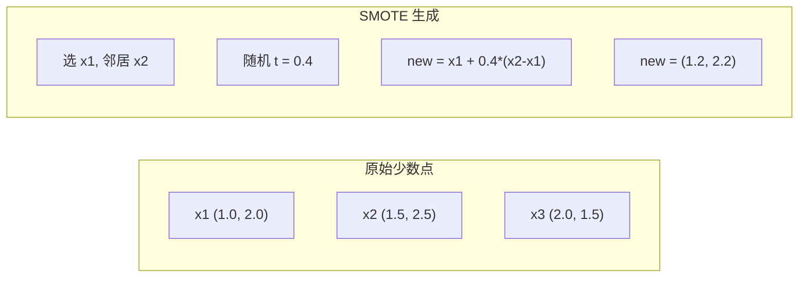

# 处理不平衡数据

> 当 99% 的数据是"正常"时，准确率就是一个谎言。

**类型：** Build
**语言：** Python
**前置知识：** 阶段 2 第 01-09 课（特别是评估指标）
**时间：** 约 90 分钟

## 学习目标

- 从零实现 SMOTE，解释合成过采样与随机复制的区别
- 使用 F1、AUPRC 和马修斯相关系数评估不平衡分类器，而非准确率
- 比较类别权重、阈值调优和重采样策略，为给定不平衡比率选择正确方法
- 构建结合 SMOTE、类别权重和阈值优化的完整不平衡数据流水线

## 问题

你构建了一个欺诈检测模型。它得到 99.9% 准确率。你庆祝。然后你意识到它把每笔交易都预测为"非欺诈"。

这不是 bug。当只有 0.1% 的交易是欺诈时，这是理性做法。模型学到始终猜多数类能最小化总体误差。这技术上正确且完全无用。

这发生在所有真正重要的分类场景中。疾病诊断：1% 阳性率。网络入侵：0.01% 攻击。制造缺陷：0.5% 次品。垃圾邮件过滤：20% 垃圾。流失预测：5% 流失者。少数类越重要，它往往越稀有。

准确率失败是因为它平等对待所有正确预测。正确标记合法交易和正确抓到欺诈都计为一点准确率。但抓到欺诈是模型存在的全部理由。我们需要指标、技术和训练策略来迫使模型关注稀有但重要的类别。

## 概念

### 为什么准确率失败

考虑 1000 样本的数据集：990 负类，10 正类。始终预测负类的模型：

|  | 预测正类 | 预测负类 |
|--|---|---|
| 实际正类 | 0 (TP) | 10 (FN) |
| 实际负类 | 0 (FP) | 990 (TN) |

准确率 = (0 + 990) / 1000 = 99.0%

模型抓到零欺诈。零疾病。零缺陷。但准确率说 99%。

### 更好的指标

**精确率** = TP / (TP + FP)。被标记为正类的所有项中，实际上多少是？高精确率意味着少误报。

**召回率** = TP / (TP + FN)。所有实际正类中，我们抓到多少？高召回率意味着少遗漏正例。

**F1 分数** = 2 * 精确率 * 召回率 / (精确率 + 召回率)。调和平均。比算术平均更严厉惩罚精确率和召回率之间的极端不平衡。

**F-beta 分数** = (1 + beta^2) * 精确率 * 召回率 / (beta^2 * 精确率 + 召回率)。beta > 1 时召回率更重要。F2 在欺诈检测中常见（漏掉欺诈比误报更差）。

**AUPRC**（精确率-召回率曲线下面积）。类似 AUC-ROC 但对不平衡数据信息量更大。随机分类器的 AUPRC 等于正类比率（不像 ROC 是 0.5）。

**马修斯相关系数（MCC）** = (TP * TN - FP * FN) / sqrt((TP+FP)(TP+FN)(TN+FP)(TN+FN))。范围 -1 到 +1。只在模型在两个类别上都表现好时才给高分。

对于上面的"总是预测负类"模型：精确率 = 0，召回率 = 0，F1 = 0，MCC = 0。这些指标正确地将模型识别为无用。

### SMOTE：合成少数类过采样技术

随机过采样复制现有少数样本。这有效但有过拟合风险，因为模型反复看到相同点。

SMOTE 创建新的合成少数样本，这些样本合理但不是副本。算法：

1. 对每个少数样本 x，在其他少数样本中找到它的 k 个最近邻
2. 随机选一个邻居
3. 在 x 和该邻居之间的线段上创建新样本

公式：`new_sample = x + random(0, 1) * (neighbor - x)`

这在真实少数点之间插值，在相同特征空间区域中创建样本，而不只是复制现有数据。



### 采样策略比较

| 策略 | 数据改变 | 风险 | 何时使用 |
|----------|-------------|------|-------------|
| 过采样 | 少数类复制 | 过拟合 | 小数据集，中度不平衡 |
| 欠采样 | 多数类移除 | 信息丢失 | 大数据集，想快速训练 |
| SMOTE | 合成少数类添加 | 边界噪声 | 中度不平衡，足够少数样本做 k-NN |

### 类别权重

不改变数据，改变模型如何对待误差。为误分类少数类分配更高权重。

对于 950 负类和 50 正类的二分类问题：
- 负类权重 = n_samples / (2 * n_negative) = 1000 / (2 * 950) = 0.526
- 正类权重 = n_samples / (2 * n_positive) = 1000 / (2 * 50) = 10.0

正类获得 19 倍的权重。误分类一个正类样本的成本等于误分类 19 个负类样本。模型被迫关注少数类。

类别权重在期望上数学等价于过采样，但不创建新数据点。这更快，避免重复样本的过拟合风险。

### 阈值调优

大多数分类器输出概率。默认阈值是 0.5：如果 P(正类) >= 0.5，预测正类。但 0.5 是任意的。类别不平衡时，最优阈值通常低很多。

过程：
1. 训练模型
2. 在验证集上获取预测概率
3. 从 0.0 到 1.0 扫描阈值
4. 在每个阈值处计算 F1（或你选择的指标）
5. 选择最大化你指标的阈值

## Build It

### 生成不平衡数据集

```python
def make_imbalanced_data(n_majority=950, n_minority=50, seed=42):
    rng = np.random.RandomState(seed)
    X_maj = rng.randn(n_majority, 2) * 1.0 + np.array([0.0, 0.0])
    X_min = rng.randn(n_minority, 2) * 0.8 + np.array([2.5, 2.5])
    X = np.vstack([X_maj, X_min])
    y = np.concatenate([np.zeros(n_majority), np.ones(n_minority)])
    shuffle_idx = rng.permutation(len(y))
    return X[shuffle_idx], y[shuffle_idx]
```

### 从零实现 SMOTE

```python
def smote(X_minority, k=5, n_synthetic=100, seed=42):
    rng = np.random.RandomState(seed)
    n_samples = len(X_minority)
    k = min(k, n_samples - 1)
    synthetic = []

    for _ in range(n_synthetic):
        idx = rng.randint(0, n_samples)
        neighbors = find_k_neighbors(X_minority, idx, k)
        neighbor_idx = neighbors[rng.randint(0, len(neighbors))]
        t = rng.random()
        new_point = X_minority[idx] + t * (X_minority[neighbor_idx] - X_minority[idx])
        synthetic.append(new_point)

    return np.array(synthetic)
```

### 带类别权重的逻辑回归

```python
def logistic_regression_weighted(X, y, weights, lr=0.01, epochs=200):
    n_samples, n_features = X.shape
    w = np.zeros(n_features)
    b = 0.0

    for _ in range(epochs):
        z = X @ w + b
        pred = sigmoid(z)
        error = pred - y
        weighted_error = error * weights
        w -= lr * (X.T @ weighted_error) / n_samples
        b -= lr * np.mean(weighted_error)

    return w, b


def compute_class_weights(y):
    classes, counts = np.unique(y, return_counts=True)
    n_samples = len(y)
    n_classes = len(classes)
    weight_map = {}
    for cls, count in zip(classes, counts):
        weight_map[cls] = n_samples / (n_classes * count)
    return np.array([weight_map[yi] for yi in y])
```

### 阈值调优

```python
def find_optimal_threshold(y_true, y_probs, metric="f1"):
    best_threshold = 0.5
    best_score = -1.0

    for threshold in np.arange(0.05, 0.96, 0.01):
        y_pred = (y_probs >= threshold).astype(int)
        tp = np.sum((y_pred == 1) & (y_true == 1))
        fp = np.sum((y_pred == 1) & (y_true == 0))
        fn = np.sum((y_pred == 0) & (y_true == 1))

        precision = tp / (tp + fp) if (tp + fp) > 0 else 0.0
        recall = tp / (tp + fn) if (tp + fn) > 0 else 0.0
        score = 2 * precision * recall / (precision + recall) if (precision + recall) > 0 else 0.0

        if score > best_score:
            best_score = score
            best_threshold = threshold

    return best_threshold, best_score
```

## Use It

使用 scikit-learn 和 imbalanced-learn：

```python
from sklearn.linear_model import LogisticRegression
from imblearn.over_sampling import SMOTE
from imblearn.pipeline import Pipeline

model_weighted = LogisticRegression(class_weight="balanced")
model_weighted.fit(X_train, y_train)

smote = SMOTE(random_state=42)
X_resampled, y_resampled = smote.fit_resample(X_train, y_train)
model_smote = LogisticRegression()
model_smote.fit(X_resampled, y_resampled)

pipeline = Pipeline([
    ("smote", SMOTE()),
    ("model", LogisticRegression(class_weight="balanced")),
])
pipeline.fit(X_train, y_train)
```

从零实现展示了每种技术到底做了什么。SMOTE 只是对少数类的 k-NN 插值。类别权重乘以损失。阈值调优是对截断值的 for 循环。没有魔法。

## Ship It

本课产出：
- `outputs/skill-imbalanced-data.md` -- 处理不平衡分类问题的决策清单

## 练习

1. 修改 SMOTE 实现，仅为靠近决策边界的少数点生成合成样本（k 近邻包含多数类样本的点）。在类别重叠的数据集上与标准 SMOTE 比较。

2. 实现成本敏感学习。创建一个接受成本矩阵并返回最小化期望成本的最优预测的函数。用不同成本比率（1:10、1:100、1:1000）测试。

3. 实现 Platt 缩放（拟合逻辑回归到模型原始输出来产生校准概率）。比较校准前后的精确率-召回率曲线。

4. 平衡袋装集成：训练多个模型，每个在不同自助样本上（全部少数 + 多数随机子集）。平均它们的预测。与单个带 SMOTE 的模型比较。

5. 渐进增加不平衡比率（50/50、70/30、90/10、95/5、99/1）。对每个比率，训练带和不带 SMOTE。绘制 F1 vs 不平衡比率。在什么比率下 SMOTE 开始产生有意义差异？

## 关键术语

| 术语 | 人们说的 | 实际含义 |
|------|----------------|----------------------|
| 类别不平衡 | "一个类样本多很多" | 数据集中类别分布显著偏斜，导致模型偏向多数类 |
| SMOTE | "合成过采样" | 通过在现有少数样本及其 k 近邻之间插值创建新少数样本 |
| 类别权重 | "使稀有类别上的错误代价更高" | 将损失函数乘以类别特定权重，使模型更重惩罚少数类误分类 |
| 阈值调优 | "移动决策边界" | 将分类概率截断从默认 0.5 改为优化所需指标的值 |
| AUPRC | "PR 曲线下面积" | 总结精确率-召回率曲线为单一数字；类别严重不平衡时比 AUC-ROC 信息量更大 |
| 马修斯相关系数 | "平衡指标" | 预测与实际标签之间的相关性，仅在模型在两个类别上都表现好时产生高分 |
| 成本敏感学习 | "不同错误代价不同" | 将真实误分类成本纳入训练目标，使模型优化总成本而非错误计数 |
| 随机过采样 | "复制少数类" | 重复少数类样本以平衡类别计数；简单但有对重复点过拟合的风险 |

## 延伸阅读

- [SMOTE: Synthetic Minority Over-sampling Technique (Chawla et al., 2002)](https://arxiv.org/abs/1106.1813) -- 原始 SMOTE 论文，仍是不平衡学习引用最多的工作
- [Learning from Imbalanced Data (He & Garcia, 2009)](https://ieeexplore.ieee.org/document/5128907) -- 全面综述
- [imbalanced-learn 文档](https://imbalanced-learn.org/stable/) -- 带 SMOTE 变体、欠采样策略和流水线集成的 Python 库
- [The Precision-Recall Plot Is More Informative than the ROC Plot (Saito & Rehmsmeier, 2015)](https://journals.plos.org/plosone/article?id=10.1371/journal.pone.0118432) -- 何时及为什么对不平衡问题偏好 PR 曲线而非 ROC 曲线