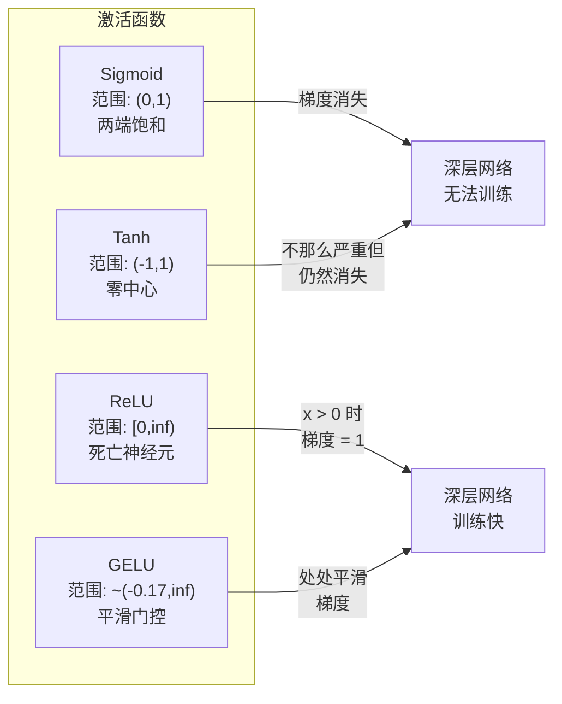
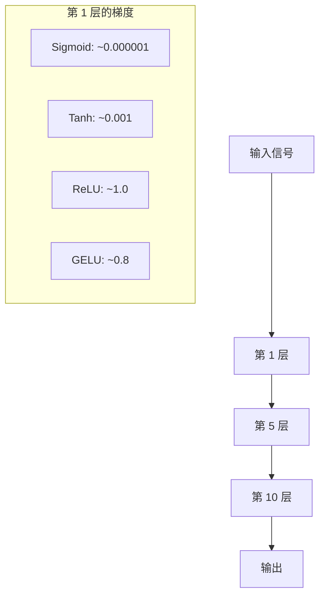

# 激活函数

> 没有非线性，你的 100 层网络就是一个花哨的矩阵乘法。激活函数是让神经网络能够用曲线思考的门。

**类型：** Build
**语言：** Python
**前置知识：** 课程 03.03（反向传播）
**时间：** 约 75 分钟

## 学习目标

- 从零实现 sigmoid、tanh、ReLU、Leaky ReLU、GELU、Swish 和 softmax 及其导数
- 通过测量不同激活函数在 10 层以上的激活幅度来诊断梯度消失问题
- 检测 ReLU 网络中的死亡神经元，解释为什么 GELU 避免了这种失败模式
- 为给定架构选择正确的激活函数（transformer、CNN、RNN、输出层）

## 问题

堆叠两个线性变换：y = W2(W1x + b1) + b2。展开它：y = W2W1x + W2b1 + b2。那只是 y = Ax + c——单个线性变换。无论你堆叠多少线性层，结果都坍缩为一个矩阵乘法。你的 100 层网络与单层具有相同的表示能力。

这不是理论好奇。它意味着深度线性网络字面意义上不能学习 XOR，不能分类螺旋数据集，不能识别人脸。没有激活函数，深度是一种幻觉。

激活函数打破了线性。它们通过非线性函数扭曲每层的输出，赋予网络弯曲决策边界、近似任意函数和实际学习的能力。但选择错误的激活函数，你的梯度会消失为零（深层网络中的 sigmoid），爆炸到无穷（无界的激活函数没有仔细初始化），或者你的神经元永久死亡（ReLU 带有大负偏置）。激活函数的选择直接决定了你的网络是否能学习。

## 概念

### 为什么非线性是必要的

矩阵乘法是可组合的。将向量乘以矩阵 A 再乘以矩阵 B 等同于乘以 AB。这意味着堆叠十个线性层在数学上等同于一个带一个大矩阵的线性层。所有这些参数，所有这些深度——浪费了。你需要一些东西来打破链条。这就是激活函数所做的。

这是证明。线性层计算 f(x) = Wx + b。堆叠两个：

```
第 1 层：h = W1 * x + b1
第 2 层：y = W2 * h + b2
```

代入：

```
y = W2 * (W1 * x + b1) + b2
y = (W2 * W1) * x + (W2 * b1 + b2)
y = A * x + c
```

一层。在层之间插入非线性激活 g()：

```
h = g(W1 * x + b1)
y = W2 * h + b2
```

现在代入打断了。W2 * g(W1 * x + b1) + b2 不能归约为单个线性变换。网络可以表示非线性函数。每个额外的带激活的层增加表示能力。

### Sigmoid

神经网络的原始激活函数。

```
sigmoid(x) = 1 / (1 + e^(-x))
```

输出范围：(0, 1)。平滑、可微，将任何实数映射到概率样的值。

导数：

```
sigmoid'(x) = sigmoid(x) * (1 - sigmoid(x))
```

此导数的最大值为 0.25，出现在 x = 0 处。在反向传播中，梯度通过层相乘。十层 sigmoid 意味着梯度最多乘以 0.25 十次：

```
0.25^10 = 0.000000953674
```

不到原始信号的百万分之一。这就是梯度消失问题。早期层的梯度变得如此小，权重几乎不更新。网络看起来在学习——损失在后期层下降——但前几层被冻结。深层 sigmoid 网络就是训练不出来。

额外问题：sigmoid 输出始终为正（0 到 1），这意味着权重上的梯度始终同号。这在梯度下降期间导致之字形运动。

### Tanh

Sigmoid 的中心化版本。

```
tanh(x) = (e^x - e^(-x)) / (e^x + e^(-x))
```

输出范围：(-1, 1)。零中心，消除之字形问题。

导数：

```
tanh'(x) = 1 - tanh(x)^2
```

最大导数为 1.0，在 x = 0 处——sigmoid 的四倍。但梯度消失问题仍然存在。对于大的正或负输入，导数接近零。十层仍然挤压梯度，只是不那么激进。

### ReLU：突破

修正线性单元。由 Nair 和 Hinton 在 2010 年推广用于深度学习（函数本身可追溯到 Fukushima 的 1969 年工作），它改变了一切。

```
relu(x) = max(0, x)
```

输出范围：[0, 无穷)。导数极其简单：

```
relu'(x) = 1  if x > 0
            0  if x <= 0
```

正输入没有梯度消失。梯度精确为 1，直接传过去。这就是深度网络变得可训练的原因——ReLU 在层间保持梯度幅度。

但有一种失败模式：死亡神经元问题。如果一个神经元的加权输入始终为负（由于大的负偏置或不幸的权重初始化），它的输出始终为零，它的梯度始终为零，它永远不会更新。它永久死亡了。在实践中，ReLU 网络中 10-40% 的神经元可能在训练期间死亡。

### Leaky ReLU

修复死亡神经元的最简单方法。

```
leaky_relu(x) = x        if x > 0
                alpha * x if x <= 0
```

其中 alpha 是一个小常数，通常为 0.01。负侧有一个小斜率而不是零，所以死亡神经元仍然获得梯度信号并且可以恢复。

### GELU：现代默认

高斯误差线性单元。由 Hendrycks 和 Gimpel 在 2016 年引入。BERT、GPT 和大多数现代 transformer 的默认激活。

```
gelu(x) = x * Phi(x)
```

其中 Phi(x) 是标准正态分布的累积分布函数。实践中使用的近似：

```
gelu(x) ~= 0.5 * x * (1 + tanh(sqrt(2/pi) * (x + 0.044715 * x^3)))
```

GELU 处处平滑，允许小负值（不像 ReLU 硬性剪切到零），并且有概率解释：它按输入在正态分布下为正的可能性来加权每个输入。这种平滑门控在 transformer 架构中优于 ReLU，因为它提供更好的梯度流动并完全避免了死亡神经元问题。

### Swish / SiLU

Ramachandran 等人在 2017 年通过自动搜索发现的自门控激活。

```
swish(x) = x * sigmoid(x)
```

Swish 形式上是 x * sigmoid(x)。Google 通过对激活函数空间进行自动搜索发现了它——神经网络在设计神经网络的部分。

像 GELU 一样，它平滑、非单调，允许小负值。区别很微妙：Swish 使用 sigmoid 进行门控，而 GELU 使用高斯 CDF。在实践中，性能几乎相同。Swish 用于 EfficientNet 和一些视觉模型。GELU 在语言模型中占主导地位。

### Softmax：输出激活

不在隐藏层使用。Softmax 将原始分数向量（logits）转换为概率分布。

```
softmax(x_i) = e^(x_i) / sum(e^(x_j) for all j)
```

每个输出在 0 和 1 之间。所有输出之和为 1。这使它成为多分类的标准最终激活。最大的 logit 获得最高概率，但与 argmax 不同，softmax 是可微的并保留关于相对置信度的信息。

### 形状比较



### 梯度流动比较



### 何时使用哪个

| 任务 | 推荐激活 | 为什么 |
|------|-------------------|-----------------|
| Transformer 隐藏层 | GELU | 平滑门控，无死亡神经元，现代标准 |
| CNN 隐藏层 | ReLU / Leaky ReLU | 简单、快速，CNN 从稀疏激活中受益 |
| RNN 隐藏层 | Tanh | 有界输出防止状态爆炸 |
| 二分类输出 | Sigmoid | 输出是 (0,1) 中的概率 |
| 多分类输出 | Softmax | 输出是概率分布 |
| 回归输出 | 线性（无激活） | 无界输出，不需要转换 |

## Build It

### 从零实现激活函数

```python
import math

def sigmoid(x):
    x = max(-500, min(500, x))
    return 1.0 / (1.0 + math.exp(-x))

def sigmoid_derivative(x):
    s = sigmoid(x)
    return s * (1 - s)

def tanh(x):
    return math.tanh(x)

def tanh_derivative(x):
    t = math.tanh(x)
    return 1 - t * t

def relu(x):
    return max(0.0, x)

def relu_derivative(x):
    return 1.0 if x > 0 else 0.0

def leaky_relu(x, alpha=0.01):
    return x if x > 0 else alpha * x

def leaky_relu_derivative(x, alpha=0.01):
    return 1.0 if x > 0 else alpha

def gelu(x):
    return 0.5 * x * (1.0 + math.tanh(
        math.sqrt(2.0 / math.pi) * (x + 0.044715 * x**3)
    ))

def swish(x):
    return x * sigmoid(x)

def softmax(logits):
    max_logit = max(logits)
    exps = [math.exp(l - max_logit) for l in logits]
    sum_exps = sum(exps)
    return [e / sum_exps for e in exps]
```

## Use It

使用 PyTorch：

```python
import torch
import torch.nn as nn

x = torch.randn(100, 256)
relu = nn.ReLU()(x)
gelu = nn.GELU()(x)
silu = nn.SiLU()(x)  # SiLU = Swish
```

## Ship It

本课产出：
- `outputs/prompt-activation-selector.md` -- 根据架构和数据选择正确激活函数的提示词

## 练习

1. 构建一个带 sigmoid 的 10 层网络。打印每层的梯度范数。证明早期层梯度比后期层小几个数量级。同样架构用 ReLU 重做——梯度现在是否保持稳定？

2. 可视化 ReLU 网络中的死亡神经元。训练期间在任何 epoch 输出始终为零的神经元比例是多少？用 Leaky ReLU 重做——死亡神经元比例下降了吗？

3. 激活函数的自动搜索。在隐藏层中尝试自己组合的激活函数：`x * tanh(x)` 和 `x / (1 + exp(-x))`。在 MNIST 上训练，比较与标准激活的验证准确率。

4. 探究 GELU 近似误差：比较精确版（基于 erf）和 tanh 近似版。在 (-5, 5) 范围内最大偏差是多少？近似值在哪里最差？

5. 对 logits 输入 softmax，包含一个极端值（如某个 logit 比其他高 20）。证明 softmax 对最大值产生非常接近 1 的概率，并且数值稳定性技巧（减去 max）是必需的。

## 关键术语

| 术语 | 人们说的 | 实际含义 |
|------|----------------|----------------------|
| 激活函数 | "非线性变换" | 应用于每层输出使其非线性的函数，赋予网络学习弯曲决策边界的能力 |
| Sigmoid | "S 形曲线，输出 0-1" | 将任何实数压缩到 (0,1) 的激活函数，在两端饱和，导致深层网络中梯度接近零 |
| ReLU | "简单剪切负值到零" | 激活函数 f(x)=max(0,x)：正值梯度为 1（无梯度消失），但负值梯度为零，可能产生死亡神经元 |
| 梯度消失 | "早期层收不到信号" | 激活导数的乘积在深层网络中变得极小的现象，阻止早期层学习 |
| GELU | "transformer 中的平滑切换" | 具有概率解释的现代激活函数：x * Phi(x)，BERT/GPT 的默认选择，处处平滑 |
| Swish / SiLU | "x * sigmoid(x)" | 自门控激活函数，类似 GELU，主要用于视觉模型（EfficientNet）和某些 LLM |
| Softmax | "logits 变成概率" | 将 logits 向量转换为非负且总和为 1 的概率分布的函数，用于多分类输出 |
| 死亡神经元 | "永远不激活" | 一直输出零的 ReLU 神经元，接收零梯度并停止学习，训练中无法恢复 |

## 延伸阅读

- [Nair and Hinton, Rectified Linear Units Improve Restricted Boltzmann Machines (2010)](https://www.cs.toronto.edu/~fritz/absps/reluICML.pdf) -- 将 ReLU 引入深度学习的论文
- [Hendrycks and Gimpel, Gaussian Error Linear Units (2016)](https://arxiv.org/abs/1606.08415) -- GELU 论文，现代 transformer 中使用的激活函数
- [Ramachandran et al., Searching for Activation Functions (2017)](https://arxiv.org/abs/1710.05941) -- Swish 的自动激活函数搜索论文