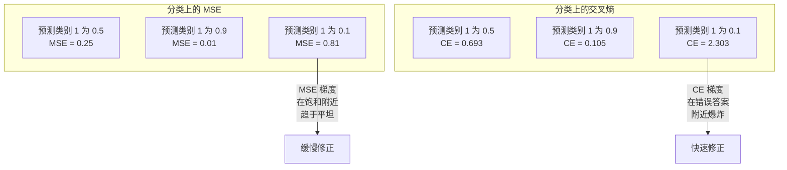
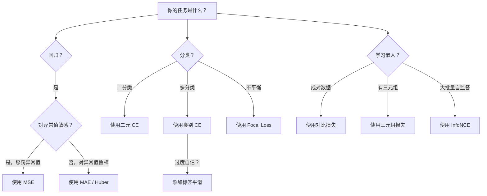
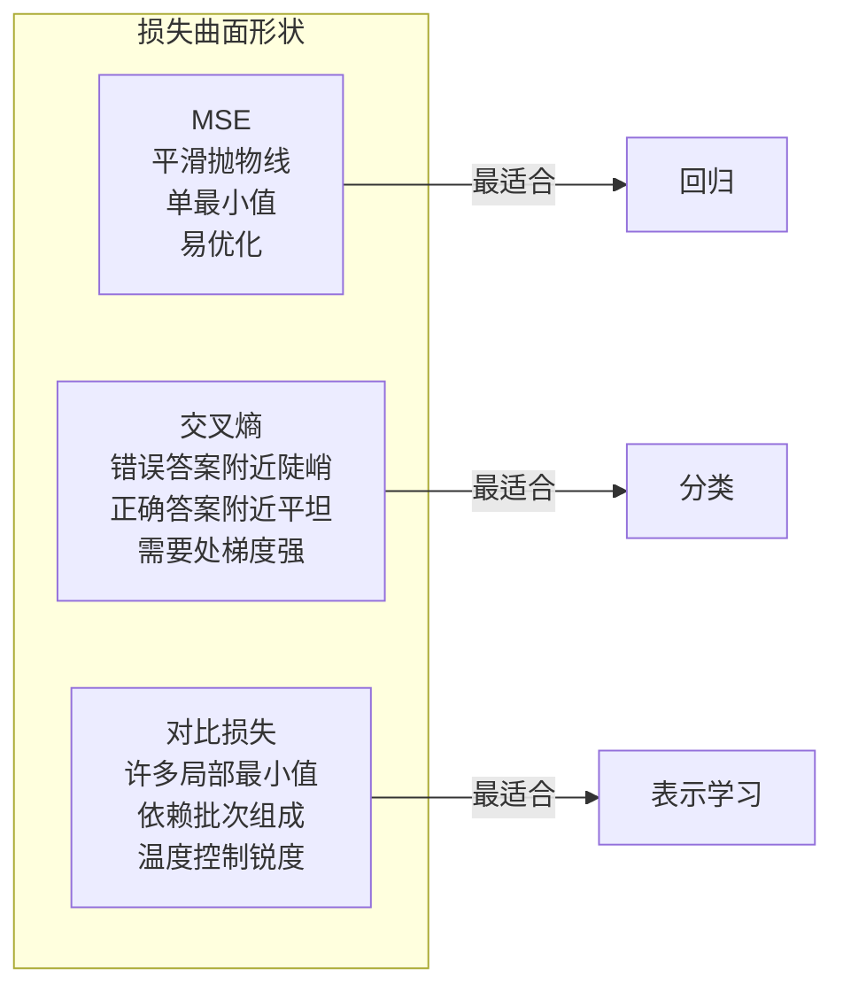

# 损失函数

> 你的网络做出预测。真实值说不对。错多少？那个数字就是损失。选错损失函数，你的模型优化的完全是错的目标。

**类型：** Build
**语言：** Python
**前置知识：** 课程 03.04（激活函数）
**时间：** 约 75 分钟

## 学习目标

- 从零实现 MSE、二元交叉熵、类别交叉熵和对比损失（InfoNCE）及其梯度
- 解释为什么 MSE 在分类中失败，演示"一切预测 0.5"的失败模式
- 对交叉熵应用标签平滑，描述它如何防止过度自信的预测
- 为回归、二分类、多分类和嵌入学习任务选择正确的损失函数

## 问题

在分类问题上最小化 MSE 的模型会自信地将一切预测为 0.5。它在最小化损失。它也无用。

损失函数是你的模型实际优化的唯一东西。不是准确率。不是 F1 分数。不是你报告给老板的任何指标。优化器取损失函数的梯度并调整权重使那个数字变小。如果损失函数不捕捉你关心的东西，模型会找到数学上最便宜的方式来满足它，而那个方式几乎从来不是你想要的。

这里有一个具体例子。你有一个二分类任务。两个类别，50/50 划分。你使用 MSE 作为损失。模型对每个输入都预测 0.5。平均 MSE 是 0.25，这是不实际学习任何东西的情况下可能的最小值。模型有零判别能力，但它技术上最小化了你的损失函数。切换到交叉熵，同一模型被迫将预测推向 0 或 1，因为 -log(0.5) = 0.693 是糟糕的损失，而 -log(0.99) = 0.01 奖励自信的正确预测。损失函数的选择是学习模型和博弈指标的模型之间的区别。

在自监督学习中更糟，你连标签都没有。对比损失完全定义了学习信号：什么算相似，什么算不同，模型应该把它们推多远。对比损失搞错了，你的嵌入会坍缩到一个点——每个输入映射到相同的向量。技术上零损失。完全无用。

## 概念

### 均方误差 (MSE)

回归的默认选择。计算预测和目标之间平方差的平均值。

```
MSE = (1/n) * sum((y_pred - y_true)^2)
```

为什么平方很重要：它二次惩罚大误差。误差为 2 的成本是误差为 1 的 4 倍。误差为 10 的成本是 100 倍。这使 MSE 对异常值敏感——单次严重错误的预测主导损失。

真实数字：如果你的模型预测房价，大多数房子误差 $10,000，但一个豪宅误差 $200,000，MSE 会激进地试图修复那个豪宅，可能损害其他 99 个房子的性能。

MSE 对预测的梯度是：

```
dMSE/dy_pred = (2/n) * (y_pred - y_true)
```

线性于误差。更大误差获得更大梯度。这对回归是特性（大误差需要大修正），对分类是缺陷（你想要指数惩罚自信的错误答案，而不是线性惩罚）。

### 交叉熵损失

分类的损失函数。根植于信息论——它衡量预测概率分布与真实分布之间的散度。

**二元交叉熵 (BCE)：**

```
BCE = -(y * log(p) + (1 - y) * log(1 - p))
```

其中 y 是真实标签（0 或 1），p 是预测概率。

为什么 -log(p) 有效：当真实标签为 1 且你预测 p = 0.99，损失为 -log(0.99) = 0.01。当你预测 p = 0.01，损失为 -log(0.01) = 4.6。那个 460 倍差异就是交叉熵有效的原因。它残酷地惩罚自信的错误预测，同时几乎不惩罚自信的正确预测。

梯度讲述同样的故事：

```
dBCE/dp = -(y/p) + (1-y)/(1-p)
```

当 y = 1 且 p 接近零，梯度为 -1/p，趋近负无穷。模型获得巨大的信号来修复错误。当 p 接近 1，梯度很小。已经正确，没什么要修复的。

**类别交叉熵：**

用于具有 one-hot 编码目标的多分类。

```
CCE = -sum(y_i * log(p_i))
```

只有真实类别对损失有贡献（因为所有其他 y_i 为零）。如果有 10 个类别且正确类别获得概率 0.1（随机猜测），损失为 -log(0.1) = 2.3。如果正确类别获得概率 0.9，损失为 -log(0.9) = 0.105。模型学习将概率质量集中到正确答案上。

### 为什么 MSE 在分类中失败



MSE 梯度在预测接近 0 或 1 时趋于平坦（由于 sigmoid 饱和）。交叉熵梯度补偿了这一点——-log 取消了 sigmoid 的平坦区域，在最需要的地方给出强梯度。

### 标签平滑

标准 one-hot 标签说"这 100% 是类别 3，0% 是其他一切"。这是一个很强的声明。标签平滑软化它：

```
smooth_label = (1 - alpha) * one_hot + alpha / num_classes
```

alpha = 0.1 且有 10 个类别时：不是 [0, 0, 1, 0, ...]，目标变为 [0.01, 0.01, 0.91, 0.01, ...]。模型目标为 0.91 而不是 1.0。

为什么这有效：试图通过 softmax 输出精确 1.0 的模型需要将 logits 推到无穷。这导致过度自信，损害泛化，使模型对分布偏移脆弱。标签平滑将目标限制在 0.9（alpha=0.1 时），保持 logits 在合理范围。GPT 和大多数现代模型使用标签平滑或其等价物。

### 对比损失

没有标签。没有类别。只有成对输入和问题：这些相似还是不同？

**SimCLR 风格对比损失（NT-Xent / InfoNCE）：**

取一张图片。创建它的两个增强视图（裁剪、旋转、色彩抖动）。这些是"正例对"——它们应该有相似的嵌入。批次中的每张其他图片形成"负例对"——它们应该有不同嵌入。

```
L = -log(exp(sim(z_i, z_j) / tau) / sum(exp(sim(z_i, z_k) / tau)))
```

其中 sim() 是余弦相似度，z_i 和 z_j 是正例对，求和覆盖所有负例，tau（温度）控制分布的锐度。更低温度 = 更难的负例 = 更激进的分离。

真实数字：批次大小 256 意味着每个正例对有 255 个负例。温度 tau = 0.07（SimCLR 默认）。损失看起来像相似度上的 softmax——它希望正例对的相似度在 256 个选项中最高。

**三元组损失：**

取三个输入：锚点、正例（相同类别）、负例（不同类别）。

```
L = max(0, d(anchor, positive) - d(anchor, negative) + margin)
```

margin（通常 0.2-1.0）强制正例距离和负例距离之间的最小间隔。如果负例已经足够远，损失为零——无梯度，无更新。这使训练高效，但需要仔细的三元组挖掘（选择接近锚点的困难负例）。

### Focal Loss

用于不平衡数据集。标准交叉熵平等对待所有正确分类的样本。Focal loss 降低简单样本的权重：

```
FL = -alpha * (1 - p_t)^gamma * log(p_t)
```

其中 p_t 是真实类别的预测概率，gamma 控制聚焦程度。gamma = 0 时，这是标准交叉熵。gamma = 2（默认）时：

- 简单样本（p_t = 0.9）：权重 = (0.1)^2 = 0.01。实际被忽略。
- 困难样本（p_t = 0.1）：权重 = (0.9)^2 = 0.81。完整梯度信号。

Focal loss 由 Lin 等人为目标检测引入，其中 99% 的候选区域是背景（简单负例）。没有 focal loss，模型淹没在简单背景样本中，永远学不会检测目标。有了它，模型将能力集中在重要的困难模糊情况上。

### 损失函数决策树



### 损失景观



## Build It

### 第 1 步：MSE 及其梯度

```python
def mse(predictions, targets):
    n = len(predictions)
    total = 0.0
    for p, t in zip(predictions, targets):
        total += (p - t) ** 2
    return total / n

def mse_gradient(predictions, targets):
    n = len(predictions)
    return [(2 / n) * (p - t) for p, t in zip(predictions, targets)]
```

### 第 2 步：二元交叉熵及其梯度

```python
def binary_cross_entropy(predictions, targets, eps=1e-15):
    n = len(predictions)
    total = 0.0
    for p, y in zip(predictions, targets):
        p = max(eps, min(1 - eps, p))
        total += -(y * math.log(p) + (1 - y) * math.log(1 - p))
    return total / n

def bce_gradient(predictions, targets, eps=1e-15):
    grads = []
    for p, y in zip(predictions, targets):
        p = max(eps, min(1 - eps, p))
        grads.append(-(y / p) + (1 - y) / (1 - p))
    return grads
```

### 第 3 步：类别交叉熵

```python
def categorical_cross_entropy(logits, target_class):
    max_logit = max(logits)
    exps = [math.exp(l - max_logit) for l in logits]
    sum_exps = sum(exps)
    probs = [e / sum_exps for e in exps]

    probs = [max(1e-15, min(1 - 1e-15, p)) for p in probs]
    return -math.log(probs[target_class])

def cce_gradient(logits, target_class):
    max_logit = max(logits)
    exps = [math.exp(l - max_logit) for l in logits]
    sum_exps = sum(exps)
    probs = [e / sum_exps for e in exps]

    grads = []
    for i in range(len(logits)):
        if i == target_class:
            grads.append(probs[i] - 1.0)
        else:
            grads.append(probs[i])
    return grads
```

### 第 4 步：对比损失

```python
def info_nce_loss(features, temperature=0.07):
    features = [l2_normalize(f) for f in features]
    n = len(features)
    total_loss = 0.0

    for i in range(0, n, 2):
        anchor = features[i]
        positive = features[i + 1]

        pos_sim = dot_product(anchor, positive) / temperature

        neg_sims = []
        for j in range(n):
            if j != i and j != i + 1:
                neg_sims.append(dot_product(anchor, features[j]) / temperature)

        neg_exp_sum = sum(math.exp(ns) for ns in neg_sims)

        total_loss += -pos_sim + math.log(math.exp(pos_sim) + neg_exp_sum)

    return total_loss / (n // 2)
```

## Use It

PyTorch 直接提供损失函数：

```python
import torch
import torch.nn as nn

mse_loss = nn.MSELoss()
bce_loss = nn.BCELoss()
ce_loss = nn.CrossEntropyLoss()

regression_loss = mse_loss(predictions, targets)
classification_loss = ce_loss(logits, class_indices)
```

## Ship It

本课产出：
- `outputs/prompt-loss-function-selector.md` -- 系统选择损失函数的提示词
- `outputs/prompt-loss-debugger.md` -- 诊断和修复损失函数问题的提示词

## 练习

1. 在一个模型上比较 MSE 和二元交叉熵做二分类。绘制两者的损失、梯度，以及随着预测值从 0 变到 1 时的模型准确率。展示当目标为 1 且预测值 = 0.01 时，交叉熵梯度约为 MSE 梯度的 100 倍。

2. 实现多分类负对数似然损失及其梯度。在 3 分类数据集上训练 softmax 回归器，不依赖框架损失函数。

3. 实现三元组损失。通过将 embeddings 映射到平面上，可视化训练前后的嵌入空间距离分布——训练后 anchor-positive 是否变近而 anchor-negative 是否变远？

4. 在带和不带标签平滑（alpha=0.1）的 CIFAR-10 上比较训练。查看预测置信度和错误率。标签平滑是否减少了错误预测的置信度？

5. 测试 focal loss 中的 gamma 参数。在一半是简单样本、一半是困难样本的数据集上，gamma=0 时模型是否事倍功半？gamma=2 时困难样本是否获得了更高梯度？

## 关键术语

| 术语 | 人们说的 | 实际含义 |
|------|----------------|----------------------|
| 损失函数 | "衡量你错了多少" | 衡量模型预测与真实值之间差异的函数，梯度下降直接最小化的目标 |
| MSE（均方误差） | "平方误差求平均" | 回归的默认损失：对误差平方；对大误差的惩罚远高于对小误差的惩罚 |
| 二元交叉熵 | "二分类的 CE" | 衡量预测与真实二分类分布之间差异的损失：—y·log(p) — (1—y)·log(1—p) |
| 类别交叉熵 | "多分类的 CE" | 对数似然损失的推广：仅真实类别贡献，预测概率越接近 1 则损失越低 |
| 标签平滑 | "软化独热标签" | 将真实标签从 (1,0,0) 等硬结果改为 (0.9, 0.05, 0.05)，防止模型过度自信 |
| 对比损失 | "相似则拉近，不同则推远" | 无显式标签时对相似性和差异度进行编码的自监督目标 |
| InfoNCE / NT-Xent | "批内每一个其它样本都是负例" | 自监督用的对比损失；正例对的相似度在 softmax 中对抗批内所有负例 |
| Focal Loss | "简单样本权重降权" | 对交叉熵的修正：通过可调 gamma 降低已被正确分类样本的权重，使模型聚焦于困难样本 |

## 延伸阅读

- [Goodfellow et al., Deep Learning, Chapter 6.2.1: Cost Functions](https://www.deeplearningbook.org/contents/mlp.html) -- 损失函数深度章节
- [Szegedy et al., Rethinking the Inception Architecture for Computer Vision (2016)](https://arxiv.org/abs/1512.00567) -- 引入标签平滑的论文
- [Chen et al., A Simple Framework for Contrastive Learning (2020)](https://arxiv.org/abs/2002.05709) -- SimCLR 论文，对比学习的 InfoNCE 损失
- [Lin et al., Focal Loss for Dense Object Detection (2017)](https://arxiv.org/abs/1708.02002) -- 处理极端类别不平衡的 focal loss 论文