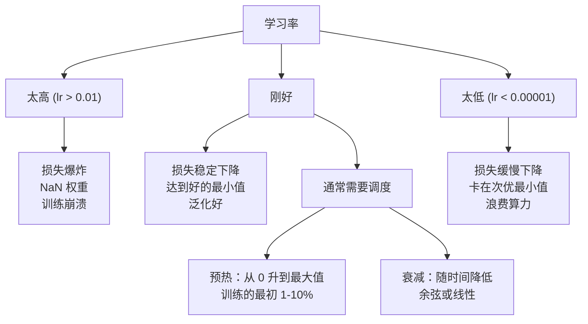
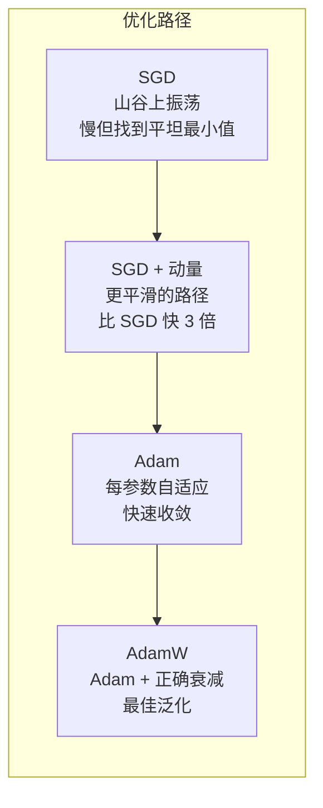
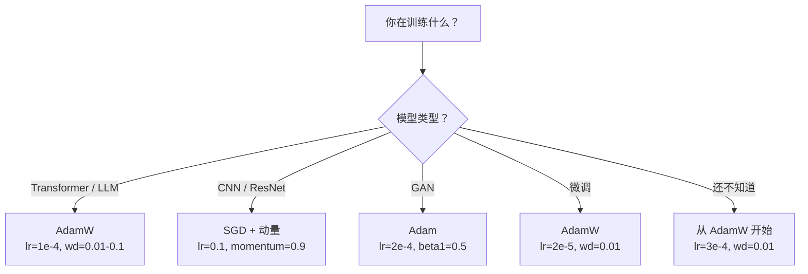

# 优化器

> 梯度下降告诉你要朝哪个方向移动。它没说要走多远或多快。SGD 是指南针。Adam 是带交通数据的 GPS。

**类型：** Build
**语言：** Python
**前置知识：** 课程 03.05（损失函数）
**时间：** 约 75 分钟

## 学习目标

- 在 Python 中从零实现 SGD、带动量的 SGD、Adam 和 AdamW 优化器
- 解释 Adam 的偏差修正如何补偿早期训练步骤中零初始化的矩估计
- 演示为什么 AdamW 在相同任务上比带 L2 正则化的 Adam 产生更好的泛化
- 为 transformer、CNN、GAN 和微调选择适当的优化器和默认超参数

## 问题

你计算了梯度。你知道权重 #4,721 应该减少 0.003 来降低损失。但 0.003 是什么单位？按什么缩放？并且你应该在第 1 步和第 1000 步移动相同的量吗？

朴素梯度下降对每个参数的每一步都应用相同的学习率：w = w - lr * gradient。这在实践中产生了三个使训练神经网络痛苦的问题。

第一，振荡。损失景观很少形如平滑碗状。它更像是狭长的山谷。梯度指向山谷的横向（陡峭方向），而不是沿山谷（平缓方向）。梯度下降在狭窄维度上来回弹跳，而在有用的维度上进展微小。你见过这个：损失快速下降然后停滞，不是因为模型已收敛，而是因为它在振荡。

第二，所有参数使用一个学习率是错误的。一些权重需要大更新（它们处于早期欠拟合阶段）。其他需要微小更新（它们接近最优值）。对前者起效的学习率会破坏后者，反之亦然。

第三，鞍点。在高维中，损失景观有大片平坦区域，梯度接近零。朴素 SGD 以梯度速度爬行通过，而梯度实际上为零。模型看起来卡住了。它没有卡住——它在一个平坦区域，对面有有用的下降路径。但 SGD 没有推过去的机制。

Adam 解决了所有三个问题。它维护每个参数的两个运行均值——梯度均值（动量，处理振荡）和梯度平方均值（自适应速率，处理不同尺度）。结合前几步的偏差修正，你得到一个单一优化器，在 80% 问题上使用默认超参数即可。本课从零构建它，以便你准确理解它在其余 20% 问题上何时以及为什么失败。

## 概念

### 随机梯度下降（SGD）

最简单的优化器。在 mini-batch 上计算梯度，沿反方向步进。

```
w = w - lr * gradient
```

"随机"意味着你使用数据的随机子集（mini-batch）来估计梯度，而不是完整数据集。这个噪声实际上很有用——它帮助逃离尖锐的局部最小值。但噪声也会导致振荡。

学习率是唯一的旋钮。太高：损失发散。太低：训练永远。最优值取决于架构、数据、批次大小和训练的当前阶段。对于朴素 SGD 在现代网络上，典型值范围从 0.01 到 0.1。但即使在单次训练中，理想学习率也在变化。

### 动量

球滚下山的类比被用滥了但准确。不是仅用梯度步进，而是维护一个累积过去梯度的速度。

```
m_t = beta * m_{t-1} + gradient
w = w - lr * m_t
```

Beta（通常 0.9）控制保留多少历史。beta = 0.9 时，动量大约是最近 10 个梯度的平均值（1 / (1 - 0.9) = 10）。

为什么这修复振荡：指向相同方向的梯度累积起来。翻转方向的梯度互相抵消。在那个狭窄山谷中，"横向"分量每一步都翻转符号并被衰减。"沿向"分量保持一致并被放大。结果是在有用方向上平滑加速。

真实数字：SGD 单独在条件差的损失景观上可能需要 10,000 步。带动量的 SGD（beta=0.9）通常在同一问题上需要 3,000-5,000 步。加速不是边际的。

### RMSProp

第一个实际有效的每参数自适应学习率方法。由 Hinton 在 Coursera 讲座中提出（从未正式发表）。

```
s_t = beta * s_{t-1} + (1 - beta) * gradient^2
w = w - lr * gradient / (sqrt(s_t) + epsilon)
```

s_t 追踪梯度平方的运行均值。具有持续大梯度的参数被除以一个大数（更小的有效学习率）。具有小梯度的参数被除以一个小数（更大的有效学习率）。

这解决了"所有参数一个学习率"的问题。一个已经获得大更新的权重可能接近目标——减慢它。一个一直获得微小更新的权重可能欠训练——加速它。

Epsilon（通常 1e-8）防止参数未更新时的除零。

### Adam：动量 + RMSProp

Adam 结合了两个想法。它维护每个参数的两个指数移动平均：

```
m_t = beta1 * m_{t-1} + (1 - beta1) * gradient        （一阶矩：均值）
v_t = beta2 * v_{t-1} + (1 - beta2) * gradient^2       （二阶矩：方差）
```

**偏差修正**是大多数解释跳过的关键细节。在第 1 步，m_1 = (1 - beta1) * gradient。beta1 = 0.9 时，那是 0.1 * gradient——小了十倍。移动平均还没有预热。偏差修正补偿：

```
m_hat = m_t / (1 - beta1^t)
v_hat = v_t / (1 - beta2^t)
```

第 1 步，beta1 = 0.9：m_hat = m_1 / (1 - 0.9) = m_1 / 0.1 = 实际梯度。第 100 步：(1 - 0.9^100) ≈ 1.0，所以修正消失。偏差修正在前 ~10 步重要，~50 步后无关。

更新：

```
w = w - lr * m_hat / (sqrt(v_hat) + epsilon)
```

Adam 默认值：lr = 0.001，beta1 = 0.9，beta2 = 0.999，epsilon = 1e-8。这些默认值对 80% 的问题有效。不生效时，先改 lr。然后 beta2。几乎永远不改 beta1 或 epsilon。

### AdamW：正确实现权重衰减

L2 正则化将 lambda * w^2 加到损失。在朴素 SGD 中，这等价于权重衰减（每一步从权重中减去 lambda * w）。在 Adam 中，这种等价性被打破。

Loshchilov & Hutter 的洞见：当你将 L2 加到损失然后 Adam 处理梯度，自适应学习率也会缩放正则化项。具有大梯度方差的参数获得更少的正则化。具有小方差的参数获得更多。这不是你想要的——你需要不依赖梯度统计的统一正则化。

AdamW 通过直接在 Adam 更新后将权重衰减应用于权重来修复：

```
w = w - lr * m_hat / (sqrt(v_hat) + epsilon) - lr * lambda * w
```

权重衰减项（lr * lambda * w）不被 Adam 的自适应因子缩放。每个参数获得相同的比例收缩。

这看起来像一个小细节。但不是。AdamW 在几乎所有任务上都比 Adam + L2 正则化收敛到更好的解。它是 PyTorch 中训练 transformer、扩散模型和大多数现代架构的默认优化器。BERT、GPT、LLaMA、Stable Diffusion——都用 AdamW 训练。

### 学习率：最重要的超参数



如果你只调一个超参数，就调学习率。学习率 10 倍的变化比你将做的任何架构决策都重要。常见默认值：

- SGD：lr = 0.01 到 0.1
- Adam/AdamW：lr = 1e-4 到 3e-4
- 微调预训练模型：lr = 1e-5 到 5e-5
- 学习率预热：在前 1-10% 步上线性上升

### 优化器对比



### 各优化器何时胜出



## Build It

### 第 1 步：朴素 SGD

```python
class SGD:
    def __init__(self, lr=0.01):
        self.lr = lr

    def step(self, params, grads):
        for i in range(len(params)):
            params[i] -= self.lr * grads[i]
```

### 第 2 步：带动量的 SGD

```python
class SGDMomentum:
    def __init__(self, lr=0.01, beta=0.9):
        self.lr = lr
        self.beta = beta
        self.velocities = None

    def step(self, params, grads):
        if self.velocities is None:
            self.velocities = [0.0] * len(params)
        for i in range(len(params)):
            self.velocities[i] = self.beta * self.velocities[i] + grads[i]
            params[i] -= self.lr * self.velocities[i]
```

### 第 3 步：Adam

```python
class Adam:
    def __init__(self, lr=0.001, beta1=0.9, beta2=0.999, eps=1e-8):
        self.lr = lr
        self.beta1 = beta1
        self.beta2 = beta2
        self.eps = eps
        self.t = 0
        self.m = None
        self.v = None

    def step(self, params, grads):
        self.t += 1
        if self.m is None:
            self.m = [0.0] * len(params)
            self.v = [0.0] * len(params)
        for i in range(len(params)):
            self.m[i] = self.beta1 * self.m[i] + (1 - self.beta1) * grads[i]
            self.v[i] = self.beta2 * self.v[i] + (1 - self.beta2) * grads[i] ** 2
            m_hat = self.m[i] / (1 - self.beta1 ** self.t)
            v_hat = self.v[i] / (1 - self.beta2 ** self.t)
            params[i] -= self.lr * m_hat / (math.sqrt(v_hat) + self.eps)
```

### 第 4 步：AdamW

```python
class AdamW:
    def __init__(self, lr=0.001, beta1=0.9, beta2=0.999, eps=1e-8, weight_decay=0.01):
        self.lr = lr
        self.beta1 = beta1
        self.beta2 = beta2
        self.eps = eps
        self.weight_decay = weight_decay
        self.t = 0
        self.m = None
        self.v = None

    def step(self, params, grads):
        self.t += 1
        if self.m is None:
            self.m = [0.0] * len(params)
            self.v = [0.0] * len(params)
        for i in range(len(params)):
            self.m[i] = self.beta1 * self.m[i] + (1 - self.beta1) * grads[i]
            self.v[i] = self.beta2 * self.v[i] + (1 - self.beta2) * grads[i] ** 2
            m_hat = self.m[i] / (1 - self.beta1 ** self.t)
            v_hat = self.v[i] / (1 - self.beta2 ** self.t)
            lr_t = self.lr * math.sqrt(1 - self.beta2 ** self.t) / (1 - self.beta1 ** self.t)
            params[i] -= lr_t * m_hat / (math.sqrt(v_hat) + self.eps)
            params[i] -= self.lr * self.weight_decay * params[i]
```

## Use It

使用 PyTorch：

```python
import torch.optim as optim

sgd = optim.SGD(model.parameters(), lr=0.01)
adam = optim.Adam(model.parameters(), lr=0.001)
adamw = optim.AdamW(model.parameters(), lr=1e-4, weight_decay=0.01)
```

## Ship It

本课产出：
- `outputs/prompt-optimizer-selector.md` -- 系统选择优化器的提示词

## 练习

1. 在 Rosenbrock 函数（一个狭长弯曲的山谷，极易振荡）上可视化 SGD vs SGD+动量。绘制参数空间中的轨迹；动量版本的轨迹是否顺着山谷底部更快到达？

2. 比较 Adam 的偏差修正：关闭 beta 的 decay 项运行 Adam，使其等同 RMSProp；关闭偏差修正项观察前 10 个 step 预热不足带来的抖动。

3. 对比 Adam vs AdamW：在 CIFAR-10 上分别训练 ResNet-18，记录训练损失和验证准确率，比较 AdamW 的验证误差是否始终更低。

4. 网格搜索 Adam 的学习率和 beta2 参数。beta2=0.99、0.999、0.9999 哪个最稳定？beta 太小会导致自适应频率过高而振荡吗？

5. 在训练过程中从 Adam 切换到 SGD：前一半用 Adam 找到好区域，后一半用 SGD。在不同切换点运行，比较最终的验证准确率。

## 关键术语

| 术语 | 人们说的 | 实际含义 |
|------|----------------|----------------------|
| SGD | "随机梯度下降" | 用 mini-batch 噪声估计梯度的梯度下降变体，比全批量更快，噪声有助于泛化 |
| 动量 | "沿方向累积以平滑路径" | 维护过去梯度的指数移动平均，使一致性方向加速而翻转方向抵消 |
| RMSProp | "按每个参数缩放学习率" | 基于历史平方梯度为每个参数单独缩放学习率的自适应方法 |
| Adam | "动量 + 自适应缩放" | 结合动量（一阶矩）和 RMSProp（二阶矩）的优化器，是目前最广泛使用的默认选择 |
| AdamW | "带解耦权重衰减的 Adam" | 独立于自适应梯度缩放应用权重衰减的 Adam 改进版，transformer 训练的默认选择 |
| 权重衰减 | "每一步缩小所有权重" | 将权重的恒定比例（lambda）从更新中减去的正则化技术，与 L2 在 Adam 中不等价 |
| 偏差修正 | "预热一阶和二阶矩" | 除以 (1 - beta^t) 来修正早期步骤中初始化为零的矩估计，防止早期更新过小 |
| 自适应学习率 | "每参数不同的步长" | 使用梯度统计为每个参数各自调整学习率的方法，改善大梯度和小梯度混合模型的收敛 |

## 延伸阅读

- [Kingma and Ba, Adam: A Method for Stochastic Optimization (2014)](https://arxiv.org/abs/1412.6980) -- 至今引用量最高的优化器论文
- [Loshchilov and Hutter, Decoupled Weight Decay Regularization (2019)](https://arxiv.org/abs/1711.05101) -- AdamW 论文，修复了 Adam 中的权重衰减
- [Sutskever et al., On the Importance of Initialization and Momentum in Deep Learning (2013)](https://proceedings.mlr.press/v28/sutskever13.pdf) -- 深度学习中动量效应的权威分析