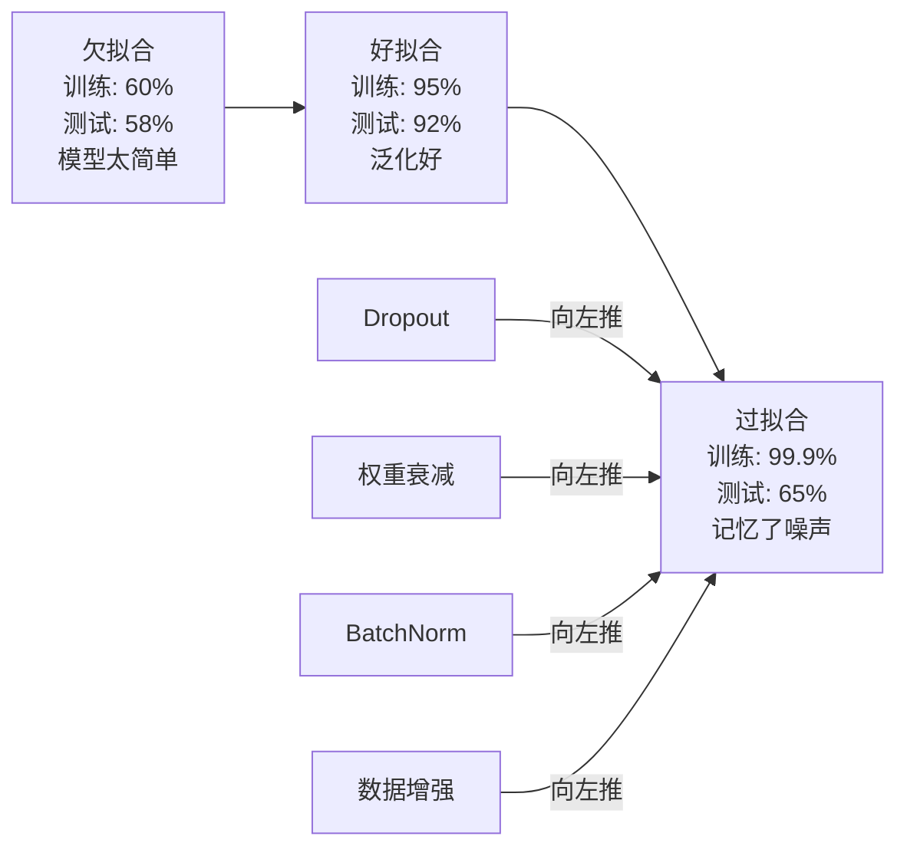
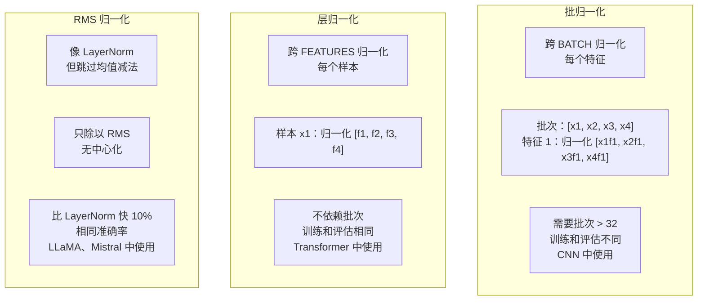
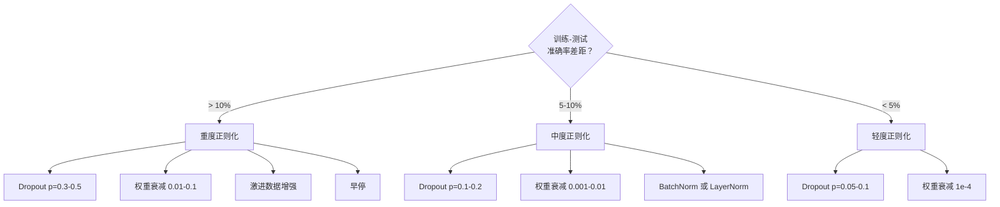

# 正则化

> 你的模型在训练数据上达到 99%，在测试数据上达到 60%。它记忆了而不是学习了。正则化是你对复杂性征收的税，以强制泛化。

**类型：** Build
**语言：** Python
**前置知识：** 课程 03.06（优化器）
**时间：** 约 75 分钟

## 学习目标

- 从零实现带反向缩放的 dropout、L2 权重衰减、批归一化、层归一化和 RMSNorm
- 测量训练-测试准确率差距，使用正则化实验诊断过拟合
- 解释为什么 transformer 使用 LayerNorm 而非 BatchNorm，为什么现代 LLM 偏好 RMSNorm
- 根据过拟合严重程度应用正确的正则化技术组合

## 问题

具有足够参数的神经网络可以记忆任何数据集。这不是假设——Zhang 等人（2017）通过在带有随机标签的 ImageNet 上训练标准网络证明了这一点。网络在完全随机的标签分配上达到了接近零的训练损失。它们在没有模式可学习的情况下记忆了一百万个随机输入-输出对。训练损失完美。测试准确率为零。

这就是过拟合问题，随着模型变大，它变得更糟。GPT-3 有 1750 亿参数。训练集大约有 5000 亿 tokens。有这么多参数，模型有足够的能力逐字记忆训练数据的很大部分。没有正则化，它只会重复训练样本而不是学习可泛化的模式。

训练性能和测试性能之间的差距就是过拟合差距。本课中的每种技术从不同角度攻击这个差距。Dropout 强制网络不依赖任何单个神经元。权重衰减防止任何单个权重增长过大。批归一化平滑损失景观，使优化器找到更平坦、更可泛化的最小值。层归一化做同样的事，但在批归一化失败的地方（小批次、变长序列）有效。RMSNorm 通过去掉均值计算快约 10%。每种技术都很简单。在一起，它们就是记忆与泛化之间的区别。

## 概念

### 过拟合谱

每个模型都坐在从欠拟合（太简单捕捉不到模式）到过拟合（太复杂以至于捕捉噪声）的谱上的某个位置。甜点在中间，正则化将模型从过拟合方向推向它。



### Dropout

最简单且具有最优雅解释的正则化技术。训练期间，以概率 p 随机将每个神经元的输出设为零。

```
output = activation(z) * mask    其中 mask[i] ~ Bernoulli(1 - p)
```

p = 0.5 时，每次前向传播一半神经元被归零。网络必须学习冗余表示，因为它无法预测哪些神经元可用。这防止了共适应——神经元学习依赖特定的其他神经元存在。

集成解释：一个具有 N 个神经元和 dropout 的网络创建 2^N 个可能的子网络（哪些神经元开关的每种组合）。带 dropout 的训练近似同时训练全部 2^N 个子网络，每个在不同的 mini-batch 上。测试时，你使用全部神经元（无 dropout）并按 (1 - p) 缩放输出以匹配训练期间的期望值。这等价于对 2^N 个子网络的预测取平均——来自单个模型的大规模集成。

在实践中，缩放在训练期间而不是测试期间应用（反向 dropout）：

```
训练期间：  output = activation(z) * mask / (1 - p)
测试期间：  output = activation(z)   （无需改变）
```

这更干净，因为测试代码完全不需要知道 dropout。

默认丢弃率：transformer 用 p = 0.1，MLP 用 p = 0.5，CNN 用 p = 0.2-0.3。更高的 dropout = 更强的正则化 = 更大的欠拟合风险。

### 权重衰减（L2 正则化）

将所有权重的平方大小加到损失中：

```
总损失 = 任务损失 + (lambda / 2) * sum(w_i^2)
```

正则化项的梯度是 lambda * w。这意味着每一步，每个权重被按其大小比例缩向零。大权重被惩罚更多。模型被推向没有单个权重占主导的解。

为什么这有助于泛化：过拟合的模型倾向于有放大的大权重来放大训练数据中的噪声。权重衰减保持权重小，限制模型的有效容量并强制它依赖鲁棒、可泛化的特征而非记忆的怪癖。

lambda 超参数控制强度。典型值：

- transformer 上 AdamW 用 0.01
- CNN 上 SGD 用 1e-4
- 严重过拟合的模型用 0.1

正如课程 06 中讨论的：权重衰减和 L2 正则化在 SGD 中等价但在 Adam 中不等价。使用 Adam 训练时始终使用 AdamW（解耦的权重衰减）。

### 批归一化

在传递到下一层之前，在 mini-batch 上归一化每层的输出。

对于某层的 mini-batch 激活：

```
mu = (1/B) * sum(x_i)           （批次均值）
sigma^2 = (1/B) * sum((x_i - mu)^2)   （批次方差）
x_hat = (x_i - mu) / sqrt(sigma^2 + eps)   （归一化）
y = gamma * x_hat + beta        （缩放和平移）
```

Gamma 和 beta 是可学习参数，允许网络在最优时撤销归一化。没有它们，你将强制每层输出为零均值单位方差，可能不是网络想要的。

**训练与推理分离：** 训练期间，mu 和 sigma 来自当前 mini-batch。推理期间，你使用训练期间累积的运行均值（指数移动平均，momentum = 0.1，意味着 90% 旧 + 10% 新）。

为什么 BatchNorm 有效仍在争论。原始论文声称它减少"内部协变量偏移"（层输入的分布随早期层更新而变化）。Santurkar 等人（2018）表明这个解释是错误的。实际原因：BatchNorm 使损失景观更平滑。梯度更具预测性，Lipschitz 常数更小，优化器可以安全使用更大的步长。这就是为什么 BatchNorm 让你使用更高的学习率并更快收敛。

BatchNorm 有一个基本限制：它依赖批次统计。批次大小为 1 时，均值和方差无意义。小批次（< 32）时，统计有噪声并损害性能。这对于目标检测（内存限制批次大小）和语言建模（序列长度变化）等任务很重要。

### 层归一化

跨特征归一化而非跨批次。对于单一样本：

```
mu = (1/D) * sum(x_j)           （特征均值）
sigma^2 = (1/D) * sum((x_j - mu)^2)   （特征方差）
x_hat = (x_j - mu) / sqrt(sigma^2 + eps)
y = gamma * x_hat + beta
```

D 是特征维度。每个样本独立归一化——不依赖批次大小。这就是为什么 transformer 使用 LayerNorm 而不是 BatchNorm。序列有可变长度，批次大小通常很小（或生成期间为 1），计算在训练和推理之间相同。

Transformer 中的 LayerNorm 在每个自注意力块和每个前馈块之后（Post-LN）或之前（Pre-LN，训练更稳定）应用。

### RMSNorm

LayerNorm 去掉均值减法。由 Zhang & Sennrich（2019）提出。

```
rms = sqrt((1/D) * sum(x_j^2))
y = gamma * x / rms
```

就是这样。无均值计算，无 beta 参数。观察：LayerNorm 中的重新中心化（均值减法）对模型性能贡献很小，但消耗计算。去掉它获得相同准确率且约 10% 更少开销。

LLaMA、LLaMA 2、LLaMA 3、Mistral 和大多数现代 LLM 使用 RMSNorm 而非 LayerNorm。在数十亿参数和数万亿 tokens 的规模下，那 10% 的节省是显著的。

### 归一化对比



### 数据增强作为正则化

不是模型修改而是数据修改。在保持标签不变的情况下变换训练输入：

- 图像：随机裁剪、翻转、旋转、颜色抖动、CutOut
- 文本：同义词替换、回译、随机删除
- 音频：时间拉伸、音高偏移、噪声添加

效果与正则化相同：它增加了训练集的有效大小，使模型更难记忆特定样本。一个只看到每个图像原始形式的模型可以记忆它。一个看到每个图像 50 个增强版本的模型被迫学习不变结构。

### 早停

最简单的正则化器：验证损失开始上升时停止训练。模型在那一点还没有过拟合。在实践中，你每隔 epoch 追踪验证损失，保存最佳模型，并继续训练一个"耐心"窗口（通常 5-20 个 epoch）。如果验证损失在耐心窗口内未改善，停止并加载最佳保存的模型。

### 何时应用什么



## Build It

### 第 1 步：Dropout（训练和评估模式）

```python
import random
import math

class Dropout:
    def __init__(self, p=0.5):
        self.p = p
        self.training = True
        self.mask = None

    def forward(self, x):
        if self.training:
            scale = 1.0 / (1.0 - self.p)
            self.mask = [scale if random.random() > self.p else 0.0 for _ in x]
            return [xi * m for xi, m in zip(x, self.mask)]
        else:
            return x

    def backward(self, grad):
        if self.training and self.mask is not None:
            return [g * m for g, m in zip(grad, self.mask)]
        return grad
```

### 第 2 步：层归一化

```python
class LayerNorm:
    def __init__(self, n_features, eps=1e-5):
        self.gamma = [1.0] * n_features
        self.beta = [0.0] * n_features
        self.eps = eps
        self.x = None
        self.normalized = None

    def forward(self, x):
        self.x = x
        n = len(x)
        mean = sum(x) / n
        var = sum((xi - mean) ** 2 for xi in x) / n
        self.normalized = [(xi - mean) / math.sqrt(var + self.eps) for xi in x]
        return [g * xn + b for g, xn, b in zip(self.gamma, self.normalized, self.beta)]
```

## Use It

使用 PyTorch：

```python
import torch.nn as nn

model = nn.Sequential(
    nn.Linear(784, 256),
    nn.ReLU(),
    nn.Dropout(0.5),
    nn.BatchNorm1d(256),
    nn.Linear(256, 10),
)
```

## Ship It

本课产出：
- `outputs/prompt-regularization-advisor.md` -- 诊断过拟合并选择适当正则化组合的提示词

## 练习

1. 训练一个过度参数化的 MLP（4 层，每层 1024 个神经元），不进行任何正则化。观察它在训练集上的准确率达到 100%，但在测试集上仅 60%。逐步添加 dropout（从 0.1 到 0.8 扫描），观察训练和测试准确率之间的差距变化。

2. 比较 BatchNorm 和 LayerNorm：修复总训练步数，显示 BatchNorm 用更少 epoch 收敛但需要较大批次，而 LayerNorm 在小批次上也能稳定工作。

3. 用 RMSNorm 实现替换 LayerNorm。在相同网络上训练，比较时间开销和准确率。观察到 10% 的加速和基本相同的准确率吗？

4. 可视化 dropout 下的梯度范数：在有无 dropout 的相同网络中训练，跟踪每层梯度范数。证明 dropout 降低了梯度范数的传播让分布变得更均匀。

5. 添加 L1 + L2（Elastic Net）正则化：测试不同 L1 比例的 weight decay，看是否产生稀疏权重，并测量非零权重的比例。

## 关键术语

| 术语 | 人们说的 | 实际含义 |
|------|----------------|----------------------|
| Dropout | "随机丢弃神经元" | 训练期间随机将神经元输出设为零的正则化技术，强制网络学习冗余表示 |
| 权重衰减 | "每一步按比例缩小权重" | 强制权重保持小值的正则化方法，防止任何单个权重主导网络 |
| L2 正则化 | "惩罚权重平方的大小" | 将 lambda * sum(w^2) 加到损失，在 SGD 中等价于权重衰减，在 Adam 中需解耦 |
| 批归一化 | "归一化批次激活" | 归一化每层输出的技术，使训练更稳定，允许更高的学习率 |
| 层归一化 | "归一化特征" | 跨特征而非批次维度的归一化，transformer 的标准选择，不受批次大小影响 |
| RMSNorm | "跳过均值减法" | LayerNorm 的简化版本，只除以 RMS 无需中心化，比 LayerNorm 快约 10% |
| 早停 | "验证损失不再改善时停下" | 监控验证损失并在恶化时停止训练以防止过拟合的最简单正则化方法 |
| 共适应 | "神经元过度依赖彼此" | 神经元学习依赖其他特定神经元存在的现象，dropout 通过随机禁用神经元来阻止 |

## 延伸阅读

- [Srivastava et al., Dropout: A Simple Way to Prevent Neural Networks from Overfitting (2014)](https://jmlr.org/papers/v15/srivastava14a.html) -- 标志性 dropout 论文
- [Ioffe and Szegedy, Batch Normalization (2015)](https://arxiv.org/abs/1502.03167) -- 原始 BatchNorm 论文
- [Ba et al., Layer Normalization (2016)](https://arxiv.org/abs/1607.06450) -- Transformer 架构中使用的 LayerNorm
- [Zhang and Sennrich, RMSNorm (2019)](https://arxiv.org/abs/1910.07467) -- LLaMA 和大多数现代 LLM 使用的 RMSNorm
- [Santurkar et al., How Does Batch Normalization Help Optimization? (2018)](https://arxiv.org/abs/1805.11604) -- 证明 BatchNorm 平滑损失景观而非减少协变量偏移