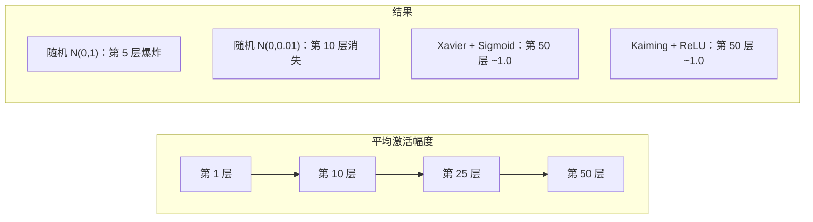
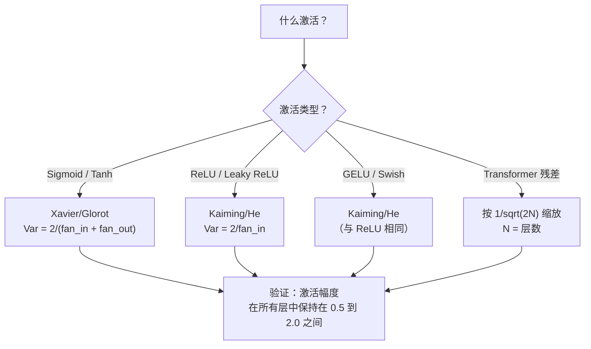

# 权重初始化与训练稳定性

> 初始化错了训练永远无法开始。初始化对了，50 层网络和 3 层一样平稳训练。

**类型：** Build
**语言：** Python
**前置知识：** 课程 03.04（激活函数），课程 03.07（正则化）
**时间：** 约 90 分钟

## 学习目标

- 实现零初始化、随机初始化、Xavier/Glorot 和 Kaiming/He 初始化策略，测量它们在 50 层网络中对激活幅度的影响
- 推导为什么 Xavier init 使用 Var(w) = 2/(fan_in + fan_out)，Kaiming 使用 Var(w) = 2/fan_in
- 演示零初始化的对称问题，解释为什么仅随机尺度不足以解决问题
- 将正确的初始化策略与激活函数匹配：Xavier 用于 sigmoid/tanh，Kaiming 用于 ReLU/GELU

## 问题

将所有权重初始化为零。什么都不学习。每个神经元计算相同的函数，收到相同的梯度，相同地更新。10,000 轮后，你的 512 神经元隐藏层仍然是同一神经元的 512 个副本。你付了 512 个参数的钱，得到了 1 个。

初始化得太大。激活通过网络爆炸。到第 10 层，值达到 1e15。到第 20 层，溢出到无穷。梯度沿相同轨迹反向传播。

从标准正态分布随机初始化。3 层有效。50 层时，信号根据随机尺度是稍微太小还是稍微太大，坍缩为零或爆炸到无穷。"有效"和"坏了"之间的边界薄如刀锋。

权重初始化是深度学习中最被低估的决策。架构得到论文。优化器得到博客文章。初始化得到脚注。但搞错了什么都没用——你的网络在训练开始前就已经死了。

## 概念

### 对称问题

层中的每个神经元具有相同的结构：输入乘以权重，加偏置，应用激活。如果所有权重以相同值开始（零是极端情况），每个神经元计算相同输出。反向传播期间，每个神经元收到相同梯度。更新步骤期间，每个神经元以相同量变化。

你被卡住了。网络有数百个参数，但它们全部同步移动。这称为对称性，随机初始化是打破它的暴力方式。每个神经元在权重空间的不同点开始，所以每个学习不同的特征。

但"随机"不够。随机性的*尺度*决定网络是否训练。

### 方差在层间的传播

考虑一个有 fan_in 个输入的单层：

```
z = w1*x1 + w2*x2 + ... + w_n*x_n
```

如果每个权重 wi 从方差为 Var(w) 的分布中抽取，每个输入 xi 有方差 Var(x)，输出方差为：

```
Var(z) = fan_in * Var(w) * Var(x)
```

如果 Var(w) = 1 且 fan_in = 512，输出方差是输入方差的 512 倍。10 层后：512^10 = 1.2e27。你的信号爆炸了。

如果 Var(w) = 0.001，输出方差每层缩小 0.001 * 512 = 0.512。10 层后：0.512^10 = 0.00013。你的信号消失了。

目标：选择 Var(w) 使得 Var(z) = Var(x)。信号大小在层间保持恒定。

### Xavier/Glorot 初始化

Glorot 和 Bengio（2010）为 sigmoid 和 tanh 激活推导了解决方案。为在前向和后向传播中保持方差恒定：

```
Var(w) = 2 / (fan_in + fan_out)
```

在实践中，权重从以下抽取：

```
w ~ Uniform(-limit, limit)  其中 limit = sqrt(6 / (fan_in + fan_out))
```

或：

```
w ~ Normal(0, sqrt(2 / (fan_in + fan_out)))
```

这是有效的，因为 sigmoid 和 tanh 在零附近近似线性，而正确初始化的激活正好在那里。方差在数十层中保持稳定。

### Kaiming/He 初始化

ReLU 杀死一半输出（一切负值变为零）。有效 fan_in 减半，因为平均一半输入被归零。Xavier init 没有考虑这一点——它低估了所需的方差。

He 等人（2015）调整了公式：

```
Var(w) = 2 / fan_in
```

权重从以下抽取：

```
w ~ Normal(0, sqrt(2 / fan_in))
```

因子 2 补偿了 ReLU 将一半激活归零。没有它，信号每层缩小约 0.5 倍。50 层时：0.5^50 = 8.8e-16。Kaiming init 防止了这一点。

### Transformer 初始化

GPT-2 引入了不同的模式。残差连接将每个子层的输出加到其输入：

```
x = x + sublayer(x)
```

每次加法增加方差。有 N 个残差层，方差按 N 比例增长。GPT-2 将残差层的权重按 1/sqrt(2N) 缩放，其中 N 是层数。这保持累积信号幅度稳定。

Llama 3（4050 亿参数，126 层）使用类似方案。没有这个缩放，残差流将在 126 层注意力和前馈块中无界增长。

```mermaid
flowchart TD
    subgraph "零初始化"
        Z1["第 1 层<br/>所有权重 = 0"] --> Z2["第 2 层<br/>所有神经元相同"]
        Z2 --> Z3["第 3 层<br/>仍然相同"]
        Z3 --> ZR["结果：1 个有效神经元<br/>无论宽度"]
    end

    subgraph "Xavier 初始化"
        X1["第 1 层<br/>Var = 2/(fan_in+fan_out)"] --> X2["第 2 层<br/>信号稳定"]
        X2 --> X3["第 50 层<br/>信号稳定"]
        X3 --> XR["结果：用<br/>sigmoid/tanh 训练"]
    end

    subgraph "Kaiming 初始化"
        K1["第 1 层<br/>Var = 2/fan_in"] --> K2["第 2 层<br/>信号稳定"]
        K2 --> K3["第 50 层<br/>信号稳定"]
        K3 --> KR["结果：用<br/>ReLU/GELU 训练"]
    end
```



### 50 层网络中的激活幅度



### 选择正确的初始化



## Build It

### 第 1 步：初始化策略

初始化权重矩阵的四种方式。每种返回一个 2D 矩阵（列表的列表），有 fan_in 列和 fan_out 行。

```python
import math
import random


def zero_init(fan_in, fan_out):
    return [[0.0 for _ in range(fan_in)] for _ in range(fan_out)]


def random_init(fan_in, fan_out, scale=1.0):
    return [[random.gauss(0, scale) for _ in range(fan_in)] for _ in range(fan_out)]


def xavier_init(fan_in, fan_out):
    std = math.sqrt(2.0 / (fan_in + fan_out))
    return [[random.gauss(0, std) for _ in range(fan_in)] for _ in range(fan_out)]


def kaiming_init(fan_in, fan_out):
    std = math.sqrt(2.0 / fan_in)
    return [[random.gauss(0, std) for _ in range(fan_in)] for _ in range(fan_out)]
```

### 第 2 步：激活函数

我们需要 sigmoid、tanh 和 ReLU 来测试每种初始化策略与其预期的激活。

```python
def sigmoid(x):
    x = max(-500, min(500, x))
    return 1.0 / (1.0 + math.exp(-x))

def relu(x):
    return max(0.0, x)

def tanh(x):
    return math.tanh(x)
```

### 第 3 步：跨层传播的方差追踪器

```python
def track_activation_magnitude(init_fn, activation_fn, n_layers=50, fan=256):
    weights = init_fn(fan, fan)
    x = [random.gauss(0, 1.0) for _ in range(fan)]
    magnitudes = []

    for _ in range(n_layers):
        z = [sum(w * xi for w, xi in zip(row, x)) for row in weights]
        x = [activation_fn(zi) for zi in z]
        magn = math.sqrt(sum(xi**2 for xi in x) / len(x))
        magnitudes.append(magn)

    return magnitudes
```

## Use It

PyTorch 中的默认初始化：

```python
# PyTorch 的 nn.Linear 默认使用 Kaiming Uniform
# 你可以显式指定：
import torch.nn as nn

nn.init.xavier_uniform_(layer.weight)
nn.init.kaiming_uniform_(layer.weight, nonlinearity='relu')
nn.init.kaiming_uniform_(layer.weight, nonlinearity='gelu')  # GELU 使用相同策略
```

## Ship It

本课产出：
- `outputs/prompt-init-strategy.md` -- 为网络选择正确初始化策略的提示词

## 练习

1. 在 50 层固定激活的网络中绘制 RMS 值随层数的变化。每种初始化一曲线。证明只有 Xavier+sigmoid 和 Kaiming+ReLU 的组合在第 50 层保持 RMS 接近 1.0。

2. 在 MNIST 上训练两个相同的 10 层 MLP，一个用 Kaiming Normal 初始化，一个用标准正态 N(0,1)。绘制两者前 100 轮的损失。标准正态是否无法有效减小损失？

3. 实现 PyTorch 中使用的 Kaiming Uniform 初始化（而非 Normal）。展示 Uniform 的极限值为 limit = sqrt(6/fan_in)。

4. 研究 GPT-2 初始化的比例因子。计算 6 层 vs 48 层 vs 96 层 transformer 中投影矩阵的标准差，并观察标准差如何随层数缩放。

5. 对于 GELU 激活，测试 Kaiming init 仍然产生稳定信号的原因，并尝试找出是否需要微调 fan_in/fan_out 中的常数因子。

## 关键术语

| 术语 | 人们说的 | 实际含义 |
|------|----------------|----------------------|
| 对称问题 | "所有权重一样，什么也学不到" | 如果同一层中所有权重初始化为相同值，所有神经元学习相同特征，因为梯度相同 |
| Xavier/Glorot 初始化 | "sigmoid/tanh 专用" | 推导为使前向和后向传播方差保持稳定的初始化策略：Var(w) = 2/(fan_in+fan_out) |
| Kaiming/He 初始化 | "ReLU 专用" | 考虑 ReLU 将一半输入归零的初始化：Var(w) = 2/fan_in |
| fan_in | "输入维度" | 进入层的神经元数量，权重初始化中确定方差的关键因子 |
| fan_out | "输出维度" | 层的输出神经元数，用于 Xavier 初始化公式的平均 |
| 梯度爆炸 | "更新让一切溢出" | 权重过大时梯度通过网络层累积，导致更新指数爆炸 |
| 信号传播 | "保持激活在合理范围" | 选择初始化以保持前向激活的方差在所有层上近似恒定 |
| 残差缩放 | "层数越多标准差越小" | transformer 中使用的 1/sqrt(2N) 因子，防止残差连接累积方差 |

## 延伸阅读

- [Glorot and Bengio, Understanding the Difficulty of Training Deep Feedforward Neural Networks (2010)](http://proceedings.mlr.press/v9/glorot10a.html) -- Xavier 初始化的原始论文
- [He et al., Delving Deep into Rectifiers (2015)](https://arxiv.org/abs/1502.01852) -- Kaiming 初始化论文，使得非常深的网络能够训练
- [Balduzzi et al., The Shattered Gradients Problem (2017)](https://proceedings.mlr.press/v70/balduzzi17a.html) -- 为什么即使有好的初始化，随机网络中的梯度相关性仍然衰减