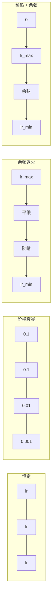
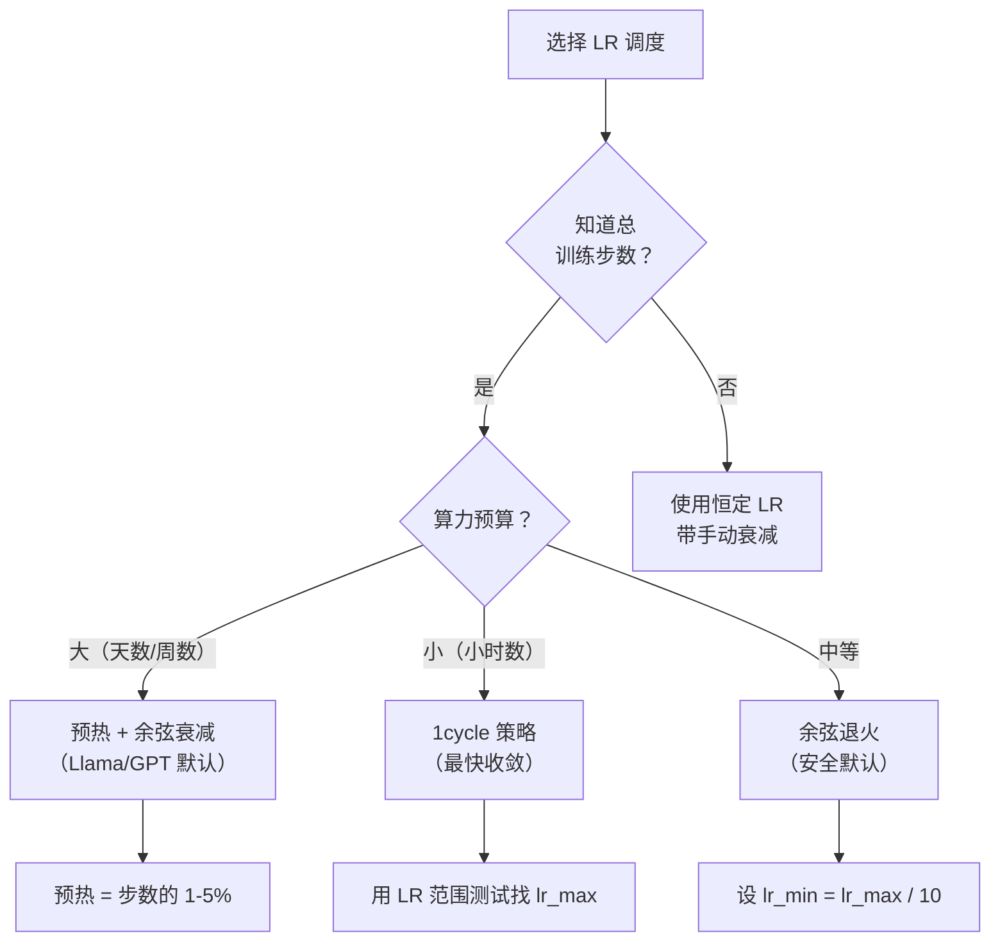
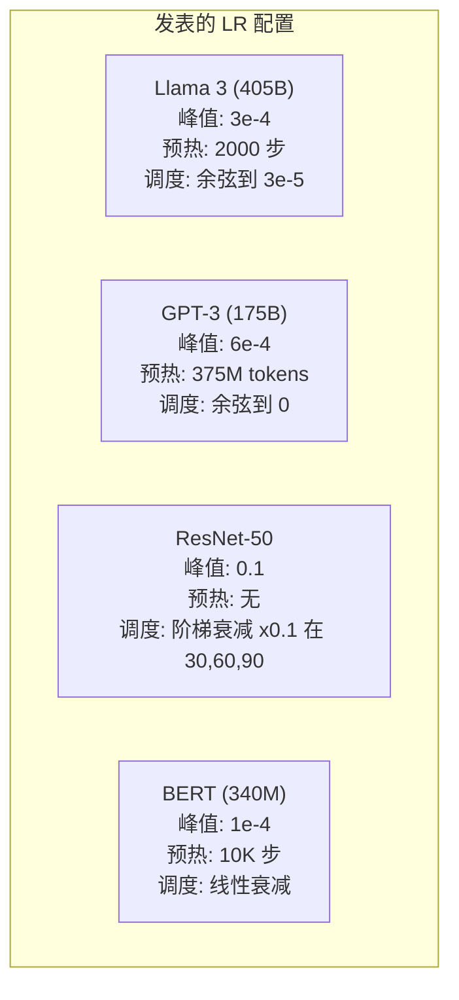

# 学习率调度与预热

> 学习率是最重要的单一超参数。不是架构。不是数据集大小。不是激活函数。学习率。如果你什么都不调，就调这个。

**类型：** Build
**语言：** Python
**前置知识：** 课程 03.06（优化器），课程 03.08（权重初始化）
**时间：** 约 90 分钟

## 学习目标

- 从零实现恒定学习率、阶梯衰减、余弦退火、预热+余弦和 1cycle 学习率调度
- 演示学习率选择的三种失败模式：发散（太高）、停滞（太低）和振荡（无衰减）
- 解释为什么基于 Adam 的优化器需要预热以及它如何稳定早期训练
- 在同一任务上比较所有五种调度的收敛速度，为给定的训练预算选择适当的调度

## 问题

将学习率设为 0.1。训练发散——损失在 3 步内跳到无穷。设为 0.0001。训练爬行——100 轮后，模型几乎没从随机移动。设为 0.01。训练有效 50 轮，然后损失在它永远无法达到的最小值周围振荡，因为步长太大。

最优学习率不是恒定的。它在训练过程中变化。早期，你想要大步长来快速跨越。训练后期，你想要微小步长来落入尖锐的最小值。90% 准确率的模型和 95% 准确率的模型之间的区别往往只是调度。

过去三年发布的每个主要模型都使用了学习率调度。Llama 3 使用峰值 lr=3e-4，2000 步预热，余弦衰减到 3e-5。GPT-3 使用 lr=6e-4，超过 3.75 亿 tokens 预热。这些不是任意选择。它们是数百万元庞大超参数搜索的结果。

你需要理解调度，因为默认值对你的问题无效。当微调预训练模型时，正确的调度与从头训练不同。当你增加批次大小时，预热期需要改变。当训练在第 10,000 步中断时，你需要知道是调度问题还是其他问题。

## 概念

### 恒定学习率

最简单的方法。选一个数，每一步都用它。

```
lr(t) = lr_0
```

极少是最优的。它对训练末期要么太高（围绕最小值振荡），要么对训练初期太低（在微小步长上浪费算力）。对小模型和调试有效。对任何训练超过一小时的都极为糟糕。

### 阶梯衰减

ResNet 时代的老派方法。在固定 epoch 将学习率缩减一个因子（通常 10 倍）。

```
lr(t) = lr_0 * gamma^(floor(epoch / step_size))
```

其中 gamma = 0.1，step_size = 30 意味着：每 30 个 epoch lr 下降 10 倍。ResNet-50 使用这个——lr=0.1，在 epoch 30、60 和 90 下降 10 倍。

问题：最优衰减点取决于数据集和架构。换不同问题你需要重新调什么时候降。转换是突然的——速率突然改变时损失可能出现尖峰。

### 余弦退火

从最大学习率到最小学习率的平滑衰减，遵循余弦曲线：

```
lr(t) = lr_min + 0.5 * (lr_max - lr_min) * (1 + cos(pi * t / T))
```

其中 t 是当前步，T 是总步数。

t=0 时，余弦项为 1，所以 lr = lr_max。t=T 时，余弦项为 -1，所以 lr = lr_min。衰减起初平缓，中期加速，末期再次平缓。

这是大多数现代训练运行的默认。除 lr_max 和 lr_min 外无需调超参数。余弦形状匹配经验观察，大多数学习发生在训练中期——你想在那个关键时期有合理的步长。

### 预热：为什么从小的开始

Adam 和其他自适应优化器维护梯度均值和方差的运行估计。第 0 步时，这些估计初始化为零。最初几个梯度更新基于垃圾统计。如果你的学习率在这期间很大，模型会采取大的、方向差的步骤。

预热修复这个问题。从一个微小的学习率（通常是 lr_max / warmup_steps 甚至零）开始，在前 N 步线性上升到 lr_max。到你达到全学习率时，Adam 的统计已经稳定。

```
lr(t) = lr_max * (t / warmup_steps)     当 t < warmup_steps
```

典型预热：总训练步数的 1-5%。Llama 3 训练了约 1.8 万亿 tokens，预热了 2000 步。GPT-3 预热了 3.75 亿 tokens。

### 线性预热 + 余弦衰减

现代默认。线性上升，然后余弦衰减：

```
if t < warmup_steps:
    lr(t) = lr_max * (t / warmup_steps)
else:
    progress = (t - warmup_steps) / (total_steps - warmup_steps)
    lr(t) = lr_min + 0.5 * (lr_max - lr_min) * (1 + cos(pi * progress))
```

这是 Llama、GPT、PaLM 和大多数现代 transformer 使用的。预热防止早期不稳定。余弦衰减将模型沉降到好的最小值。

### 1cycle 策略

Leslie Smith 的发现（2018）：在训练前半段将学习率从低值升到高值，然后在后半段降回来。反直觉——为什么要在中途*增加*学习率？

理论：高学习率通过向优化轨迹添加噪声充当正则化。模型在上升阶段探索更多损失景观，找到更好的盆地。下降阶段然后在找到的最佳盆地内精炼。

```
阶段 1（0 到 T/2）：  lr 从 lr_max/25 升到 lr_max
阶段 2（T/2 到 T）：  lr 从 lr_max 降到 lr_max/10000
```

1cycle 通常在固定算力预算下比余弦退火训练得更快。权衡：你必须提前知道总步数。

### 调度形状



### 决策流程图



### 发表模型中的真实数字



## Build It

### 第 1 步：调度函数

每个函数接收当前步并返回该步的学习率。

```python
import math


def constant_schedule(step, lr=0.01, **kwargs):
    return lr


def step_decay_schedule(step, lr=0.1, step_size=100, gamma=0.1, **kwargs):
    return lr * (gamma ** (step // step_size))


def cosine_schedule(step, lr=0.01, total_steps=1000, lr_min=1e-5, **kwargs):
    if step >= total_steps:
        return lr_min
    return lr_min + 0.5 * (lr - lr_min) * (1 + math.cos(math.pi * step / total_steps))


def warmup_cosine_schedule(step, lr=0.01, total_steps=1000, warmup_steps=100, lr_min=1e-5, **kwargs):
    if total_steps <= warmup_steps:
        return lr * (step / max(warmup_steps, 1))
    if step < warmup_steps:
        return lr * step / warmup_steps
    progress = (step - warmup_steps) / (total_steps - warmup_steps)
    return lr_min + 0.5 * (lr - lr_min) * (1 + math.cos(math.pi * progress))


def one_cycle_schedule(step, lr=0.01, total_steps=1000, **kwargs):
    mid = max(total_steps // 2, 1)
    if step < mid:
        return (lr / 25) + (lr - lr / 25) * step / mid
    else:
        progress = (step - mid) / max(total_steps - mid, 1)
        return lr * (1 - progress) + (lr / 10000) * progress
```

### 第 2 步：可视化所有调度

打印基于文本的图表，显示每个调度在训练中如何演变。

## Use It

PyTorch 调度器：

```python
import torch.optim.lr_scheduler as lr_scheduler

scheduler = lr_scheduler.CosineAnnealingLR(optimizer, T_max=100)
scheduler = lr_scheduler.OneCycleLR(optimizer, max_lr=0.01, total_steps=1000)

# 或使用 PyTorch 2.0+ 的 warmup
from torch.optim.lr_scheduler import CosineAnnealingLR, LinearLR, SequentialLR

warmup = LinearLR(optimizer, start_factor=1e-3, total_iters=100)
cosine = CosineAnnealingLR(optimizer, T_max=900)
scheduler = SequentialLR(optimizer, schedulers=[warmup, cosine], milestones=[100])
```

## Ship It

本课产出：
- `outputs/prompt-lr-schedule-advisor.md` -- 选择任务最优学习率调度的提示词

## 练习

1. 打印一个 10 行 x 50 列的 ASCII 图表，同时显示五种调度的 lr 曲线，每步一行。观察步衰减的阶梯形状、余弦的光滑曲线，以及 1cycle 的上升下降模式。

2. LR 范围测试（Smith 2018）。用指数增长的学习率训练一个小 MLP 10 个 epoch。当 lr 增加到某个值时，loss 不再下降而开始上升；找到这个 lr，设置为 1cycle 的 max_lr。

3. 比较 1cycle 与余弦退火 + 预热在 10 层 CNN 上的训练时间和最终准确率。绘制每条曲线的训练损失。1cycle 是否在更短步数内收敛？

4. 在预热阶段打印 Adam 的偏差修正因子 (1 - beta^t)。证明在预热结束时该因子接近 1，并观察到预热学习率在此期间增长。

5. 固定总训练预算 1000 步。改变预热步数 0、50、100、200、500 并运行训练。绘制最终验证准确率随预热步数的变化来寻找最优。

## 关键术语

| 术语 | 人们说的 | 实际含义 |
|------|----------------|----------------------|
| 学习率调度 | "LR 随时间变化" | 在训练过程中改变学习率的策略，早期大步长快速进展，后期小步长精炼 |
| 预热 | "从低 LR 开始" | 训练最初 1-5% 步将学习率从零线性增加到峰值，使自适应优化器统计稳定 |
| 余弦退火 | "LR 沿余弦下降" | 从最大学习率到最小学习率沿半余弦曲线平滑衰减的调度，现代训练的标准 |
| 1cycle 策略 | "先上升，后下降" | 学习率先增加到最大值后减少到零的两阶段调度，通过高学习率噪声充当内置正则化 |
| 阶梯衰减 | "每 N epoch 减 10 倍" | 在固定 epoch 间隔将学习率乘以因子（如 0.1）的调度，在 ResNet 时代常见 |
| LR 范围测试 | "找到最有效的 LR" | 逐渐增加学习率并测量损失，找到损失下降最快但不发散的 LR 范围 |
| 余弦 + 预热 | "Llama 默认" | 组合线性预热和余弦衰减的现代调度，几乎所有 2023+ 大规模训练运行的标准 |
| 发散 | "损失跳向无穷" | 学习率过高导致权重更新过大，损失和参数溢出到 NaN 的失败模式 |

## 延伸阅读

- [Loshchilov and Hutter, SGDR: Stochastic Gradient Descent with Warm Restarts (2017)](https://arxiv.org/abs/1608.03983) -- 引入余弦退火的论文
- [Smith, A Disciplined Approach to Neural Network Hyper-Parameters: Part 1 (2018)](https://arxiv.org/abs/1803.09820) -- 1cycle 策略和 LR 范围测试
- [Xiong et al., On Layer Normalization in the Transformer Architecture (2020)](https://arxiv.org/abs/2002.04745) -- 说明预热对 transformer 训练稳定性的关键作用